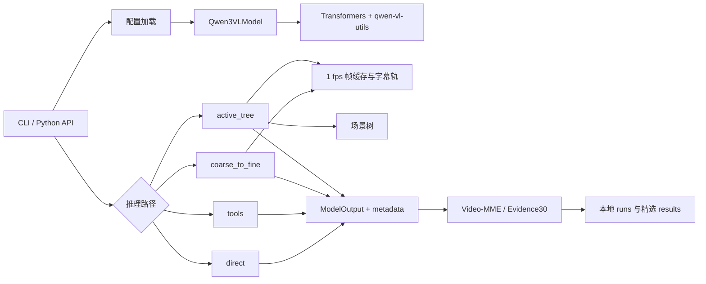

# 架构说明

本文解释代码如何协作。先建立一个总心智模型：仓库把“模型调用”“视频观察策略”和
“实验评测”分成三层；四条推理路径共享同一个模型适配器，但控制器、预算和证据状态不同。

## 总体调用关系



在线推理入口是 `qwen3vl-agent`。Video-MME 与 Evidence30 入口复用同一批控制器，
但额外负责数据集读取、记录标准答案、标准化 exposure、计算指标和保存运行签名。

## 1. 模型适配层

### BaseVideoModel 与 ModelOutput

`qwen3vl_agent/models/base.py` 定义最小接口：

- `load()`：加载权重和处理器；
- `generate(messages, videos, images, **kwargs)`：完成一次生成；
- `unload()`：释放模型和显存；
- `ModelOutput.text`：模型文本；
- `ModelOutput.metadata`：token、耗时、生成参数及上层 trace。

测试中的 FakeModel 只实现这组接口，因此绝大多数控制逻辑测试不需要真实权重、Torch 或 GPU。

### Qwen3VLModel

`qwen3vl_agent/models/qwen3vl.py` 是实际 Qwen3-VL 适配器：

1. 将字符串消息转换为 Qwen 多模态 content parts；
2. 只向第一条尚未包含媒体的 user 消息注入视频/图片；
3. 用 processor chat template 生成文本 prompt；
4. 用 `qwen-vl-utils` 解析视觉输入；
5. 调用 Transformers 模型生成；
6. 只解码新增 token，并记录输入/输出 token 和延迟。

Torch、Transformers 与 qwen-vl-utils 都在真正加载或生成时延迟导入。这是轻量 CI 能在
不下载模型的情况下测试控制器的关键。

`qwen3vl_agent/factory.py` 负责从配置构建模型。无显式路径时先读取
`QWEN3VL_MODEL_PATH`，再回落到 `Qwen/Qwen3-VL-2B-Instruct`。

## 2. direct 与 tools

### direct

命令行的 direct 路径由 `qwen3vl_agent/cli.py` 选择
`Qwen3VLAgent.generate(use_tools=False)`，最终只调用一次模型。

Video-MME 评测中的 direct 还有一层内存保护：默认从共享的 1 fps 缓存均匀选择固定数量的
帧，然后一次回答。只有显式传入 `--native-video-decode` 才让 qwen-vl-utils
直接解码整段源视频。两者都是“一次回答”基线，但媒体准备方式不同。

### tools

`qwen3vl_agent/agent.py` 的流程是：

1. 用工具 manifest 和最新用户问题构造 planner prompt；
2. 解析模型返回的 JSON 工具计划；
3. 丢弃未知、重复或超预算调用；
4. 通过 `ToolRegistry` 执行工具；
5. 把成功结果序列化为补充证据，追加到最后一条 user 消息；
6. 再调用模型生成最终答案。

planner 失败会记录错误并退化为 direct；单个工具失败只进入 tool-call record，不中断最终回答。
默认工具 `video_metadata` 使用 PyAV 读取容器和主视频流元数据。

工具抽象位于 `qwen3vl_agent/tools/`：

- `ToolContext` 提供问题、消息、媒体和调用元数据；
- `BaseTool` / `FunctionTool` 定义生命周期和调用协议；
- `ToolRegistry` 负责注册、manifest、装载和卸载；
- JSON Schema 描述模型可生成的参数。

## 3. 共享视频缓存

`qwen3vl_agent/coarse_to_fine/cache.py` 提供：

- 以固定 fps 解码视频并写入 JPEG 帧缓存；
- `CachedVideo`、`FrameRef` 和时间窗采样；
- 进程内 LRU 与磁盘复用；
- SRT 解析、字幕时间对齐和字符预算；
- contact sheet 生成。

coarse-to-fine、active-tree、Video-MME direct 评测和多个 Evidence30 诊断共用这层缓存。
默认缓存位于 `.cache/qwen3vl_agent`，可用 `QWEN3VL_CACHE_DIR` 覆盖。

## 4. coarse-to-fine

核心实现位于 `qwen3vl_agent/coarse_to_fine/agent.py`。Python 控制器掌握合法
状态转移和预算，模型只负责路由、窗口排序和基于证据回答。

```text
4-frame glance
├── global
│   └── 全局均匀采样 → 一轮回答
└── local
    └── 初始时间窗
        → 窗口排序
        → top-k 细节采样
        → 回答与置信度
        → 证据不足时拆分窗口
        → 投票/停止/回退
```

主要组件：

- `config.py`：帧数、轮数、窗口数、字符数和协议修复预算；
- `types.py`：`TimeWindow`、`FrameRef`、
  `FrameBudget`、决策与 trace 类型；
- `prompts.py`：路由、窗口排序、回答 prompt 与 JSON 解析；
- `adapters.py`：多选标签解析、答案记录与投票；
- `cache.py`：媒体缓存和字幕对齐；
- `agent.py`：状态机与降级处理。

默认正常停止条件是：全局路径完成、置信度达阈值或预算耗尽。协议/缓存异常会在 metadata
中标记 degraded，并回退到一次直接回答。

## 5. Active Evidence Tree

核心实现位于 `qwen3vl_agent/active_tree/`。它不是 coarse-to-fine 的参数别名，
而是证据优先的主动观察状态机。

```text
question-only evidence contract
        ↓
query-independent scene tree
        ↓
option-hidden breadth observation（只负责路由）
        ↓ reveal options
typed plan → legal action → grounded observer
        ↓
atomic evidence ledger
        ↓
completeness verifier + shuffled skeptic
        ↓
verified option / explicit unverified result
```

### 数据结构

`types.py` 定义：

- `SceneNode` / `SceneTree`：分层时间结构；
- `TaskContract` / `EvidenceSlot`：回答前必须满足的证据槽；
- `PlannedAction`：受控观察动作；
- `AtomicEvidence` / `EvidenceLedger`：带时间、模态、节点和槽位的事实；
- `ResourceLedger`：模型调用与视觉观察预算。

### 控制流程

`scene_tree.py` 从缓存帧变化和字幕间隔构造问题无关场景树。
`agent.py` 先编译问题契约，再做 option-hidden 广度扫描。选项揭示后，planner
只能从当前 frontier 和允许动作中选择；非法动作、停滞或协议失败由 Python 回退逻辑处理。

Observer 生成的事实经过规范化后进入账本。用于 breadth/routing 的事实不能满足 required
slot，避免把“看起来相关”误当成“已经证明”。sequence、subtitle、OCR、compare 等模式
有各自观察和落账约束。

完整性 verifier 检查 required slot，shuffled skeptic 以打乱后的选项顺序做反证检查。
验证失败时可继续修复观察；预算耗尽或证据仍不完整时返回 unverified，而不是强行宣称
证据闭环。

`alignment.py` 和 `temporal.py` 提供受阈值约束的对齐/时序裁决；
`replay.py` 把 trace 渲染为单文件 HTML。更细的协议与论文映射见
[Active Tree v0.2 设计](active_tree_v02_design.md)。

### 必须保持的约束

- breadth 与 routing evidence 不得填充 required slot；
- option-hidden 阶段不得泄漏选项；
- planner 不能自行扩大动作、节点或调用预算；
- subtitle 证据必须能回落到原始 cue；
- sequence 动态事实不能只由无变化的静态帧证明；
- verifier 不能在缺少可判别审计字段时宣称 sufficient。

这些约束由 `tests/test_active_tree.py` 的特征测试保护。

## 6. Video-MME 与 Evidence30

### Video-MME runtime

`qwen3vl_agent/evaluation/videomme.py` 读取 parquet 并构造
`VideoMMEQuestion`；`evaluation/runtime.py` 用
`VideoMMEStrategySession` 统一加载模型、选择策略、拼接字幕、记录 trace 和释放资源。

### Evidence30 主流程

`evaluation/evidence30.py` 把各策略 metadata 规范化为视觉/字幕 exposure，并根据
AI-assisted reference 计算宽松时间暴露、槽位覆盖和 hard-negative 指标。

`evaluation/evidence30_runner.py` 执行三路 dev/locked 评测、断点续跑和聚合；
`evaluation/freeze.py` 固定配置、代码/标注哈希和环境信息。具体顺序见
[Evidence30 调试协议](evidence30_debug_protocol.md)。

### 统一答题头消融

`evaluation/ablations.py` 从已完成 dev trace 构造三个最多 16 帧的 packet：

- `direct_replay`：direct 实际暴露的帧/字幕；
- `active_tree_replay`：active-tree 实际暴露、按优先级压缩后的上下文；
- `oracle_context`：由 reference 时间区间构造的诊断性 Oracle 上下文。

三者使用相同的一次多选 prompt，隔离搜索/上下文选择与最终答题头的影响。它只读 dev。

### core-density 诊断

`evaluation/core_dense.py` 只选择 ablation v2 中 Oracle context 仍答错的 9 条 dev：

1. dev-only loader 不打开 `locked.jsonl`；
2. 选择最小 sufficient evidence set；
3. 按 required evidence item 均衡分配 core interval 采样；
4. 比较 `core_16` 与 `core_32`；
5. 复用同一统一答题头，并禁止把 atomic fact、hard negative 或 gold 注入 prompt。

两种 variant 的 `total_pixels` 上限都为 2,097,152；`core_16` 的单帧
上限为 131,072，`core_32` 降为 65,536，以更多低分辨率时间帧换取近似匹配的
视觉 token 预算。这个实验用于判断 Oracle 失败是否主要来自 core 内采样密度，而不是新增
线上策略。

## 7. 配置与路径

`qwen3vl_agent/config.py` 递归展开 `~`、普通环境变量以及
`${NAME:-fallback}`。版本化 YAML 因而可在不同机器复用。

集中约定：

| 变量 | 用途 | 默认值 |
|---|---|---|
| `QWEN3VL_MODEL_PATH` | 本地模型目录或 Hugging Face ID | `Qwen/Qwen3-VL-2B-Instruct` |
| `VIDEOMME_ROOT` | Video-MME 数据根目录 | `data/videomme` |
| `QWEN3VL_CACHE_DIR` | JPEG 帧与场景树缓存 | `.cache/qwen3vl_agent` |

`qwen3vl_agent/paths.py` 统一推导 parquet、videos 和 subtitle 子目录。

## 8. Trace、结果和版本边界

真实运行会产生 JSON、JSONL、JPEG、HTML replay 和缓存。这些都进入 `runs/`、
`tmp/` 或缓存目录并被 Git 忽略。需要长期保留的聚合结果应：

1. 去除本机绝对路径和逐题媒体路径；
2. 保留 policy ID、run signature、样本数和关键指标；
3. 写入 `results/`；
4. 在 `docs/current_status.md` 中解释适用范围。

冻结标注位于 `annotations/videomme_evidence30/0.2.0`。兼容副本位于上一级，
`_unreviewed_ai_drafts` 不属于发布内容。

## 9. 当前技术债

- `active_tree/agent.py` 超过 2,000 行，职责边界清楚但物理拆分尚未完成；
- `evaluation/ablations.py` 与 `evaluation/core_dense.py` 也较大；
- CI 只覆盖控制逻辑，不能替代 GPU、模型、视频和字幕的端到端 smoke；
- 环境冻结记录模型路径和依赖，但模型权重本身不在仓库；
- Evidence30 是小样本、单标注者 AI-assisted reference，不是公开 benchmark gold。

后续拆分大文件时应先保持现有 trace schema、停止原因和 79 个特征测试，再做纯结构重构。
