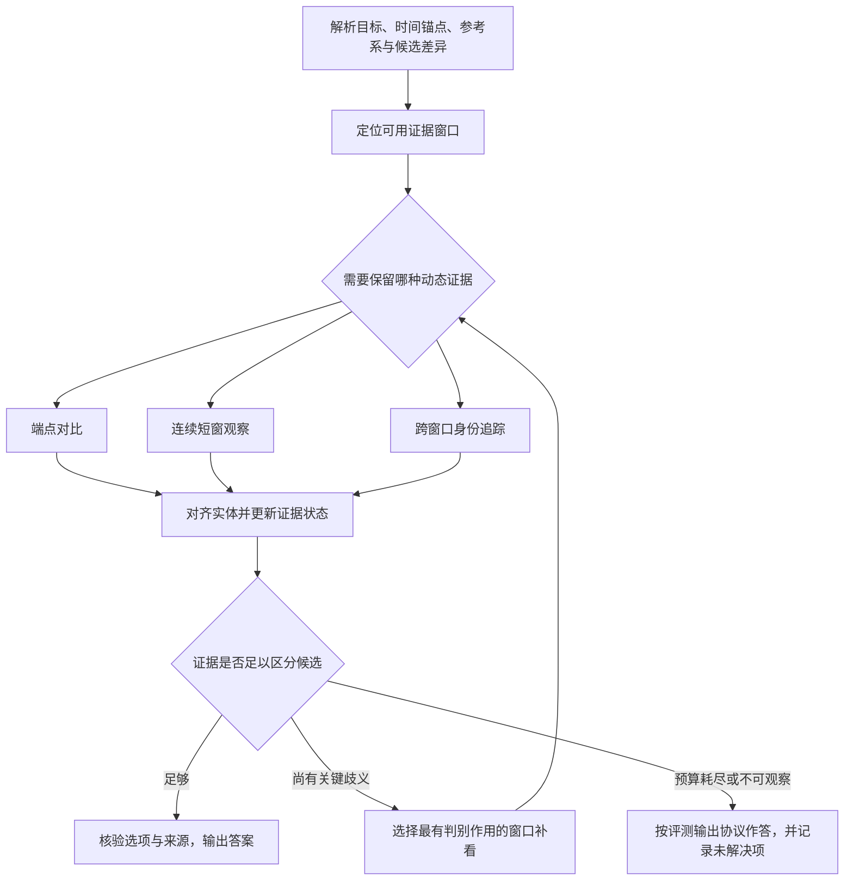

> 分类来源材料：保留原材料的设计语境；当前实现与验证状态请看 [运行文档](../pipelines/) 和 [发布验证](../validation.md)。

# R2：连续动态与实体状态追踪——特征、原题与 pipeline 讨论材料

整理日期：2026-09-07。分类基线：`benchmark_pipeline_reclassification_v04.xlsx` 的九类方案。

**R2 的设计重点，是让系统保留回答问题所需的实体—时间状态。** 有的题只需对齐两个状态，有的题必须保留局部运动过程，有的题则离不开遮挡期间的身份传播。选项对比和允许观察的范围会进一步决定需要哪一种证据。

本文完整整理 **25 个默认 R2 原生入口和 8 个条件性涉及 R2 的入口**，共 33 条例题／模板记录。其中 16 条来自官方数据集标注，14 条为论文原例，3 条为官方附录模板。20 条有明确的数据答案或论文答案标记，13 条来源未标注实例答案。题型入口数不等于实际视频数、样本数或数据集中的题型占比。

本文的 R 分类继承工作簿；原题和答案回查论文与标注。**各题的机制分析、最小证据和 pipeline 建议均为本文判断，尚未经过该 pipeline 的模型实验验证。** 本次没有观看原视频；阅读了论文例题图和原始标注，二者不等价于视频核验。

<a id="contents"></a>

## 目录

- [1. R2 的定义及九类边界](#definition)
- [2. 收录范围与入口对照](#coverage)
- [3. 八组特征与证据要求](#features)
- [4. 25 个默认 R2 入口的完整例题](#primary)
- [5. 8 个条件入口与边界例题](#boundary)
- [6. pipeline 候选流程与讨论取舍](#pipeline)
- [7. 实验对照与诊断建议](#experiments)
- [8. 来源、原文修正与核验范围](#sources)

建议讨论时先看第 1、3、6 节，再沿例题编号回看证据。最有区分度的一组是：[E01 墙面变色](#e01)、[E18 玉米阶段变化](#e18)、[E11 手部折返](#e11)、[E13 空中画图](#e13)、[E20 杯壳身份](#e20)、[E25 周期相位](#e25)，以及 [E10 灯是否曾亮](#e10)、[E19 飞出多少只鸟](#e19) 两个边界。

<a id="definition"></a>

## 1. R2 的定义及九类边界

### 1.1 分类依据：主要保存什么证据状态

工作簿对 R2 的核心证据状态定义为：**实体—时间状态轨迹，包含身份、位置、属性、运动、遮挡，可包含周期／相位。** 控制流是初始化实体、选择保留连续性的观察窗口、追踪或重识别、更新状态，再查询变化、轨迹或相位。停止条件是关键转移与身份对应已经足以支持答案；端点比较足够时，无需逐帧密集处理。[分类基线 F01](#f01)

可以把每次观察理解为：在某个时间、某个参考系里，目标是谁，处于什么位置和状态，是否可见，依据是哪一段画面。随后要回答的可能是：

- 同一对象前后哪里变了。
- 动作朝哪个方向进行，有没有反转。
- 轨迹整体是什么形状。
- 速度、幅度或周期如何变化。
- 被遮住的目标跟随哪个实体，查询时刻在哪里。
- 已经观察到的稳定动作组，当前处于哪个相位。

这里的“连续”指保留**任务所需的时间关联和身份关联**。它不要求所有题都使用每一帧，也不保证跨镜头、完全遮挡或分辨率不足时一定能恢复真实轨迹。

### 1.2 放在九类体系中的位置

| 主类 | 工作簿名称 | 区分它的主要状态或操作 |
| --- | --- | --- |
| R1 | 定向定位与局部取证 | 检索后得到足量直接事实证据 |
| **R2** | **连续动态与实体状态追踪** | **同一实体的状态演化、动态过程或身份传播** |
| R3 | 事件账本与时序归约 | 事件／区间，及次数、顺序、时长等归约 |
| R4 | 清单构建与集合归约 | 去重后的对象／类型集合，以及集合计数或否定覆盖 |
| R5 | 分段全局综合 | 跨分段的全局内容综合 |
| R6 | 证据约束关系推理 | 受事实约束的关系与解释 |
| R7 | 假设与未来推演 | 观察截止、假设条件与未来／替代状态 |
| R8 | 视觉符号与约束求解 | 视觉符号及其约束 |
| R9 | 空间场景建模与查询 | 空间场景和跨视角参考系 |

名称来自工作簿；第三列是用于本次讨论的简要说明。**主类与可调用组件可以不同。** R4 数不同鸟时可以使用 R2 的身份组件，R2 判断指定第几板球的旋转时可以使用 R3 的事件定位。[F01](#f01)

### 1.3 与最容易混淆的五类如何区分

| 边界 | 优先考虑 R2 的条件 | 相邻主类更合适的条件 | 原题参照 |
| --- | --- | --- | --- |
| R1 ↔ R2 | 直接事实之间的变化、方向或身份对应是关键证据 | 找到一个或少量局部事实即可，过程不承担额外判别作用 | 墙面变化 E01；飞机此前在哪 B01；手套此前在哪 B03 |
| R2 ↔ R3 | 查询同一对象的轨迹、状态过程、运动趋势或相位 | 查询独立事件的出现次数、顺序、时长、首次／末次 | 玉米状态 E18；场景顺序 B05；乐器时序 B06 |
| R2 ↔ R4 | 查询对象是否发生某种变化、运动或身份转移 | 查询不同对象的唯一数量，或完整范围中的存在／缺失 | 运动绿色物体 E08；不同鸟数量 E19；香的根数 B02 |
| R2 ↔ R7 | 由已观察到的稳定周期延续下一相位 | 预测新的行为、意图或假设干预下的未见状态 | 周期动作 E25 |
| R2 ↔ R9 | 在明确参考系内描述一个目标随时间的运动 | 必须建立跨视角空间结构、尺度、拓扑或持久空间地图 | E07 的画面方向与 E23 的旋转不能直接充当三维空间模型 |

这不是靠关键词分类：出现 before、next、tracking、state change，都不足以单独决定主类。还需要看选项、计数单位、目标对应是否清晰、视频中实际可观察的证据，以及输入是否允许使用某些时间范围或模态。

### 1.4 两个必须带到讨论中的边界例题

**“灯是否曾亮过”（E10）**：题型名是 State Change，但存在一个亮灯证据即可支持肯定答案；要支持否定答案则要覆盖要求的时间范围。这个代表题分别涉及 R1 的正例取证和 R4 的否定覆盖，不能因为题型名而强行要求完整 R2 轨迹。

**“第五个场景有多少只鸟飞出视野”（E19）**：数的是不同鸟的实例，主状态是符合条件的唯一身份集合，代表题归 R4。R2 帮助判断运动和身份。若换成“同一只鸟飞出几次”，则数的是事件，主类应转向 R3。这里的改述只用于说明边界，不作为新增原题。

<a id="coverage"></a>

## 2. 收录范围与入口对照

### 2.1 数字的准确含义

| Benchmark | 默认 R2 入口数 | 其中工作簿代表题为 R2 | 本文例题编号 |
| --- | ---: | ---: | --- |
| LongVideoBench | 2 | 2 | E01–E02 |
| MVBench | 8 | 7 | E03–E10 |
| TOMATO | 4 | 4 | E11–E14 |
| TVBench | 3 | 3 | E15–E17 |
| Video-MME-v2 | 8 | 7 | E18–E25 |
| 合计 | **25** | **23** | E01–E25 |

工作簿有 127 个原生语义入口。25 是其中建议默认 R2 的入口数量；23 是这些入口中代表题建议归入 R2 的数量。原生入口还可能包含条件子型，不能将 25/127 解读为实际样本中的 R2 比例。本文另外收录默认主类不是 R2、但条件候选含 R2 的 8 个入口。[F01](#f01)

### 2.2 25 个默认入口

S1–S8 是本文为解释 R2 内部证据需求设置的讨论分组，**没有替换九类方案，也不预先要求实现八套独立 pipeline**。

| 编号 | Benchmark | 原生入口（工作簿名称） | 默认 / 代表题 | 条件候选 | 本文机制 |
| --- | --- | --- | --- | --- | --- |
| [E01](#e01) | LongVideoBench | Scene-referred Object Attribute Change | R2 / R2 | R2 | S1 属性差分 |
| [E02](#e02) | LongVideoBench | Text-referred Object Attribute Change | R2 / R2 | R2 | S1 状态转移 |
| [E03](#e03) | MVBench | Action Antonym | R2 / R2 | R2 | S2 动作正反 |
| [E04](#e04) | MVBench | Fine-grained Action | R2 / R2 | R1  /  R2 | S2 细粒度动作 |
| [E05](#e05) | MVBench | Fine-grained Pose | R2 / R2 | R1  /  R2 | S2 姿态转移 |
| [E06](#e06) | MVBench | Moving Attribute | R2 / R2 | R1  /  R2 | S3 运动条件筛选 |
| [E07](#e07) | MVBench | Moving Direction | R2 / R2 | R2 | S4 位移方向 |
| [E08](#e08) | MVBench | Object Existence | R2 / R2 | R1  /  R2  /  R4 | S3 运动条件存在性 |
| [E09](#e09) | MVBench | Object Shuffle | R2 / R2 | R2 | S7 遮挡身份 |
| [E10](#e10) | MVBench | State Change | R2 / R1 | R1  /  R2  /  R4 | 边界：R1 / R4 |
| [E11](#e11) | TOMATO | Direction | R2 / R2 | R2 | S4 方向序列 |
| [E12](#e12) | TOMATO | Rotation | R2 / R2 | R2 | S5 旋转 |
| [E13](#e13) | TOMATO | Shape & Trend | R2 / R2 | R2 | S4 轨迹形状 |
| [E14](#e14) | TOMATO | Velocity & Frequency | R2 / R2 | R2 | S6 速度趋势 |
| [E15](#e15) | TVBench | Action Antonym | R2 / R2 | R2 | S2 动作正反 |
| [E16](#e16) | TVBench | Moving Direction | R2 / R2 | R2 | S4 位移方向 |
| [E17](#e17) | TVBench | Object Shuffle | R2 / R2 | R2 | S7 遮挡身份 |
| [E18](#e18) | Video-MME-v2 | Entity Attribute Change Detection | R2 / R2 | R2 | S1 多阶段状态序列 |
| [E19](#e19) | Video-MME-v2 | Entity Existence Change Detection | R2 / R4 | R2  /  R3  /  R4 | 边界：R4 + R2 |
| [E20](#e20) | Video-MME-v2 | Entity Persistence Tracking | R2 / R2 | R2 | S7 跨窗口身份传播 |
| [E21](#e21) | Video-MME-v2 | Fine-Grained Action Recognition | R2 / R2 | R2 | S2 细粒度动作组合 |
| [E22](#e22) | Video-MME-v2 | Motion Properties Analysis | R2 / R2 | R2 | S6 幅度趋势 |
| [E23](#e23) | Video-MME-v2 | Motion Trajectory Estimation | R2 / R2 | R2 | S5 旋转 + 事件定位 |
| [E24](#e24) | Video-MME-v2 | Scene Transformation Detection | R2 / R2 | R2  /  R3 | S1 场景状态差分 |
| [E25](#e25) | Video-MME-v2 | Temporal Periodicity Detection | R2 / R2 | R2  /  R7 | S8 周期与相位 |

### 2.3 8 个条件入口

这八条展示何时可能需要 R2 组件或转入 R2。它们的代表题不自动属于 R2 核心评测集。

| 编号 | Benchmark | 原生入口（工作簿名称） | 默认 / 代表题 | 条件候选 | 本文机制 |
| --- | --- | --- | --- | --- | --- |
| [B01](#b01) | LongVideoBench | Scene-referred Object Tracking | R1 / R1 | R1  /  R2 | R1；困难身份对齐可涉 R2 |
| [B02](#b02) | LVBench | Entity Recognition | R1 / R4 | R1  /  R2  /  R4  /  R6 | R4；必要时用 R2 去重 |
| [B03](#b03) | MLVU | Ego Reasoning | R1 / R1 | R1  /  R2  /  R6 | R1；必要时用 R2 实体关联 |
| [B04](#b04) | MVBench | Object Interaction | R1 / R1 | R1  /  R2  /  R6 | R1；关系绑定困难可涉 R2 |
| [B05](#b05) | MVBench | Scene Transition | R3 / R3 | R2  /  R3 | R3；同场景属性变化才涉 R2 |
| [B06](#b06) | TOMATO | Visual Cues | R3 / R3 | R2  /  R3 | R3；局部动态感知可用 R2 |
| [B07](#b07) | Video-MME | Action Recognition | R1 / R1 | R1  /  R2 | R1；细过程子题可涉 R2 |
| [B08](#b08) | Video-MME-v2 | Visual Recognition | R1 / R1 | R1  /  R2  /  R4 | R1 / R2 / R4 条件分流 |

<a id="features"></a>

## 3. 八组特征与证据要求

### S1. 属性和场景状态变化

典型形式是“怎么变了”“与另一个阶段相比哪里不同”。目标可以是一个物体、身体部位、装置或被锚定的场景状态。难点是先确认比较对象和时间，再判断是属性差分还是多阶段演化。

- **最小证据：** 只问净变化时可用两个对齐端点；选项包含变化顺序、阶段或中间状态时，必须取得相应中间证据。
- **需要保存：** 目标及部位对应、属性值、状态时间、可见性，必要时保存派生对象和阶段顺序。
- **停止与误区：** 足以区分所有候选状态过程时停止。不能用“同一类对象出现了两次”代替同一对象对齐，也不能把端点相同理解为中间未发生变化。
- **代表题：** E01 是端点差分，E18 是多阶段状态，E24 是装置对齐；E10 则提醒状态存在性未必是状态变化。

### S2. 动作正反、姿态转移和细粒度动态

典型形式包括穿上／脱下、坐下／站起、散开／堆起，以及需要接触顺序或身体动作细节的运动技能。判别作用可能来自极短的一段过程，而不是更长的视频范围。

- **最小证据：** 有序的动作前、关键接触／转移、动作后窗口；细粒度动作还要保留必要的身体部位和交互对象。
- **需要保存：** 关键姿态或接触关系的序列、动作方向、相关实体和局部证据。
- **停止与误区：** 候选的关键动态差异已经被观察到，且没有未处理的反转或复合动作时停止。原生 Fine-grained Action 不保证每个样本都无法由静态捷径回答。
- **代表题：** E03、E05、E15 与 E21。E04 可用于检查场景与文字偏置是否掩盖了真正的动态能力。

### S3. 由运动条件筛选目标

表面上可能只问形状、颜色或有没有，但目标由“正在移动”“飞出视野”等动态条件定义。其自然分解是先验证动态谓词，再读取属性或做集合运算。

- **最小证据：** 指定窗口中的相邻时间观察，加上同一目标的属性证据；仅问开始或结束附近时，不自动要求全片追踪。
- **需要保存：** 目标 ID、时间窗口、动态谓词及证据、属性或存在结果。
- **停止与误区：** 肯定存在与否定存在的停止条件不同。数独立对象时应维护 R4 的唯一集合，不能把看到几次运动当成几个对象。
- **代表题：** E06、E08、E19。这是适合优先尝试“轻量局部动态组件”的一组。

### S4. 位移方向、折返和轨迹形状

不同问题会查询净位移、方向序列或完整路径形态。三者对抽帧的要求差别很大：一对端点可能够判断单向位移，但不能恢复折返顺序或闭合图形。

- **最小证据：** 覆盖题目所问运动范围的位置观察，特别保留转折点、极值点和路径闭合处。
- **需要保存：** 同一参考系内的位置序列、方向分段、准备动作与目标动作的分界。
- **停止与误区：** 所有需要排除的折返或路径候选已被覆盖时停止。相机平移、人物转身和裁剪坐标变化都可能改变投影，不能忽略参考系。
- **代表题：** E11 区分方向顺序，E13 区分空中轨迹形状，E07/E16 展示较简单的方向查询。

### S5. 旋转方向、反转和旋转类型

顺／逆时针取决于观察面和视角；自转、绕一个中心移动以及球的旋转类型也不是同一个量。对称物体或过疏抽帧可能使多个运动过程投影成相同观察。

- **最小证据：** 可跟踪特征或方向变化的有序观察；可能出现整圈绕回或反转时，应覆盖中间相位。
- **需要保存：** 参考系、旋转对象／部位、相位或方向证据、换向区间和歧义。
- **停止与误区：** 当一个方向或旋转类型被充分支持，且剩余可能性已排除时停止。两个位置点未必能唯一决定旋转方向；二维位移也不能直接当作球体自转。
- **代表题：** E12 是方向与换向；E23 是更难的专业运动性质，适合揭示可观察性上限。

### S6. 速度、频率和幅度随时间的变化

速度描述运动快慢，频率描述重复速率，幅度描述位移或姿态的变化范围。它们可以一起变化，也可以各自独立。不能用“动作多了”替代“速度变快了”，也不能用频率推断抬腿幅度。

- **最小证据：** 可比较的运动片段及真实时间戳；幅度需要捕获运动极值，频率需要明确定义重复单位。
- **需要保存：** 原视频时间、相位／位置或幅度特征、阶段边界、归一化参照；采用稀疏或不等间隔采样时仍保留真实时间差。
- **停止与误区：** 题目范围中的趋势已被足够观察支持时停止。每道速度题都未必有稳定周期；采样恰好总落在同一相位会造成伪静止或伪低频。
- **代表题：** E14 是旋转加减速；E22 是按阶段变化的抬脚幅度。

### S7. 遮挡、交换和实体持久性

问题可能只问某时刻的位置，但答案依赖目标被遮住期间的身份关联。外观相同、交叉运动、完全遮挡和画面切换，会让多个身份解释同时成立。

- **最小证据：** 一个可靠的可见／揭示状态，以及连接它与查询时刻的关键身份转移证据。根据允许观察的范围，传播方向可以是正向或反向。
- **需要保存：** 持久身份、目标—容器关系、查询时刻的空间排名、歧义对应和最后一个确定状态。
- **停止与误区：** 查询状态由可追溯的身份链支持，且影响答案的歧义已消解时停止。不能把“从左数第三个”当作永远不变的 ID；遮挡期间更不能把未看见当作不存在。
- **代表题：** E09/E17 是容器遮挡游戏；E20 同时含交换边界和历史状态查询。B01 则说明离散重识别并不一定需要完整连续追踪。

### S8. 周期结构、当前相位与受约束的延续

这里关心的是重复动作的内部结构及“接下来接哪个相位”。它不同于数动作重复了几次，也不同于开放地预测人物下一步想做什么。

- **最小证据：** 能支持稳定重复模式的已观察序列、当前相位、视角约定和允许观察的截止时刻。
- **需要保存：** 动作组、相位次序、当前相位、可用历史范围与周期稳定性的证据。
- **停止与误区：** 已有证据能唯一或充分区分候选相位时停止；周期不稳定或任务转向新行为时记录 R7 依赖。不能因为题干含 next 就直接判为预测，也不能假定“继续”保证了稳定周期。
- **代表题：** E25，尤其适合比较“稳定周期延续”和“使用真实后续视频找答案”两种行为的差别。

### 3.1 贯穿所有子型的失败机制

| 失败机制 | 对答案的影响 | 应留下的诊断证据 |
| --- | --- | --- |
| 稀疏抽帧漏掉关键转移 | 折返变成单向、开关变化丢失、动作正反混淆 | 抽样时间点、未覆盖间隔、转折附近的补看结果 |
| 先压成无序摘要 | 方向和接触次序丢失，轨迹形状无法恢复 | 原始有序片段与摘要丢失的状态字段 |
| 同类外观当作同一身份 | 杯壳或相似对象交叉后身份串线 | 每次关联依据及备选对应 |
| 镜头或裁剪坐标变化 | 将视角变化当作对象运动或属性变化 | 参考系、裁剪在原画面的位置、镜头边界 |
| 遮挡和消失混淆 | 错判不存在、漏记目标或错误新建身份 | 可见性状态、最后可见时刻、遮挡候选 |
| 丢失时间戳或忽略时间间隔 | 速度与频率比较失真 | 原视频时间、各观察间隔、播放变速记录 |
| 端点对比被用于阶段查询 | 无法区分起止相同的不同过程 | 候选差异表与中间阶段证据 |
| 裁剪只保留局部目标 | 丢失接触对象、空间参照或队友配合 | 原画面与局部裁剪的关联 |
| 直接把候选文本记成事实 | 状态记录逐渐贴合猜中的选项 | 观察事实与候选假设分开的记录 |
| 证据本身分辨率不足 | 再复杂的控制器也不能确认细小动态 | 目标像素、模糊／遮挡区间、补看仍无法分辨的事实 |

以上是需要通过实例验证的失效假设。TOMATO 的任务定义强调多帧动态，其分析还指出逐帧描述正确不代表能正确归约整体旋转；TVBench 则专门检查单帧、文字和常识捷径。它们为这些诊断提供研究依据，但不能代替本项目的实际消融。[TOMATO 论文](https://arxiv.org/html/2410.23266v2)、[TVBench 论文](https://arxiv.org/pdf/2410.07752v3)

<a id="primary"></a>

## 4. 25 个默认 R2 入口的完整例题

以下英文题干和候选来自原始标注或论文图表。PDF 中的换行、连字和弯引号仅作文字排版规范化；题干删节、模板占位符、标色答案等实质差异均逐条注明。中文为本文翻译，不能替代英文作为正式评测输入。

“来源答案”表示原始来源的答案键或答案标记，**不表示本文已通过观看视频确认该答案**。需要具体视频才成立的模板，不填写猜测答案。

<a id="e01"></a>

### E01　LongVideoBench：两个锚点之间的墙面颜色变化

**原生入口：** Scene-referred Object Attribute Change。**分类：** 默认 R2；工作簿代表题 R2；条件候选 R2。

**定位：** `src.longvideobench.saa`；工作簿“127题型重分类”第 16 行。正文原例；定位：Fig. 2, p. 4。

**英文原题与选项**

```text
In the top right corner of the video, there is a woman wearing a purple outfit, holding a white pen in her left hand, sitting on a black object. The wall is white. When she explains 11.5110*21.20/(44.11+1.223) and during the summary at the end of the video, how does the color of the wall change?

A. White turns to blue
B. White turns to purple
C. White turns to green
D. White turns to black
```

**中文对照**

视频右上角有一名穿紫色衣服的女子，左手拿着白色笔，坐在一个黑色物体上，墙面为白色。当她讲解 11.5110*21.20/(44.11+1.223) 时，以及视频末尾总结时，墙面的颜色如何变化？

- A. 白色变为蓝色
- B. 白色变为紫色
- C. 白色变为绿色
- D. 白色变为黑色

**来源答案：B**（White turns to purple）。依据：论文图中的绿色加粗选项。

**分析与 pipeline 启发（本文判断）**

**选项差异：** 四项都以白色为起点，差别集中在第二个锚点的颜色。可以先定位公式讲解和结尾总结，再对齐所指墙面。需要保存的是两个锚点的时间、画面区域和颜色证据。

**观察要求：** 这是端点对比方式的代表：在两个锚点清晰、目标对应可靠且问题只问净变化的前提下，无需追踪中间每一帧。必要时读取端点附近的邻帧，排除过渡画面、光照突变和画中画区域混淆。第二个锚点的颜色证据仍须实际取得，不能直接把论文答案当作观察结果。

**核验状态：** 已提取并视觉核对论文 Fig.2 的题干、选项及绿色加粗答案标记；本次未取得对应原始样本 ID。 **视频观看状态：未观看原视频。**

**原始来源：** [论文／标注文件](https://arxiv.org/pdf/2407.15754v1#page=4)。

**原文核对说明：** 旧调研及工作簿缩写了题干。本次恢复 Fig.2 全文和公式锚点；图中 B 为绿色加粗选项。工作簿保留的名称是 Scene-referred Object Attribute Change，论文图中写作 Sequence-referred Object Attribute Change (SAA)，两者在本条对应同一来源入口。

<a id="e02"></a>

### E02　LongVideoBench：字幕锚定的火焰变化

**原生入口：** Text-referred Object Attribute Change。**分类：** 默认 R2；工作簿代表题 R2；条件候选 R2。

**定位：** `src.longvideobench.taa`；工作簿“127题型重分类”第 23 行。正文原例；定位：Fig. 2, p. 4。

**英文原题与选项**

```text
Amidst the thick black smoke, a burst of yellow flames is erupting. When these flames appear together with the subtitles 'forth basaltic magma from the mantle in', what change occurs to the flames?

A. It extinguishes.
B. Its color changes to blue.
C. Its color changes to orange.
D. Its color changes to red.
E. Its color changes to purple.
```

**中文对照**

浓厚黑烟中，一团黄色火焰正在喷发。当这些火焰与字幕“forth basaltic magma from the mantle in”一起出现时，火焰发生了什么变化？

- A. 熄灭
- B. 颜色变为蓝色
- C. 颜色变为橙色
- D. 颜色变为红色
- E. 颜色变为紫色

**来源答案：B**（Its color changes to blue.）。依据：论文图中的绿色加粗选项。

**分析与 pipeline 启发（本文判断）**

**选项差异：** A 判断存在状态，其余四项判断颜色变化；看到某一时刻有黄色火焰不能区分这些候选。应从字幕锚点附近取得按时间排列的观察，确认变化对象仍是题目所指火焰。

**观察要求：** 字幕用于定位，变化结论来自画面。字幕文件、画面内字幕和音频转写属于不同输入条件，必须按评测设置使用。若已能从前后邻近窗口确认变化，可结束观察；若火焰短暂消失后重现，应保留中间窗口，避免把短暂遮挡误认成熄灭。

**核验状态：** 已提取并视觉核对论文 Fig.2 的题干、选项及绿色加粗答案标记；本次未取得对应原始样本 ID。 **视频观看状态：未观看原视频。**

**原始来源：** [论文／标注文件](https://arxiv.org/pdf/2407.15754v1#page=4)。

**原文核对说明：** 旧调研题干经过缩写；本次按 Fig.2 恢复全文。图中 B 为绿色加粗选项。

<a id="e03"></a>

### E03　MVBench：散落与堆起的动作方向

**原生入口：** Action Antonym。**分类：** 默认 R2；工作簿代表题 R2；条件候选 R2。

**定位：** `src.mvbench.action_antonym`；工作簿“127题型重分类”第 40 行。正文原例；定位：Table 1, p. 3。

**英文原题与选项**

```text
Which one of these descriptions correctly matches the actions in the video?

A. not sure
B. scattering something down
C. piling something up
```

**中文对照**

以下哪一种描述正确对应视频中的动作？

- A. 不确定
- B. 把东西向下散落
- C. 把东西堆起来

**来源答案：未标注。** 来源未标注。

**分析与 pipeline 启发（本文判断）**

**选项差异：** B/C 可能共享人物、物体和相近姿态，核心区别是物体组织状态沿时间变化的方向。A 是原题候选，不能当作本文额外添加的拒答选项。

**观察要求：** 取得动作前、接触／操作阶段及动作后的有序短片段，保存聚集或分散趋势。若只看动作结束后的物体堆，可能无法区分“刚刚堆起”和“正在打散”。这类题适合验证时间顺序是否提供额外收益，但单个样本是否存在静态捷径仍须看视频，不能由题型名称保证。

**核验状态：** 已视觉核对本地论文 Table 1，题干、候选文字及顺序与原表一致；原表未给示例答案键，未绑定可核对的视频 ID。 **视频观看状态：未观看原视频。**

**原始来源：** [论文／标注文件](https://arxiv.org/pdf/2311.17005v4#page=3)。

<a id="e04"></a>

### E04　MVBench：浇水、渗漏、倾倒与种植

**原生入口：** Fine-grained Action。**分类：** 默认 R2；工作簿代表题 R2；条件候选 R1  /  R2。

**定位：** `src.mvbench.fine_grained_action`；工作簿“127题型重分类”第 49 行。正文原例；定位：Table 1, p. 3。

**英文原题与选项**

```text
What is the action performed by the person in the video?

A. watering
B. leaking
C. pouring
D. planting
```

**中文对照**

视频中的人正在做什么动作？

- A. 浇水
- B. 渗漏
- C. 倾倒
- D. 种植

**来源答案：未标注。** 来源未标注。

**分析与 pipeline 启发（本文判断）**

应观察人物、容器、液体与接受对象之间的关系，以及动作如何开始和持续。单个水流画面可能支持“液体流动”，却未必能区分主动倾倒、浇灌目标和被动漏出。

候选中有些类别可能因场景或物体而被单帧排除。因此，本条作为 R2 默认入口保留，实验时还应设置文本、单帧和乱序观察诊断，识别实际需要动态证据的样本。目标是确认动态过程带来的区别，不把所有动作识别都做成完整身份追踪。

**核验状态：** 已视觉核对本地论文 Table 1，题干、候选文字及顺序与原表一致；原表未给示例答案键，未绑定可核对的视频 ID。 **视频观看状态：未观看原视频。**

**原始来源：** [论文／标注文件](https://arxiv.org/pdf/2311.17005v4#page=3)。

<a id="e05"></a>

### E05　MVBench：姿态名称背后的状态转移

**原生入口：** Fine-grained Pose。**分类：** 默认 R2；工作簿代表题 R2；条件候选 R1  /  R2。

**定位：** `src.mvbench.fine_grained_pose`；工作簿“127题型重分类”第 50 行。正文原例；定位：Table 1, p. 3。

**英文原题与选项**

```text
What is the pose performed by the person in the video?

A. pick up
B. sit down
C. drop
D. stand up
```

**中文对照**

视频中的人执行了什么姿态／动作？

- A. 拾起
- B. 坐下
- C. 放落／丢下
- D. 站起

**来源答案：未标注。** 来源未标注。

**分析与 pipeline 启发（本文判断）**

题名写 Pose，但四个候选是动作或姿态转移。B/D 需要确认身体由高到低还是由低到高；A/C 需要关注手和物体的关系及物体运动方向。

可以保存有序姿态关键点和手—物体接触状态，也可以先用有序短片段直接判断。真正只问“此刻站着还是坐着”的子题更接近 R1；不能根据原生标签把静态姿态和姿态转移混为一类。

**核验状态：** 已视觉核对本地论文 Table 1，题干、候选文字及顺序与原表一致；原表未给示例答案键，未绑定可核对的视频 ID。 **视频观看状态：未观看原视频。**

**原始来源：** [论文／标注文件](https://arxiv.org/pdf/2311.17005v4#page=3)。

<a id="e06"></a>

### E06　MVBench：先确认哪个对象在动，再读取形状

**原生入口：** Moving Attribute。**分类：** 默认 R2；工作簿代表题 R2；条件候选 R1  /  R2。

**定位：** `src.mvbench.moving_attribute`；工作簿“127题型重分类”第 51 行。正文原例；定位：Table 1, p. 3。

**英文原题与选项**

```text
What shape is the moving object when the video begins?

A. cylinder
B. sphere
C. cube
```

**中文对照**

视频开始时，正在运动的物体是什么形状？

- A. 圆柱体
- B. 球体
- C. 立方体

**来源答案：未标注。** 来源未标注。

**分析与 pipeline 启发（本文判断）**

**选项差异：** 最后输出的是静态形状，但目标由 moving 限定。只有先通过开始附近的邻帧确定运动实体，才能把形状读数绑定到正确对象。

**最小状态：** 开始窗口、目标 ID、至少两次有时间顺序的位置观察、该目标的形状。无需为了回答形状而跟踪整个视频，但也不能从首帧任取一个显眼物体。若同一时间有多个运动对象，必须核对题目和视频能否唯一指定目标，不能擅自挑一个。

**核验状态：** 已视觉核对本地论文 Table 1，题干、候选文字及顺序与原表一致；原表未给示例答案键，未绑定可核对的视频 ID。 **视频观看状态：未观看原视频。**

**原始来源：** [论文／标注文件](https://arxiv.org/pdf/2311.17005v4#page=3)。

<a id="e07"></a>

### E07　MVBench：青色球体的移动方向

**原生入口：** Moving Direction。**分类：** 默认 R2；工作簿代表题 R2；条件候选 R2。

**定位：** `src.mvbench.moving_direction`；工作簿“127题型重分类”第 53 行。正文原例；定位：Table 1, p. 3。

**英文原题与选项**

```text
What direction is the cyan sphere moving within the video?

A. The object is stationary.
B. Up and to the right.
C. Down and to the left.
D. Down and to the right.
```

**中文对照**

视频中的青色球体向什么方向移动？

- A. 物体静止
- B. 向右上方
- C. 向左下方
- D. 向右下方

**来源答案：未标注。** 来源未标注。

**分析与 pipeline 启发（本文判断）**

应稳定匹配同一个青色球体，并比较按时间排序的位置。需要说明方向相对于画面、观察者还是场景；若源任务已有坐标约定，应继承该约定。

两点位移可能足以区分单向运动，但若存在转向、镜头平移或目标遮挡，则需要中间观察。不要把相机造成的图像位移自动解释为物体在世界中的运动，也不要把未检测到位置差异直接等价为静止。

**核验状态：** 已视觉核对本地论文 Table 1，题干、候选文字及顺序与原表一致；原表未给示例答案键，未绑定可核对的视频 ID。 **视频观看状态：未观看原视频。**

**原始来源：** [论文／标注文件](https://arxiv.org/pdf/2311.17005v4#page=3)。

<a id="e08"></a>

### E08　MVBench：末段是否存在运动的绿色物体

**原生入口：** Object Existence。**分类：** 默认 R2；工作簿代表题 R2；条件候选 R1  /  R2  /  R4。

**定位：** `src.mvbench.object_existence`；工作簿“127题型重分类”第 54 行。正文原例；定位：Table 1, p. 3。

**英文原题与选项**

```text
Are there any moving green objects when the video ends?

A. not sure
B. yes
C. no
```

**中文对照**

视频结束时，是否存在正在运动的绿色物体？

- A. 不确定
- B. 有
- C. 没有

**来源答案：未标注。** 来源未标注。

**分析与 pipeline 启发（本文判断）**

题目同时限定了末段时间、颜色和运动三个条件。“看到绿色物体”只能满足颜色条件，仍需末段邻帧验证其运动。

正例可以由一个满足条件的对象支持；否定答案需要检查相关末段视野中的候选对象，并考虑遗漏和遮挡。覆盖范围由“视频结束时”限定，不能机械地扩成全片扫描。这里的覆盖与存在性检查可借用 R4 组件，核心动态筛选仍属于 R2。

**核验状态：** 已视觉核对本地论文 Table 1，题干、候选文字及顺序与原表一致；原表未给示例答案键，未绑定可核对的视频 ID。 **视频观看状态：未观看原视频。**

**原始来源：** [论文／标注文件](https://arxiv.org/pdf/2311.17005v4#page=3)。

<a id="e09"></a>

### E09　MVBench：遮挡游戏中的隐藏物体

**原生入口：** Object Shuffle。**分类：** 默认 R2；工作簿代表题 R2；条件候选 R2。

**定位：** `src.mvbench.object_shuffle`；工作簿“127题型重分类”第 56 行。正文原例；定位：Table 1, p. 3。

**英文原题与选项**

```text
Where is the hidden object at the end of the game from the person's point of view?

A. Under the first object from the left.
B. Under the third object from the left.
C. Under the second object from the left.
```

**中文对照**

从参与者的视角看，游戏结束时隐藏物体在哪里？

- A. 从左数第一个物体下面
- B. 从左数第三个物体下面
- C. 从左数第二个物体下面

**来源答案：未标注。** 来源未标注。

**分析与 pipeline 启发（本文判断）**

**选项差异：** 三项只区别最终位置。若目标始终被容器遮住，最终截图不会直接给出答案；需要把已知目标位置沿容器运动传播到查询时刻。

**最小状态：** 容器身份、目标—容器对应、每次交叉或交换的前后位置，以及参与者视角的左右约定。容器的持久 ID 与“当前从左数第几个”是两种量，移动后必须重新计算后者。身份无法唯一传播时应保留候选对应，并回看最后一次确定状态到歧义点的窗口，不能按外观相似度强行锁定。

**核验状态：** 已视觉核对本地论文 Table 1，题干、候选文字及顺序与原表一致；原表未给示例答案键，未绑定可核对的视频 ID。 **视频观看状态：未观看原视频。**

**原始来源：** [论文／标注文件](https://arxiv.org/pdf/2311.17005v4#page=3)。

<a id="e10"></a>

### E10　MVBench：边界案例：灯是否曾经亮过

**原生入口：** State Change。**分类：** 默认 R2；工作簿代表题 R1；条件候选 R1  /  R2  /  R4。

**定位：** `src.mvbench.state_change`；工作簿“127题型重分类”第 58 行。正文原例；定位：Table 1, p. 3。

**英文原题与选项**

```text
Is the lighting device on at any point?

A. yes
B. I don't know
C. no
```

**中文对照**

照明装置是否在任何时刻处于开启状态？

- A. 是
- B. 我不知道
- C. 否

**来源答案：未标注。** 来源未标注。

**分析与 pipeline 启发（本文判断）**

**本题不能作为纯 R2 核心例题。** 原生标签是 State Change，但题干问的是状态存在性，而非开关转移的方向、次数或顺序。工作簿将代表题归为 R1。

找到一个可靠亮灯时刻即可支持 A，这时不需要连续状态轨迹。若支持 C，则要对要求的时间范围建立覆盖，属于 R4 式否定核验。只有另一个具体问题要求“由开变关还是由关变开”等转移信息时，才需要 R2 主状态。该判断基于题干逻辑，本文没有根据视频判定本题答案。

**核验状态：** 已视觉核对本地论文 Table 1，题干、候选文字及顺序与原表一致；原表未给示例答案键，未绑定可核对的视频 ID。 **视频观看状态：未观看原视频。**

**原始来源：** [论文／标注文件](https://arxiv.org/pdf/2311.17005v4#page=3)。

<a id="e11"></a>

### E11　TOMATO：单方向移动与折返

**原生入口：** Direction。**分类：** 默认 R2；工作簿代表题 R2；条件候选 R2。

**定位：** `src.tomato.direction`；工作簿“127题型重分类”第 61 行。官方数据集样本；定位：tomato_direction.parquet, key=0231-04。

**英文原题与选项**

```text
In which direction(s) did the person's hand move?

A. Not moving at all
B. Left.
C. Right.
D. First to the right then to the left.
E. First to the left then to the right.
```

**中文对照**

这个人的手向哪个或哪些方向移动了？

- A. 完全没有移动
- B. 向左
- C. 向右
- D. 先向右再向左
- E. 先向左再向右

**来源答案：C**（Right.）。依据：官方数据集答案键。

**分析与 pipeline 启发（本文判断）**

**选项差异：** D/E 的差别是方向出现的顺序，B/C 与 D/E 的差别是是否发生折返。只记录净位移会丢失折返点；先右后左可能回到接近起点，不能因此选 A。

**观察要求：** 保留目标手的位置序列和转向时刻，再归约为方向分段。候选中的单向描述覆盖题目要求的整段运动，因此找到一次向右位移还不足以证明全程只有向右。官方答案键 C 只用于核验选项对应，不替代这段覆盖检查。

**核验状态：** 已按 key=0231-04 核对官方标注；原始 answer=2 为从 0 开始的索引，换算为 C。下载版本与本地副本 SHA-256 一致。 **视频观看状态：未观看原视频。**

**原始来源：** [论文／标注文件](https://huggingface.co/datasets/yale-nlp/TOMATO/resolve/aa4827bbd64ce5a93588b09e5c6da6eb58dd09c9/data/direction-00000-of-00001-6ad53d19ff32f95f.parquet)。

<a id="e12"></a>

### E12　TOMATO：旋转方向及方向反转

**原生入口：** Rotation。**分类：** 默认 R2；工作簿代表题 R2；条件候选 R2。

**定位：** `src.tomato.rotation`；工作簿“127题型重分类”第 62 行。官方数据集样本；定位：tomato_rotation.parquet, key=0215-06。

**英文原题与选项**

```text
Which direction(s) does the person's hand rotate in?

A. No rotation.
B. Clockwise then counter-clockwise.
C. Counter-clockwise then clockwise.
D. Clockwise throughout.
E. Counter-clockwise throughout.
```

**中文对照**

这个人的手向哪个或哪些方向旋转？

- A. 没有旋转
- B. 先顺时针再逆时针
- C. 先逆时针再顺时针
- D. 全程顺时针
- E. 全程逆时针

**来源答案：D**（Clockwise throughout.）。依据：官方数据集答案键。

**分析与 pipeline 启发（本文判断）**

**选项差异：** 除顺／逆时针外，还要求判断是否换向及换向顺序。应固定观察面或旋转平面，在有序窗口中观察手的方向、可跟踪特征或绕中心的运动。

**最小状态：** 参考系、带时间的旋转相位／方向证据、各方向持续区间。一个循环的起止姿态可能相同，两个稀疏位置也可能无法唯一确定方向。必要时在跨相位歧义和可能反转处加密观察；不可仅凭“通常怎么转”的常识补全。

**核验状态：** 已按 key=0215-06 核对官方标注；原始 answer=3 为从 0 开始的索引，换算为 D。下载版本与本地副本 SHA-256 一致。 **视频观看状态：未观看原视频。**

**原始来源：** [论文／标注文件](https://huggingface.co/datasets/yale-nlp/TOMATO/resolve/aa4827bbd64ce5a93588b09e5c6da6eb58dd09c9/data/rotation-00000-of-00001-08423ae1066428bd.parquet)。

<a id="e13"></a>

### E13　TOMATO：在空中画出的轨迹形状

**原生入口：** Shape & Trend。**分类：** 默认 R2；工作簿代表题 R2；条件候选 R2。

**定位：** `src.tomato.shape_trend`；工作簿“127题型重分类”第 63 行。官方数据集样本；定位：tomato_shape_trend.parquet, key=0209-04。

**英文原题与选项**

```text
What is the shape of the object that the person drew in the air?

A. Trapezoid.
B. Diamond.
C. Square/rectangle.
D. Circle.
E. Triangle.
F. Not drawing at all.
```

**中文对照**

这个人在空中画出的物体是什么形状？

- A. 梯形
- B. 菱形
- C. 正方形／长方形
- D. 圆形
- E. 三角形
- F. 根本没有画形状

**来源答案：A**（Trapezoid.）。依据：官方数据集答案键。

**分析与 pipeline 启发（本文判断）**

**选项差异：** 被判断的是随时间描出的路径，不一定有一个真实轮廓留在单帧画面中。起点和终点接近，不能区分梯形、圆和其他闭合形状。

**观察要求：** 选择稳定的手部或指尖参考点，保留覆盖一次完整描画的有序轨迹。需要处理抬手准备和收手动作，避免把准备轨迹并入图形；镜头移动或人物转身也会改变投影。轨迹几何是回答候选形状的依据，不能把每帧“有一只手”的描述当作充分证据。

**核验状态：** 已按 key=0209-04 核对官方标注；原始 answer=0 为从 0 开始的索引，换算为 A。下载版本与本地副本 SHA-256 一致。 **视频观看状态：未观看原视频。**

**原始来源：** [论文／标注文件](https://huggingface.co/datasets/yale-nlp/TOMATO/resolve/aa4827bbd64ce5a93588b09e5c6da6eb58dd09c9/data/shape_trend-00000-of-00001-0d46b5472272272a.parquet)。

<a id="e14"></a>

### E14　TOMATO：手部旋转速度的变化趋势

**原生入口：** Velocity & Frequency。**分类：** 默认 R2；工作簿代表题 R2；条件候选 R2。

**定位：** `src.tomato.velocity_frequency`；工作簿“127题型重分类”第 64 行。官方数据集样本；定位：tomato_velocity_frequency.parquet, key=0215-08。

**英文原题与选项**

```text
What is the pattern of the person's hand's rotation speed?

A. Decelerating.
B. Constant speed.
C. Accelerating.
D. Not moving at all.
```

**中文对照**

这个人的手部旋转速度呈现什么变化模式？

- A. 减速
- B. 匀速
- C. 加速
- D. 完全没有运动

**来源答案：C**（Accelerating.）。依据：官方数据集答案键。

**分析与 pipeline 启发（本文判断）**

**选项差异：** 需要比较运动速度随时间的趋势，单纯判断发生旋转并不够。观察结果必须保留原视频时间戳；不同抽帧间隔下相同的位移量不代表相同速度。

**最小状态：** 可比较的相位变化及时间差，或连续周期的发生时间。可用相邻窗口的角位移／时间差、或周期时长趋势支持判断。若动作并非周期性，就不能强行套周期计数；若采用变速播放帮助人看，计算仍应使用原始时间，而不是播放时间。

**核验状态：** 已按 key=0215-08 核对官方标注；原始 answer=2 为从 0 开始的索引，换算为 C。下载版本与本地副本 SHA-256 一致。 **视频观看状态：未观看原视频。**

**原始来源：** [论文／标注文件](https://huggingface.co/datasets/yale-nlp/TOMATO/resolve/aa4827bbd64ce5a93588b09e5c6da6eb58dd09c9/data/velocity_frequency-00000-of-00001-d77a9ec4957bf2b4.parquet)。

<a id="e15"></a>

### E15　TVBench：穿上与脱下外套的官方模板

**原生入口：** Action Antonym。**分类：** 默认 R2；工作簿代表题 R2；条件候选 R2。

**定位：** `src.tvbench.action_antonym`；工作簿“127题型重分类”第 66 行。附录原例/模板；定位：Appendix A.2, Table 6, p. 13。

**英文原题与选项**

```text
What is the action being performed in the video?

A. Wear jacket
B. Take off jacket
```

**中文对照**

视频中正在执行什么动作？

- A. 穿上外套
- B. 脱下外套

**来源答案：未标注。** 来源未标注；模板答案取决于实例视频。

**分析与 pipeline 启发（本文判断）**

两个候选共享人物、外套和大量中间姿态，区别在衣物与身体的关系如何随时间变化。宜检查动作开始、穿套／脱离过程和结束状态，避免只看到手臂在袖子里就直接选“穿上”。

这是一条官方生成模板，具有清晰的设计用途，但没有具体视频和独立答案键。实际实验应从官方 action_antonym 标注实例取题，保留每个实例的候选顺序，不能把本模板中的 A/B 当作固定真值。

**核验状态：** 已视觉核对 v3 论文 Appendix A.2、Table 6（p.13）；这是题型生成模板，未绑定具体视频，来源未标注本模板的独立答案。v2 HTML 对应表编号为 Table 5，本文以 v3 PDF 为准。 **视频观看状态：未观看原视频。**

**原始来源：** [论文／标注文件](https://arxiv.org/pdf/2410.07752v3#page=13)。

**原文核对说明：** 原表候选为分号或换行列表；A/B/C 等仅是本文按原顺序添加的阅读标签，不是某个数据样本的原始答案键。

<a id="e16"></a>

### E16　TVBench：指定物体移动方向的官方模板

**原生入口：** Moving Direction。**分类：** 默认 R2；工作簿代表题 R2；条件候选 R2。

**定位：** `src.tvbench.moving_direction`；工作簿“127题型重分类”第 71 行。附录原例/模板；定位：Appendix A.2, Table 6, p. 13。

**英文原题与选项**

```text
Which direction does the {gray cube} move in the video?

A. Down and to the right.
B. Down and to the left.
C. Up and to the right.
D. Up and to the left.
```

**中文对照**

视频中的 {灰色立方体} 向哪个方向移动？花括号内为模板中的目标描述。

- A. 向右下方
- B. 向左下方
- C. 向右上方
- D. 向左上方

**来源答案：未标注。** 来源未标注；模板答案取决于实例视频。

**分析与 pipeline 启发（本文判断）**

先根据目标描述绑定对象，再用有序位置证据区分四个方向。观察窗口应足以排除停顿、折返和相机影响。

模板的作用是说明任务构造；选项列表本身不能决定答案。与 MVBench 的 E07 相比，这里没有“静止”选项，而且方向排列不同，说明答案接口必须保留逐题选项映射。

**核验状态：** 已视觉核对 v3 论文 Appendix A.2、Table 6（p.13）；这是题型生成模板，未绑定具体视频，来源未标注本模板的独立答案。v2 HTML 对应表编号为 Table 5，本文以 v3 PDF 为准。 **视频观看状态：未观看原视频。**

**原始来源：** [论文／标注文件](https://arxiv.org/pdf/2410.07752v3#page=13)。

**原文核对说明：** 原表候选为分号或换行列表；A/B/C 等仅是本文按原顺序添加的阅读标签，不是某个数据样本的原始答案键。 保留官方模板中的花括号，表示可替换的目标描述；不是已绑定视频的独立样本。

<a id="e17"></a>

### E17　TVBench：同外观容器遮挡游戏的官方模板

**原生入口：** Object Shuffle。**分类：** 默认 R2；工作簿代表题 R2；条件候选 R2。

**定位：** `src.tvbench.object_shuffle`；工作簿“127题型重分类”第 73 行。附录原例/模板；定位：Appendix A.2, Table 6, p. 13。

**英文原题与选项**

```text
The person uses multiple similar objects to play an occlusion game. Where is the hidden object at the end of the game from the person's point of view?

A. Under the third object from the left.
B. Under the second object from the left.
C. Under the first object from the left.
```

**中文对照**

参与者用多个相似物体玩一个遮挡游戏。从参与者的视角看，游戏结束时隐藏物体在哪里？

- A. 从左数第三个物体下面
- B. 从左数第二个物体下面
- C. 从左数第一个物体下面

**来源答案：未标注。** 来源未标注；模板答案取决于实例视频。

**分析与 pipeline 启发（本文判断）**

新增的第一句明确了相似物体与遮挡条件，进一步说明外观识别不足以稳定传播身份。应通过有重叠的相邻窗口记录容器交叉前后的对应关系。

这条与 E09 的任务机制近似，但三个候选顺序不同：本条 A 是第三个，E09 的 A 是第一个。可以共享证据模块，不能共享固定答案字母映射。仍需从数据集选定具体视频后才能给出实例答案。

**核验状态：** 已视觉核对 v3 论文 Appendix A.2、Table 6（p.13）；这是题型生成模板，未绑定具体视频，来源未标注本模板的独立答案。v2 HTML 对应表编号为 Table 5，本文以 v3 PDF 为准。 **视频观看状态：未观看原视频。**

**原始来源：** [论文／标注文件](https://arxiv.org/pdf/2410.07752v3#page=13)。

**原文核对说明：** 原表候选为分号或换行列表；A/B/C 等仅是本文按原顺序添加的阅读标签，不是某个数据样本的原始答案键。 按官方 Table 6 恢复旧调研遗漏的第一句。三个候选项依原表顺序列出；正文文字描述与表格的候选数量存在不一致，本条严格引用该表，不推断所有数据样本都只有三个选项。

<a id="e18"></a>

### E18　Video-MME-v2：玉米变化中的阶段顺序

**原生入口：** Entity Attribute Change Detection。**分类：** 默认 R2；工作簿代表题 R2；条件候选 R2。

**定位：** `src.video_mme_v2.entity_attribute_change_detection`；工作簿“127题型重分类”第 96 行。官方数据集样本；定位：test parquet, question_id=018-1, group=018。

**英文原题与选项**

```text
How did the corn at the beginning of the video change?

A. The corn cob curves → white roots emerge → green tender shoots emerge → corn seedlings grow tall, corn cob disappears.
B. Green tender shoots and white roots emerge → the corn cob curves → corn seedlings grow tall, corn cob disappears.
C. Green tender shoots emerge → corn seedlings grow tall, corn cob disappears → white roots emerge.
D. Green tender shoots emerge → the corn cob curves → corn seedlings grow tall, corn cob remains visible.
E. Green tender shoots emerge → white roots emerge → corn seedlings grow tall, corn cob remains visible.
F. Green tender shoots emerge → corn seedlings grow tall, corn cob remains visible → white roots emerge.
G. The corn cob curves → green tender shoots emerge → white roots emerge → corn seedlings grow tall, corn cob disappears.
H. The corn cob curves → green tender shoots and white roots emerge → corn seedlings grow tall, corn cob disappears.
```

**中文对照**

视频开头的玉米发生了怎样的变化？

- A. 玉米棒弯曲 → 长出白根 → 长出绿色嫩芽 → 玉米苗长高，玉米棒消失
- B. 长出绿色嫩芽和白根 → 玉米棒弯曲 → 玉米苗长高，玉米棒消失
- C. 长出绿色嫩芽 → 玉米苗长高，玉米棒消失 → 长出白根
- D. 长出绿色嫩芽 → 玉米棒弯曲 → 玉米苗长高，玉米棒仍可见
- E. 长出绿色嫩芽 → 长出白根 → 玉米苗长高，玉米棒仍可见
- F. 长出绿色嫩芽 → 玉米苗长高，玉米棒仍可见 → 长出白根
- G. 玉米棒弯曲 → 长出绿色嫩芽 → 长出白根 → 玉米苗长高，玉米棒消失
- H. 玉米棒弯曲 → 长出绿色嫩芽和白根 → 玉米苗长高，玉米棒消失

**来源答案：H**（The corn cob curves → green tender shoots and white roots emerge → corn seedlings grow tall, corn cob disappears.）。依据：官方数据集答案键。

**分析与 pipeline 启发（本文判断）**

**本题明确展示了“属性变化”内部也有不同证据需求。** A/G/H 的开头和结尾很接近，区别在根、芽的出现顺序或同阶段出现；D/E/F 又涉及玉米棒最终是否仍可见。只比较最初的玉米与最后的幼苗不足以区分全部候选。

**观察要求：** 对齐同一玉米及其派生的根、芽、幼苗，保留弯曲、出根、出芽、长高和玉米棒可见性变化的阶段证据。实体状态可以包含多个部位和派生对象，不能因外观变化就重新分配无关 ID。

**与 R3 的关系：** 需要有序阶段，但主状态仍是同一实体的演化；阶段时间归约可复用 R3 思路。是否把根与芽视为同时出现，要依据可见时间分辨率，不能从有限抽帧推断无限精确的同时性。官方 H 中的并列出现表述也不授权添加这种精度。

**核验状态：** 已按 question_id=018-1 核对官方 test 标注的题干、选项顺序、答案与 third_head；level=2，group_type=relevance，group_structure=4。下载版本与本地副本 SHA-256 一致。 **视频观看状态：未观看原视频。**

**原始来源：** [论文／标注文件](https://huggingface.co/datasets/MME-Benchmarks/Video-MME-v2/resolve/6e4bebb03202e1ddbf3d37703e560e51c5aa2d64/test.parquet)。

[标注提供的原视频链接](https://www.youtube.com/watch?v=4_r5jkMCcKk)。链接供讨论时回看，本次未验证可播放性。

<a id="e19"></a>

### E19　Video-MME-v2：边界案例：多少只鸟飞出视野

**原生入口：** Entity Existence Change Detection。**分类：** 默认 R2；工作簿代表题 R4；条件候选 R2  /  R3  /  R4。

**定位：** `src.video_mme_v2.entity_existence_change_detection`；工作簿“127题型重分类”第 97 行。官方数据集样本；定位：test parquet, question_id=102-1, group=102。

**英文原题与选项**

```text
In the fifth scene, how many birds flew out of view?

A. 0.
B. 5.
C. 6.
D. 8.
E. 1.
F. 3.
G. 2.
H. 4.
```

**中文对照**

在第五个场景中，有多少只鸟飞出了视野？

- A. 0 只
- B. 5 只
- C. 6 只
- D. 8 只
- E. 1 只
- F. 3 只
- G. 2 只
- H. 4 只

**来源答案：G**（2.）。依据：官方数据集答案键。

**分析与 pipeline 启发（本文判断）**

**本题以鸟的独立实例为计数单位，工作簿代表题归为 R4。** 首先定位第五个场景，然后建立符合“飞出视野”条件的鸟的唯一身份集合，最后取集合大小。

R2 的作用是提供运动与身份核验：某只鸟是否确实离开画面，重复出现是否还是同一只鸟。R3 则适合另一个问题——同一只鸟一共飞出几次。对象数、离开事件数、单个对象的位置变化，是三个不同查询。官方答案 G 对应 2 只，不意味着只需找到两次离开事件便可停止。

**核验状态：** 已按 question_id=102-1 核对官方 test 标注的题干、选项顺序、答案与 third_head；level=2，group_type=relevance，group_structure=4。下载版本与本地副本 SHA-256 一致。 **视频观看状态：未观看原视频。**

**原始来源：** [论文／标注文件](https://huggingface.co/datasets/MME-Benchmarks/Video-MME-v2/resolve/6e4bebb03202e1ddbf3d37703e560e51c5aa2d64/test.parquet)。

[标注提供的原视频链接](https://www.youtube.com/watch?v=BWJcT0VX-fk)。链接供讨论时回看，本次未验证可播放性。

<a id="e20"></a>

### E20　Video-MME-v2：第一次杯壳交换后的球在哪里

**原生入口：** Entity Persistence Tracking。**分类：** 默认 R2；工作簿代表题 R2；条件候选 R2。

**定位：** `src.video_mme_v2.entity_persistence_tracking`；工作簿“127题型重分类”第 98 行。官方数据集样本；定位：test parquet, question_id=003-3, group=003。

**英文原题与选项**

```text
The host performed a total of two shell swaps (defining a single swap as an instance where all shells return to an approximately straight line). Underneath which shell was the ball located after the first swap?

A. There is no ball under any shell.
B. The seventh shell.
C. The fourth shell.
D. The fifth shell.
E. The sixth shell.
F. The second shell.
G. The third shell.
H. The first shell.
```

**中文对照**

主持人一共进行了两次杯壳交换，其中一次交换定义为所有杯壳都回到大致一条直线上。第一次交换后，球在哪一个杯壳下面？

- A. 任何杯壳下面都没有球
- B. 第七个杯壳
- C. 第四个杯壳
- D. 第五个杯壳
- E. 第六个杯壳
- F. 第二个杯壳
- G. 第三个杯壳
- H. 第一个杯壳

**来源答案：C**（The fourth shell.）。依据：官方数据集答案键。

**分析与 pipeline 启发（本文判断）**

**选项差异：** 先用“全部杯壳回到大致一条直线”识别第一次交换的结束，再回答该时刻的目标归属。“第一轮”与“第几个杯壳”不是同一类索引。

**最小状态：** 杯壳的持久 ID、各轮结束时的空间排名、球—杯壳关联、身份传播路径和歧义窗口。若已知球的归属来自末尾揭示，而查询第一次交换后的历史状态，可在完整视频允许的范围内反向传播身份；不应强制所有例题都只能从初始可见球开始正向追踪。

**评测注意：** 本题属于官方逻辑组 003 的第三问，原生层级为 level 3，但本文主类是 R2。官方难度层级与我们按证据状态划分的 R 类不是同一轴。讨论时可联看 B08，但实际评测不能把同组其他题的标准答案交给本题。

**核验状态：** 已按 question_id=003-3 核对官方 test 标注的题干、选项顺序、答案与 third_head；level=3，group_type=logic，group_structure=[1,2,3,4]。下载版本与本地副本 SHA-256 一致。 **视频观看状态：未观看原视频。**

**原始来源：** [论文／标注文件](https://huggingface.co/datasets/MME-Benchmarks/Video-MME-v2/resolve/6e4bebb03202e1ddbf3d37703e560e51c5aa2d64/test.parquet)。

[标注提供的原视频链接](https://www.youtube.com/watch?v=SwbI-xFdRis)。链接供讨论时回看，本次未验证可播放性。

<a id="e21"></a>

### E21　Video-MME-v2：足球过人的细粒度动作

**原生入口：** Fine-Grained Action Recognition。**分类：** 默认 R2；工作簿代表题 R2；条件候选 R2。

**定位：** `src.video_mme_v2.fine_grained_action_recognition`；工作簿“127题型重分类”第 100 行。官方数据集样本；定位：test parquet, question_id=043-1, group=043。

**英文原题与选项**

```text
How did Harry Wilson complete the dribble?

A. Knock-and-run.
B. La Croqueta.
C. Reverse Elastico.
D. Outside of the foot one-two pass.
E. Elastico.
F. Rainbow flick.
G. Step over.
H. Marseille Turn.
```

**中文对照**

Harry Wilson 是如何完成这次带球过人的？

- A. 趟球加速过人
- B. 油炸丸子过人（La Croqueta）
- C. 逆向牛尾巴过人
- D. 脚外侧二过一传球
- E. 牛尾巴过人
- F. 彩虹过人
- G. 跨步／踩单车假动作
- H. 马赛回旋

**来源答案：D**（Outside of the foot one-two pass.）。依据：官方数据集答案键。

**分析与 pipeline 启发（本文判断）**

**选项差异：** 包括个人脚法、身体转向以及传球配合，区别不只是“这个人在踢球”。需要先定位 Harry Wilson 对应的那次过人，再观察球、双脚、身体及相关队友之间的连续关系。

**观察要求：** 关键触球点可能很短，局部裁剪须同时保留足部、球和必要交互对象；只裁人物上身会失去证据，过早裁成单脚又可能漏掉二过一传球。术语映射可以由知识辅助，但具体是哪种动作仍须由视频支持。本文中文术语是阅读释义，英文候选保留官方原文。

**核验状态：** 已按 question_id=043-1 核对官方 test 标注的题干、选项顺序、答案与 third_head；level=2，group_type=relevance，group_structure=4。下载版本与本地副本 SHA-256 一致。 **视频观看状态：未观看原视频。**

**原始来源：** [论文／标注文件](https://huggingface.co/datasets/MME-Benchmarks/Video-MME-v2/resolve/6e4bebb03202e1ddbf3d37703e560e51c5aa2d64/test.parquet)。

[标注提供的原视频链接](https://www.youtube.com/watch?v=UmJeKGvR3Lw)。链接供讨论时回看，本次未验证可播放性。

<a id="e22"></a>

### E22　Video-MME-v2：抬脚幅度的分阶段变化

**原生入口：** Motion Properties Analysis。**分类：** 默认 R2；工作簿代表题 R2；条件候选 R2。

**定位：** `src.video_mme_v2.motion_properties_analysis`；工作簿“127题型重分类”第 105 行。官方数据集样本；定位：test parquet, question_id=176-1, group=176。

**英文原题与选项**

```text
How does the foot-raising amplitude change when the host demonstrates before introducing his video?

A. Medium amplitude at first, then amplitude suddenly decreases, finally transitions to large amplitude.
B. Maintains high leg-raising high amplitude throughout, no obvious changes.
C. Medium amplitude at first, maintains this medium amplitude throughout the jumping, only changing step direction.
D. Large amplitude at first, suddenly transitions to ground-touching jumps (no amplitude) in the middle, then back to large amplitude.
E. Almost no amplitude at first, then linearly slowly increases until reaching maximum amplitude at the end of demonstration.
F. Small amplitude throughout, mainly relying on rapid foot frequency changes.
G. Large amplitude at first, then gradually decreases, finally becoming almost no amplitude.
H. Almost no amplitude at first, then maintains high amplitude, then transitions to medium amplitude.
```

**中文对照**

主持人在介绍自己的视频之前进行示范时，抬脚幅度如何变化？

- A. 起初中等幅度，然后幅度突然减小，最后过渡到大幅度
- B. 全程保持高抬腿的大幅度，没有明显变化
- C. 起初中等幅度，整个跳动过程都保持中等幅度，只改变步伐方向
- D. 起初大幅度，中途突然变为贴地跳动（没有幅度），然后恢复大幅度
- E. 起初几乎没有幅度，然后缓慢线性增加，直到示范结束达到最大幅度
- F. 全程小幅度，主要依靠快速改变脚部频率
- G. 起初大幅度，然后逐渐减小，最后几乎没有幅度
- H. 起初几乎没有幅度，随后保持大幅度，再过渡到中等幅度

**来源答案：H**（Almost no amplitude at first, then maintains high amplitude, then transitions to medium amplitude.）。依据：官方数据集答案键。

**分析与 pipeline 启发（本文判断）**

**选项差异：** 比较的是不同阶段的抬脚幅度以及突变、渐变或保持，不是脚步发生了多少次。E/G/H 即使部分端点相近，中间变化过程也不同。

**最小状态：** 示范段的起止锚点、每阶段的足部极值／相对抬升量和阶段顺序。取样需要覆盖各阶段的运动极值，不能总在脚落地时抽帧。可以相对于身体尺度或稳定地面参照比较幅度，但应注明归一化方法；频率变快并不等价于幅度变大。

**核验状态：** 已按 question_id=176-1 核对官方 test 标注的题干、选项顺序、答案与 third_head；level=2，group_type=relevance，group_structure=4。下载版本与本地副本 SHA-256 一致。 **视频观看状态：未观看原视频。**

**原始来源：** [论文／标注文件](https://huggingface.co/datasets/MME-Benchmarks/Video-MME-v2/resolve/6e4bebb03202e1ddbf3d37703e560e51c5aa2d64/test.parquet)。

[标注提供的原视频链接](https://www.youtube.com/watch?v=yB9Eg6axBPg)。链接供讨论时回看，本次未验证可播放性。

<a id="e23"></a>

### E23　Video-MME-v2：指定回合击球的旋转类型

**原生入口：** Motion Trajectory Estimation。**分类：** 默认 R2；工作簿代表题 R2；条件候选 R2。

**定位：** `src.video_mme_v2.motion_trajectory_estimation`；工作簿“127题型重分类”第 106 行。官方数据集样本；定位：test parquet, question_id=084-2, group=084。

**英文原题与选项**

```text
In the match between OVTCHAROV and HARIMOTO, during the 10th and 11th strokes of the rally, what was the ball's spin type?

A. Top–side spin.
B. Reverse topspin.
C. No obvious spin.
D. Light backspin.
E. Topspin.
F. Side–backspin.
G. Pure sidespin.
H. Backspin.
```

**中文对照**

在 OVTCHAROV 与 HARIMOTO 的比赛中，该回合第 10 板和第 11 板击球时，球属于哪种旋转？

- A. 侧上旋
- B. 反向上旋
- C. 无明显旋转
- D. 轻微下旋
- E. 上旋
- F. 侧下旋
- G. 纯侧旋
- H. 下旋

**来源答案：E**（Topspin.）。依据：官方数据集答案键。

**分析与 pipeline 启发（本文判断）**

**分解要求：** 先识别指定比赛与回合，按击球口径定位第 10、11 板，再分析相关动态。前半部分可复用 R3 的事件定位与序号，后半部分才是 R2 的运动性质判断。

**可观察性限制：** 球在图像中的二维移动方向不能直接等同于球体的旋转类型。小球、模糊、帧率不足可能使自转不可直接分辨；需要确认球拍动作、接触过程、飞行／反弹等线索能否支撑判断。不能因为标准答案为 E，就声称已经从轨迹测出了上旋。本条适合用于讨论 VLM 的视觉能力限制与观察策略收益应如何分开评价。

**核验状态：** 已按 question_id=084-2 核对官方 test 标注的题干、选项顺序、答案与 third_head；level=2，group_type=logic，group_structure=[1,2,3,4]。下载版本与本地副本 SHA-256 一致。 **视频观看状态：未观看原视频。**

**原始来源：** [论文／标注文件](https://huggingface.co/datasets/MME-Benchmarks/Video-MME-v2/resolve/6e4bebb03202e1ddbf3d37703e560e51c5aa2d64/test.parquet)。

[标注提供的原视频链接](https://www.youtube.com/watch?v=x2WTsgm_UGw)。链接供讨论时回看，本次未验证可播放性。

<a id="e24"></a>

### E24　Video-MME-v2：Level 3 与 Level 4 的装置变化

**原生入口：** Scene Transformation Detection。**分类：** 默认 R2；工作簿代表题 R2；条件候选 R2  /  R3。

**定位：** `src.video_mme_v2.scene_transformation_detection`；工作簿“127题型重分类”第 113 行。官方数据集样本；定位：test parquet, question_id=016-1, group=016。

**英文原题与选项**

```text
Compared to Level 3, what changes were made to the experimental setup in Level 4?

A. The weight of the train was increased.
B. The base of the blocking pole was reinforced by replacing it with special materials.
C. The base of the blocking pole was increased from one side to two sides.
D. The weight of the train was decreased.
E. An additional blocking pole was added.
F. The blocking pole was reinforced.
G. The base of the blocking pole was lightened in weight.
H. The speed of the train was reduced.
```

**中文对照**

与 Level 3 相比，Level 4 的实验装置做了哪些改变？

- A. 增加了列车重量
- B. 通过更换特殊材料加固了阻挡杆的底座
- C. 阻挡杆的底座由一侧增加为两侧
- D. 减轻了列车重量
- E. 增加了一根阻挡杆
- F. 加固了阻挡杆
- G. 减轻了阻挡杆底座的重量
- H. 降低了列车速度

**来源答案：F**（The blocking pole was reinforced.）。依据：官方数据集答案键。

**分析与 pipeline 启发（本文判断）**

这是两个实验阶段之间的结构化差分：定位两级装置，对齐列车、阻挡杆和底座，再区分数量、材料、重量、结构与速度等候选属性。端点窗口可能足够，但未必每个候选属性都能从静态画面直接读出。

标准答案 F 的“加固”较宽泛，B/C 描述了更具体的方式。比较时只能使用实际观察或被允许的字幕／音频事实，不能自动把宽泛变化展开成未经观察的材料替换。若问题改为 Level 3 与 Level 4 的出现顺序或持续时间，主状态就转为 R3。

**核验状态：** 已按 question_id=016-1 核对官方 test 标注的题干、选项顺序、答案与 third_head；level=2，group_type=relevance，group_structure=4。下载版本与本地副本 SHA-256 一致。 **视频观看状态：未观看原视频。**

**原始来源：** [论文／标注文件](https://huggingface.co/datasets/MME-Benchmarks/Video-MME-v2/resolve/6e4bebb03202e1ddbf3d37703e560e51c5aa2d64/test.parquet)。

[标注提供的原视频链接](https://www.youtube.com/watch?v=rRNRJtzdBIU)。链接供讨论时回看，本次未验证可播放性。

<a id="e25"></a>

### E25　Video-MME-v2：继续同一动作组时的下一相位

**原生入口：** Temporal Periodicity Detection。**分类：** 默认 R2；工作簿代表题 R2；条件候选 R2  /  R7。

**定位：** `src.video_mme_v2.temporal_periodicity_detection`；工作簿“127题型重分类”第 117 行。官方数据集样本；定位：test parquet, question_id=105-1, group=105。

**英文原题与选项**

```text
When the subtitle "Think about drawing the big circles with your arms" appears and this set of movements is completed, assuming the demonstrator wants to continue doing this set of movements, from the demonstrator's perspective, what movement is he most likely doing next?

A. Raising both arms above the head and swinging them up and down, as if doing a jump rope motion.
B. Drawing big circles inward with both arms.
C. Keeping arms straight, swinging them back and forth along the sides of the body.
D. Extending both arms forward horizontally then slowly lowering them to the sides of the body.
E. Crossing both arms in front of the chest, then opening them horizontally to both sides while expanding the chest, feeling the stretch in the chest and front of the shoulders.
F. Placing both hands on the waist, remaining still, only doing deep breathing.
G. Bending the elbows, placing both hands on the shoulders, doing shoulder circling movements.
H. Drawing big circles outward with both arms.
```

**中文对照**

当字幕“Think about drawing the big circles with your arms”出现且这一组动作完成时，假设示范者要继续做这一组动作，从示范者的视角看，他接下来最可能做什么动作？

- A. 将双臂举过头顶并上下摆动，像做跳绳动作一样
- B. 双臂向内画大圈
- C. 保持双臂伸直，在身体两侧前后摆动
- D. 双臂水平向前伸出，然后缓慢放到身体两侧
- E. 双臂在胸前交叉，然后扩胸并向两侧水平打开，感受胸部及肩前侧拉伸
- F. 双手叉腰，保持不动，只做深呼吸
- G. 屈肘，将双手放在肩上，做绕肩运动
- H. 双臂向外画大圈

**来源答案：B**（Drawing big circles inward with both arms.）。依据：官方数据集答案键。

**分析与 pipeline 启发（本文判断）**

**选项差异：** B/H 都是画大圈，差别在相对于示范者的向内与向外；其他项改变了动作组。题目显式假设“继续同一组动作”，因而可先检查已观察到的周期结构及当前相位。

**观察要求：** 定位字幕对应的一组动作，保存相位顺序、参考视角和允许观察的截止时刻。若把本题作为下一相位任务，答案必须由截止前的周期证据支持，不能回看真实后续动作来代替推断。能否证明稳定周期需靠视频；仅出现 next 或“继续”不保证周期成立。

**分类边界：** 工作簿默认 R2，条件候选含 R7。稳定动作组的相位延续可走 R2；若需预测新的意图或尚未展示的行为，应另记 R7 依赖。

**核验状态：** 已按 question_id=105-1 核对官方 test 标注的题干、选项顺序、答案与 third_head；level=2，group_type=relevance，group_structure=4。下载版本与本地副本 SHA-256 一致。 **视频观看状态：未观看原视频。**

**原始来源：** [论文／标注文件](https://huggingface.co/datasets/MME-Benchmarks/Video-MME-v2/resolve/6e4bebb03202e1ddbf3d37703e560e51c5aa2d64/test.parquet)。

[标注提供的原视频链接](https://www.youtube.com/watch?v=KnRyzlBwRBo)。链接供讨论时回看，本次未验证可播放性。

<a id="boundary"></a>

## 5. 8 个条件入口与边界例题

这些入口来自工作簿的条件候选列。它们帮助确定 R2 应什么时候作为主流程、什么时候作为组件，以及什么时候无需引入 R2。

<a id="b01"></a>

### B01　LongVideoBench：跨场景寻找此前出现的飞机

**原生入口：** Scene-referred Object Tracking。**分类：** 默认 R1；工作簿代表题 R1；条件候选 R1  /  R2。

**定位：** `src.longvideobench.sos`；工作簿“127题型重分类”第 18 行。正文原例；定位：Fig. 2, p. 4。

**英文原题与选项**

```text
Under a blue sky with white clouds, there are undulating mountains in the distance. In the sky, there is an airplane with black smoke trailing from its tail. In which of the following scenes has this airplane appeared before?

A. Over the mouth of an active volcano
B. Over a vast grassland
C. At a crowded crossroad
D. Above the blue sea
E. In the low airspace in front of a forest
```

**中文对照**

蓝天白云下，远处有连绵起伏的山。天空中有一架尾部拖着黑烟的飞机。以下哪个场景中，这架飞机此前出现过？

- A. 活火山口上方
- B. 广阔草地上方
- C. 拥挤的十字路口
- D. 蓝色海面上方
- E. 森林前方的低空

**来源答案：E**（In the low airspace in front of a forest）。依据：论文图中的绿色加粗选项。

**分析与 pipeline 启发（本文判断）**

工作簿代表题为 R1：可以先定位所指飞机，再检索若干离散场景，比较能识别同一实体的特征。未必需要从视频开头连续传播位置轨迹。

若多个相似飞机无法凭离散证据区分，才需要更强的身份关联。不能把“同类飞机”“同样拖黑烟”自动当作同一实体的证明；也不能仅因标签包含 Tracking 就固定选择 R2。

**核验状态：** 已提取并视觉核对论文 Fig.2 的题干、选项及绿色加粗答案标记；本次未取得对应原始样本 ID。 **视频观看状态：未观看原视频。**

**原始来源：** [论文／标注文件](https://arxiv.org/pdf/2407.15754v1#page=4)。

**原文核对说明：** 恢复 Fig.2 完整题干及选项 E 中的 the；图中 E 为绿色加粗选项。

<a id="b02"></a>

### B02　LVBench：放入香炉的是多少根香

**原生入口：** Entity Recognition。**分类：** 默认 R1；工作簿代表题 R4；条件候选 R1  /  R2  /  R4  /  R6。

**定位：** `src.lvbench.entity_recognition`；工作簿“127题型重分类”第 25 行。官方数据集样本；定位：meta JSONL, video=Cm73ma6Ibcs, uid=63。

**英文原题与选项**

```text
How many sticks does the protagonist put in the incense burner?

A. 3
B. 2
C. 5
D. 1
```

**中文对照**

主人公往香炉中放了多少根香？

- A. 3 根
- B. 2 根
- C. 5 根
- D. 1 根

**来源答案：D**（1）。依据：本地官方标注副本答案键。

**分析与 pipeline 启发（本文判断）**

计数单位是独立的香，不是放香动作的次数，也不是香出现在多少帧中。主状态是唯一实例集合，所以工作簿代表题为 R4。

只有在手部遮挡、多个相似物体分批进入或重复出现使去重困难时，才需要 R2 身份关联组件。论文原生 Entity Recognition 标签包含多种能力，本条不能证明该标签整体都属于 R2。

**核验状态：** 已读取本地官方 meta 副本，核对 video=Cm73ma6Ibcs、uid=63 的题干、选项与答案；本次未核对远端文件字节一致性。标注 time_reference=10:43-10:50 仅供材料查核，不能作为普通评测输入。 **视频观看状态：未观看原视频。**

**原始来源：** [论文／标注文件](https://github.com/zai-org/LVBench)。

本地核验文件：官方标注副本（本地来源，未随仓库分发）。

[标注提供的原视频链接](https://www.youtube.com/watch?v=Cm73ma6Ibcs)。链接供讨论时回看，本次未验证可播放性。

**原文核对说明：** 原数据将 (A) 至 (D) 写在 question 字段内；此处仅统一为 A. 至 D. 的展示格式，选项文字和顺序不变。

<a id="b03"></a>

### B03　MLVU：挂上挂钩之前手套放在哪里

**原生入口：** Ego Reasoning。**分类：** 默认 R1；工作簿代表题 R1；条件候选 R1  /  R2  /  R6。

**定位：** `src.mlvu.er`；工作簿“127题型重分类”第 34 行。正文原例；定位：Fig. 2, p. 5。

**英文原题与选项**

```text
Where was the baking glove before I hung it on the hook?

A. On the kitchen count
B. By the window
C. On the oven
D. In the dishwasher
```

**中文对照**

在我把烘焙手套挂到挂钩上之前，手套放在哪里？

- A. 厨房台面上（原文为 kitchen count）
- B. 窗边
- C. 烤箱上
- D. 洗碗机里

**来源答案：A**（On the kitchen count）。依据：论文蓝色答案标记。

**分析与 pipeline 启发（本文判断）**

可以先定位挂手套事件，然后回看相邻的此前状态，直接读取位置，因此工作簿代表题为 R1。出现 before 不会自动使其成为 R3，也不要求建立全片身份轨迹。

若此前状态距离很远、发生多次转手，或存在多只同类手套，身份对应就可能成为主要难点，需要 R2。应依据实际视频需要保留的状态决定依赖。

**核验状态：** 已视觉核对 Fig.2(e) 题干、选项及蓝色答案 A；图注明确蓝色为 ground-truth answers。 **视频观看状态：未观看原视频。**

**原始来源：** [论文／标注文件](https://arxiv.org/pdf/2406.04264v3#page=5)。

**原文核对说明：** 原文选项 A 写作 On the kitchen count；按原样保留，中文理解为厨房台面，未擅自把英文改成 counter。

<a id="b04"></a>

### B04　MVBench：被整理的是哪一个物体

**原生入口：** Object Interaction。**分类：** 默认 R1；工作簿代表题 R1；条件候选 R1  /  R2  /  R6。

**定位：** `src.mvbench.object_interaction`；工作簿“127题型重分类”第 55 行。正文原例；定位：Table 1, p. 3。

**英文原题与选项**

```text
Which object was tidied up by the person?

A. broom
B. cabinet
C. blanket
D. table
```

**中文对照**

这个人整理了哪个物体？

- A. 扫帚
- B. 柜子
- C. 毯子
- D. 桌子

**来源答案：未标注。** 来源未标注。

**分析与 pipeline 启发（本文判断）**

常见情况下，定位整理动作并绑定其客体即可，是 R1 的局部主体—动作—客体事实读取。题名 Object Interaction 不代表一定需要跨窗口追踪或多跳推理。

当客体在操作中被遮挡、替换或与相似物体交叉时，R2 可以帮助稳定客体身份；如果问题另问互动原因，则可能涉及 R6。

**核验状态：** 已视觉核对本地论文 Table 1，题干、候选文字及顺序与原表一致；原表未给示例答案键，未绑定可核对的视频 ID。 **视频观看状态：未观看原视频。**

**原始来源：** [论文／标注文件](https://arxiv.org/pdf/2311.17005v4#page=3)。

<a id="b05"></a>

### B05　MVBench：场景依次从哪里切换到哪里

**原生入口：** Scene Transition。**分类：** 默认 R3；工作簿代表题 R3；条件候选 R2  /  R3。

**定位：** `src.mvbench.scene_transition`；工作簿“127题型重分类”第 57 行。正文原例；定位：Table 1, p. 3。

**英文原题与选项**

```text
What's the right option for how the scenes in the video change?

A. From the reception desk to the conference room.
B. From the kitchen to the dining area.
C. From the server room to the control center.
D. From the classroom to the library.
```

**中文对照**

以下哪个选项正确描述视频中的场景变化？

- A. 从接待台到会议室
- B. 从厨房到用餐区
- C. 从服务器机房到控制中心
- D. 从教室到图书馆

**来源答案：未标注。** 来源未标注。

**分析与 pipeline 启发（本文判断）**

这条代表题问不同场景按什么顺序出现，工作簿归为 R3。需要保留场景区间和先后关系，不必持续维护同一物体的运动状态。

若是比较同一装置、同一房间在两个阶段的属性差异，则更接近 E24 的 R2。另需注意，本题四项的场景类别彼此不同，单帧可能排除很多选项；真正需要时序的程度仍须由实例诊断。

**核验状态：** 已视觉核对本地论文 Table 1，题干、候选文字及顺序与原表一致；原表未给示例答案键，未绑定可核对的视频 ID。 **视频观看状态：未观看原视频。**

**原始来源：** [论文／标注文件](https://arxiv.org/pdf/2311.17005v4#page=3)。

<a id="b06"></a>

### B06　TOMATO：最后演奏的乐器：以视觉线索判断时序

**原生入口：** Visual Cues。**分类：** 默认 R3；工作簿代表题 R3；条件候选 R2  /  R3。

**定位：** `src.tomato.visual_cues`；工作簿“127题型重分类”第 65 行。官方数据集样本；定位：tomato_visual_cues.parquet, key=0731-00。

**英文原题与选项**

```text
Which musical instrument sounds last?

A. Cello.
B. None of them produces any sound.
C. Flute.
D. Violin.
E. All instruments sound at the same time.
```

**中文对照**

哪一种乐器最后发声／演奏？

- A. 大提琴
- B. 所有乐器都没有发出声音
- C. 长笛
- D. 小提琴
- E. 所有乐器同时发声

**来源答案：C**（Flute.）。依据：官方数据集答案键。

**分析与 pipeline 启发（本文判断）**

TOMATO 对 Visual Cues 的任务定义明确以视觉线索判断动作顺序或时机，不提供音频。题干中的 sounds 不能被解读为可以额外使用音频。

局部演奏动作的识别可能需要连续帧，但最终要归约各动作的先后，工作簿主类为 R3。英文 last 的具体时间口径应按官方实例说明核对，不能默认等于最后停止演奏；这里未观看视频，因此不进一步断言是起音还是停音的边界。

**核验状态：** 已按 key=0731-00 核对官方标注；原始 answer=2 为从 0 开始的索引，换算为 C。下载版本与本地副本 SHA-256 一致。 **视频观看状态：未观看原视频。**

**原始来源：** [论文／标注文件](https://huggingface.co/datasets/yale-nlp/TOMATO/resolve/aa4827bbd64ce5a93588b09e5c6da6eb58dd09c9/data/visual_cues-00000-of-00001-d4585588d5b20c3d.parquet)。

<a id="b07"></a>

### B07　Video-MME：庆祝活动中的直接动作事实

**原生入口：** Action Recognition。**分类：** 默认 R1；工作簿代表题 R1；条件候选 R1  /  R2。

**定位：** `src.video_mme.action_recognition`；工作簿“127题型重分类”第 77 行。官方数据集样本；定位：test parquet, question_id=006-3。

**英文原题与选项**

```text
What is special about the celebration in New York according to the video?

A. Hosting large parades.
B. Dressing in green and dyeing the river to green.
C. Drinking a lot.
D. Planting shamrocks.
```

**中文对照**

根据视频，纽约的庆祝活动有什么特别之处？

- A. 举办大型游行
- B. 穿绿色衣服并把河流染成绿色
- C. 大量饮酒
- D. 种植三叶草

**来源答案：A**（Hosting large parades.）。依据：本地官方标注副本答案键。

**分析与 pipeline 启发（本文判断）**

本题通常通过相关场景中的直接活动事实作答，工作簿代表题为 R1。需要核对视频谈到的纽约片段，不能用节日或城市的常识代替来源证据。

只有当具体子题要求动作正反、连续细节或同一目标状态变化时，Action Recognition 才需要 R2；这说明整类动作识别不宜硬绑定到一个控制器。

**核验状态：** 已读取本地官方 test 副本，按 question_id=006-3 核对题干、选项与答案；本次未核对远端文件字节一致性。 **视频观看状态：未观看原视频。**

**原始来源：** [论文／标注文件](https://huggingface.co/datasets/lmms-eval/Video-MME)。

本地核验文件：官方标注副本（本地来源，未随仓库分发）。

[标注提供的原视频链接](https://www.youtube.com/watch?v=40BlVzjxu-I)。链接供讨论时回看，本次未验证可播放性。

<a id="b08"></a>

### B08　Video-MME-v2：球是否在某个杯壳下面

**原生入口：** Visual Recognition。**分类：** 默认 R1；工作簿代表题 R1；条件候选 R1  /  R2  /  R4。

**定位：** `src.video_mme_v2.visual_recognition`；工作簿“127题型重分类”第 119 行。官方数据集样本；定位：test parquet, question_id=003-1, group=003。

**英文原题与选项**

```text
Does the ball exist underneath any of the shells?

A. No.
B. Yes.
C. Cannot be determined.
```

**中文对照**

任意一个杯壳下面是否有球？

- A. 没有
- B. 有
- C. 无法确定

**来源答案：B**（Yes.）。依据：官方数据集答案键。

**分析与 pipeline 启发（本文判断）**

这条来自与 E20 相同的官方视频组 003。若允许观察范围内有明确揭示，存在性可以由局部证据支持，主 R1；若整个可用范围内目标被遮挡而必须通过身份历史推知，则涉及 R2；若要支持全范围“不存在”，还需 R4 式覆盖。

同一个视频的不同问题可以需要不同 pipeline。该例适合与 E20 一起讨论“需要保存什么状态”的差别，但不能把本题标准答案 B 作为 E20 运行时的已知事实。

**核验状态：** 已按 question_id=003-1 核对官方 test 标注的题干、选项顺序、答案与 third_head；level=1，group_type=logic，group_structure=[1,2,3,4]。下载版本与本地副本 SHA-256 一致。 **视频观看状态：未观看原视频。**

**原始来源：** [论文／标注文件](https://huggingface.co/datasets/MME-Benchmarks/Video-MME-v2/resolve/6e4bebb03202e1ddbf3d37703e560e51c5aa2d64/test.parquet)。

[标注提供的原视频链接](https://www.youtube.com/watch?v=SwbI-xFdRis)。链接供讨论时回看，本次未验证可播放性。

<a id="pipeline"></a>

## 6. pipeline 候选流程与讨论取舍

本节给出设计讨论提纲。现有材料足以提出控制流和诊断假设，尚不足以证明某一种工具组合或帧预算最优。

### 6.1 一个共享流程，三种观察方式



流程的关键检查是：**当前缺少的是定位、时间顺序、实体对应，还是细节分辨能力？** 四种问题对应的下一步不同，不能一律扩大全片抽帧。

| 观察方式 | 适用情况 | 主要成本 | 充分性与停止条件 | 典型失效 |
| --- | --- | --- | --- | --- |
| 端点对比 | 锚点明确、身份易对齐、只问净变化 | 定位成本，加两个局部窗口和必要邻帧 | 两端状态与对应可靠，候选不再依赖中间阶段 | 漏掉先后、短暂变化、往返 |
| 连续短窗观察 | 动作正反、短时方向、细动作、局部属性筛选 | 原片段采样、局部放大和按需补帧 | 区分候选的关键动态及必要范围已覆盖 | 高速细节漏采、参考系错误、片段切在转移中间 |
| 跨窗口身份追踪 | 遮挡、相似对象交换、长时状态查询 | 重叠窗口、关联状态、歧义回看 | 有证据链连接已知状态和查询状态，影响答案的身份歧义已处理 | 错误身份被连续传播、完全不可辨的遮挡、跨镜头跳接 |

这三种方式可以在一题中组合。例如 E20 先定位交换边界，再做身份传播；E23 先按事件序号找击球，再看短时动态；E18 即便以属性差分开始，也应因候选包含阶段顺序而升级到多阶段观察。

### 6.2 查询解析应产出哪些必要信息

| 信息 | 为什么需要 | 例子 |
| --- | --- | --- |
| 目标及指代 | 确定需要对齐或跟踪谁 | 青色球、指定人物的手、视频开头的玉米 |
| 时间锚点及范围 | 避免看错局部段或过度扫描 | 公式讲解／结尾；第五个场景；第一次交换后 |
| 查询操作 | 决定需要的状态及归约 | 属性差分、方向序列、轨迹形状、身份位置 |
| 候选间的关键差异 | 明确哪些事实会改变答案 | 向内／向外；出根和出芽的顺序 |
| 参考视角 | 确定左右、顺逆和空间排名 | 从参与者视角看；相对于画面 |
| 允许观察的范围和模态 | 区分历史回溯、未来延续及字幕使用 | E20 查询历史；E25 如按下一相位任务需固定截止 |
| 实体数还是事件数 | 避免 R2/R3/R4 混用 | 多少只鸟与飞出几次 |

候选可以帮助确定要观察的差异，但**候选描述不能被写进“已经观察到的事实”**。例如 E18 的 H 可以提示需要比较根与芽的阶段，却不能证明两者确实在同一阶段出现。

### 6.3 哪些状态值得显式保存

以下是候选证据记录，而非已经定稿的代码 schema。先保存任务确实使用的字段，避免每题都生成完整三维场景或密集轨迹。

| 状态内容 | 建议记录的要点 | 直接服务的子型 |
| --- | --- | --- |
| 目标身份 | 持久 ID、识别依据、可能的备选对应 | 所有需要同一对象对齐的题，尤其 S7 |
| 观察时间与窗口 | 原始时间戳、窗口边界、观察顺序 | 方向、速度、阶段、周期 |
| 位置与参考系 | 画面坐标／局部坐标约定，裁剪映射，必要的身体／地面参照 | S4、S5、S6、S7 |
| 属性与可见性 | 属性值、可见／遮挡／离画面／未知；区分直接看见与传播所得 | S1、S3、S7 |
| 动态摘要 | 有序阶段、方向分段、极值、相位，不强制存每帧文本 | S2、S4、S5、S6、S8 |
| 实体间的临时关系 | 目标在何容器下、手与物体是否接触、关联对象 | S2、S7 |
| 证据来源 | 对应源帧／片段、裁剪、观察调用；推断能追溯到观察 | 所有子型 |
| 未解决项 | 不确定身份、尚未观察的关键转移、可能改变答案的候选 | 选择下一步补看 |

必须区分“最后看见目标在这里”“根据容器轨迹推知目标在这里”和“当前无法排除另一个位置”。若记录只剩一个位置值，下游无法知道应否回看，也无法诊断错误从哪里传播。

### 6.4 如何选择下一次观察

| 当前问题 | 优先采取的观察 | 为什么 |
| --- | --- | --- |
| 没找到题目所指事件 | 扩大锚点附近搜索或执行粗到细定位 | 高密度看错片段没有用 |
| 动作正反或折返不清 | 在关键转移两侧补邻帧，扩大少量前后文 | 缺的是顺序和边界 |
| 目标交叉后身份不清 | 从最后确定状态回看交叉前后，保留全景与局部 | 只看交叉后的单帧难以恢复对应 |
| 极值或周期不清 | 增加相位覆盖并保持时间戳 | 更多同相位帧可能仍无帮助 |
| 小目标看不清 | 放大目标及必要参照，检查源分辨率和模糊 | 全片扩帧无法补回不存在的局部细节 |
| 两个候选差在一个阶段 | 只补查该阶段及其前后连接 | 补看应能改变候选判断 |

新建身份、回看和重识别应受预算控制。重复编码同一帧、同帧多裁剪、长状态提示词都带来成本，不能只统计“独特源帧数量”后称预算相同。若所有允许观察都无法区分身份或细节，应保留失败原因，而不是继续用更长的文字推理制造确定感。

### 6.5 与导师讨论的主要取舍

| 讨论问题 | 可比较的选择 | 目前倾向及检验方法 |
| --- | --- | --- |
| 一个 R2 控制器还是多个独立 pipeline | 共享流程＋查询配置；按子型分别实现 | 先共享观察、证据状态和预算，只有失败机制稳定不同且消融有收益时再拆分 |
| VLM 直接看连续视频，还是引入外部跟踪 | 有序短片段直接判断；检测／分割／光流／跟踪辅助 | S1–S3 先验证轻量方案；S7 重点比较身份关联，S5–S6 检查几何量是否真能测量 |
| 何时需要显式状态 | 模型上下文中隐式记忆；外部有序证据记录 | 用同一批帧比较两者，区分结构化记忆收益和多看帧收益 |
| 是否允许反向身份传播 | 仅正向；按查询与已知揭示时刻选择方向 | E20 适合比较；未来任务仍服从观察截止，不能使用真实后续 |
| 什么时候加密抽帧 | 固定帧率；按转移／歧义主动加密 | 用相同总成本比较，保存触发理由和新增证据 |
| 原生标签用于路由到什么程度 | 直接按标签；标签先验＋逐题证据需求 | 继承九类映射为候选，以选项、范围与实际视频证据审查混合子型 |
| 专业术语与视觉能力如何分工 | 仅靠名称知识；先观察再映射术语 | E21/E23 分别记录定位失败、视觉分辨失败与术语映射失败 |
| 先验证哪些任务 | 端点与普通短动作；直接挑战复杂遮挡／高速球 | 先跑可观察性较清晰的子型，再把 S7 和 E23 作为独立难度层，避免混成一个均值 |

这些倾向是可以被实验推翻的假设。尤其应检查：如果外部状态在相同输入帧下没有收益，是否保留更简单的连续片段方案；如果错误来自原视频不可辨认，就不把它包装成控制器尚未足够复杂。

### 6.6 停止条件与输出约束

| 查询 | 足以停止的证据形态 | 不充分的停止理由 |
| --- | --- | --- |
| 净属性变化 | 对齐的前后状态已区分候选 | 只看见终态；默认把选项中的起点当作已观察 |
| 全段运动方向／趋势 | 需要排除的反转、阶段或趋势已被覆盖 | 在一个局部窗口看到了目标方向 |
| 遮挡身份位置 | 已知状态至查询时刻的身份传播链明确 | 容器看起来相似；语言模型偏好某一选项 |
| 下一相位 | 截止前的重复结构及当前相位充分 | 偷看真实后续动作；仅凭题干说“继续” |
| 动态条件下的否定 | 要求范围内候选实体与相关动态已核查 | 一次检索没有命中 |

若 benchmark 强制输出一个已有候选标签，就按其协议输出，并在独立 trace 中记录预算耗尽、证据不足或未解决身份。不能自行增加一个标准选项之外的“未知”并混入官方 Accuracy。原题已有 not sure 或 Cannot be determined 时，按该题的原始候选处理。

<a id="experiments"></a>

## 7. 实验对照与诊断建议

### 7.1 先用原题讨论机制，再构建实验样本集

本文 33 条记录覆盖的是**入口和机制**，并非随机抽样的 R2 评测集。论文展示例题、无视频 ID 的模板和反复用于调参的例题，不适合直接汇总成正式性能结论。

可先按 S1–S8 做小规模人工审阅，记录每题至少需要哪种证据、允许范围和可观察性，再从官方可定位实例中形成固定的开发集与留出集。多题共享视频时按视频隔离；Video-MME-v2 同组问题一起隔离。R2 核心样本与 R1/R3/R4 等边界样本分别统计。

特别保留两类标签：**原生题型**用于对齐 benchmark 报告，**实际证据需求**用于诊断 pipeline。人工证据区间和标准答案仅用于离线核验，不直接交给正常定位流程。

### 7.2 四个主对照与两个补充对照

| 对照 | 输入与处理 | 要回答的问题 |
| --- | --- | --- |
| 统一直接问答 | 当前骨干模型，统一抽样后直接回答 | 没有专门 R2 控制时的基线 |
| 端点观察 | 两个相关端点窗口及必要邻帧；定位成本计入 | 哪些题用简单差分已足够 |
| 有序短片段 | 保持顺序和真实时间戳，局部精看，不维护外部轨迹状态 | 连续观察本身带来多少收益 |
| 显式状态追踪 | 与有序短片段使用相同观察帧，额外维护证据状态 | 状态表示是否提供独立收益 |
| 主动补看 | 允许根据歧义选窗口，但受相同总预算约束 | 观察调度是否比固定采样更有效 |
| 外部视觉组件 | 在相同骨干上增加候选跟踪／几何组件，并单列组件成本 | 收益来自控制策略还是新增感知能力 |

第一轮应固定骨干模型、候选顺序、输入模态、允许时间范围和生成设置。**相同帧集合的配对消融**用于识别状态表示收益；**相同总成本的比较**用于评价调度效率，两者解决不同问题。

帧预算、分辨率、视觉 token、语言输入输出 token、模型调用、重复编码、外部组件耗时都应记录。达到同一源帧数不代表实际成本相同。建议展示准确率与总成本的关系，再决定预算，而不是在本材料中虚构一个普适最优帧率。

### 7.3 诊断场景与正确的解释方式

| 诊断 | 重点子型 | 检查内容与解释限制 |
| --- | --- | --- |
| 只给题干／选项 | 所有核心集 | 检查文字和常识捷径，不能视为视频能力 |
| 单帧、首尾帧 | S1、S2、S4 | 判断哪些样本实际上可静态作答，哪些确实需要中间过程 |
| 打乱观察顺序 | S2、S4、S5、S8 | 检查是否使用时间顺序；性能下降本身不证明推理正确 |
| 时间反转 | 动作正反、运动方向 | 若评价反转视频正确率，必须重新核对问题、锚点和真值，不能沿用原标签 |
| 降低采样密度或删除中间窗口 | S4、S5、S6、S7 | 查看转向、相位、交叉身份在哪个间隔丢失 |
| 保留图像但去掉时间戳 | S6 | 检查速度／频率是否依赖真实时间；分开等间隔与不等间隔采样 |
| 对比全景、裁剪、两者结合 | S2、S5、S7 | 判断细节分辨率和上下文丢失的取舍 |
| 身份歧义时禁用回看 | S7 | 检查错误关联是否被永久传播 |
| 严格截断未来 | S8、涉及 R7 的样本 | 确认预测／延续没有使用截止后的画面或字幕 |

这些都是待执行的实验场景，本次没有运行模型，也没有生成虚构的对照结果。

### 7.4 报告指标及失败归因

**结果指标：** 保留每题正确性、各子型准确率及其样本数，报告总体与子型宏平均，避免大类掩盖小类失效；支持不确定性时报告样本数与统计区间。选择题候选数不同，应同时保留 K，不能把所有任务的随机机会水平当成相同。

**机制指标：** 在有人审阅的诊断子集上，记录定位是否成功、关键转移是否覆盖、身份是否错配、参考系是否正确、答案是否由记录中的证据支持，以及补看是否消除了目标歧义。没有身份轨迹真值时，不能冒称得到正式的跟踪基准指标。

**成本指标：** 独特源帧、实际编码帧／裁剪数、视觉与文本 token、调用次数、观察耗时、端到端耗时和预算耗尽率。显式状态记录带来的额外提示词成本也计入。

**Video-MME-v2：** 可以在 R2 子集上报告单题准确率，但官方组分数需要完整组的预测和官方评分协议；只抽出 003-3 或 084-2，不能当作完整组计算官方分数，也不能拿组内其他题的标准答案补足。[官方说明](https://huggingface.co/datasets/MME-Benchmarks/Video-MME-v2)

**推荐的错误归因顺序：** 找错时间段 → 找错目标 → 图像细节不可辨 → 时间／参考系错误 → 身份或状态传播错误 → 查询归约错误 → 选项映射错误。沿这个顺序审阅能帮助区分感知能力、控制策略和答案接口的问题。

<a id="sources"></a>

## 8. 来源、原文修正与核验范围

### 8.1 分类与本地材料

<a id="f01"></a>

**F01　九类分类基线。** [benchmark_pipeline_reclassification_v04.xlsx](benchmark_pipeline_reclassification_v04.xlsx)。本次只读核对“9类Pipeline”“127题型重分类”“关键边界与反例”等相关内容。默认 R、代表题 R、条件候选三个字段分别保留；未将任何一列当成所有实际样本的逐题真值。

<a id="f02"></a>

**F02　既有调研与例题汇编。** mllm_video_benchmark_survey.md（本地证据，未随仓库分发）。用于定位既有例题和答案，再回查原始来源。该旧文档的通用输入输出 P1–P5 包装器与当前九类 R1–R9 不是同一套分类，本文没有混用它们。

**F03　已有流程设计背景。** [r1,r3,r4,r5.md](r1,r3,r4,r5.md)。用于理解项目已有的证据来源、观察预算以及 R2 与其他主类的组件边界；本文没有声称已经实现新的 R2 控制器。

### 8.2 论文与官方入口

| 来源 | 本次具体核对内容 | 可定位来源 |
| --- | --- | --- |
| LongVideoBench | Fig.2，p.4 的 SAA、TAA、SOS 全文、选项与绿色加粗答案；类别名称差异 | [论文 v1](https://arxiv.org/pdf/2407.15754v1#page=4)、[官方项目](https://github.com/longvideobench/LongVideoBench) |
| MVBench | Table 1，p.3 的 8 个默认 R2 入口及 2 个条件入口；原表不含答案键 | [论文 v4](https://arxiv.org/pdf/2311.17005v4#page=3)、[官方数据](https://huggingface.co/datasets/OpenGVLab/MVBench) |
| TOMATO | 第 4.1 节六类定义、纯视觉 Visual Cues、运动诊断背景；5 个相关标注文件 | [论文 v2](https://arxiv.org/html/2410.23266v2)、[官方项目](https://github.com/yale-nlp/TOMATO)、[官方数据](https://huggingface.co/datasets/yale-nlp/TOMATO) |
| TVBench | v3 Appendix A.2、Table 6，p.13 的 3 个模板；原题字段和选项顺序 | [论文 v3](https://arxiv.org/pdf/2410.07752v3#page=13)、[官方数据](https://huggingface.co/datasets/FunAILab/TVBench) |
| Video-MME-v2 | 9 条所选官方题干、选项、答案、层级、组信息与视频链接 | [官方数据和评分说明](https://huggingface.co/datasets/MME-Benchmarks/Video-MME-v2)、[论文](https://arxiv.org/abs/2604.05015) |
| LVBench | 本地官方 meta 中 video=Cm73ma6Ibcs、uid=63 | [官方项目](https://github.com/zai-org/LVBench)、[论文](https://arxiv.org/abs/2406.08035) |
| MLVU | Fig.2(e)，p.5，手套原题、原选项及蓝色答案 A | [论文 v3](https://arxiv.org/pdf/2406.04264v3#page=5)、[官方项目](https://github.com/JUNJIE99/MLVU) |
| Video-MME | 本地官方 test 中 question_id=006-3 的题干、选项和答案 | [官方项目](https://github.com/MME-Benchmarks/Video-MME)、[官方链接的数据入口](https://huggingface.co/datasets/lmms-eval/Video-MME) |

TVBench 的 arXiv v3 标题为 *Lost in Time: A New Temporal Benchmark for VideoLLMs*；较早 v2 HTML 标题为 *TVBench: Redesigning Video-Language Evaluation*，其模板表编号为 Table 5。本文例题以本地 v3 PDF 的 Table 6 为准，避免把版本间页码混用。[版本记录](https://arxiv.org/abs/2410.07752)

### 8.3 原始标注版本核验

本次从官方固定 revision 下载下列六份标注，并逐文件比较完整 SHA-256，均与既有本地标注副本完全一致。下载的是题目元数据，未下载或观看原视频。

- TOMATO revision：`aa4827bbd64ce5a93588b09e5c6da6eb58dd09c9`。
- Video-MME-v2 revision：`6e4bebb03202e1ddbf3d37703e560e51c5aa2d64`。

| 官方标注文件 | 固定版本下载链接 | SHA-256（前 16 位） | 与本地副本 |
| --- | --- | --- | --- |
| videomme_v2_test.parquet | [固定 revision](https://huggingface.co/datasets/MME-Benchmarks/Video-MME-v2/resolve/6e4bebb03202e1ddbf3d37703e560e51c5aa2d64/test.parquet) | `8dc7f8c8830aa49d` | 完全一致 |
| tomato_direction.parquet | [固定 revision](https://huggingface.co/datasets/yale-nlp/TOMATO/resolve/aa4827bbd64ce5a93588b09e5c6da6eb58dd09c9/data/direction-00000-of-00001-6ad53d19ff32f95f.parquet) | `1d7163d2e54c8168` | 完全一致 |
| tomato_rotation.parquet | [固定 revision](https://huggingface.co/datasets/yale-nlp/TOMATO/resolve/aa4827bbd64ce5a93588b09e5c6da6eb58dd09c9/data/rotation-00000-of-00001-08423ae1066428bd.parquet) | `0138892985e9d4ff` | 完全一致 |
| tomato_shape_trend.parquet | [固定 revision](https://huggingface.co/datasets/yale-nlp/TOMATO/resolve/aa4827bbd64ce5a93588b09e5c6da6eb58dd09c9/data/shape_trend-00000-of-00001-0d46b5472272272a.parquet) | `631bb6e33304f2d3` | 完全一致 |
| tomato_velocity_frequency.parquet | [固定 revision](https://huggingface.co/datasets/yale-nlp/TOMATO/resolve/aa4827bbd64ce5a93588b09e5c6da6eb58dd09c9/data/velocity_frequency-00000-of-00001-d77a9ec4957bf2b4.parquet) | `45d4e3e2dd7bfe81` | 完全一致 |
| tomato_visual_cues.parquet | [固定 revision](https://huggingface.co/datasets/yale-nlp/TOMATO/resolve/aa4827bbd64ce5a93588b09e5c6da6eb58dd09c9/data/visual_cues-00000-of-00001-d4585588d5b20c3d.parquet) | `e5d5abe2055b4ef0` | 完全一致 |

TOMATO 的答案字段为从 0 开始的整数索引，本次按对应选项顺序转换为字母；Video-MME-v2 的答案已是字母。LVBench 和 Video-MME 的两条边界题读取并核对了本地官方副本，本次没有对其远端发布文件做字节一致性验证，已在题目旁注明。

### 8.4 相对旧材料的具体修正

| 条目 | 发现的差异 | 本文处理 |
| --- | --- | --- |
| E01 / E02 / B01 | LongVideoBench 的旧题干是缩写；SOS 的选项 E 少了 the | 按 Fig.2 恢复完整题干、公式锚点及选项文字 |
| E01 / E02 / B01 | 旧调研写“论文图中未显式标注”答案，实际图中有绿色加粗选项 | 记录论文标色答案 B / B / E，明确答案来源于图，不冒称视频核验 |
| E01 | 工作簿写 Scene-referred，论文 Fig.2 写 Sequence-referred Object Attribute Change | 保留工作簿入口名，同时注明论文标签差异 |
| E16 | 旧例题去掉了模板目标的花括号 | 恢复 {gray cube}，明确模板身份 |
| E17 | 旧例题省略了“多个相似物体玩遮挡游戏”的首句 | 恢复完整模板题干，保留原表候选顺序 |
| E15–E17 | 旧引用容易将 TVBench v2 HTML 与 v3 PDF 表号混用 | 统一定位 v3 Table 6，注明 v2 对应 Table 5 |
| E18 | “属性变化可以只看端点”的概括容易被误用到本题 | 根据完整选项说明：本题必须分辨中间阶段及顺序 |
| B03 | 原论文把厨房台面写成 kitchen count | 原文保留，中文作释义并注明 |

上述修正只写入本讨论材料，未改动分类工作簿和旧调研文件。工作簿仍作为分类基线，原始题文与答案由更直接的论文和数据来源核验。

### 8.5 本次完成的核验与仍待进行的工作

已经核验：25＋8 个来源入口覆盖、33 条题干及完整候选、中文对照的候选数量和顺序、答案字母映射、原生标签与条件映射、关键论文图表、固定标注版本，以及文档目录和内部链接。

尚未进行：观看原视频、逐题确认最小充分帧集合、标注真实身份轨迹、运行 R2 模型或对照实验。因此，本文可以直接用于讨论题型机制、选择开发样本和提出 pipeline 假设；有关实际准确率、观察预算最优值和工具收益，需要后续实验给出。
