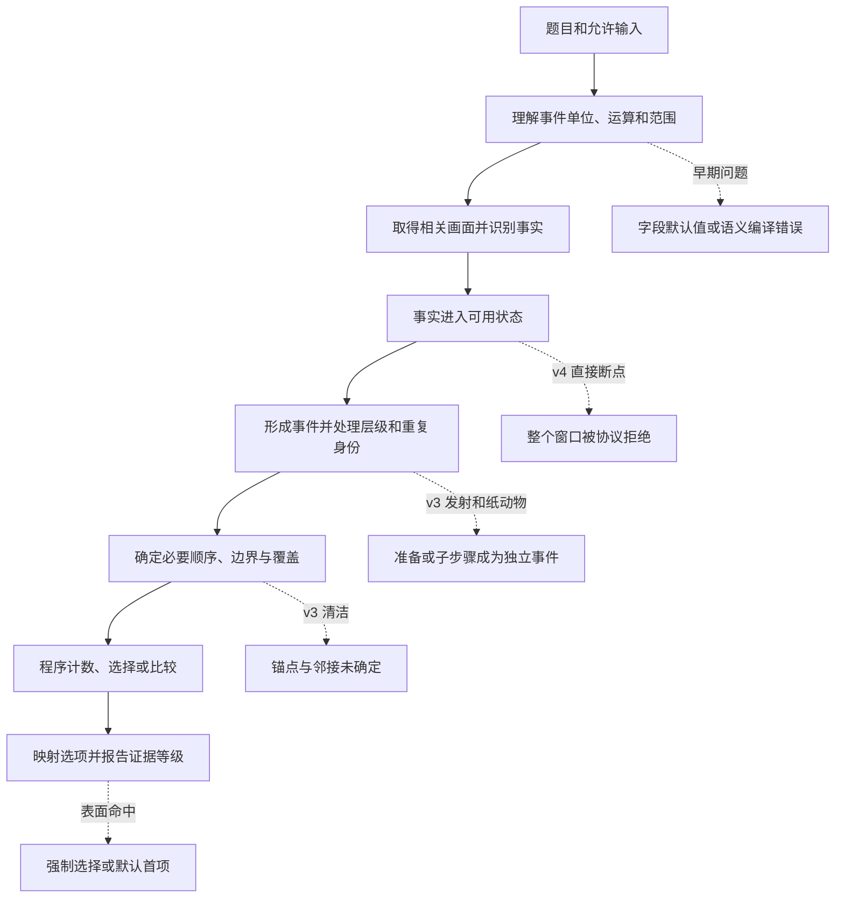

> 分类来源材料：保留原材料的设计语境；当前实现与验证状态请看 [运行文档](../pipelines/) 和 [发布验证](../validation.md)。

# R3：事件账本与时序归约——题型特征、原题与 pipeline 重设计讨论材料

整理日期：2026-09-09。分类基线：项目当前的 `benchmark_pipeline_reclassification_v04.xlsx`。用途：与导师讨论 R3 的任务边界、证据需求和实现路线。

**R3 关心的是：在题目允许的时间范围内，哪些事件实际发生了，它们各算一次什么事件，彼此有什么时间关系，以及如何据此得到次数、序号、顺序、位置、时长或频次。** 当前名称中的“账本”是一种工程实现选择；即使重写实现，这组任务的共同要求仍然存在。

本文整理 **29 道 R3 机制例题和 6 道边界例题，共 35 道完整题干与选项**，涉及 9 个 benchmark。其中 30 道来自逐题原始标注，3 道是有论文答案的 EgoLifeQA 原例，2 道 LongVideoBench 例题沿用源表转录、明确保留答案待核状态。附录列出源表中 **28 个默认 R3 入口和 9 个条件性涉及 R3 的入口**，保留其原生标签、代表题及分类差异。

**当前实跑经验支持的判断是：R3 值得作为共同任务族研究，但我们尚未证明现有“编译—观察—账本—复核—归约”实现可靠。** 已出现事件单位错误、事实无法入账、关系核验失真、预算被非关键调用消耗、以及默认选项掩盖失败等问题。最近 v4 发射题首先失败在输出协议与提交边界，尚未真正检验可修订时间线能否数对三次。不能把这几轮统一概括为“题太难”“只需加强 prompt”或“模型完全没看视频”。

本次核对了分类表、标注、公开来源、已有运行报告及上传代码快照；**未运行模型、未连接服务器、未新增测评，也未重新观看全部原视频**。官方答案与本文的机制分析分开呈现；文中的观察需求是待验证的设计要求，不是新完成的视频标注。

## 阅读导航

- [1. R3 在九类体系中的位置](#definition)
- [2. R3 的关键特征与内部子型](#features)
- [3. 29 道 R3 机制原题](#examples)
- [4. 6 道容易混淆的边界原题](#boundaries)
- [5. 三道调试题与历次失败](#failures)
- [6. 重设计时应优先讨论的选择](#redesign)
- [7. 导师讨论提纲与验收口径](#discussion)
- [8. 附录：37 个相关原生入口与原题索引](#taxonomy)
- [9. 来源、版本与核验范围](#sources)

若讨论时间有限，先看第 1、2、5、6 节。例题优先看 E01–E03、E04、E07、E09、E23–E24，再看同视频的 B01、B03 对照。

<a id="definition"></a>

## 1. R3 在九类体系中的位置

### 1.1 现有分类的含义

九类体系按**求解所需的主要证据状态和控制流程**分类，不是按英文关键词分类，也不是九个 benchmark 官方标签。它是待验证的工程分解，不能仅凭名称认定必须维护九套完全独立系统。[分类源表](benchmark_pipeline_reclassification_v04.xlsx)，“9类Pipeline”工作表第 4 行给出了 R3 定义。

| 维度 | 源表中的 R3 定义 | 重设计时需要回答的问题 |
| --- | --- | --- |
| 名称 | 事件账本与时序归约 | 是否保留账本、改为轻量事件表，或按题采用不同状态？ |
| 核心状态 | 事件／区间：ID、主体、起止时间、边界证据、覆盖范围 | 哪些是所有题必需，哪些只在特定运算中需要？ |
| 控制流 | 定义事件单位与范围 → 扫描／检索 → 记录边界 → 合并重复窗口 → 归约 | 能否避免固定地走完每个环节？ |
| 查询形式 | 次数、顺序、时长、锚点前后、首次／末次、习惯频次／共现 | 能否共享观察能力，使用不同的证据完成条件？ |
| 停止条件 | 必要范围已覆盖，影响答案的边界已处理；局部关系只覆盖足以证明关系的区间 | 如何区分“已经采样”和“关键疑点已经解决”？ |
| 硬边界 | 不同对象／动作种类主要归 R4；连续轨迹形态主要归 R2；next 不一定是未来预测 | 如何按具体问题判断，而不硬套原生任务名？ |

**“时序归约”可以用普通话理解为：把带时间的事件记录，变成题目要求的结果。** 比如把三次独立发射归约成数字 3，把若干制作事件按制作顺序排列后取第二个，再读取它的动物类别。

### 1.2 与其余八类的边界

| 类别 | 项目名称 | 与 R3 的主要区别 | 可共享的能力 |
| --- | --- | --- | --- |
| R1 | 定向定位与局部取证 | 在有限片段读一个直接事实；“开头的杯子是什么颜色”不要求构建事件序列 | 检索、局部视频观察、OCR、属性读取 |
| R2 | 连续动态与实体状态追踪 | 重点是轨迹、相位、方向和连续身份；“画出什么形状”与“画了几次该形状”不同 | 运动识别、身份追踪、动作周期检测 |
| **R3** | **事件账本与时序归约** | **重点是独立发生、事件时间关系与按时间聚合** | 时间索引、去重、顺序选择、区间运算 |
| R4 | 清单构建与集合归约 | 数不同对象／类别，或查缺失活动；不是同一事件类型发生几次 | 目标识别、实例／类别归一化、范围覆盖 |
| R5 | 分段全局综合 | 回答全片主要内容或整体过程，允许适度压缩；压缩会损失 R3 所需的次数和细粒度先后 | 分段浏览、场景索引、事实缓存 |
| R6 | 证据约束关系推理 | 判断原因、意图、关系、步骤正确性；时间先后本身不等于因果 | 事实检索、候选证据核验、人物绑定 |
| R7 | 假设与未来推演 | 推断尚未观察到的未来或改变条件后的结果；R3 通常查询已发生的历史 | 观察截止、当前状态、历史事件记录 |
| R8 | 视觉符号与约束求解 | 从数字、公式、图表或规则求解；视频内真实事件的时间差是 R3，读取日期再算差可能主要是 R8 | 算术、比较、约束与结果映射 |
| R9 | 空间场景建模与查询 | 重点是空间坐标、距离、方向和多视角结构；空间视频里的出现顺序仍可属 R3 | 对象识别、跨视角身份、场景检索 |

一个题可以同时调用多类能力。例如“空中画了几个梯形”可能由 R2 的轨迹识别支持 R3 计数；“最常与我一起弹吉他的人是谁”需要人物识别，但主要结果来自多次共同活动的频次统计。**主类表示主要求解机制，不表示感知部分容易。**

### 1.3 五个特别容易误判的情况

1. **看到 counting 就归 R3。** `How many different kinds of animal faces…` 数的是类别，R4 更合适；`How many times…` 才倾向事件次数。TVBench 的 Action Count 模板还写着 `sets` 与 `distinct repeated actions`，不能直接继承 MVBench 的计数单位。
2. **看到 first、last、next 就归 R3。** “开头的颜色”可以是 R1；“历史上最早的年代”可能是明示事实或数字比较；“接下来会做什么”在输入只到预测截止时属于 R7。
3. **视频里有动作，就一定需要事件账本。** 单个局部动作识别可以由 R1 完成；连续动作方向和轨迹形态可能主要是 R2。
4. **按视频时间排序等于按现实时间排序。** 回放、剪辑、叙事倒叙可能打破这一点；“视频中出现次序”和“比赛实际进球次序”要分清。
5. **默认 R 等于每条真实题的 R。** 例如 Video-MME 的 Object Recognition 225-3 实际还要求选择第二个制作事件；Video-MME-v2 的 Basic Counting 002-1 则直接问浇花次数。

<a id="features"></a>

## 2. R3 的关键特征与内部子型

### 2.1 第一难点：什么才算“一次”

事件不是帧，也不是窗口，更不是一句模型描述。对同一动作连续抽取 20 帧，不等于发生了 20 次；同一制作过程被分成 4 个窗口，也不等于制作了 4 个成品。

| 事件单位 | 如何区分一次 | 典型例题 | 容易混淆的内容 |
| --- | --- | --- | --- |
| 动作周期 | 一轮目标动作及其重置／下一轮起点 | 发射、俯卧撑、重复演示 | 准备、动作中段、结果状态被分别计数 |
| 完整活动／制作实例 | 围绕同一目标或成品的一次活动 | 第二个纸动物 | 折叠、绘画、展示被误当三个制作实例 |
| 出现片段 | 连续出现及其离开／再次出现 | 动物依次出场 | 同一类别再次出现被集合去重删掉 |
| 类别首次出现 | 每个指定类别最早出现的时刻 | VSI-Bench 类别顺序 | 首次出现次序与空间位置顺序混淆 |
| 状态转变 | 从指定前态到后态的一次变化 | 进出、开关、场景切换 | 持续状态被按窗口重复计数 |
| 话语／提及事件 | 有时间位置的一次说出或提及 | 计划跳舞后先提到哪首歌 | 将字幕提及当成视觉动作已经发生 |
| 共现活动 | 两种活动或参与者满足约定的重叠关系 | 喝咖啡时通常做什么 | 长片段因帧多而被错误赋予更高频次 |

事件层级要服务题目。对纸动物题，“折一步”可以保留为制作证据，但题目所排序的单位是纸动物的制作过程。对发射题，“按压”可能是准备，也可能是完整动作的关键环节；需要图像确认，不能靠编译 prompt 提前宣布机械过程。

### 2.2 第二难点：时间有多种口径

至少区分：

- **媒体时间**：视频的第几秒，模型输入的帧属于哪里。
- **事件边界**：目标动作何时开始、何时结束，边界是否只是一个不确定区间。
- **题目范围**：全片、某一阶段、某锚点后，或该阶段最初 15 秒。
- **内容中的时间**：画面上的比赛计时、字幕说的日期、故事里的前一天。

E04 的“Green Level 最初 15 秒”应先定位 Green Level 起点，再取相对区间；不是自动读取视频第 0–15 秒。E22 的热身到开赛可能需要两个事件边界之差；B06 的计时器设置则可能只需读取一个显示值。E23 所问的停留时长还要判断是在视频呈现时间上统计，还是在叙事中的实际下午时间上比较。

**出现顺序、开始顺序和完成顺序可能不同。** 原题只有 `made` 时，应保留制作含义并核对标注口径，不能把我们采用的 `offset` 排序当成官方提供的精确完成时间真值。两个活动重叠也不意味着完全无法回答；如果题目只问谁先开始，可能已有充分证据。

### 2.3 第三难点：事件身份与对象身份不同

同一个人、同一个物体可以完成多次独立动作；同一个事件也可以跨多个窗口、镜头或视角出现。因此：

- 同一物体 ≠ 同一次事件。
- 共享帧或时间重叠 ≠ 必然同一次事件。
- 分处两个窗口 ≠ 两次事件。
- 两个不同片段 ≠ 必然两次现实发生；可能是回放。

需要保留“同一事件”“不同事件”“尚不能判断”之间的区别。还需要能纠正事件内容：准备动作误报时撤销，多个动作混在一起时拆分，同一制作被分段时合并。仅有 SAME/DISTINCT 的关系标签不足以解决所有问题。

### 2.4 第四难点：答案需要的覆盖范围不同

| 查询 | 最少需要证明什么 | 何时还不能停止 |
| --- | --- | --- |
| 全片次数 | 所需范围内独立事件及未解决候选，含重复身份处理 | 仍可能漏事件、重复计数或错误计入准备动作 |
| 首次／第 N 项／前 K 项 | 相关前缀、竞争候选、顺序及被读属性 | 更早可能还有事件；已找到 N 条但顺序未定 |
| 末次／后 K 项 | 相关后缀及尾端覆盖 | 后面尚未看完，可能再出现 |
| 后继／前驱 | 正确锚点、目标事件及两者之间的相关覆盖 | 找到“之后某件事”，却未排除更近的事件 |
| 定位／时长 | 被选事件的所需边界及时间基准 | 起止未知、剪辑跳时或比较对象尚不完整 |
| 共现频率 | 主事件样本、参与者／伴随活动、统计范围 | 仅看到一次共现，或把帧数当次数 |

**扫描完成只是采样工作完成；证据充分是题目所需的关键判定完成。** 稀疏采样即使覆盖首中尾，也不是数学意义上的“没有漏掉任何事件”。应记录采样能力与残留疑点，而不是使用一个 `coverage=true` 代替全部证明。

阴性结果也有不同来源：“确实没有目标”“有动作但没识别成目标”“边界不清”“输出没通过协议”。只有第一种在合格范围证据支持下才可能支持零次；后几种不能自动变成零。

### 2.5 第五难点：短动作与长活动需要不同观察方式

| 情况 | 主要信息需求 | 对统一窗口方案的挑战 |
| --- | --- | --- |
| 短、重复、快速动作 | 足够密的连续运动和周期切换 | 稀疏帧可能跳过关键过程；增加文字推理不能补回没拍到的状态 |
| 跨窗长活动 | 主体／对象连续性、活动阶段、成品身份 | 窗口切分会诱导把步骤当独立事件 |
| 长视频稀有事件 | 高召回检索与有限局部精看 | 逐窗同等投入成本高；只凭摘要又易漏短事件 |
| 多个并行事件 | 部分顺序、重叠关系、参与者 | 强制全序或精确单点时间会制造虚假确定性 |
| 多日历史频次 | 查询时刻、历史索引、跨记录去重 | 短视频全扫模板无法直接扩展到长期记忆 |

“R3 是一个任务族”与“每题应固定同样窗口、相同输出字段、同样复核次数”是两回事。后者需要实验支持。

### 2.6 现有 12 类运算如何对应任务

下表保留当前接口名称，便于对照旧代码；不要求新 pipeline 继续采用同一份实现。多种运算可以组合在一题中。

| 运算 | 结果是什么 | 必要证据 | 本文例题 |
| --- | --- | --- | --- |
| `count_occurrences` | 独立发生次数 | 事件单位、重复身份、必要范围 | E01、E04–E07、E20 |
| `localize_event` | 事件所在区间／位置 | 匹配事件及所需定位精度 | E21 |
| `first_occurrence` | 第一次及其属性 | 前缀覆盖、最早候选 | E08–E10 |
| `last_occurrence` | 最后一次及其属性 | 后缀覆盖、最晚候选 | E10、E29 |
| `first_k` | 前 K 个的有序列表 | 前缀、顺序与每项身份 | E12 |
| `last_k` | 后 K 个的有序列表 | 后缀、顺序与每项身份 | E11 |
| `nth_occurrence` | 第 N 个及其属性 | 前 N 项的支持、序号和属性 | E02 |
| `order_events` | 指定事件／出现片段的顺序 | 相应的先后关系，保留必要重复 | E09、E13、E18–E19 |
| `next_after_anchor` | 锚点后符合要求的事件 | 锚点选择、后继及邻接要求 | E03、E14、E16、E27 |
| `previous_before_anchor` | 锚点前符合要求的事件 | 锚点选择、前驱及邻接要求 | E15、E17、E28 |
| `event_duration` | 时长、时间差或时长比较 | 时间基准、相关边界、区间合并口径 | E22–E23 |
| `cooccurrence_frequency` | 伴随活动／人物的频次 | 独立主事件、共现条件、统计范围 | E24–E25 |

其中 `before/after` 不必天然等于“紧挨着”：E16、E17 明确写 first／most recent；E14、E15 的较宽题干需要结合任务定义和候选理解。E22 的“两事件间隔”是否用现有 `event_duration` 直接表达，也是新接口需要明确的边界，不能用运算名称掩盖参数定义。

### 2.7 标注与输入规则本身也会影响设计

- MVBench 候选在原始 JSON 中是有序文本列表，答案是候选文本；本文 A/B/C 是按原始顺序展示。`action_sequence` 的 `start/end` 是官方输入范围信息，不能随便看其外的视频，也不能把它误当为目标事件的真值边界。[官方加载器](https://github.com/OpenGVLab/Ask-Anything/blob/4dd8210b030374bb0c510a57dfbe916f70d3ef71/video_chat2/mvbench.ipynb)
- `action_localization` 另有 `accurate_start/accurate_end` 标注，它们属于真值信息；讨论时可用来了解任务，生产观察和查询编译不能读入。其他数据的 `time_reference` 也要先确定是允许输入还是评分／证据标注。
- LongVideoBench 的问题可能用字幕作为锚点；EgoLifeQA 的“提到歌曲”可能需要语音／转写。它们说明 R3 的范围，不表示当前纯视觉 runner 已具备相应输入。[LongVideoBench 任务定义](https://arxiv.org/html/2407.15754v1)、[EgoLifeQA 定义](https://arxiv.org/html/2503.03803v2)
- TOMATO Visual Cues 明确要求无音频条件下从视觉线索判断动作时机。题干里的 `sounds` 不能自行授权读取音频。[TOMATO §4.1](https://arxiv.org/html/2410.23266v2)
- 标准答案、人工观察说明和官方边界应隔离保存。本讨论文档含答案，不能整体放进生产模型上下文。共享视频可以共享媒体文件，不能自动共享另一道题的答案或中间结论。

<a id="examples"></a>

## 3. 29 道 R3 机制原题

以下保留来源题干、选项顺序及答案，不把中文译文伪装成原题。**“证据需求”和“易错点”均是本文分析。** 这些是机制讨论材料，不是新安排的测评题单。E27–E28 的逐题原始标注本轮未取得，来源层级单独注明。

| 编号 | 原题定位 | 主要机制 |
| --- | --- | --- |
| [E01](#e01) | MVBench / action_count.json，第 0 行（从 0 开始） | 短动作次数：桌面发射 |
| [E02](#e02) | Video-MME / question_id=225-3 | 第 N 个制作事件及成品属性：第二个纸动物 |
| [E03](#e03) | Video-MME / question_id=251-3 | 已发生的紧接动作：清洁地板之后 |
| [E04](#e04) | Video-MME-v2 / question_id=002-1 | 语义阶段内的相对时间范围：浇花次数 |
| [E05](#e05) | Video-MME-v2 / question_id=108-1 | 用教学口令绑定目标动作：soda pop |
| [E06](#e06) | Video-MME-v2 / question_id=108-3 | 双锚点之间的完整演示次数 |
| [E07](#e07) | TOMATO / key=0209-03 | 动态轨迹构成一次事件：空中画梯形 |
| [E08](#e08) | MVBench / character_order.json，第 0 行（从 0 开始） | 书写顺序与 OCR：第一个字母 |
| [E09](#e09) | VSI-Bench / id=2713 | 类别首次出现顺序：空间视频中的时间查询 |
| [E10](#e10) | Video-MME-v2 / question_id=014-2 | 首项和末项同时查询：首末进球队伍 |
| [E11](#e11) | Video-MME-v2 / question_id=019-1 | 后 K 项及其顺序：最后五个动物片段 |
| [E12](#e12) | Video-MME-v2 / question_id=021-1 | 前 K 项的有序列表：最先两项比赛 |
| [E13](#e13) | Video-MME-v2 / question_id=019-2 | 保留重复出现：全部猫科动物序列 |
| [E14](#e14) | MVBench / action_sequence.json，第 0 行（从 0 开始） | 锚点之后的动作：拿食物后 |
| [E15](#e15) | MVBench / action_sequence.json，第 1 行（从 0 开始） | 锚点之前的动作：看书前 |
| [E16](#e16) | Video-MME-v2 / question_id=143-1 | 显式紧接后继：拉窗帘后的第一件事 |
| [E17](#e17) | Video-MME-v2 / question_id=143-2 | 显式最近前驱：拉窗帘前最近的一件事 |
| [E18](#e18) | MVBench / scene_transition.json，第 0 行（从 0 开始） | 场景转移的方向 |
| [E19](#e19) | MLVU / data/5_order.json，第 0 行（从 0 开始） | 长视频中的四事件排序 |
| [E20](#e20) | MLVU / data/4_count.json，第 0 行（从 0 开始） | 长视频中的目标场景出现次数 |
| [E21](#e21) | MVBench / action_localization.json，第 0 行（从 0 开始） | 时间区间定位：坐在沙发上发生在哪一段 |
| [E22](#e22) | LVBench / uid=3960 | 两个事件之间的时间差：热身到开赛 |
| [E23](#e23) | Video-MME / question_id=556-3 | 按停留时长选择地点 |
| [E24](#e24) | EgoLifeQA / 源表“159原映射审计”第 158 行 | 跨多次事件的共现频次：喝咖啡时的习惯 |
| [E25](#e25) | EgoLifeQA / 源表“159原映射审计”第 104 行 | 按共同活动频次选择人物 |
| [E26](#e26) | EgoLifeQA / 源表“159原映射审计”第 157 行 | 跨历史记录的首个话语事件 |
| [E27](#e27) | LongVideoBench / 源表“159原映射审计”第 46 行 | 长视频中的视觉锚点后继 |
| [E28](#e28) | LongVideoBench / 源表“159原映射审计”第 47 行 | 长视频中的字幕锚点前驱 |
| [E29](#e29) | TOMATO / key=0731-00 | 无音频条件下的末次动作：最后演奏的乐器 |

<a id="e01"></a>

### E01　短动作次数：桌面发射

**来源与定位：** MVBench / action_count；action_count.json，第 0 行（从 0 开始）；video=video_6480.mp4。[原始标注](https://huggingface.co/datasets/OpenGVLab/MVBench/resolve/230a2d4fac8900333c61754641c7a13e069ac9c6/json/action_count.json)；本地来源（本地证据，未随仓库分发）

**来源层级：** 原始标注。

**英文原题与完整选项：**

```text
How many times did the person launch objects on the table?

A. 3
B. 2
C. 4
```

**中文题意：** 这个人在桌上发射物体多少次？

**来源答案：** A. 3 来源将答案保存为候选文本；本文标签按候选原始顺序分配。

**题型特征：** 重复动作计数。一次“发射”是题目事件单位；按压、拿起、放下、飞出和落地可能属于同一次动作的不同阶段。

**最小证据需求：** 全片中的独立发射候选、区分准备与目标动作的画面，以及跨窗口重复身份。计数通常不需要把每次起止精确到某一帧，但必须能说明为什么是不同的完整发生。

**易错点／讨论价值：** 官方答案为 3。旧运行曾产生 6 条 accepted 记录，程序仍无法确定计数；最新 v4 则 0 条提交。两种失败的阶段完全不同，详见第 5 节。

<a id="e02"></a>

### E02　第 N 个制作事件及成品属性：第二个纸动物

**来源与定位：** Video-MME / Object Recognition；question_id=225-3；video_id=225。[原始标注](https://huggingface.co/datasets/lmms-eval/Video-MME/resolve/ead1408f75b618502df9a1d8e0950166bf0a2a0b/videomme/test-00000-of-00001.parquet)；本地来源（本地证据，未随仓库分发）；[来源视频](https://www.youtube.com/watch?v=BiJtPU9uP0c)

**来源层级：** 原始标注。

**英文原题与完整选项：**

```text
What is the second paper animal made in this video?

A. A pig.
B. A cat.
C. A dog.
D. A monkey.
```

**中文题意：** 视频中制作的第二个纸动物是什么？

**来源答案：** A. A pig.

**题型特征：** 按制作事件选择第 2 项，然后读取动物类别。原生 Object Recognition 标签不能覆盖其全部求解要求。

**最小证据需求：** 至少要识别第一、第二个制作实例的相对次序，以及第二个成品的类别；步骤和成品之间需要对应关系。制作开始顺序、完成顺序与展示顺序要分开。

**易错点／讨论价值：** 看见猪脸或 Pinky Pig 文字还不够，必须把属性归到正确的制作实例。不能把“先选前两项，再让终局猜第二项”当成已经完成程序选择，也不能因为读到猫就忽略更早制作。

<a id="e03"></a>

### E03　已发生的紧接动作：清洁地板之后

**来源与定位：** Video-MME / Temporal Perception；question_id=251-3；video_id=251。[原始标注](https://huggingface.co/datasets/lmms-eval/Video-MME/resolve/ead1408f75b618502df9a1d8e0950166bf0a2a0b/videomme/test-00000-of-00001.parquet)；本地来源（本地证据，未随仓库分发）；[来源视频](https://www.youtube.com/watch?v=1sTQOxXFO44)

**来源层级：** 原始标注。

**英文原题与完整选项：**

```text
After cleaning her floor in the video, what did the woman do next?

A. Frying an egg.
B. Using a cup to catch water.
C. Washing her clothes.
D. Cutting a watermelon.
```

**中文题意：** 视频中，女子清洁地板后紧接着做了什么？

**来源答案：** A. Frying an egg.

**题型特征：** 先定位独立的清洁锚点，再选择其后继动作；属于已经发生的时序查询。

**最小证据需求：** 哪个清洁片段是题目锚点、它何时结束、之后出现什么活动，以及中间是否还有更符合 next 的动作。全片检索有时必要，但最后只需闭合相关邻接证据。

**易错点／讨论价值：** 常见错误是把清洁编成待返回的主事件，或把“之后某个动作”当作“下一个动作”。题干没有 15 秒限制。旧运行默认 A 恰好命中煎蛋，不证明邻接链成立。

<a id="e04"></a>

### E04　语义阶段内的相对时间范围：浇花次数

**来源与定位：** Video-MME-v2 / Basic Counting；question_id=002-1；video_id=002。[原始标注](https://huggingface.co/datasets/MME-Benchmarks/Video-MME-v2/resolve/6e4bebb03202e1ddbf3d37703e560e51c5aa2d64/test.parquet)；本地来源（本地证据，未随仓库分发）；[来源视频](https://www.youtube.com/watch?v=3kkRIIRDm0k)

**来源层级：** 原始标注。

**英文原题与完整选项：**

```text
Within the first 15 seconds of the Green Level challenge, how many times in total did the man water the flowers?

A. 4.
B. 1.
C. 7.
D. 2.
E. 0.
F. 5.
G. 6.
H. 3.
```

**中文题意：** 在 Green Level 挑战开始后的前 15 秒内，男子总共浇了几次花？

**来源答案：** F. 5.

**题型特征：** 相对语义阶段的计数：先绑定 Green Level 起点，再在该阶段前 15 秒累计浇花事件。

**最小证据需求：** 阶段开始的来源、视频时间到阶段相对时间的映射、区间内的独立浇花动作。要决定跨区间边界的一次动作按开始、结束还是相交计入。

**易错点／讨论价值：** 这是原题明确给出的 15 秒，与 E03 曾被模型凭空添加的 15 秒不同。原生 Basic Counting 在本题中应以事件次数解释，不能因为标签“Basic”改为对象数量。

<a id="e05"></a>

### E05　用教学口令绑定目标动作：soda pop

**来源与定位：** Video-MME-v2 / Repetitive Action Counting；question_id=108-1；video_id=108。[原始标注](https://huggingface.co/datasets/MME-Benchmarks/Video-MME-v2/resolve/6e4bebb03202e1ddbf3d37703e560e51c5aa2d64/test.parquet)；本地来源（本地证据，未随仓库分发）；[来源视频](https://www.youtube.com/watch?v=wPW3Rzz06Ek)

**来源层级：** 原始标注。

**英文原题与完整选项：**

```text
How many times did the video demonstrate the action corresponding to "soda pop" when teaching Section 1?

A. 3.
B. 5.
C. 2.
D. 4.
E. 6.
F. 7.
G. 1.
H. 8.
```

**中文题意：** 教授 Section 1 时，视频示范了多少次与“soda pop”对应的动作？

**来源答案：** E. 6.

**题型特征：** 用语言标签指代视觉动作，再在指定教学阶段数演示次数。语言标签解决目标含义，视觉过程解决实际发生。

**最小证据需求：** Section 1 的范围、口令与动作之间的绑定、该动作每轮演示的证据。若需要字幕或音频才能绑定，必须先核对本次输入权限。

**易错点／讨论价值：** 不能统计字符串出现次数代替动作演示次数；背景音乐重复说出口令也不等于人物重复完成动作。

<a id="e06"></a>

### E06　双锚点之间的完整演示次数

**来源与定位：** Video-MME-v2 / Repetitive Action Counting；question_id=108-3；video_id=108。[原始标注](https://huggingface.co/datasets/MME-Benchmarks/Video-MME-v2/resolve/6e4bebb03202e1ddbf3d37703e560e51c5aa2d64/test.parquet)；本地来源（本地证据，未随仓库分发）；[来源视频](https://www.youtube.com/watch?v=wPW3Rzz06Ek)

**来源层级：** 原始标注。

**英文原题与完整选项：**

```text
From the end of teaching Section 1 to the beginning of teaching Section 3, during the time in between, how many times was the "YOU'RE ALL I CAN THINK OF" action completely demonstrated?

A. 14.
B. 11.
C. 9.
D. 15.
E. 8.
F. 10.
G. 13.
H. 12.
```

**中文题意：** 从 Section 1 教学结束到 Section 3 教学开始之间，“YOU'RE ALL I CAN THINK OF”动作被完整示范了多少次？

**来源答案：** B. 11.

**题型特征：** 双锚点界定范围，且题面显式要求完整演示。它比只数动作片段多一个完成条件。

**最小证据需求：** 两个阶段边界、目标动作含义、每个候选是否完成、跨窗合并，以及边界外的片段不混入。

**易错点／讨论价值：** 不能把口令标注的整段教学视频都扫描后直接相加，也不能把跨窗的一次动作拆成两次。“completely”来自题面，不应与所有计数题一律强制完整结束混为一谈。

<a id="e07"></a>

### E07　动态轨迹构成一次事件：空中画梯形

**来源与定位：** TOMATO / count；key=0209-03。[原始标注](https://huggingface.co/datasets/yale-nlp/TOMATO/resolve/aa4827bbd64ce5a93588b09e5c6da6eb58dd09c9/data/count-00000-of-00001-b1a5fcd07825dea8.parquet)；本地来源（本地证据，未随仓库分发）

**来源层级：** 原始标注。

**英文原题与完整选项：**

```text
How many trapezoid(s) does the person draw in the air throughout the entire video?

A. 2
B. 1
C. 3
D. 4
E. 5
F. 0
```

**中文题意：** 整个视频中，这个人在空中画了多少个梯形？

**来源答案：** C. 3 原始 answer=2，按从 0 开始的索引转为选项标签。

**题型特征：** 一次事件由完整轨迹形状定义，R3 计数依赖 R2 式连续运动识别。

**最小证据需求：** 能辨认梯形路径的连续运动、轮次切换或重置，以及整个范围的重复次数。只有手部静态位置通常不足以证明一次梯形。

**易错点／讨论价值：** 这类题可能受细粒度视觉能力主导。添加事件账本不能自动修复轨迹没识别出来的问题。原始 answer=2 是从 0 开始的选项索引，对应 C=3，不是答案数值 2。

<a id="e08"></a>

### E08　书写顺序与 OCR：第一个字母

**来源与定位：** MVBench / character_order；character_order.json，第 0 行（从 0 开始）；video=video_1238.mp4。[原始标注](https://huggingface.co/datasets/OpenGVLab/MVBench/resolve/230a2d4fac8900333c61754641c7a13e069ac9c6/json/character_order.json)；本地来源（本地证据，未随仓库分发）

**来源层级：** 原始标注。

**英文原题与完整选项：**

```text
What letter did the person write first on the paper?

A. l
B. v
C. e
```

**中文题意：** 这个人在纸上最先写的是哪个字母？

**来源答案：** A. l 来源将答案保存为候选文本；本文标签按候选原始顺序分配。

**题型特征：** 书写事件排序后做字符识别。最终纸面上的空间排列不一定等于写字顺序。

**最小证据需求：** 各候选字符何时写出或首次可辨，特别是最早书写过程；OCR 可以读取字母，但需要时间依据来选 first。

**易错点／讨论价值：** 只看最终成品或默认从左到右读取可能误判。若开场已经有文字，还需区分预先存在的字母与视频中实际新写的字母。

<a id="e09"></a>

### E09　类别首次出现顺序：空间视频中的时间查询

**来源与定位：** VSI-Bench / obj_appearance_order；id=2713；scene_name=45b0dac5e3；dataset=scannetpp。[原始标注](https://huggingface.co/datasets/nyu-visionx/VSI-Bench/resolve/bdcadb3fea447621a828a24911801faba3587c12/test.jsonl)；本地来源（本地证据，未随仓库分发）

**来源层级：** 原始标注。

**英文原题与完整选项：**

```text
What will be the first-time appearance order of the following categories in the video: ceiling light, cup, heater, door?

A. cup, door, heater, ceiling light
B. ceiling light, door, cup, heater
C. heater, cup, door, ceiling light
D. ceiling light, cup, heater, door
```

**中文题意：** 视频中，ceiling light、cup、heater、door 这些类别首次出现的顺序是什么？

**来源答案：** A. cup, door, heater, ceiling light

**题型特征：** 按类别的首次出现时间排序。场景属于空间数据集，但问题本身不要求重建距离或三维坐标。

**最小证据需求：** 每个指定类别最早出现的证据及此前覆盖；同类多个实例如何定义“类别出现”按官方任务口径处理。

**易错点／讨论价值：** 题干有 will，但官方给定视频中的 appearance order 不是未见未来预测。也不能把相机经过物体的空间路线直接当作已核验的出现时间。

<a id="e10"></a>

### E10　首项和末项同时查询：首末进球队伍

**来源与定位：** Video-MME-v2 / Event Sequence Ordering；question_id=014-2；video_id=014。[原始标注](https://huggingface.co/datasets/MME-Benchmarks/Video-MME-v2/resolve/6e4bebb03202e1ddbf3d37703e560e51c5aa2d64/test.parquet)；本地来源（本地证据，未随仓库分发）；[来源视频](https://www.youtube.com/watch?v=sI2VBJH8Jn4)

**来源层级：** 原始标注。

**英文原题与完整选项：**

```text
Which teams scored the first and last goals in this match, respectively?

A. The green team, the green team.
B. The white team, the blue team.
C. The red team, the red team.
D. The green team, the red team.
E. The white team, the white team.
F. The red team, the green team.
G. The red team, the white team.
H. The white team, the red team.
```

**中文题意：** 这场比赛中，分别是哪支队伍打进第一个和最后一个进球？

**来源答案：** F. The red team, the green team.

**题型特征：** 两个位置选择加队伍属性投影，需要前端和尾端证据。

**最小证据需求：** 目标进球事件、首球与末球顺序及所属队伍；镜头回放是否重复展示同一进球需要单独处理。

**易错点／讨论价值：** 只找到第一个进球就停止会遗漏末项要求；只看最后一个进球镜头也可能把首球的回放认作末球。题目说比赛中的进球，不能无条件按视频剪辑片段逐次计数。

<a id="e11"></a>

### E11　后 K 项及其顺序：最后五个动物片段

**来源与定位：** Video-MME-v2 / Object Appearance Ordering；question_id=019-1；video_id=019。[原始标注](https://huggingface.co/datasets/MME-Benchmarks/Video-MME-v2/resolve/6e4bebb03202e1ddbf3d37703e560e51c5aa2d64/test.parquet)；本地来源（本地证据，未随仓库分发）；[来源视频](https://www.youtube.com/watch?v=lAIVJxXoc_Q)

**来源层级：** 原始标注。

**英文原题与完整选项：**

```text
What is the sequence of last five aquatic animals appearing in the video?

A. Fish -> Hippo -> Whale -> Orca -> Seal & Orca.
B. Whale -> Hippo -> Fish -> Seal & Orca -> Orca.
C. Fish -> Seal & Orca -> Orca -> Whale -> Hippo.
D. Whale -> Orca -> Hippo -> Fish -> Seal & Orca.
E. Hippo -> Whale -> Fish -> Orca -> Seal & Orca.
F. Hippo -> Whale -> Orca -> Seal & Orca -> Fish.
G. Hippo -> Fish -> Whale -> Orca -> Seal & Orca.
H. Hippo -> Whale -> Fish -> Seal & Orca -> Orca.
```

**中文题意：** 视频中最后出现的五个水生动物，其顺序是什么？

**来源答案：** A. Fish -> Hippo -> Whale -> Orca -> Seal & Orca.

**题型特征：** 取后五项并保留顺序。原题称 animals，候选里包含 Seal & Orca 联合片段；本文按题面与选项解释为出现序列，不把它擅自换成五个唯一物种。

**最小证据需求：** 尾部的出现事件、各片段类别、联合出现如何作为一项，以及末尾已覆盖的依据。

**易错点／讨论价值：** 全片物种清单不能回答后五项；同类再次出现也不能自动去重。应先固定项的单位，再执行 last_k。

<a id="e12"></a>

### E12　前 K 项的有序列表：最先两项比赛

**来源与定位：** Video-MME-v2 / Event Sequence Ordering；question_id=021-1；video_id=021。[原始标注](https://huggingface.co/datasets/MME-Benchmarks/Video-MME-v2/resolve/6e4bebb03202e1ddbf3d37703e560e51c5aa2d64/test.parquet)；本地来源（本地证据，未随仓库分发）；[来源视频](https://www.youtube.com/watch?v=DkQWbcCf-QA)

**来源层级：** 原始标注。

**英文原题与完整选项：**

```text
What is the order of the first two competitions?

A. Arm wrestling, deadlift.
B. Deadlift, arm wrestling.
C. Punch strength, arm wrestling.
D. Push-ups, punch strength.
E. Punch strength, deadlift.
F. Arm wrestling, punch strength.
G. Push-ups, arm wrestling.
H. Deadlift, punch strength.
```

**中文题意：** 最先进行的两项比赛的顺序是什么？

**来源答案：** A. Arm wrestling, deadlift.

**题型特征：** 输出前两项的有序列表，而不是只问第 2 项。

**最小证据需求：** 开始阶段各比赛的识别、第一与第二项次序，排除此前还有一项符合“competition”的内容。

**易错点／讨论价值：** 预告片或片头展示可能不是正式比赛发生。应按题目事件含义区分预览、正式活动和结果展示。

<a id="e13"></a>

### E13　保留重复出现：全部猫科动物序列

**来源与定位：** Video-MME-v2 / Object Appearance Ordering；question_id=019-2；video_id=019。[原始标注](https://huggingface.co/datasets/MME-Benchmarks/Video-MME-v2/resolve/6e4bebb03202e1ddbf3d37703e560e51c5aa2d64/test.parquet)；本地来源（本地证据，未随仓库分发）；[来源视频](https://www.youtube.com/watch?v=lAIVJxXoc_Q)

**来源层级：** 原始标注。

**英文原题与完整选项：**

```text
What is the sequence of all felines appearing in the video?

A. Tiger -> Cougar -> Cheetah -> Lynx -> Tiger -> Tiger -> Lion -> Cougar.
B. Tiger -> Cheetah -> Cougar -> Tiger -> Tiger -> Lynx -> Cougar -> Lion.
C. Tiger -> Cougar -> Cheetah -> Tiger -> Lynx -> Tiger -> Cougar -> Lion.
D. Lion -> Tiger -> Cheetah -> Cougar -> Tiger -> Lynx -> Tiger -> Cougar.
E. Tiger -> Cheetah -> Tiger -> Cougar -> Lynx -> Tiger -> Lion -> Cougar.
F. Cheetah -> Tiger -> Cougar -> Tiger -> Lynx -> Tiger -> Lion -> Cougar.
G. Cheetah -> Tiger -> Tiger -> Cougar -> Lynx -> Cougar -> Tiger -> Lion.
H. Cougar -> Tiger -> Cheetah -> Tiger -> Tiger -> Lynx -> Lion -> Cougar.
```

**中文题意：** 视频中出现的所有猫科动物依次是什么？

**来源答案：** B. Tiger -> Cheetah -> Cougar -> Tiger -> Tiger -> Lynx -> Cougar -> Lion.

**题型特征：** 目标类别筛选后的完整出现序列。选项明确保留多次 Tiger，说明这里不能套“不同类别去重”。

**最小证据需求：** 每次符合条件的出现片段及顺序；同一连续片段跨窗口要合并，间隔之后再次出现要按任务单位保留。

**易错点／讨论价值：** 过度去重与去重不足都会改变答案。事件身份应与类别身份分开存储。

<a id="e14"></a>

### E14　锚点之后的动作：拿食物后

**来源与定位：** MVBench / action_sequence；action_sequence.json，第 0 行（从 0 开始）；video=ZS9XR.mp4；原始 start/end=1.5/17.1 秒。[原始标注](https://huggingface.co/datasets/OpenGVLab/MVBench/resolve/230a2d4fac8900333c61754641c7a13e069ac9c6/json/action_sequence.json)；本地来源（本地证据，未随仓库分发）

**来源层级：** 原始标注。

**英文原题与完整选项：**

```text
What happened after the person took the food?

A. Ate the medicine.
B. Tidied up the blanket.
C. Put down the cup/glass/bottle.
D. Took the box.
```

**中文题意：** 这个人拿了食物之后发生了什么？

**来源答案：** A. Ate the medicine. 来源将答案保存为候选文本；本文标签按候选原始顺序分配。

**题型特征：** 以取食物为锚点查询其后的动作。原始题干只写 after，具体是否要求最近后继还要结合官方任务与候选。

**最小证据需求：** 官方允许片段为 1.5–17.1 秒；在该输入范围识别锚点和候选事件的时间关系。

**易错点／讨论价值：** 不能因回答候选里有 medicine 就从常识补出服药动作；也不能把官方片段范围当作取食物事件本身的起止真值。

<a id="e15"></a>

### E15　锚点之前的动作：看书前

**来源与定位：** MVBench / action_sequence；action_sequence.json，第 1 行（从 0 开始）；video=EY6P4.mp4；原始 start/end=0.5/11.0 秒。[原始标注](https://huggingface.co/datasets/OpenGVLab/MVBench/resolve/230a2d4fac8900333c61754641c7a13e069ac9c6/json/action_sequence.json)；本地来源（本地证据，未随仓库分发）

**来源层级：** 原始标注。

**英文原题与完整选项：**

```text
What happened before the person watched at the book?

A. Tidied up the table.
B. Took the phone/camera.
C. Opened the closet/cabinet.
D. Washed the table.
```

**中文题意：** 这个人看书之前发生了什么？

**来源答案：** C. Opened the closet/cabinet. 来源将答案保存为候选文本；本文标签按候选原始顺序分配。

**题型特征：** 锚点前驱方向的查询。原题中的 watched at 按原文保留。

**最小证据需求：** 官方输入片段 0.5–11.0 秒内的看书锚点与之前动作。若有多个前序候选，需核对题目是否要求最近一个。

**易错点／讨论价值：** 扫描顺序从前到后不意味着只能做后继；前驱查询需要保留锚点前的相关片段。

<a id="e16"></a>

### E16　显式紧接后继：拉窗帘后的第一件事

**来源与定位：** Video-MME-v2 / Temporal Action Localization；question_id=143-1；video_id=143。[原始标注](https://huggingface.co/datasets/MME-Benchmarks/Video-MME-v2/resolve/6e4bebb03202e1ddbf3d37703e560e51c5aa2d64/test.parquet)；本地来源（本地证据，未随仓库分发）；[来源视频](https://www.youtube.com/watch?v=WHPI4UPvI0w)

**来源层级：** 原始标注。

**英文原题与完整选项：**

```text
What is the first thing that happens after the boy pulls the curtain closed?

A. The boy is hugged by his sister.
B. The boy looks around.
C. The boy and his sister look out the window together.
D. The boy adjusts his collar.
E. The boy scratches his nose.
F. The boy calls his sister's name.
G. The boy plays with a game controller.
H. The boy takes a deep breath.
```

**中文题意：** 男孩拉上窗帘后，发生的第一件事是什么？

**来源答案：** B. The boy looks around.

**题型特征：** 显式 first after。原生 Temporal Action Localization 标签下，本题返回的是后继活动内容。

**最小证据需求：** 窗帘拉合事件结束、紧接动作和中间覆盖；区分拉窗帘时的并行动作与拉上之后的动作。

**易错点／讨论价值：** 这是“找到某个之后动作”和“找到第一个之后动作”的直接对照，后者有更强的排他性要求。

<a id="e17"></a>

### E17　显式最近前驱：拉窗帘前最近的一件事

**来源与定位：** Video-MME-v2 / Temporal Action Localization；question_id=143-2；video_id=143。[原始标注](https://huggingface.co/datasets/MME-Benchmarks/Video-MME-v2/resolve/6e4bebb03202e1ddbf3d37703e560e51c5aa2d64/test.parquet)；本地来源（本地证据，未随仓库分发）；[来源视频](https://www.youtube.com/watch?v=WHPI4UPvI0w)

**来源层级：** 原始标注。

**英文原题与完整选项：**

```text
What is the most recent thing that happens before the boy pulls the curtain closed?

A. The boy calls his sister's name.
B. The boy looks around.
C. The sister closes the door; the boy looks around.
D. The boy looks out the window.
E. The boy and his sister look out the window together.
F. The boy plays with a game controller.
G. The boy is hugged by his sister.
H. The boy is eaten by the monster.
```

**中文题意：** 男孩拉上窗帘之前，最近发生的一件事是什么？

**来源答案：** E. The boy and his sister look out the window together.

**题型特征：** 显式 most recent before；与 E16 共享视频和锚点，但方向相反。

**最小证据需求：** 锚点开始前最后一个符合语义的事件，以及与锚点之间没有更近候选的证据。

**易错点／讨论价值：** 不能复用 E16 的最终答案作为本题证据；原始媒体可共享，题目相关的选择状态应独立。选项中的复合动作是否是一项也应按题意处理。

<a id="e18"></a>

### E18　场景转移的方向

**来源与定位：** MVBench / scene_transition；scene_transition.json，第 0 行（从 0 开始）；video=Top010_04755.mp4。[原始标注](https://huggingface.co/datasets/OpenGVLab/MVBench/resolve/230a2d4fac8900333c61754641c7a13e069ac9c6/json/scene_transition.json)；本地来源（本地证据，未随仓库分发）

**来源层级：** 原始标注。

**英文原题与完整选项：**

```text
What's the right option for how the scenes in the video change?

A. From the reception desk to the conference room.
B. From the kitchen to the dining area.
C. From the server room to the control center.
D. From the classroom to the library.
```

**中文题意：** 哪个选项正确描述了视频中的场景变化？

**来源答案：** C. From the server room to the control center. 来源将答案保存为候选文本；本文标签按候选原始顺序分配。

**题型特征：** 场景事件的有向转移，从哪种场景到哪种场景。

**最小证据需求：** 转移前后的视觉场景及时间次序；若有多次转场，应确认题目覆盖哪组转移。

**易错点／讨论价值：** 只列出 server room 和 control center 两个场景不够，还要知道先后；同一场景内部物体属性变化则更接近 R2。

<a id="e19"></a>

### E19　长视频中的四事件排序

**来源与定位：** MLVU / order；data/5_order.json，第 0 行（从 0 开始）；video=order_126.mp4；duration=665.34 秒。[原始标注](https://github.com/JUNJIE99/MLVU/blob/main/data/5_order.json)；本地来源（本地证据，未随仓库分发）

**来源层级：** 原始标注。

**英文原题与完整选项：**

```text
Arrange the following events from the video in the correct chronological order: (1)Woman tapes her hands with white tape; (2)Woman starts boxing in the ring with a guy; (3)Woman does sit ups on a towel on the beach; (4)Pictures of woman in her bikini are shown.

A. 2->1->3->4
B. 3->2->1->4
C. 4->3->2->1
D. 1->2->3->4
```

**中文题意：** 按视频中的时间顺序排列四件事：(1)女子用白胶带缠手；(2)女子开始在拳击台上与一名男子拳击；(3)女子在海滩的毛巾上做仰卧起坐；(4)展示女子穿比基尼的照片。

**来源答案：** D. 1->2->3->4 来源将答案保存为候选文本；本文标签按候选原始顺序分配。

**题型特征：** 长视频的多目标事件排序。包含活动与照片展示，单位不必都强制为相同的身体动作周期。

**最小证据需求：** 四类目标在约 665.34 秒视频中的定位及对应次序；若某类重复出现，应依题目／官方构造规则选择代表发生。

**易错点／讨论价值：** 可以先建立高召回的粗时间索引，再在竞争位置精看；无须为了四项顺序穷尽记录所有无关动作，也不能凭拳击训练的常见流程排序。

<a id="e20"></a>

### E20　长视频中的目标场景出现次数

**来源与定位：** MLVU / count；data/4_count.json，第 0 行（从 0 开始）；video=count_126.mp4；duration=572.86 秒。[原始标注](https://github.com/JUNJIE99/MLVU/blob/main/data/4_count.json)；本地来源（本地证据，未随仓库分发）

**来源层级：** 原始标注。

**英文原题与完整选项：**

```text
Throughout this video, what is the total count of occurrences for the scene featuring the 'playing trombone' action

A. 2
B. 1
C. 5
D. 4
```

**中文题意：** 在整个视频中，含有“演奏长号”动作的场景总共出现多少次？

**来源答案：** B. 1 来源将答案保存为候选文本；本文标签按候选原始顺序分配。

**题型特征：** 长视频目标场景的独立出现次数；这里原题强调 occurrences for the scene，不等于数乐手每次吹气或滑动乐器。

**最小证据需求：** 约 572.86 秒范围内目标场景的各次出现及去重，保留进入、离开或片段切换证据。

**易错点／讨论价值：** 短动作计数与长视频插入场景计数虽然都用 count，但事件单位及采样策略差别很大。不要把同一细粒度动作边界模板机械迁移过来。

<a id="e21"></a>

### E21　时间区间定位：坐在沙发上发生在哪一段

**来源与定位：** MVBench / action_localization；action_localization.json，第 0 行（从 0 开始）；video=RPY8D.mp4；原始 start/end=0.0/15.2 秒。[原始标注](https://huggingface.co/datasets/OpenGVLab/MVBench/resolve/230a2d4fac8900333c61754641c7a13e069ac9c6/json/action_localization.json)；本地来源（本地证据，未随仓库分发）

**来源层级：** 原始标注。

**英文原题与完整选项：**

```text
During which part of the video does the action 'person sitting on a couch' occur?

A. In the middle of the video.
B. At the end of the video.
C. Throughout the entire video.
D. At the beginning of the video.
```

**中文题意：** “人坐在沙发上”这个动作发生在视频的哪个部分？

**来源答案：** C. Throughout the entire video. 来源将答案保存为候选文本；本文标签按候选原始顺序分配。

**题型特征：** 输出粗时间位置：开头、中间、末尾或全程。不是读取沙发颜色，也不是让模型生成任意秒数。

**最小证据需求：** 目标状态／活动在官方允许片段 0.0–15.2 秒内的分布。选“全程”需要相应范围支持，不能只凭中间一帧。

**易错点／讨论价值：** 原始标注还带 accurate_start/accurate_end，本题均为 0.0/15.2；这是离线真值，不可喂给生产观察器。粗位置任务未必需要逐帧精确边界。

<a id="e22"></a>

### E22　两个事件之间的时间差：热身到开赛

**来源与定位：** LVBench / temporal grounding / event understanding；uid=3960；video=Xjf5N9S3jAA；标注 time_reference=06:44-10:55。[原始标注](https://huggingface.co/datasets/zai-org/LVBench/resolve/0caedb92002cc268bad486449e551c76f0485670/video_info.meta.jsonl)；本地来源（本地证据，未随仓库分发）；[来源视频](https://www.youtube.com/watch?v=Xjf5N9S3jAA)

**来源层级：** 原始标注。

**英文原题与完整选项：**

```text
How long did it take to transition from the warmup to the start of the match?

A. 2 min
B. 3 min
C. 10 min
D. 4 min
```

**中文题意：** 从热身转到比赛正式开始，用了多长时间？

**来源答案：** D. 4 min

**题型特征：** 两个阶段之间的时间差。原生标签同时包含 temporal grounding 与 event understanding。

**最小证据需求：** “从热身转到开赛”的两个时间锚点及时间基准；标注提供 06:44–10:55 作为证据范围，但不能未经协议确认直接作为模型输入。

**易错点／讨论价值：** 06:44–10:55 是标注证据范围，不自动等于两事件的精确起止；官方选择 4 分钟也不授权反推每个边界。程序减法必须建立在正确时间语义上。

<a id="e23"></a>

### E23　按停留时长选择地点

**来源与定位：** Video-MME / Temporal Perception；question_id=556-3；video_id=556。[原始标注](https://huggingface.co/datasets/lmms-eval/Video-MME/resolve/ead1408f75b618502df9a1d8e0950166bf0a2a0b/videomme/test-00000-of-00001.parquet)；本地来源（本地证据，未随仓库分发）；[来源视频](https://www.youtube.com/watch?v=XkFulQe9EVE)

**来源层级：** 原始标注。

**英文原题与完整选项：**

```text
Which area of the video does the male protagonist stay in for the longest time in the afternoon?

A. Home.
B. Library.
C. Classroom.
D. Harvard innovation lab.
```

**中文题意：** 下午，视频中的男主角在哪个地点停留时间最长？

**来源答案：** D. Harvard innovation lab.

**题型特征：** 地点相关活动区间的时长比较，可能还要求同地点多段时间聚合。

**最小证据需求：** 下午范围、各地点的相关停留片段及持续时间；需确认比较的是实际生活时间、解说明示时间，还是视频呈现时长。

**易错点／讨论价值：** 剪辑后的镜头长度不能直接代表现实停留时长。若答案由解说明示，局部取证可能更适合；因此这是 R3 候选与时间基准审查例，尚未逐视频验证。

<a id="e24"></a>

### E24　跨多次事件的共现频次：喝咖啡时的习惯

**来源与定位：** EgoLifeQA / HabitInsight；源表“159原映射审计”第 158 行；src.egolifeqa.habitinsight。[论文／任务定义](https://arxiv.org/html/2503.03803v2#S3.F5)；[本地来源](benchmark_pipeline_reclassification_v04.xlsx)

**来源层级：** 论文 Fig.5 原例；源表转录，并核对本地论文文本答案。

**英文原题与完整选项：**

```text
What activity do I usually do while drinking coffee?

A. Scrolling through TikTok
B. Texting on the phone
C. Tidying up the room
D. Doing Craftwork
```

**中文题意：** 我喝咖啡时通常在做什么？

**来源答案：** D. Doing Craftwork

**题型特征：** 以多次喝咖啡为主事件，统计伴随活动的频次；它不是概括一个咖啡片段，也不是解释形成习惯的原因。

**最小证据需求：** 查询截止之前的喝咖啡事件、每次伴随活动和去重口径。论文原例说明五次喝咖啡中三次伴随手工活动。

**易错点／讨论价值：** “通常”需要多次样本支持。若按帧数投票，某次较长的伴随活动会被重复放大；应先决定按事件次数、时间比例还是其他口径统计。

<a id="e25"></a>

### E25　按共同活动频次选择人物

**来源与定位：** EgoLifeQA / RelationMap；源表“159原映射审计”第 104 行；src.egolifeqa.relationmap。[论文／任务定义](https://arxiv.org/html/2503.03803v2#S3.F5)；[本地来源](benchmark_pipeline_reclassification_v04.xlsx)

**来源层级：** 论文 Fig.5 原例；源表转录，并核对本地论文文本答案。

**英文原题与完整选项：**

```text
Shure is playing the guitar now. Who else usually joins us playing guitar together?

A. Choizst
B. Jake
C. Nicous
D. Lucia
```

**中文题意：** Shure 现在在弹吉他。还有谁通常会加入我们一起弹吉他？

**来源答案：** C. Nicous

**题型特征：** 按共同活动的参与频次比较人物；虽然叫 RelationMap，原例并不要求推测亲密关系或心理状态。

**最小证据需求：** 查询时刻以前的共同弹吉他活动、参与者身份和独立发生次数。论文原例的依据是 Nicous 与他们共同弹奏的次数最多。

**易错点／讨论价值：** 一张合照或一次同框不能支持 usually。也不能把“在同一房间”自动等价为“共同弹吉他”。

<a id="e26"></a>

### E26　跨历史记录的首个话语事件

**来源与定位：** EgoLifeQA / EventRecall；源表“159原映射审计”第 157 行；src.egolifeqa.eventrecall。[论文／任务定义](https://arxiv.org/html/2503.03803v2#S3.F5)；[本地来源](benchmark_pipeline_reclassification_v04.xlsx)

**来源层级：** 论文 Fig.5 原例；源表转录，并核对本地论文文本答案。

**英文原题与完整选项：**

```text
What was the first song mentioned after planning to dance?

A. Why Not Dance
B. Mushroom
C. I Wanna Dance with Somebody
D. Never Gonna Give You Up
```

**中文题意：** 计划跳舞之后，最先提到的歌曲是什么？

**来源答案：** A. Why Not Dance

**题型特征：** 跨历史记录的“话语锚点 → 首个歌曲提及”查询，属于时序选择；不是预测接下来会唱什么。

**最小证据需求：** 计划跳舞的相关话语时间、之后歌曲被提及的时间和内容，以及查询截止。可能需要音频或带时间戳的转写。

**易错点／讨论价值：** 歌曲提及事件可以有文本证据，但不能因此宣称视觉上已经完整表演了这首歌。当前纯视觉三题配置不能覆盖所有这类机制。

<a id="e27"></a>

### E27　长视频中的视觉锚点后继

**来源与定位：** LongVideoBench / Event before/after Event；源表“159原映射审计”第 46 行；src.longvideobench.e3e。[论文／任务定义](https://arxiv.org/html/2407.15754v1)；[本地来源](benchmark_pipeline_reclassification_v04.xlsx)

**来源层级：** 源表收录的论文例题；本轮未取得逐题原始标注，答案未核定。

**英文原题与完整选项：**

```text
A long-haired woman is leaning against the curtain. What action does she do afterward?

A. Turn her head
B. Nod
C. Stand up
D. Wave her hand
```

**中文题意：** 一位长发女子靠着窗帘，之后她做了什么动作？

**来源答案：** 未核定；不从选项或常识猜测。

**题型特征：** 用细节描述在长视频中定位视觉锚点，再看其后的活动。

**最小证据需求：** 符合“长发、靠窗帘”描述的片段与正确后序动作；如果多处都符合，需要绑定到题目所指片段。

**易错点／讨论价值：** 先检索，再局部取证可能足够，不一定要构建全片事件账本。本题题干和候选来自现有源表；本轮未取得逐题标注，不把某个候选当作已核实答案。

<a id="e28"></a>

### E28　长视频中的字幕锚点前驱

**来源与定位：** LongVideoBench / Event before/after Text；源表“159原映射审计”第 47 行；src.longvideobench.t3e。[论文／任务定义](https://arxiv.org/html/2407.15754v1)；[本地来源](benchmark_pipeline_reclassification_v04.xlsx)

**来源层级：** 源表收录的论文例题；本轮未取得逐题原始标注，答案未核定。

**英文原题与完整选项：**

```text
What happened before a man in black armor and glasses spoke into a microphone with the subtitle 'country uh so we've seen significant'?

A. A black-haired girl shook a wine glass.
B. A woman in pink stood on a ladder.
C. A red-haired girl shook a wine glass.
D. A person opened a wine-bottle cap.
E. A car drove on grass.
```

**中文题意：** 一名穿黑色盔甲、戴眼镜的男子对着麦克风讲话，并出现字幕“country uh so we've seen significant”；这之前发生了什么？

**来源答案：** 未核定；不从选项或常识猜测。

**题型特征：** 视觉描述与字幕联合锚定，再查询锚点之前的事件。

**最小证据需求：** 字幕时间与可见说话者的对齐、之前候选场景的位置，以及多次相同文本／相似人物造成的歧义。

**易错点／讨论价值：** 字幕是锚点信息，前序事件本身仍需对应的视觉证据。若禁用外部字幕，应说明该输入条件是否仍能识别锚点。本轮未取得逐题标注，答案待核。

<a id="e29"></a>

### E29　无音频条件下的末次动作：最后演奏的乐器

**来源与定位：** TOMATO / visual cues；key=0731-00。[原始标注](https://huggingface.co/datasets/yale-nlp/TOMATO/resolve/aa4827bbd64ce5a93588b09e5c6da6eb58dd09c9/data/visual_cues-00000-of-00001-d4585588d5b20c3d.parquet)；本地来源（本地证据，未随仓库分发）

**来源层级：** 原始标注。

**英文原题与完整选项：**

```text
Which musical instrument sounds last?

A. Cello.
B. None of them produces any sound.
C. Flute.
D. Violin.
E. All instruments sound at the same time.
```

**中文题意：** 哪种乐器最后发声？

**来源答案：** C. Flute. 原始 answer=2，按从 0 开始的索引转为选项标签。

**题型特征：** 按 TOMATO 的无音频 Visual Cues 设定，从可见演奏线索判断动作时机。

**最小证据需求：** 各乐器的可见演奏动作及相对结束／发生顺序；“最后”究竟指最后开始还是最后仍在演奏，应按任务原意核对。

**易错点／讨论价值：** 不能仅从题干 sounds 擅自使用音频，也不能把“乐器在画面中”当作“乐器正在演奏”。原始 answer=2 对应 C=Flute。

<a id="boundaries"></a>

## 4. 6 道容易混淆的边界原题

以下对照题说明：相同视频、相似时间词或相同动作对象，并不保证需要同一种 pipeline。这里的类别判断仍以题面与允许输入为依据，未做新的视频实验。

<a id="b01"></a>

### B01　R4 对照：动物脸种类数

**来源与定位：** Video-MME / Counting Problem；question_id=225-1；video_id=225。[原始标注](https://huggingface.co/datasets/lmms-eval/Video-MME/resolve/ead1408f75b618502df9a1d8e0950166bf0a2a0b/videomme/test-00000-of-00001.parquet)；本地来源（本地证据，未随仓库分发）；[来源视频](https://www.youtube.com/watch?v=BiJtPU9uP0c)

**来源层级：** 原始标注。

**英文原题与完整选项：**

```text
How many different kinds of animal faces are made in this video?

A. 4.
B. 3.
C. 5.
D. 2.
```

**中文题意：** 视频中制作了多少种不同的动物脸？

**来源答案：** B. 3.

**题型特征：** R4：类别集合的大小。与 E02 同视频，但这里数 kinds，第二个制作实例的序号不重要。

**最小证据需求：** 收集所需范围内制作出的类别并去重；同类动物脸制作两次仍可能只算一种。

**易错点／讨论价值：** 复用媒体有价值，但不能复用 E02 的 nth 任务状态。把对象种类数和制作次数都写成 count_occurrences 会改变题意。

<a id="b02"></a>

### B02　R1 对照：开头杯子的颜色

**来源与定位：** Video-MME / Attribute Perception；question_id=077-1；video_id=077。[原始标注](https://huggingface.co/datasets/lmms-eval/Video-MME/resolve/ead1408f75b618502df9a1d8e0950166bf0a2a0b/videomme/test-00000-of-00001.parquet)；本地来源（本地证据，未随仓库分发）；[来源视频](https://www.youtube.com/watch?v=540LkURTR7g)

**来源层级：** 原始标注。

**英文原题与完整选项：**

```text
What is the color of the tall drinking glass initially held by the woman?

A. Blue.
B. Red.
C. Green.
D. Yellow.
```

**中文题意：** 开头女子拿着的高饮水杯是什么颜色？

**来源答案：** A. Blue.

**题型特征：** R1：初始局部锚点加属性读取。initially 指定位置，不要求枚举所有杯子事件。

**最小证据需求：** 开头符合描述的高杯及清楚的颜色证据，必要时局部放大。

**易错点／讨论价值：** 看到时间词就启动全片账本会增加成本。若同期开头有多个杯子，解决对象绑定即可，不一定升级为事件排序题。

<a id="b03"></a>

### B03　R4 对照：没有出现的活动

**来源与定位：** Video-MME / Action Recognition；question_id=251-1；video_id=251。[原始标注](https://huggingface.co/datasets/lmms-eval/Video-MME/resolve/ead1408f75b618502df9a1d8e0950166bf0a2a0b/videomme/test-00000-of-00001.parquet)；本地来源（本地证据，未随仓库分发）；[来源视频](https://www.youtube.com/watch?v=1sTQOxXFO44)

**来源层级：** 原始标注。

**英文原题与完整选项：**

```text
Which daily activity is not shown in the video?

A. Cleaning the floor.
B. Eating a meal.
C. Ironing clothes.
D. Cooking.
```

**中文题意：** 视频中没有出现哪项日常活动？

**来源答案：** B. Eating a meal.

**题型特征：** R4：候选活动集合的缺失核验。与 E03 同视频，但没有 next 或事件次数要求。

**最小证据需求：** 在必要范围核验四个候选类别；不能只看到清洁和烹饪就假定剩下某项不存在。

**易错点／讨论价值：** R4 和 R3 都可能需要范围覆盖，但主要状态不同：这里是活动种类是否出现，而非每次出现的次序。

<a id="b04"></a>

### B04　R2 对照：空中运动轨迹的形状

**来源与定位：** TOMATO / shape&trend；key=0209-04。[原始标注](https://huggingface.co/datasets/yale-nlp/TOMATO/resolve/aa4827bbd64ce5a93588b09e5c6da6eb58dd09c9/data/shape_trend-00000-of-00001-0d46b5472272272a.parquet)；本地来源（本地证据，未随仓库分发）

**来源层级：** 原始标注。

**英文原题与完整选项：**

```text
What is the shape of the object that the person drew in the air?

A. Trapezoid.
B. Diamond.
C. Square/rectangle.
D. Circle.
E. Triangle.
F. Not drawing at all.
```

**中文题意：** 这个人在空中画出的形状是什么？

**来源答案：** A. Trapezoid. 原始 answer=0，按从 0 开始的索引转为选项标签。

**题型特征：** R2：运动轨迹的形状。与 E07 的“画了几个梯形”形成机制对照，但不是同一道计数题。

**最小证据需求：** 一次可辨的连续轨迹、观察参考系与准备／收手动作的区分。

**易错点／讨论价值：** 事件计数的归约器不能凭账本句子补出轨迹几何；如果基础运动识别不足，R3 需要更合适的感知组件。

<a id="b05"></a>

### B05　R7 对照：观察截止之后的下一步

**来源与定位：** MVBench / action_prediction；action_prediction.json，第 0 行（从 0 开始）；video=AJTDO.mp4；原始 start/end=0.0/11.375 秒。[原始标注](https://huggingface.co/datasets/OpenGVLab/MVBench/resolve/230a2d4fac8900333c61754641c7a13e069ac9c6/json/action_prediction.json)；本地来源（本地证据，未随仓库分发）

**来源层级：** 原始标注。

**英文原题与完整选项：**

```text
What will the person do next?

A. Put down the pillow.
B. Open the door.
C. Take the book.
D. Open the closet/cabinet.
```

**中文题意：** 这个人接下来会做什么？

**来源答案：** A. Put down the pillow. 来源将答案保存为候选文本；本文标签按候选原始顺序分配。

**题型特征：** R7：MVBench Action Prediction。原始输入边界为 0.0–11.375 秒；下一步是在允许观察之后推断。

**最小证据需求：** 只使用截止前的动作状态及合法上下文，比较下一步候选。

**易错点／讨论价值：** 与 E03 读取完整视频中已发生的后继动作不同。若为了“定位 next”读取截止之后画面，会把预测任务改成检索并泄漏目标。

<a id="b06"></a>

### B06　R1 对照：计时器上设置的时长

**来源与定位：** LVBench / key information retrieval；uid=3443；video=gbDR39yIs3Y；标注 time_reference=02:31-02:36。[原始标注](https://huggingface.co/datasets/zai-org/LVBench/resolve/0caedb92002cc268bad486449e551c76f0485670/video_info.meta.jsonl)；本地来源（本地证据，未随仓库分发）；[来源视频](https://www.youtube.com/watch?v=gbDR39yIs3Y)

**来源层级：** 原始标注。

**英文原题与完整选项：**

```text
How long does the vlogger set the timer for when brushing her teeth?

A. 3:10
B. 2:40
C. 3:00
D. 2:50
```

**中文题意：** 这位 vlogger 刷牙时把计时器设为多长时间？

**来源答案：** B. 2:40

**题型特征：** R1：读取设置值；原生 key information retrieval。这里问的不是人物实际刷牙持续多久。

**最小证据需求：** 计时器或明确设置动作的局部事实；标注证据范围为 02:31–02:36。

**易错点／讨论价值：** 对两段视频时间戳相减可能得到错误结果。How long 不能自动路由为事件时长测量。

<a id="failures"></a>

## 5. 三道调试题与历次失败

### 5.1 这三题为什么值得保留，又为什么不能代表全部 R3

| 题目 | 它主要检验什么 | 官方答案 | 没有覆盖到的其他 R3 难点 |
| --- | --- | --- | --- |
| 发射次数 E01 | 短动作识别、完整单位、跨窗重复身份、全范围计数 | 3 | 长时历史、时长比较、字幕锚点 |
| 第二个纸动物 E02 | 活动层级、制作实例、顺序与属性的绑定 | A pig. | 多人并行、回放与现实时间区分 |
| 清洁后的动作 E03 | 锚点选择、活动边界、紧接后继 | Frying an egg. | 前 K／后 K 项、共现频率 |

这三题具有清晰的调试价值，但没有证明视觉上足够容易。发射识别受动作速度、抽帧及机械语义影响；手工视频涉及长活动分段；清洁题可能有多个清洁片段。当前材料没有在相同输入条件下的人类／强基线对照，因此**无法据这三题判断 benchmark 难度，也无法断言其他模型必然能轻松解决**。

与此同时，多次运行已经出现与难度无关的确定工程障碍，例如不适用的 `null` 字段导致编译失败、目标引用自相矛盾导致整窗不入账、默认 A 被计入答案命中。修复这些障碍是必要的，但不自动解决视觉事件识别。

### 5.2 历次改动解决了哪一层，留下了哪一层

| 阶段／版本 | 当时采用的办法 | 已有证据暴露的问题 | 应如何解释 |
| --- | --- | --- | --- |
| 早期 B 编译 | 一次输出事件定义与查询 | 无关 `k=null`、默认值处理、原题语义被改写、修复上下文不足 | 同时有字段处理缺陷与任务编译问题 |
| B1/B2 编译修正 | 先任务意图，再可执行查询；增加 `nth_occurrence` | 后续三题可得到 count／nth(2)／next，但整题仍未闭合 | B 通过只说明编译这一步，不证明观察与事件管理正确 |
| 早期观察 | 直接要求输出事件 | 相关画面收到后仍有空事件列表，原因不可区分 | 空列表可能来自识别、匹配、边界或协议；不能视作不存在 |
| O1/O2 观察 v2 | 带图提事实，再纯文本转事件 | 汇总引用数量限制拒绝输出；不完整片段丢失；事实有而事件为空 | 提升了诊断可见性，但产生新的接口阻塞 |
| O1/O2 观察 v3 | 调整引用／事实关联与恢复规则 | 事实进入了更多窗口；准备动作、制作子步骤仍变成独立事件；关系调用成本高 | 不能把结构通过等价为语义正确 |
| 时间线 v4 | 一次带图观察提出事实与候选；关键带图复核；可修订事件 | 最新发射题 4 次基础观察和 4 次复核全部未通过协议，0 次提交 | 首要断点在观察输出进入有效状态之前，核心时间线机制尚未得到真实验证 |

早期 B 的真实失败输出回放及边界规则见 B 修正说明（本地证据，未随仓库分发）；观察 v2 的已知问题与修正目标见 观察 v3 说明（本地证据，未随仓库分发）。这些是历史实现／验证材料，不是本次新运行的结果。

### 5.3 2026-09-08：三题完整运行的结果

这一轮使用 observation v3 / prompt r3-3.1，同一个 Qwen3-VL-8B-Instruct、双卡 4090D。三题各完整运行一次，共 221 次模型调用，进程约 76 分 31 秒。运行报告（本地证据，未随仓库分发）

| 题目 | 预测／官方答案 | 调用数 | O1 最终通过／任务数 | O2 最终通过／任务数 | 最终解释 |
| --- | --- | ---: | --- | --- | --- |
| 发射 | 4／3 | 43 | 4/4 | 4/4 | 部分证据，求解未完成 |
| 纸动物 | 猫／猪 | 86 | 19/20 | 11/20 | 部分证据，预算受限 |
| 清洁后动作 | A／A | 92 | 21/21 | 11/21 | 无证据，协议失败后默认首项 |

原始命中率 1/3，有完整证据且答对 0/3。窗口“最终通过”可能经过格式修复，不等于视觉语义正确。原始 O1 分别输出 15、132、116 条事实描述，这些数字包含复查重复描述，不是事件次数。

**发射题：问题从“识别事实”扩展到了“错误事件单位与身份”。**

O1/O2 均通过，账本中有 6 个 `accepted` 记录，但描述包含按压、拿起、放置等片段。它们需要进一步判断：是完整发射、准备动作，还是同一次发射的跨窗重复。程序返回 `null`，阻塞项为 `unresolved_event_identity`，条件计数范围为 3–6。最终模型依部分账本选择 4；它不是程序证明的次数。

关系核验本身也有反例：`call_000012` 将 4.006–7.743 秒与 4.141–4.881 秒的重叠片段描述成有明确时间间隔。这说明不能把模型输出的 SAME/DISTINCT 当作可靠时间推理真值。即便身份关系都判对，仅合并事件也无法撤销“准备动作被误标成发射”这一内容错误。

**纸动物题：主要问题是活动层级，而不只是没有看见猪。**

原始事实和账本里已有粉色猪脸与 “Pinky Pig” 描述，但折叠、画五官等步骤被分别写成制作事件。最终账本有 12 个 `accepted`、5 个 `boundary_pending`。这种事件集合即使排序算法完全正确，也可能排的是“步骤”而不是“纸动物制作实例”。程序还记录了顺序边界重叠／未知、未确认竞争事件和覆盖缺口，所以不能返回确定的第二项。

**清洁题：没有闭合锚点与邻接，而且终局协议失败掩盖了这一点。**

程序保留 `anchor_identity_unresolved`、`anchor_not_unique` 及覆盖缺口。最终模型输出为：

```json
{"prediction":"Unknown","evidence_refs":[]}
```

一次终局修复后仍相同，程序使用 `protocol_default_choice` 返回 A。由于本题 A 恰好是煎蛋，答案标签命中，但不能据此认定看到了并确认“清洁结束 → 煎蛋开始”。

此外，本题计划额度 118 次，实际 92 次结束时仍有 26 次必要阶段预留、13 个待复查窗口；日志为 `model_call_budget_or_required_coverage_reserve`。这表明当时的问题涉及预算预留与调度，不是实际已经调用 118 次。可选关系或修复被拒绝，不能无条件中止仍有额度的必要扫描。

### 5.4 2026-09-09：v4 为什么又成了无证据回退

本轮仅完成发射题，纸动物题被用户中断，清洁题未启动。已停止并释放双卡，未自动续跑。发射题 13 次调用、530.3402 秒，预测 A 与答案 A 一致，但记录为 `support_level=none`、`answer_basis=unbacked_fallback`。本地停止记录（本地证据，未随仓库分发）、运行凭据（本地证据，未随仓库分发）

调用构成为：2 次 B 编译 + 4 次基础观察 + 2 次格式修复 + 4 次带图复核 + 1 次终局。**4 次基础观察与 4 次复核全部没有形成有效提交，事件提交次数为 0。** 原始响应并不是没有保存，而是未被接纳到求解使用的有效状态。

#### 问题一：同一语义关系被要求在多个字段重复声明

当前结构同时要求：事实有 `target_ids`、事实有 `relevance`、事件有 `target_id`、事件再用 `fact_refs` 指向事实。校验要求这些声明彼此一致。

例如，事件 `target_id=launch` 引用事实 V02，但 V02 的 `target_ids` 没有 `launch`，或者 V02 被标为 `unrelated`，程序就拒绝该事件。即使描述从人的角度看可能有关，也不允许模型字段之间矛盾。这是一个合理的一致性目标，但让小模型重复维护多份关联，明显提高了输出失败的机会。上传快照校验逻辑（本地证据，未随仓库分发）

还有一个接口细节：`target_ids` 在结构层允许省略并默认空数组；当 `relevance=target` 时又要求非空。这种有条件必填并非代码自相矛盾，却增加了模型需要自行记住的跨字段依赖。它不应该成为“已经看见的事实能否被保存”的唯一关口。

#### 问题二：短引用仍有严格长度限制

快照将 `REFS` 定义为最多 4 个字符串；事实和窗口描述的证据还至少需要 1 个。引用格式变短，只减少字符长度，没有消除数组数量限制。协议定义（本地证据，未随仓库分发）

“数组长度不合法”与“引用了不存在的帧”是两种错误。前者可能是空数组，也可能超过上限；不能仅凭错误名称判断模型伪造了画面。停止摘要曾将相关情况概括为超过上限；完整原始数组本地尚未回收，因此本文不对每次失败的引用数量作进一步推断。

#### 问题三：一个字段错误可以阻断整个窗口进入有效状态

实现先规范化、校验整个响应，再提交时间线更新。事实目标关联错误、汇总引用错误等会使整次输出失败。因此，“有效账本里没有事实／事件”可能是**接口提交失败的结果**，不能直接推断“模型看过图像后什么都没识别”。窗口提交入口（本地证据，未随仓库分发）

原子提交能防止半个错误事件更新污染账本，但如果把“原始观察事实保存”和“确认事件更新”绑在同一事务中，就可能连可供后续诊断与再解释的内容都无法进入后续上下文。需要讨论的是提交层级，而不只是“校验太严，要全部放开”。

#### 问题四：格式修复权限与失败类型不匹配

`repair_guard` 允许引用拼写、默认值等格式规范化，却不允许改变事实分组、目标归属和核验含义。它通过比较修复前后的内容阻止语义改写。修复守卫（本地证据，未随仓库分发）

所以，若错误本身是“这个事实究竟支持哪个目标”，纯文本格式修复不能随意改 `target_ids` 来通过校验；若需要从多个不同帧中重新挑 4 个，修复也可能被视为改变证据集合。把这类错误送给只获准改格式的调用，可能消耗额度而无法解除阻塞。

#### 问题五：复核未有效承接被拒绝的观察内容

复核的 `prior_window_claims` 从已经进入 `ledger.observations` 的内容生成；未提交的原始响应不会通过这一字段变成“待核验的上轮事实”。复核仍有当前图像和历史错误，但在全部窗口被拒绝时，不能依赖已提交的事实历史进行定向修订。复核上下文（本地证据，未随仓库分发）

于是复核再次经过同一份复杂协议，继续触发相近错误。计划中的“带图撤销准备动作、拆分混合事件、合并跨窗片段”没有在该题上形成有效事务，不能说这一设计已被真实验证后证明无效。

**这次的直接失败链是：带图输出 → 引用／字段一致性校验失败 → 没有有效事实与事件提交 → 程序没有可归约的事件集合 → 终局无证据强制选择。** 这里的无证据选择与 v3 清洁题“终局协议失败后默认首项”不同，两者都不能当作证据求解成功。

完整 v4 原始调用记录尚未下载，本节将本地停止记录、此前已确认的运行事实与代码行为结合解释；不声称本次重新逐条审看了服务器上八份完整响应。更细的逐字段根因需要那些原始输出，不能靠我们希望 pipeline 成功的结果反推。

### 5.5 将故障定位到整条流程



这张图是归因框架，不是新实现的固定调用图。实际问题可能跨层：错误事件单位会制造大量身份歧义，身份歧义会增加复核，复核耗尽预算后表现为覆盖不足。因此最终的 `budget_limited` 往往是下游症状，不能替代根因分析。

<a id="redesign"></a>

## 6. 重设计时应优先讨论的选择

### 6.1 可以保留任务思想，但不应把现有复杂度当作前提

R3 的合理共同核心是：**可追溯的时间证据、明确的事件单位、按题要求执行选择／聚合，以及如实报告未确定之处。** 现有实现中的多阶段 JSON、所有事件的完整证明字段、模型关系判别和固定复核池，都只是实现手段。

重设计时应允许删掉不能稳定创造信息的环节。程序擅长计数、排序和区间计算，前提是输入事件可信；模型擅长从图像提出解释，但其自报 `completed`、`clear` 或 `verified` 不能天然变成事实真值。

### 6.2 四种可讨论的路线

下表是设计选择及本文判断，并非已经验证的优劣排名；这轮没有运行任何新基线或消融。

| 路线 | 核心方式 | 适合讨论的题 | 优点 | 主要风险 |
| --- | --- | --- | --- | --- |
| 直接视频问答 + 少量证据回读 | 模型在足够视频上下文中判断，必要时核对关键片段 | 短视频、简单邻接、局部顺序 | 接口少、较少中间转换损失 | 计数与覆盖不透明，长视频不易控制 |
| 轻量事件表 + 按题归约 | 保存候选事件、粗区间和来源；只补足当前运算所需信息 | 计数、前后 K、第 N 项、常规排序 | 程序结果可解释，可按需细化 | 仍依赖事件识别与跨窗身份，不能只简化字段就保证成功 |
| 分层活动分段 + 局部动作识别 | 长活动、子步骤、成品实例分层表示，短动作单独检测 | 纸动物、烹饪、重复动作 | 正面处理活动层级和动作周期差异 | 分层错误会传播；引入组件需要相应证据与成本理由 |
| 先时间索引，再围绕候选证据取样 | 长视频先定位关键片段，围绕顺序／邻接／频次竞争点扩展 | MLVU、LongVideoBench、历史频次 | 降低无关窗口开销 | 检索漏召回会破坏 first／last／count；负证据更难保证 |

值得优先讨论的是：**能否使用共用的媒体读取、事实缓存和轻量事件表示，再按“重复短动作／长活动／顺序邻接／时间统计”选择不同处理方式。** 没有必要因为都叫 R3，就固定相同窗口切分和相同多轮协议；也不应在尚未证明感知瓶颈之前直接换成更重的系统。

### 6.3 观察事实与确认事件应如何分层保存

建议讨论以下三层职责，而不是要求每条事实在同一次输出中同时完成全部判断：

| 层 | 保存什么 | 允许的状态 | 不应承担的职责 |
| --- | --- | --- | --- |
| 原始观察 | 模型响应、对应媒体来源、解析结果、失败字段 | 原始、可解析、部分可用、失败 | 不自动成为确认事件 |
| 事件假设 | 一次可能发生、关联事实、粗时间位置、实例／活动层级 | 候选、冲突、待合并、撤销 | 不因文字描述“很明确”就自动提升证据等级 |
| 查询结果 | 当前运算依赖的事件和来源、结果与残留缺口 | 确定、部分、无法确定 | 不用首选项代替内部推理结果 |

“部分可用”需要明确边界：保留一条有合法帧来源的描述，不等于接受它的目标归属；保留一次候选，不等于计为一次完整事件。未知引用和伪造来源依然应拒绝，但可独立保存与之无关的原始内容，避免一个格式小错抹去整窗可诊断信息。

可以由程序生成的稳定 ID、版本、引用映射和默认字段尽量由程序维护。模型需要输出的应主要是与视觉判断有关的信息。跨字段一致性检查仍然有价值，但应审视为什么同一关联要让模型在三处重复填写。

### 6.4 让运算决定要复核哪些证据

| 当前问题 | 有价值的复核 | 可能无效的工作 |
| --- | --- | --- |
| 发射计数 | 是否完整发射、是否准备、是否跨窗同一次 | 给所有事件对都请求关系；强求每次精确起止帧 |
| 第二个纸动物 | 哪些步骤属于同一成品；前两制作实例及类别 | 穷尽确认第三个以后所有细节，或只核验猪脸存在 |
| 清洁后继 | 哪个清洁实例、结束点、最近后续活动 | 对大量无关家务事件做全局两两排序 |
| 最后五项 | 尾段候选、遗漏与项的身份 | 从头详细描述所有早期无关场景 |
| 习惯频次 | 独立主事件及每次的伴随情况 | 按采样帧数累计“看见了多少次” |

复核应能改变关键判断，而不只是换一种文字重复已有结论。第二次复核应有新图像、更合适的连续片段、不同时间范围或明确的新信息；对完全相同输入再次做确定性生成，不能默认会带来新证据。

### 6.5 按不同错误选择恢复方式

| 错误 | 更合适的处理方向 | 不合适的自动处理 |
| --- | --- | --- |
| 可唯一识别的引用拼写、默认空字段、完整选项精确匹配 | 程序确定性规范化 | 再花一次模型调用重写全部内容 |
| 格式／类型错误但内容可完整保留 | 有限格式修复，保留原始输入和错误路径 | 为过校验而补造事件和时间 |
| 事实是否支持目标不明确 | 保留候选；必要时带图重新判断 | 纯文本任意改 `target_ids` 或直接升级确认 |
| 图像中动作没有辨清 | 检查相关画面和采样是否足够，必要时改变感知方式 | 仅扩大解释文字或事件 schema |
| 覆盖不足 | 执行当前查询仍必需的观察 | 用“没有返回事件”支持零次 |
| 事件单位错误 | 撤销、分组、合并或拆分，重新计算结果 | 只修正 final 的选项标签 |
| 预算不足 | 保留具体断点及可用结果，按任务优先级结束 | 一个可选任务失败后终止仍可完成的基础任务 |

这里提出的是需要设计的行为，不表示已有生产代码完成了这些改动。

### 6.6 重新界定“程序确定”与“视觉可靠”的关系

程序可以确定地从三个输入事件得到数字 3，但这只证明算术正确。若其中一个是准备动作、另一个真实发射漏掉，数字仍可能碰巧正确。需要分别记录：

1. **视觉支持**：关键动作、属性和边界是否有对应媒体证据。
2. **事件语义**：事件单位与题目要求是否一致，是否重复或漏计。
3. **运算正确**：程序是否按冻结的顺序／范围／聚合规则执行。
4. **答案映射**：语义结果是否映射到正确选项；若只是强制选择，应保留标志。

因此，一套可用的新设计既不能只追求 JSON 全通过，也不能只追求最终三个选项全命中。最小目标应是让成功与失败都能明确落在这四层中的某一层。

<a id="discussion"></a>

## 7. 导师讨论提纲与验收口径

### 7.1 建议先讨论的十个问题

1. **R3 的研究对象是什么？** 是提升模型的时间感知，还是在固定模型上改善证据组织、工具调度和可解释性？这决定主要贡献应如何验证。
2. **“九类”应该对应九套完整 pipeline，还是共享组件上的九种控制策略？** 当前跨类原题表明后者值得认真考虑。
3. **R3 内是否至少区分短动作计数、长活动实例、顺序邻接、时间统计？** 它们的感知分辨率、事件单位与覆盖需求明显不同。
4. **需要多复杂的中间结构？** 哪些字段直接影响答案，哪些只是为了便于审计而重复声明？能否减少模型输出负担而保留可追溯性？
5. **事件单位由谁确定，何时允许修订？** 题干给出语义，视频补充可观察定义；新观察推翻旧假设后，依赖结果如何失效？
6. **确认一次事件需要哪些证据？** 计数、定位、时长是否应有不同要求？不能统一以某个 `accepted` 标签代表全部可靠性。
7. **如何对待中间输出失败？** 原始事实保存、事件候选生成与确认事务应如何分开，才能既不污染账本，又不整窗归零？
8. **何时值得继续看图？** 复核目标能否直接由影响答案的缺口产生，而不是全账本两两判别？
9. **选项何时进入流程？** 无标签候选可帮助定义目标，但答案键绝不进入；选项辅助识别与盲观察之间的取舍需要明确记录。
10. **怎样判断是工程问题、感知问题还是任务定义问题？** 必须保留输入、原文、事件状态与失败阶段，而不只看准确率和总调用数。

### 7.2 下一步讨论可使用的最小验收标准

以下是将来确定新设计后可采用的验收口径，**不是本次已安排或执行的额外测试**。

| 层面 | 应记录的结果 | 为什么必要 |
| --- | --- | --- |
| 协议可用性 | 原始响应、首次解析成功率、修复次数、可用事实保留情况 | 区分没有看懂与不能入账 |
| 事件单位 | 每个计入事件的来源、撤销／合并／拆分理由 | 防止正确数字建立在错误事件上 |
| 时序与范围 | 被选择项的前序／后序支持、锚点关系、范围缺口 | 防止看到答案对象就宣布第 N 项或后继成立 |
| 结果与证据 | 完整证据且正确、部分证据选择、无证据选择、协议默认 | 防止默认 A 恰好正确造成假成功 |
| 成本 | 模型调用、视觉输入量、重复读取、端到端时间 | 判断收益是否值得额外流程成本 |

原三题仍可作为工程回归案例，但已经被反复查看、用于提示词和实现修改，属于开发诊断材料。即使未来全部通过，也不能据此宣称整体 R3 或 benchmark 效果。应在研究设计确定后另行约定泛化验证方式，而不是现在自动扩充测试。

**建议带给导师的核心讨论主张：把 R3 定义为“查询驱动的时间证据处理”，允许不同感知与事件组织方式；先降低接口失效率、明确事件单位，再讨论增加多少推理与复核。** 这比继续围绕三个错误答案单独增加 prompt 条款，更容易形成可检验的研究问题。

<a id="taxonomy"></a>

## 8. 附录：37 个相关原生入口与原题索引

以下来自源表“127题型重分类”。筛选条件是默认 R、代表题 R、条件候选任一字段包含 R3；共 37 行，其中默认 R3 为 28 行，其余 9 行为条件入口。**这是原生入口数，不是真实样本数，也不是逐题视频核验后的 R3 规模。**

“代表题”按源表原文保留，可能是简短模板，不能直接用作完整评测样本。正文对 TVBench 的通用占位选项没有伪装成实际选择题。MLVU 源表中的论文图示题与正文所选官方 JSON 记录不是同一条，不能混用答案。

### 8.1 默认 R3：28 个入口

| Excel 行／Source ID | Benchmark／原生题型 | 默认／代表题／条件候选 | 源表代表原题 | 分类理由及需核对之处 |
| --- | --- | --- | --- | --- |
| 4<br>`src.egolifeqa.habitinsight` | EgoLifeQA<br>HabitInsight | R3／R3<br>R3 &#124; R6 | What activity do I usually do while drinking coffee? | 示例按多次喝咖啡事件统计伴随活动，而非一次检索或摘要；解释习惯原因才走R6。 [论文](https://arxiv.org/html/2503.03803v2) |
| 5<br>`src.egolifeqa.relationmap` | EgoLifeQA<br>RelationMap | R3／R3<br>R1 &#124; R3 &#124; R6 | Shure is playing the guitar now. Who else usually joins us playing guitar together? | Fig.5以共同弹吉他的频次比较人物；人际统计不等同社会心理推理。明示身份R1，频次R3，隐含关系R6。 [论文](https://arxiv.org/html/2503.03803v2) |
| 8<br>`src.longvideobench.e3e` | LongVideoBench<br>Event before/after Event | R3／R3<br>R1 &#124; R3 | A long-haired woman is leaning against the curtain. What action does she do afterward? | 锚定事件后找紧接动作；主任务是时间邻接，不是新增锚点大类。 [论文](https://arxiv.org/pdf/2407.15754) |
| 9<br>`src.longvideobench.t3e` | LongVideoBench<br>Event before/after Text | R3／R3<br>R1 &#124; R3 | What happened before a man in black armor and glasses spoke into a microphone with the subtitle 'country uh so we've seen significant'? | 字幕/说话事件为锚点，检索其之前事件，保留事件边界。 [论文](https://arxiv.org/pdf/2407.15754) |
| 11<br>`src.longvideobench.o3o` | LongVideoBench<br>Object before/after Object | R3／R3<br>R1 &#124; R3 | What is the first concept mentioned after the man in a black shirt and cap talks about evolution? | first after要求按时间选首个概念；内容定位与时序选择分开。 [论文](https://arxiv.org/pdf/2407.15754) |
| 12<br>`src.longvideobench.t3o` | LongVideoBench<br>Object before/after Text | R3／R3<br>R1 &#124; R3 | In a picture with a microscope, after the subtitle 'After completing a study about prehistoric insects' appears, what person appears? | 字幕时间后出现的人物需要时间关系选择。 [论文](https://arxiv.org/pdf/2407.15754) |
| 19<br>`src.longvideobench.sss` | LongVideoBench<br>Sequence of Scenes | R3／R3<br>R1 &#124; R3 | Which sequence of scenes is correct? | 为场景建立时间索引，再比较顺序。 [论文](https://arxiv.org/pdf/2407.15754) |
| 30<br>`src.lvbench.temporal_grounding` | LVBench<br>Temporal Grounding | R3／R1<br>R1 &#124; R3 | What happens from 01:58-02:46? | 给定01:58–02:46问发生什么走R1；原定义还包含事件定位、持续时间及顺序，走R3。 [论文](https://arxiv.org/html/2406.08035v3) |
| 31<br>`src.mlvu.ac` | MLVU<br>Action Count | R3／R3<br>R3 | How many times does the action of 'carving a pumpkin' occur in this video? | 统计插入目标动作的独立occurrence；跨窗口去重。 [论文](https://arxiv.org/html/2406.04264v3) |
| 32<br>`src.mlvu.ao` | MLVU<br>Action Order | R3／R3<br>R3 | Order these actions from the video: (1) water skiing, (2) playing trombone, (3) making jewelry. | 为各动作建时间索引后排序。 [论文](https://arxiv.org/html/2406.04264v3) |
| 41<br>`src.mvbench.action_count` | MVBench<br>Action Count | R3／R3<br>R3 | How many times did the person launch objects on the table? | 计数目标动作的发生次数；不是动作种类数。 [论文](https://arxiv.org/pdf/2311.17005) |
| 42<br>`src.mvbench.action_localization` | MVBench<br>Action Localization | R3／R3<br>R3 | During which part of the video does the action 'person sitting on a couch' occur? | 问动作发生在视频哪一段；需定位区间再映射选项。 [论文](https://arxiv.org/pdf/2311.17005) |
| 44<br>`src.mvbench.action_sequence` | MVBench<br>Action Sequence | R3／R3<br>R1 &#124; R3 | What happened after the person took the food? | 先找取食物锚点，再查询后继事件。 [论文](https://arxiv.org/pdf/2311.17005) |
| 45<br>`src.mvbench.character_order` | MVBench<br>Character Order | R3／R3<br>R3 | What letter did the person write first on the paper? | OCR是感知组件；first按字母首次写出时间排序。 [论文](https://arxiv.org/pdf/2311.17005) |
| 57<br>`src.mvbench.scene_transition` | MVBench<br>Scene Transition | R3／R3<br>R2 &#124; R3 | What's the right option for how the scenes in the video change? | 比较视频场景按时间的转移；同一场景属性改变才是R2。 [论文](https://arxiv.org/pdf/2311.17005) |
| 60<br>`src.tomato.action_count` | TOMATO<br>Action Count | R3／R3<br>R3 | How many trapezoid(s) does the person draw in the air throughout the entire video? | 空中画梯形的次数为完整轨迹事件数；轨迹识别是必要组件，账本防跨窗双计。 [论文](https://arxiv.org/html/2410.23266v2) |
| 65<br>`src.tomato.visual_cues` | TOMATO<br>Visual Cues | R3／R3<br>R2 &#124; R3 | Which musical instrument sounds last? | §4.1明确无音频，凭可见演奏动作判断先后/时机；sounds不授权音频。 [论文](https://arxiv.org/html/2410.23266v2) |
| 68<br>`src.tvbench.action_localization` | TVBench<br>Action Localization | R3／R3<br>R3 | During which part of the video does the action 'person takes a blanket' occur? | 动作时间区间映射到beginning/middle/end等选项。 [论文](https://arxiv.org/html/2410.07752v2) |
| 69<br>`src.tvbench.action_sequence` | TVBench<br>Action Sequence | R3／R3<br>R3 | What did the person do first? | first要求事件时间排序。 [论文](https://arxiv.org/html/2410.07752v2) |
| 70<br>`src.tvbench.egocentric_sequence` | TVBench<br>Egocentric Sequence | R3／R3<br>R3 | What is the sequence of actions shown in the video? | 第一人称不是独立推理算法；问题是动作序列。 [论文](https://arxiv.org/html/2410.07752v2) |
| 74<br>`src.tvbench.scene_transition` | TVBench<br>Scene Transition | R3／R3<br>R3 | What's the right option for how the scenes in the video change? | 场景转换序列，不是一个通用锚点窗口类别。 [论文](https://arxiv.org/html/2410.07752v2) |
| 75<br>`src.tvbench.unexpected_action` | TVBench<br>Unexpected Action | R3／R3<br>R3 | Locate the creative/amusing/mesmerizing part of the video. | 官方模板要求Locate creative/amusing/mesmerizing part，终点是时间位置，不是异常原因解释。 [论文](https://arxiv.org/html/2410.07752v2) |
| 86<br>`src.video_mme.temporal_perception` | Video-MME<br>Temporal Perception | R3／R1<br>R1 &#124; R3 &#124; R8 | According to the video, which of the following is considered the earliest stage of human evolution? | 最早人类演化阶段是内容中的语义年代，不等于在视频中最先出现。若视频明示读R1；事件出现顺序R3；读取年代后比较可R8。代表题归类仍需视频证据确认。 [论文](https://arxiv.org/html/2405.21075v3) |
| 99<br>`src.video_mme_v2.event_sequence_ordering` | Video-MME-v2<br>Event Sequence Ordering | R3／R3<br>R3 | Which teams scored the first and last goals in this match, respectively? | 首个与最后一个进球需要已发生事件的时间索引及末端覆盖，而非未来预测。 [论文](https://arxiv.org/pdf/2604.05015) |
| 110<br>`src.video_mme_v2.object_appearance_ordering` | Video-MME-v2<br>Object Appearance Ordering | R3／R3<br>R3 | What is the sequence of last five aquatic animals appearing in the video? | 最后五种水生动物的出现顺序依赖事件时间索引及尾段覆盖；按题目指定出现/首次/末次口径。 [论文](https://arxiv.org/pdf/2604.05015) |
| 112<br>`src.video_mme_v2.repetitive_action_counting` | Video-MME-v2<br>Repetitive Action Counting | R3／R3<br>R3 | How many times did the video demonstrate the action corresponding to "soda pop" when teaching Section 1? | 数soda pop对应动作完成了几次，需要独立occurrence边界与窗口去重。 [论文](https://arxiv.org/pdf/2604.05015) |
| 116<br>`src.video_mme_v2.temporal_action_localization` | Video-MME-v2<br>Temporal Action Localization | R3／R3<br>R3 | What is the first thing that happens after the boy pulls the curtain closed? | 拉上窗帘后第一件事需要锚点之后的有序事件与排除中间遗漏，不只是任意找到一个相关片段。 [论文](https://arxiv.org/pdf/2604.05015) |
| 122<br>`src.vsi_bench.appearance_order` | VSI-Bench<br>Appearance Order | R3／R3<br>R3 | What will be the first-time appearance order of the following categories in the video: ceiling light, cup, heater, door? | 按视频中类别首次出现排序；题干will不表示预测不可见未来，需阅读允许的完整视频范围。 [论文](https://arxiv.org/pdf/2412.14171) |

### 8.2 条件入口：9 个入口

| Excel 行／Source ID | Benchmark／原生题型 | 默认／代表题／条件候选 | 源表代表原题 | 分类理由及需核对之处 |
| --- | --- | --- | --- | --- |
| 3<br>`src.egolifeqa.eventrecall` | EgoLifeQA<br>EventRecall | R1／R3<br>R1 &#124; R3 | What was the first song mentioned after planning to dance? | 回忆一个事实用R1；示例问计划跳舞之后首先提及哪首歌，需在锚点后的事件/话语序列选首个。 [论文](https://arxiv.org/html/2503.03803v2) |
| 26<br>`src.lvbench.event_understanding` | LVBench<br>Event Understanding | R1／R1<br>R1 &#124; R3 &#124; R5 | How is the weather like in the opening? | 天气示例是开场局部观察；Fig.1换人次数需R3；视频类型/整体流程可能需R5。 [论文](https://arxiv.org/html/2406.08035v3) |
| 67<br>`src.tvbench.action_count` | TVBench<br>Action Count | R4／R4<br>R3 &#124; R4 | The person makes sets of repeated actions. How many distinct repeated actions did the person do? | 模板强调sets/distinct repeated actions。暂保留动作种类/组的去重清单解释；必须复核原视频/标注计数单位，不能自动当作MVBench动作次数。 [论文](https://arxiv.org/html/2410.07752v2) |
| 79<br>`src.video_mme.counting_problem` | Video-MME<br>Counting Problem | R4／R4<br>R1 &#124; R3 &#124; R4 | When demonstrating the Germany modern Christmas tree is initially decorated with apples, candles and berries, which kind of the decoration has the largest number? | 装饰物哪类最多需各类实例清单及比较；重复动作次数走R3，视频直接报出一个数量且仅问该事实时可R1。先固定计数单位。 [论文](https://arxiv.org/html/2405.21075v3) |
| 87<br>`src.video_mme.temporal_reasoning` | Video-MME<br>Temporal Reasoning | R6／R1<br>R1 &#124; R3 &#124; R6 &#124; R7 | What happened when Irish imiggrants brought the tradition of St. Patrick's Day to America? | 圣帕特里克节传到美国后发生了什么，可能是解说中的直接事实；真实事件顺序走R3，原因解释R6，未发生的未来推演R7。代表题按明示事实条件暂列R1。 [论文](https://arxiv.org/html/2405.21075v3) |
| 89<br>`src.video_mme_v2.basic_counting` | Video-MME-v2<br>Basic Counting | R4／R3<br>R3 &#124; R4 | Within the first 15 seconds of the Green Level challenge, how many times in total did the man water the flowers? | 论文Table 4将Basic Counting描述为静态、顺序无关计数，但官方002-1浇花次数与004-1货运车厢数量同标此类。前者R3事件次数，后者R4实例数；保留官方标签，增设执行子型。 [论文](https://arxiv.org/pdf/2604.05015) |
| 97<br>`src.video_mme_v2.entity_existence_change_detection` | Video-MME-v2<br>Entity Existence Change Detection | R2／R4<br>R2 &#124; R3 &#124; R4 | In the fifth scene, how many birds flew out of view? | 代表题问多少只鸟飞出视野，计数单位为鸟的实例，R4并调用追踪；问同一鸟飞出几次则R3；仅问实体进出变化则R2。 [论文](https://arxiv.org/pdf/2604.05015) |
| 102<br>`src.video_mme_v2.general_skills_acquisition` | Video-MME-v2<br>General Skills Acquisition | R6／R6<br>R1 &#124; R3 &#124; R6 | After scalding the duck breasts, I flipped the breasts to the flesh side and sprinkled five-spice powder and salt over them. Then, I prepared a mixture of soy sauce, red vinegar, and maltose syrup, which I brushed onto the skin side of the breasts. Based on the video, which of the following (if any) is incorrect in my description of the preparation steps above? | 复现烹饪流程中找操作错误需核对条件和步骤关系；直接问某步骤R1，单纯步骤先后R3。不能把整个知识/技能类都当异常检测。 [论文](https://arxiv.org/pdf/2604.05015) |
| 113<br>`src.video_mme_v2.scene_transformation_detection` | Video-MME-v2<br>Scene Transformation Detection | R2／R2<br>R2 &#124; R3 | Compared to Level 3, what changes were made to the experimental setup in Level 4? | Level 3到4装置变化是对齐后的状态差分；若问场景切换何时/顺序，改事件时间账本R3。 [论文](https://arxiv.org/pdf/2604.05015) |


<a id="sources"></a>

## 9. 来源、版本与核验范围

### 9.1 原题与分类的可追溯来源

| 来源 | 本文用途 | 核验说明 |
| --- | --- | --- |
| [九类分类工作簿](benchmark_pipeline_reclassification_v04.xlsx) | 九类定义、37 个相关入口、论文例题转录 | 只读提取“9类Pipeline”“127题型重分类”“159原映射审计”，没有修改工作簿 |
| [MVBench 官方数据](https://huggingface.co/datasets/OpenGVLab/MVBench/tree/230a2d4fac8900333c61754641c7a13e069ac9c6/json) | 计数、书写、动作前后、定位、转场及预测对照 | 复用计数与预测文件，新下载 4 份小型 JSON；未下载视频 |
| [Video-MME 官方仓库](https://github.com/MME-Benchmarks/Video-MME)及其链接的 LMMS-Lab 标注 | 原三题、同视频边界、时长比较 | 从已有 2,700 条标注中精确按 question_id 取题；保留原生标签 |
| [Video-MME-v2 官方数据](https://huggingface.co/datasets/MME-Benchmarks/Video-MME-v2) | 相对范围、完整演示、首末项、重复序列、显式前后邻接 | 复用固定版本 3,200 条标注；不把原生标签整类等价为 R3 |
| [TOMATO 官方数据](https://huggingface.co/datasets/yale-nlp/TOMATO)、[论文](https://arxiv.org/html/2410.23266v2) | 轨迹计数、形状对照、无音频时序线索 | 读取本地 count／shape_trend／visual_cues，核对索引答案；本轮未重新下载这三份标注 |
| [VSI-Bench 官方数据](https://huggingface.co/datasets/nyu-visionx/VSI-Bench) | 类别首次出现顺序 | 复用此前已核验固定版本，按 id=2713 取题 |
| [MLVU 官方数据目录](https://github.com/JUNJIE99/MLVU/tree/main/data) | 长视频 count／order | 本轮下载 4_count.json、5_order.json；各取第 0 条，分别为 206／259 条文件中的一条；不是源表论文图示题 |
| [LVBench 官方仓库](https://github.com/zai-org/LVBench)与官方 HF 标注 | 两锚点时间差、计时器读取对照 | 按 uid=3960、3443 从已有原始 meta 读取；链接固定版本与此前下载审计一致 |
| [EgoLife 论文 Fig.5](https://arxiv.org/html/2503.03803v2) | 习惯共现、共同活动频次、话语首项 | 题干选项由源表转录，答案与依据对照本地论文文本；未取得逐题数据 ID，不冒充正式运行样本 |
| [LongVideoBench 论文](https://arxiv.org/html/2407.15754v1)、[官方数据入口](https://huggingface.co/datasets/longvideobench/LongVideoBench) | 视觉／字幕锚点前后与任务定义 | 数据文件访问返回 401，未取得逐题标注；E27–E28 沿用源表，答案留空；没有绕过访问限制 |

EgoLifeQA 论文答案核对使用的本地文本为 Egolife_page5.txt（本地证据，未随仓库分发）。该材料保存了 Fig.5 的题干、候选与 Answer／Evidence 文本，但正文按源表恢复了版面拆字造成的空白。没有将这些人工说明输入当前生产 pipeline。

### 9.2 使用的文件与 SHA-256

固定版本写在每道题的来源链接中。MLVU 两份文件使用 2026-09-09 读取的 main 内容，以本地文件和 SHA-256 固定本次材料；不声称固定了远端 git 提交。工作簿和已有副本同样记录内容哈希。以下是实际使用文件，不是计划下载清单。

| 文件 | 内容 SHA-256 | 取材方式 |
| --- | --- | --- |
| mvbench_action_count.json（本地证据，未随仓库分发） | `5e3389d3f8a81744096825d735d45d04b1842fb49da7f5b9a70d4c2224505117` | 复用本地来源，只读 |
| videomme.parquet（本地证据，未随仓库分发） | `7fffab8ed38ecc2f9f0eca4c44d8a11636f0ee96116ede83580c8b9ae0faf986` | 复用本地来源，只读 |
| videomme_v2_test.parquet（本地证据，未随仓库分发） | `8dc7f8c8830aa49dd08a82592f8276899472a145155dde3bea5dd6914a65a9b4` | 复用本地来源，只读 |
| tomato_count.parquet（本地证据，未随仓库分发） | `d834d55093942560d13a3ee24fdb8d6753c44f96ec7d138cd8b018bdb52787ee` | 复用本地来源，只读 |
| mv_character_order.json（本地证据，未随仓库分发） | `72c20ad5749da31759c92f4ed83ed117a52f70963ce1d85d5dfd1582accdead4` | 本轮下载的小型标注 |
| vsi.jsonl（本地证据，未随仓库分发） | `aa3ff8cc2010e555f4f865ff96483812ec0b275005b68562f53bb114ad4db9db` | 复用本地来源，只读 |
| mv_action_sequence.json（本地证据，未随仓库分发） | `d5f8c063a5ae5a433c3fb8ff78a03acbf0513a01928b384ed90a1e044adf230e` | 本轮下载的小型标注 |
| mv_scene_transition.json（本地证据，未随仓库分发） | `edab8a7992851061cac170f7e50782961ec21826f99e70ee72ae73a9dafb79f9` | 本轮下载的小型标注 |
| mlvu_5_order.json（本地证据，未随仓库分发） | `c332f83c45a1a28cec156658f8cb6a948fcb181ed0ee5e044a9be3fb95dc6bdb` | 本轮下载的小型标注 |
| mlvu_4_count.json（本地证据，未随仓库分发） | `4b063074ab8e676e4756e4aaa369c18e38ed49563ec4e0cd0a381c4260dacb8a` | 本轮下载的小型标注 |
| mv_action_localization.json（本地证据，未随仓库分发） | `164290bb5f447b6cdff26eb51a2470bcf4ce31f84d092ec4337f7bd4ce558eec` | 本轮下载的小型标注 |
| lvbench_video_info.meta.jsonl（本地证据，未随仓库分发） | `a3042f766f568d457e2a91a30cdcf32a886c5421226eefa98a006ffaae038d8f` | 复用本地来源，只读 |
| [benchmark_pipeline_reclassification_v04.xlsx](benchmark_pipeline_reclassification_v04.xlsx) | `bb4e7d23165cd2042a36c7cc2964dd45b71446a54fc788cec8f1902d793192e4` | 复用本地来源，只读 |
| tomato_visual_cues.parquet（本地证据，未随仓库分发） | `e5d5abe2055b4ef01443512e4d0d90489a8795b55c92dde88d65841ad5786c5b` | 复用本地来源，只读 |
| tomato_shape_trend.parquet（本地证据，未随仓库分发） | `631bb6e33304f2d3710b50cc1281fbe02b6edb264e09b20156d70b8d3cacc9c2` | 复用本地来源，只读 |
| action_prediction.json（本地证据，未随仓库分发） | `15601d39ca8604dbb642149c097f416518f4816b0c0bec57a6202d95f8bdac79` | 复用本地来源，只读 |

### 9.3 运行证据与代码来源

- 2026-09-07 完整三题报告（本地证据，未随仓库分发）：早期空事件与无依据回退。
- 2026-09-08 完整三题报告（本地证据，未随仓库分发）及结构化报告（本地证据，未随仓库分发）：本地保有完整回收日志；本轮主要复核报告并交叉核对代码，不重新跑模型。
- 2026-09-09 停止记录（本地证据，未随仓库分发）及运行凭据（本地证据，未随仓库分发）：一题完成、一题中断、一题未启动；完整原始调用未下载。本材料不把三个题都写成 v4 已完成。
- v4 机制解释对照实际上传快照中的 timeline_contract.py（本地证据，未随仓库分发）和timeline_engine.py（本地证据，未随仓库分发）。上传包 SHA-256：`c527f71385052a9b90cc5e5e0ffbc1d4ed4242d6cbaf1b15e6dbf57a89d3281f`。

### 9.4 文档核验与限制

已核对正文 35 道题的来源记录或源表行、完整题干、候选顺序、33 个有来源答案的映射、两个待核答案的保留、29／6 题分组、37 行入口统计，以及本地文件链接和文档内跳转。LVBench 原始选项使用 `(A)`，本文仅将展示标签统一为 `A.`；MVBench／MLVU 文本候选与 TOMATO 数字索引按原始顺序分配标签，选项内容不改写。

未完成的内容明确保留：未逐视频核验所有分类；未新标注真实事件边界或最小充分帧；未评估模型能力上限；未运行新版 pipeline 或额外测试；未取得 LongVideoBench 两题逐条标注；未回收 v4 全部原始响应。中文译文、证据需求、错误影响和重设计路线属于分析，不能替代这些实证工作。

复现本次文档提取与核对可查看 取材记录（本地证据，未随仓库分发）、来源哈希记录（本地证据，未随仓库分发）和文档核对记录（本地证据，未随仓库分发）。它们只是文档准备材料，不是新增测评入口。
