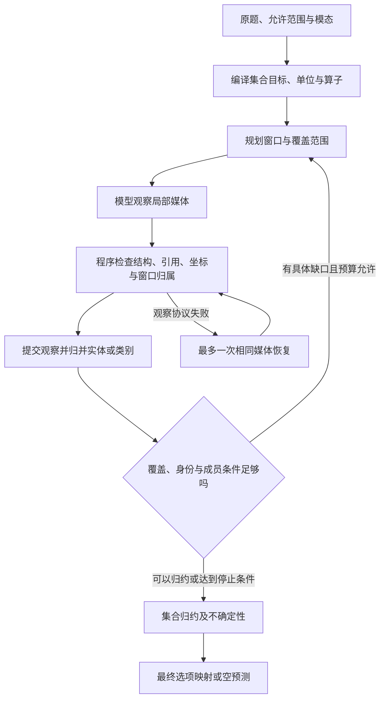

> 分类来源材料：保留原材料的设计语境；当前实现与验证状态请看 [运行文档](../pipelines/) 和 [发布验证](../validation.md)。

# R4：清单构建与集合归约——题型特征、原题与 pipeline 重设计讨论材料

整理日期：2026-09-09。分类基线：项目当前 `benchmark_pipeline_reclassification_v04.xlsx`。用途：与导师讨论 R4 的任务边界、必要证据、内部子型及重新设计 pipeline 的取舍。

**R4 的共同任务是：在题目指定的范围内，确定哪些成员符合条件、哪些观察属于同一成员，再对得到的集合执行计数、比较、交并差或缺失核验。** 成员可以是独立物体、动物/活动类别、文字值或历史任务项；这些成员的“相同”判据差别很大，不能共用一套简单字符串去重或物体重识别规则。

本文收录 **26 道 R4 机制例题和 6 道边界例题，共 32 道完整题面，涉及 8 个 benchmark**。其中 30 道来自逐题原始标注，1 道 LongVideoBench 原题来自已保存正式评测日志的输入及评分目标，1 道来自 EgoLife 论文原图。选择题保留全部原选项，数值开放题保留原输出形式；每题附来源答案、中文题意、分类理由和观察需求。

附录覆盖分类表中 **8 个默认 R4 入口与 10 个条件性涉及 R4 的入口**。这里的“入口”是 benchmark 原生标签的映射行，不能解释为题目数量、R4 在数据集中的占比，或全部样本已被正确路由。

**本轮日志提示的主要研究问题是：能否把成员资格、实体身份、类别等价与覆盖完整性分别定义清楚，并让程序只归约已经获得相应支持的内容？** 当前实现已经可以在部分题目中生成合法观察，但合法 JSON、合法帧引用和真实语义是不同层次；形式校验通过并没有阻止瓶子混入杯子集合、三角形混入动物类别、同一杯子被拆开及动物别名重复计数。

本文是讨论材料，不是新版本实现或效果报告。核对范围包括分类表、原始题目、官方项目/数据页面、已有运行日志和实际使用的 v4.1 源码快照；**没有运行模型或新增 GPU 测试，也没有逐题重新观看全部原视频**。来源答案用于审阅，机制分析与设计建议是本文判断。LVBench 的 `time_reference` 等答案证据标注仅供导师定位审阅，不能在正式输入协议未提供时直接用作模型导航。

## 阅读导航

- [1. R4 在九类体系中的位置](#definition)
- [2. 关键特征、内部子型与证据要求](#features)
- [3. 26 道机制原题](#examples)
- [4. 6 道边界原题](#boundaries)
- [5. 当前 pipeline 的真实问题与因果链](#failures)
- [6. 重设计时可讨论的架构选择](#redesign)
- [7. 与导师讨论的决策清单](#discussion)
- [8. 附录：原生入口映射及标签内部差异](#taxonomy)
- [9. 来源、版本与核验范围](#sources)

建议先看第 1、2、5、6 节；原题优先读 E01 杯子、E13 动物脸、E17 缺失活动，以及 E03 单帧鸟数、E12 植物并集、E23 历史购物差集。这六题可以快速展示“同属 R4”并不代表应采用相同的观察和去重流程。

<a id="definition"></a>

## 1. R4 在九类体系中的位置

### 1.1 沿用项目定义，重新审视实现

| 维度 | v04 工作簿中的 R4 定义 |
| --- | --- |
| 名称 | 清单构建与集合归约 |
| 核心证据状态 | 规范化集合/清单：唯一实体 ID、类型、属性、证据、范围和缺失检查 |
| 控制流 | 定义集合及计数单位 → 覆盖指定范围 → 提取/合并身份 → 集合运算/唯一计数/否定核验 |
| 停止条件 | 范围覆盖满足穷举需求；身份重复已消解；否定项有足够覆盖，而非仅未检索到 |
| 主要子型 | 单帧实例、跨视角实例、全片对象/文字清单、动作种类、计划减已完成 |
| 硬边界 | 同一动作发生 N 次不等于 N 个实体；对象在多帧出现不应重复计数 |
| 旧策略来源 | P08、P16、P20 中的集合归约，以及 P02 中的对象计数应用 |
| 可复用能力 | R2 的运动过滤/身份连续性，R3 的事件或阶段定位，以及共用的 OCR、检索与输入权限管理 |

以上定义来自 [分类基线 F01](#f01)。九类是项目按证据状态与控制流形成的工程分解，不是官方统一题型，也没有证据证明九类及当前实现已经是最优结构。重新设计时可以保留 R4 这一任务族，同时拆分内部处理路径。

### 1.2 与其余八类的区别

| 主类 | 项目名称 | 与 R4 的边界和协作 |
| --- | --- | --- |
| R1 | 定向定位与局部取证 | 局部颜色/OCR/属性；提供直接事实。R4 还要求集合成员、去重或缺失覆盖。 |
| R2 | 连续动态与实体状态追踪 | 维护同一实体的连续变化；可支持 R4 的运动过滤和重识别。不同实体数仍可由 R4 归约。 |
| R3 | 事件账本与时序归约 | 记录发生次数、序号、时长和前后关系；数动作种类或不同实体应另判 R4。 |
| R4 | 清单构建与集合归约 | 维护符合题意的成员集合及其等价关系，再执行集合查询。 |
| R5 | 分段全局综合 | 形成主要内容、体裁或梗概；全片摘要不自动保留精确成员清单。 |
| R6 | 证据约束关系推理 | 解释原因、意图和关系；局部关系可以筛选 R4 成员，但计数本身不等于解释推理。 |
| R7 | 假设与未来推演 | 在观察截止前的事实之上推演未来或假设；R4 主要核对已发生/已出现的成员。 |
| R8 | 视觉符号与约束求解 | 绑定数值、单位、公式与约束求解；R4 的集合基数是基础归约，不因有加减法自动变成 R8。 |
| R9 | 空间场景建模与查询 | 维护空间参考系、几何或拓扑；房间对象清点可调用空间线索，但其主输出是 R4 集合数量。 |

最实用的判别问题是：**为了给出答案，最终必须维护的是局部事实、时间事件、对象状态、精确集合，还是整体解释？** 一个主类可以调用其他类的局部能力。R4 调用一次对象追踪，并不意味着整题必须改为 R2；反过来，R2 调用两次单帧计数，也不意味着主任务变为全视频库存。

### 1.3 同一个视频可以提出三种完全不同的问题

| 原视频中的真实题目 | 所需中间状态 | 主机制 |
| --- | --- | --- |
| 077-1：开头女子拿着的高杯是什么颜色？ | 指定对象的颜色事实 | R1，见 B01 |
| 077-2：整个视频出现几个杯子？ | 全范围内不同杯子实例及身份对应 | R4，见 E01 |
| 225-1：制作了几种动物脸？ | 动物类别集合 | R4，见 E13 |
| 225-3：第二个制作的纸动物是什么？ | 制作事件的次序及其类别 | R3，见 B02 |

不要按视频、名词或 Counting/Recognition 标签绑定固定流程。尤其要保留题目级推理状态隔离：共享原视频可以复用解码缓存，不能把另一题的答案或针对另一题形成的成员清单直接当作本题证据。

<a id="features"></a>

## 2. 关键特征、内部子型与证据要求

### 2.1 第一个决定：一个成员到底是什么

| 成员单位 | “相同”的判据 | 典型错误 | 原题 |
| --- | --- | --- | --- |
| 物理实例 | 是同一个实际物体；名称相同不充分，检测框不同也不充分 | 同杯重复数，或把两个相似杯子并成一个 | E01、E02 |
| 有条件的物理实例 | 同一实体，并满足颜色、材质、运动、位置或操作条件 | 把所有金属物体当作正在运动的金属物体 | E04–E06、E09–E12 |
| 语义类别 | 在题目所需粒度下属于同一类 | `pinky pig` 与 `pig` 分开，或把三角形当动物 | E13–E16 |
| 文字值/命名项 | 按公开口径归一化后的字面值或明确实体名称 | 相近词被误合并；只保留 OCR 摘要丢失原文 | E19 |
| 组合/属性类型 | 同一套服装、同一种搭配等题目定义的组合 | 同一个人穿不同衣服仍只算一个；每件衣服又被分开 | E08 |
| 任务项/购买事项 | 同一人物、任务、物品及有效计划版本 | 重复讨论算两项、计划当完成、部分完成当全部完成 | E23 |

“见过一次”和“属于一个成员”是两层概念。假设同一只杯子被观察 10 次，可以有 10 条原始观察但只有 1 个实体；两只同色同款杯子同框，应有 2 个实体。若两个成品都是猪脸，动物类别可能仍只有 1 种。这个假设例仅解释计数单位，不是本次视频的新标注。

### 2.2 第二个决定：什么条件才允许进入集合

成员资格至少包含以下几个部分：

```text
目标类别符合题意
AND 题目属性/动作/关系条件成立
AND 属于题目指定时间与空间范围
AND 使用允许模态的真实证据
```

例如，“正在移动的红色物体”同时要求物体身份、红色、运动和正确时间范围；“被讨论过的墓葬物品”要求讨论证据；“大屏幕里的动物”要求证据来自屏幕区域。一个合法框或一个合法引用，只解决“在哪里观察”的问题，不能独自证明以上全部条件。

当前杯子题的 `target=cup, predicate=physical_object` 暴露了目标与谓词脱节：模型返回 `bottle`，仍可把宽泛的物体条件标为满足。重设计时应先讨论成员条件的语义表示，再讨论 JSON 字段数量。

### 2.3 第三个决定：实体身份和类别等价必须分开

**实体身份**关注两个观察是否来自同一个物体，需要同框独立性、连续运动、稳定局部特征、位置与环境关系等证据。光照、角度、裁剪范围、检测框宽度或原始名称的变化，通常不足以证明是两个不同物体。

**类别等价**关注两个名字是否属于题目所问的同一类。`Naughty Dog` 可能是作品标题，`dog` 是动物类别；应保留标题原文与类别的对应。相反，若题目要求不同片名或精确关键词，删除修饰词可能误把本来不同的成员合并。

“字符串规范化”只可靠解决空白、编码、约定大小写及已知别名映射；它不能自动完成任意动物分类，也不能确认两只杯子的实体身份。**归一化必须服从查询粒度，不能对所有命名空间统一使用“同名就合并”。**

### 2.4 第四个决定：范围可以是一帧，也可以跨很多天

| 范围 | 必要工作 | 不应默认执行的工作 |
| --- | --- | --- |
| 指定一帧 | 定位帧，处理该帧的目标与遮挡 | 扫描全片并构建跨窗口身份图 |
| 一个场景/事件附近 | 定义边界及主体，检查相关连续片段 | 把场景外的对象加入候选出现记录 |
| 全视频 | 覆盖相关时间和空间，连接重复视角/重现 | 只取若干最高相似度片段就宣称找全 |
| 两个阶段 | 分别建集，再比较/分别计数 | 在两阶段间不加区分地做全局去重 |
| 截止某时刻的历史 | 真实历史时间、人物、计划版本和完成状态 | 使用未来信息或用媒体拼接顺序代替历史时间 |

R4 的穷举要求针对**题目范围**。E20 的红桌场景可以很局部；E02 的房间计数需要跨视角；E23 的计划差集可能跨日。视频很长并不自动要求统一扫描每一秒，视频很短也不意味着一次抽样已经看全目标。

### 2.5 第五个决定：缺失结论承担额外证据要求

设候选集合为 C，已确认出现的集合为 S。只有在相关范围和候选核验足够完整时，才可以把 `C − S` 解释为缺失项。若还有未检查或不可辨认区域，差集只是**尚未证实出现的候选**。

需要分别表示：

1. **有正证据出现**：某个允许窗口确实显示/提及目标。
2. **局部已检查未见**：这一个窗口内没有发现目标，不能直接外推全片。
3. **证据不清楚或范围未检查**：保留待核验，不构造虚假的对象记录。
4. **按既定策略完成相关范围检查**：才讨论全局未出现；该标签仍不等于数学意义上的视觉完备证明。

找到一个真阳性即可证明存在；证明不存在通常要求更广的覆盖。覆盖采样点、没有 JSON 错误、观察模型没有主动报疑点，都不单独等于语义上找全。

### 2.6 第六个决定：归约算子必须和清单口径一致

| 查询 | 合适的归约表达 | 常见误用 |
| --- | --- | --- |
| 多少个不同杯子 | 已确认杯子实体集合的基数 | 多帧检测数相加；取单帧最大值 |
| 多少种动物脸 | 动物类别规范化后集合的基数 | 成品数量、作品标题数量 |
| 擦过或浇过的植物数 | 两个条件实体集合的并集基数 | 两种动作次数相加 |
| 哪项没出现 | 候选集合减去已出现集合，并要求覆盖 | 当前没检索到就判全局缺失 |
| 室内新增的设备 | 室内集合减去室外集合 | 不同取景造成的不可见被判新增 |
| 哪类装饰最多 | 每类实例数量/界限，再取最大；保留并列 | 数类别多少、比面积或显著性 |
| 一只水豚背上同时最多几只猴子 | 每时刻/片段的条件集合基数，再求最大 | 全片猴子并集大小 |
| 第1天、第3天各几件 | 两个分组各自归约，再按指定顺序输出 | 先把两天合并成一个无作用域集合 |

一种抽象写法是：对每条观察先判定成员资格，再按查询定义的等价关系归组，最后对这些组执行算子。未知成员资格或未知身份关系仍然会影响可得结论；不能在最后一步通过选项的数值反向强行决定组数。

### 2.7 R4 为什么有可能比题面看起来更难

难点可能来自小物体检测、遮挡与重现、同质外观、类别粒度、动作边界、文字辨认或输入模态不足。严格的集合操作本身往往很简单，难的是得到可信的操作数。

因此，重设计时应分开诊断：**没看见、看错目标、认错身份、分错类别、漏掉范围、算错集合、选错选项、工程未完成**。这八类错误需要的修复不同。增加观察次数可能帮助漏检，却也可能制造更多重复记录；更严格的格式检查可以防止坏数据入库，却不能自动增强类别理解。

<a id="examples"></a>

## 3. 26 道机制原题

英文题干、选项与来源答案按对应资料保留，语法或措辞不擅自改写。中文说明是题意解释，不代替原题。MVBench/TVBench 原选项不含字母时，在代码块中保留原顺序，答案按原文本给出。题面要求的阶段、动作、空间关系属于任务条件；分析中提出的观察需求不是已完成的视频人工标注。

| 原题索引 | 机制 | 来源与定位 |
| --- | --- | --- |
| [E01](#e01) | 全视频中的杯子实体 | Video-MME · 077-2 |
| [E02](#e02) | 跨视角房间清点 | VSI-Bench · 0 |
| [E03](#e03) | 由屏幕文字锚定单帧清点 | Video-MME-v2 · 112-1 |
| [E04](#e04) | 人口范围与显式纳入条件 | Video-MME-v2 · 111-2 |
| [E05](#e05) | 属性筛选后的车厢计数 | Video-MME-v2 · 004-1 |
| [E06](#e06) | 题干直接规定复合物体的计数粒度 | Video-MME-v2 · 159-1 |
| [E07](#e07) | 动作中的物体数量 | LVBench · 63 |
| [E08](#e08) | 不同套装清单 | LVBench · 1333 |
| [E09](#e09) | 满足离开条件的金属实体 | MVBench · 原 JSON 第 135 行（从 0 起） |
| [E10](#e10) | 开头正在运动的实体 | TVBench · 原 JSON 第 48 行（从 0 起） |
| [E11](#e11) | 指定场景内的离开实体 | Video-MME-v2 · 102-1 |
| [E12](#e12) | 多个动作条件的实体并集 | Video-MME-v2 · 267-4 |
| [E13](#e13) | 动物脸类别 | Video-MME · 225-1 |
| [E14](#e14) | 制作阶段内的食材类别 | Video-MME-v2 · 267-1 |
| [E15](#e15) | 关系条件下的动物类别 | Video-MME-v2 · 269-2 |
| [E16](#e16) | 特定对象片段中的物品类别 | Video-MME-v2 · 270-3 |
| [E17](#e17) | 全视频活动类别缺失 | Video-MME · 251-1 |
| [E18](#e18) | 讨论内容的缺失 | Video-MME · 002-1 |
| [E19](#e19) | 关键词清单与文字/提及边界 | Video-MME · 062-2 |
| [E20](#e20) | 限定场景的负证据 | LongVideoBench · PzUxuZ-KGsU_1 / doc_id 891 |
| [E21](#e21) | 屏幕内描绘物与舞台实物分开 | LVBench · 2285 |
| [E22](#e22) | 场景间的设备差集 | Video-MME-v2 · 396-1 |
| [E23](#e23) | 历史计划减已完成 | EgoLifeQA · Figure 5 / Day 5 16:20:46.350 |
| [E24](#e24) | 分组计数后比较最多 | Video-MME · 001-1 |
| [E25](#e25) | 同一时刻的最大数量 | Video-MME-v2 · 269-1 |
| [E26](#e26) | 两个阶段分别统计 | Video-MME-v2 · 323-1 |

<a id="e01"></a>

### E01 · 全视频中的杯子实体

**来源：** Video-MME；原生标签 `Counting Problem`；原题定位 `077-2`。

**原题：**

> How many cups appear in this video?

**原选项（保留来源顺序）：**

```text
A. 2.
B. 3.
C. 4.
D. 5.
```

**官方标注答案：** D. 5.

**中文题意：** 视频里一共出现了多少个杯子？

**为什么归入该机制：** 计数单位是不同杯子实体。同一杯子在不同窗口、不同角度或初查与审计中再次出现，应对应同一个成员。

**需要保留的证据：** 先判定是不是杯子，再判定是否是此前见过的那只；保留支持成员资格的画面、身份线索和未覆盖区域。不能用帧数、检测记录数或最大同框数量替代全视频唯一数量。

**讨论点：** 本次实跑同时出现 bottle 被计入、同一杯子因检测框差异被判为不同，以及最终选项与内部边界不一致。官方 D=5 只用于诊断，不能作为去重目标倒推分组。

**溯源：** [F02 来源](https://huggingface.co/datasets/lmms-eval/Video-MME/resolve/ead1408f75b618502df9a1d8e0950166bf0a2a0b/videomme/test-00000-of-00001.parquet)；逐题原始标注。 [来源视频](https://www.youtube.com/watch?v=540LkURTR7g)。

<a id="e02"></a>

### E02 · 跨视角房间清点

**来源：** VSI-Bench；原生标签 `object_counting`；原题定位 `0`。

**原题：**

> How many table(s) are in this room?

**原输出形式：** 数值开放题，无选择项。

**官方标注答案：** 4（原生数值输出，无选项）

**中文题意：** 这个房间里有多少张桌子？

**为什么归入该机制：** 跨视角唯一实体计数。主输出是桌子集合的基数；空间建模或重识别可以是辅助能力，不要求每题先做完整三维重建。

**需要保留的证据：** 区分换视角再次看到同一桌子和首次看到另一张相似桌子。逐帧总数相加会重复；取所有帧的最大桌子数又可能漏掉从未同时入镜的桌子。

**讨论点：** 该例采用原始 test.jsonl 的 id=0，不混用 debiased/pruned 派生集。未重新观看房间视频，不能把题面分析当作已经确认的空间轨迹。

**溯源：** [F04 来源](https://huggingface.co/datasets/nyu-visionx/VSI-Bench/resolve/bdcadb3fea447621a828a24911801faba3587c12/test.jsonl)；逐题原始标注。 视频/场景定位：`arkitscenes / 41069025`。

<a id="e03"></a>

### E03 · 由屏幕文字锚定单帧清点

**来源：** Video-MME-v2；原生标签 `Basic Counting`；原题定位 `112-1`。

**原题：**

> In the first frame where the subtitle "6. You are in a phase of transition." appears, how many birds are visible?

**原选项（保留来源顺序）：**

```text
A. 7.
B. 10.
C. 9.
D. 6.
E. 5.
F. 11.
G. 8.
H. 12.
```

**官方标注答案：** C. 9.

**中文题意：** 字幕“6. You are in a phase of transition.”第一次出现的那一帧，可见多少只鸟？

**为什么归入该机制：** OCR/时间定位支持的单帧实例计数。范围是一帧，核心仍是该帧中不同鸟的清单，不需要全片身份图。

**需要保留的证据：** 正确定位第一次出现，而非任意一帧带同样字幕的画面；在同一张图上处理重叠、边缘和小目标。

**讨论点：** 这是讨论轻量分支的好例子：定位复杂度和计数复杂度应分开；成功定位后没必要继续扫描无关片段。

**溯源：** [F03 来源](https://huggingface.co/datasets/MME-Benchmarks/Video-MME-v2/resolve/6e4bebb03202e1ddbf3d37703e560e51c5aa2d64/test.parquet)；逐题原始标注。 [来源视频](https://www.youtube.com/watch?v=ovxO4EpOFQA)。

<a id="e04"></a>

### E04 · 人口范围与显式纳入条件

**来源：** Video-MME-v2；原生标签 `Basic Counting`；原题定位 `111-2`。

**原题：**

> When the match is at around fifty-three minutes, at the moment the goalkeeper catches the ball, how many players from both teams are within the goalkeeper's penalty area (including the goalkeeper)?

**原选项（保留来源顺序）：**

```text
A. 7.
B. 6.
C. 11.
D. 10.
E. 8.
F. 9.
G. 12.
H. 5.
```

**官方标注答案：** D. 10.

**中文题意：** 比赛约第53分钟，守门员接球时，两队共有多少球员在其禁区内，包括守门员？

**为什么归入该机制：** 在事件锚点处构建受空间区域与角色条件约束的人物集合。题干明确包括守门员。

**需要保留的证据：** 比赛显示时间不一定等于视频播放时间；先绑定该次接球，再判断人是否属于禁区内球员集合。角色和边界都必须服务题干。

**讨论点：** 只数红色队服或排除守门员都会改变统计人口。这里的空间区域筛选通常可局部完成，不自动升级为 R9。

**溯源：** [F03 来源](https://huggingface.co/datasets/MME-Benchmarks/Video-MME-v2/resolve/6e4bebb03202e1ddbf3d37703e560e51c5aa2d64/test.parquet)；逐题原始标注。 [来源视频](https://www.youtube.com/watch?v=1CB_xGYibQU)。

<a id="e05"></a>

### E05 · 属性筛选后的车厢计数

**来源：** Video-MME-v2；原生标签 `Basic Counting`；原题定位 `004-1`。

**原题：**

> How many cargo-loaded wagons are on the train traveling down the hill towards BEARHEAD STATION?

**原选项（保留来源顺序）：**

```text
A. 6.
B. 3.
C. 4.
D. 1.
E. 5.
F. 7.
G. 0.
H. 2.
```

**官方标注答案：** B. 3.

**中文题意：** 驶下山坡前往 BEARHEAD STATION 的火车有多少节装载货物的车厢？

**为什么归入该机制：** 目标实体是车厢，纳入条件是装载货物。不能把机车、空车厢、货物件数混为同一单位。

**需要保留的证据：** 绑定正确列车及行驶阶段，再对车厢逐一检查载货状态；如果列车跨镜头出现，还需避免重复清点。

**讨论点：** 与杯子题同样要求 target 与 predicate 联合成立；“是一个物体”不能替代“是符合载货条件的车厢”。

**溯源：** [F03 来源](https://huggingface.co/datasets/MME-Benchmarks/Video-MME-v2/resolve/6e4bebb03202e1ddbf3d37703e560e51c5aa2d64/test.parquet)；逐题原始标注。 [来源视频](https://www.youtube.com/watch?v=SseVCuT0vAI)。

<a id="e06"></a>

### E06 · 题干直接规定复合物体的计数粒度

**来源：** Video-MME-v2；原生标签 `Basic Counting`；原题定位 `159-1`。

**原题：**

> From the moment the main character changes cars until the end of the video, how many green traffic signs does the main character encounter in total? (Two signs on the same pole count as two.)

**原选项（保留来源顺序）：**

```text
A. 4.
B. 7.
C. 6.
D. 8.
E. 10.
F. 3.
G. 9.
H. 5.
```

**官方标注答案：** C. 6.

**中文题意：** 从主角换车到片尾共遇到多少块绿色交通标牌？同一根杆上的两块标牌按两块计。

**为什么归入该机制：** 计数单位明确是标牌，不是杆、路口或画面。此类公开口径应直接进入任务定义。

**需要保留的证据：** 范围从换车事件开始；同杆两牌要保留两个成员。若路线重访同一标牌，还须核对原标注对“再次遇到”的口径，不能只凭 encounter 一词确定去重方式。

**讨论点：** 展示“模型自由发挥粒度”为什么危险。题干明确的规则优先于一般视觉分组习惯；将一整组标牌框成一个对象可能已经丢失所需单位。

**溯源：** [F03 来源](https://huggingface.co/datasets/MME-Benchmarks/Video-MME-v2/resolve/6e4bebb03202e1ddbf3d37703e560e51c5aa2d64/test.parquet)；逐题原始标注。 [来源视频](https://www.youtube.com/watch?v=WeqPzYcqGzg)。

<a id="e07"></a>

### E07 · 动作中的物体数量

**来源：** LVBench；原生标签 `entity recognition`；原题定位 `63`。

**原题：**

> How many sticks does the protagonist put in the incense burner?

**原选项（保留来源顺序）：**

```text
(A) 3
(B) 2
(C) 5
(D) 1
```

**官方标注答案：** (D) 1

**中文题意：** 主角往香炉里放了几根香？

**为什么归入该机制：** 问的是香的根数，而非放香动作发生次数。一个动作可能放入多根，一根也可能被反复调整。

**需要保留的证据：** 找到相关片段，识别被放入的独立香，区分手部动作与物体实例。短范围可能只需少量有连续性的帧。

**讨论点：** LVBench 的 time_reference 是官方答案证据标注，本文件仅用于定位审阅；若正式评测协议不提供，不能把该时间段直接当作模型输入。

**离线审阅定位：** 官方 `time_reference=10:43-10:50`；仅供定位审阅，不自动作为模型输入。

**溯源：** [F05 来源](https://huggingface.co/datasets/zai-org/LVBench/resolve/0caedb92002cc268bad486449e551c76f0485670/video_info.meta.jsonl)；逐题原始标注。 [来源视频](https://www.youtube.com/watch?v=Cm73ma6Ibcs)。

<a id="e08"></a>

### E08 · 不同套装清单

**来源：** LVBench；原生标签 `entity recognition`；原题定位 `1333`。

**原题：**

> How many different outfits has the American man worn in total in the video?

**原选项（保留来源顺序）：**

```text
(A) 10
(B) 1
(C) 5
(D) 2
```

**官方标注答案：** (C) 5

**中文题意：** 视频中这名美国男子总共穿过多少套不同的服装？

**为什么归入该机制：** 成员是题目粒度下的套装/穿搭，不是人物身份，也不必等同于每一件衣物的物理实例。

**需要保留的证据：** 同一套穿搭跨场景重现需归并，不同穿搭即便人物相同也应区分。保留颜色、款式和搭配等有用特征，避免只按描述字符串去重。

**讨论点：** 提示“R4 类别/组合成员”不止动物种类。这里需要定义什么差异构成一套不同服装；粒度不清时应保留歧义。

**离线审阅定位：** 官方 `time_reference=01:00-84:27`；仅供定位审阅，不自动作为模型输入。

**溯源：** [F05 来源](https://huggingface.co/datasets/zai-org/LVBench/resolve/0caedb92002cc268bad486449e551c76f0485670/video_info.meta.jsonl)；逐题原始标注。 [来源视频](https://www.youtube.com/watch?v=wNCPgIVz15c)。

<a id="e09"></a>

### E09 · 满足离开条件的金属实体

**来源：** MVBench；原生标签 `Moving Count`；原题定位 `原 JSON 第 135 行（从 0 起）`。

**原题：**

> How many metal objects exit the scene?

**原选项（保留来源顺序）：**

```text
2
3
1
0
```

**官方标注答案：** 0（原始答案文本）

**中文题意：** 有多少个金属物体离开了场景？

**为什么归入该机制：** 运动条件过滤后的唯一实体数。金属属性、离开行为与对象身份必须对应到同一个物体。

**需要保留的证据：** 用有序帧确认真正离开，而不是被遮挡或镜头切走；再按物体身份计数。物体不动、镜头移动，不能自动算物体离开。

**讨论点：** 所选官方例的答案为 0。零是允许的正确结果，但必须来自条件检查；不能用解析失败、没抽到关键帧或空列表代替零。

**溯源：** [F06 来源](https://huggingface.co/datasets/OpenGVLab/MVBench/resolve/230a2d4fac8900333c61754641c7a13e069ac9c6/json/moving_count.json)；逐题原始标注。 视频/场景定位：`video_12070.mp4`。

<a id="e10"></a>

### E10 · 开头正在运动的实体

**来源：** TVBench；原生标签 `Object Count`；原题定位 `原 JSON 第 48 行（从 0 起）`。

**原题：**

> How many metal objects are moving when the video begins?

**原选项（保留来源顺序）：**

```text
0
1
3
2
```

**官方标注答案：** 0（原始答案文本）

**中文题意：** 视频开始时有多少个金属物体正在运动？

**为什么归入该机制：** 局部时间范围内，先判运动与材质，再数符合条件的不同物体。标签 Object Count 不意味着单帧一定足够。

**需要保留的证据：** 需要开头的邻近有序帧区别对象运动与静止；不能把全片后来才开始运动的物体算进开头。

**讨论点：** 该例官方答案也是 0。与 E09 的区别是“开头正在移动”与“范围内曾离开”，二者的时态和见证要求不同。

**溯源：** [F07 来源](https://huggingface.co/datasets/FunAILab/TVBench/resolve/1d933b2aced8da5d6b315bb6a37807d126e05526/json/object_count.json)；逐题原始标注。 视频/场景定位：`video_14568.mp4`。

<a id="e11"></a>

### E11 · 指定场景内的离开实体

**来源：** Video-MME-v2；原生标签 `Entity Existence Change Detection`；原题定位 `102-1`。

**原题：**

> In the fifth scene, how many birds flew out of view?

**原选项（保留来源顺序）：**

```text
A. 0.
B. 5.
C. 6.
D. 8.
E. 1.
F. 3.
G. 2.
H. 4.
```

**官方标注答案：** G. 2.

**中文题意：** 第五个场景中，有多少只鸟飞出了视野？

**为什么归入该机制：** 默认按鸟的实例计数，并调用运动/身份能力验证飞出。若原标注实际按重复出界事件计数，主机制应调整，不能只用 how many 猜测。

**需要保留的证据：** 先确定第五个场景的边界，再识别鸟及出界过程。镜头切换本身不等于所有鸟都飞出。

**讨论点：** 原生 Entity Existence Change Detection 在该样本上服务实体计数。识别场景、追踪运动与最终集合基数是三项不同职责。

**溯源：** [F03 来源](https://huggingface.co/datasets/MME-Benchmarks/Video-MME-v2/resolve/6e4bebb03202e1ddbf3d37703e560e51c5aa2d64/test.parquet)；逐题原始标注。 [来源视频](https://www.youtube.com/watch?v=BWJcT0VX-fk)。

<a id="e12"></a>

### E12 · 多个动作条件的实体并集

**来源：** Video-MME-v2；原生标签 `Basic Counting`；原题定位 `267-4`。

**原题：**

> In the scenes where the woman is tidying up the apartment, how many different indoor plants in total does she either wipe the leaves of or water?

**原选项（保留来源顺序）：**

```text
A. 7.
B. 1.
C. 3.
D. 2.
E. 6.
F. 0.
G. 5.
H. 4.
```

**官方标注答案：** D. 2.

**中文题意：** 女子整理公寓的场景中，总共擦过叶子或浇过水的不同室内植物有多少盆/株？

**为什么归入该机制：** 对满足“擦叶子 OR 浇水”的植物实例取并集；同一植物接受两种操作也只计一次。题面未固定盆与株的边界，需要按实际对象及标注口径审阅。

**需要保留的证据：** 把操作绑定到植物身份；保留两个动作集合之间的同一实体关系。不能把擦拭次数与浇水次数相加，也不能把植物种类数当作实例数。

**讨论点：** 这是 R2/R3 提供运动或事件证据，R4 决定集合成员与去重的复合例题。

**溯源：** [F03 来源](https://huggingface.co/datasets/MME-Benchmarks/Video-MME-v2/resolve/6e4bebb03202e1ddbf3d37703e560e51c5aa2d64/test.parquet)；逐题原始标注。 [来源视频](https://www.youtube.com/watch?v=EvRzXNVajXk)。

<a id="e13"></a>

### E13 · 动物脸类别

**来源：** Video-MME；原生标签 `Counting Problem`；原题定位 `225-1`。

**原题：**

> How many different kinds of animal faces are made in this video?

**原选项（保留来源顺序）：**

```text
A. 4.
B. 3.
C. 5.
D. 2.
```

**官方标注答案：** B. 3.

**中文题意：** 视频制作了多少种不同的动物脸？

**为什么归入该机制：** 数动物类别，不数纸张、折叠步骤、成品出现次数或作品名字。猫脸反复展示仍属于同一动物类别。

**需要保留的证据：** 确认画面实际表达的是动物脸，保留类别与作品原始名称的对应。折纸中间形成三角形不能直接新增一种动物。

**讨论点：** 实跑的 triangle、pinky pig/pig、Naughty Dog/dog 错误集中暴露了目标成员资格和类别归一化两个缺口；详见第 5 节。

**溯源：** [F02 来源](https://huggingface.co/datasets/lmms-eval/Video-MME/resolve/ead1408f75b618502df9a1d8e0950166bf0a2a0b/videomme/test-00000-of-00001.parquet)；逐题原始标注。 [来源视频](https://www.youtube.com/watch?v=BiJtPU9uP0c)。

<a id="e14"></a>

### E14 · 制作阶段内的食材类别

**来源：** Video-MME-v2；原生标签 `Basic Counting`；原题定位 `267-1`。

**原题：**

> In the video, regarding the making of "My go-to 2 MIN oatmeal", how many different toppings were added to the bowl after the oatmeal was cooked?

**原选项（保留来源顺序）：**

```text
A. 0.
B. 3.
C. 7.
D. 1.
E. 5.
F. 6.
G. 4.
H. 2.
```

**官方标注答案：** D. 1.

**中文题意：** 制作“My go-to 2 MIN oatmeal”时，燕麦煮熟后向碗中加入了多少种不同配料？

**为什么归入该机制：** 类别集合带制作阶段与动作筛选。只计煮熟后加入的配料种类，不计加入动作次数或每颗食材。

**需要保留的证据：** 绑定这道料理和煮熟后的阶段；区别提前加入的原料、旁边摆放但未加入的物品，以及同种配料的重复加入。

**讨论点：** 一个统一的“看见什么就列什么”观察器无法直接保证这组联合条件。

**溯源：** [F03 来源](https://huggingface.co/datasets/MME-Benchmarks/Video-MME-v2/resolve/6e4bebb03202e1ddbf3d37703e560e51c5aa2d64/test.parquet)；逐题原始标注。 [来源视频](https://www.youtube.com/watch?v=EvRzXNVajXk)。

<a id="e15"></a>

### E15 · 关系条件下的动物类别

**来源：** Video-MME-v2；原生标签 `Basic Counting`；原题定位 `269-2`。

**原题：**

> How many different types of animals did capybaras ride on the backs of in the video?

**原选项（保留来源顺序）：**

```text
A. 3.
B. 1.
C. 7.
D. 6.
E. 5.
F. 0.
G. 2.
H. 4.
```

**官方标注答案：** G. 2.

**中文题意：** 视频中水豚骑在了多少种不同动物的背上？

**为什么归入该机制：** 统计被水豚骑乘的动物类别；目标关系的方向是水豚在上、另一动物在下。

**需要保留的证据：** 将骑乘关系与双方类别绑定。镜头中动物同框不等于骑乘；猴子骑水豚也不满足本题方向。

**讨论点：** 这里需要局部关系识别，但最终答案仍来自符合关系的类别集合，不必因此把整题归为解释原因的 R6。

**溯源：** [F03 来源](https://huggingface.co/datasets/MME-Benchmarks/Video-MME-v2/resolve/6e4bebb03202e1ddbf3d37703e560e51c5aa2d64/test.parquet)；逐题原始标注。 [来源视频](https://www.youtube.com/watch?v=bgyo_7XvB2M)。

<a id="e16"></a>

### E16 · 特定对象片段中的物品类别

**来源：** Video-MME-v2；原生标签 `Basic Counting`；原题定位 `270-3`。

**原题：**

> In the video clip of the fourth-ranked dog, how many different types of objects did he carry in total?

**原选项（保留来源顺序）：**

```text
A. 7.
B. 4.
C. 5.
D. 8.
E. 3.
F. 2.
G. 6.
H. 1.
```

**官方标注答案：** B. 4.

**中文题意：** 排名第四的狗所在片段里，它一共叼过多少种不同物品？

**为什么归入该机制：** 锚定第四名狗的片段后，收集满足“被该狗叼着”的物品类别。

**需要保留的证据：** 区分排名与时间序号；物体必须与叼取动作绑定。同种物品的多个实例通常只贡献一种类别。

**讨论点：** 类别粒度来自题意；作品名称、颜色修饰和一般名称之间需要明确对应，避免重现动物脸题的字符串计数。

**溯源：** [F03 来源](https://huggingface.co/datasets/MME-Benchmarks/Video-MME-v2/resolve/6e4bebb03202e1ddbf3d37703e560e51c5aa2d64/test.parquet)；逐题原始标注。 [来源视频](https://www.youtube.com/watch?v=6jRi1YQSWzI)。

<a id="e17"></a>

### E17 · 全视频活动类别缺失

**来源：** Video-MME；原生标签 `Action Recognition`；原题定位 `251-1`。

**原题：**

> Which daily activity is not shown in the video?

**原选项（保留来源顺序）：**

```text
A. Cleaning the floor.
B. Eating a meal.
C. Ironing clothes.
D. Cooking.
```

**官方标注答案：** B. Eating a meal.

**中文题意：** 视频没有展示哪项日常活动？

**为什么归入该机制：** 候选活动集合减去视频中确实展示过的活动类别。一个活动出现多次仍只是一个已出现类别。

**需要保留的证据：** 区分当前窗口没看到、整个允许范围已检查未见、以及无法辨认。没有证据的候选应保存在待检查状态，而不是伪装成观察到的成员。

**讨论点：** 本次在 24–32 秒将未见候选写成空引用观察，首次与恢复都失败；后续窗口未执行，不能说已经证明哪项全局缺失。

**溯源：** [F02 来源](https://huggingface.co/datasets/lmms-eval/Video-MME/resolve/ead1408f75b618502df9a1d8e0950166bf0a2a0b/videomme/test-00000-of-00001.parquet)；逐题原始标注。 [来源视频](https://www.youtube.com/watch?v=1sTQOxXFO44)。

<a id="e18"></a>

### E18 · 讨论内容的缺失

**来源：** Video-MME；原生标签 `Object Recognition`；原题定位 `002-1`。

**原题：**

> Which of the following features/items is not discussed in the video in relation to the tomb?

**原选项（保留来源顺序）：**

```text
A. Inkstone.
B. Niche.
C. Jade.
D. Sacrificial table.
```

**官方标注答案：** C. Jade.

**中文题意：** 关于这座墓葬，视频没有讨论哪项特征或物品？

**为什么归入该机制：** 集合关系是“被讨论”，不是“出现在画面”。需要明确允许使用的字幕、语音或屏幕文字证据。

**需要保留的证据：** 限定墓葬话题，核对四个候选是否被讨论；画面中见到某物不自动证明有人讨论它，没在画面里看到也不能证明没讨论。

**讨论点：** 若运行条件是纯视觉且答案依赖未提供的解说，应记录模态不足。这是任务覆盖范围问题，不能靠放宽观察合同解决。

**溯源：** [F02 来源](https://huggingface.co/datasets/lmms-eval/Video-MME/resolve/ead1408f75b618502df9a1d8e0950166bf0a2a0b/videomme/test-00000-of-00001.parquet)；逐题原始标注。 [来源视频](https://www.youtube.com/watch?v=N1cdUjctpG8)。

<a id="e19"></a>

### E19 · 关键词清单与文字/提及边界

**来源：** Video-MME；原生标签 `OCR Problems`；原题定位 `062-2`。

**原题：**

> Which of the following keywords was not mentioned in the video?

**原选项（保留来源顺序）：**

```text
A. World Law.
B. World War.
C. World Police.
D. World Court.
```

**官方标注答案：** B. World War.

**中文题意：** 以下哪个关键词没有在视频中被提到？

**为什么归入该机制：** 词项集合及缺失检查。原生标签为 OCR Problems，但题干使用 mentioned，证据关系仍需结合官方输入协议及原片核对。

**需要保留的证据：** 保留原文和实际出现位置；World Law、World War 等相近词必须区分。拼写变体规范化不能把不同含义的词合并。

**讨论点：** 这与动物类别归一化形成重要对照：动物作品别名可能应合并，字面词项的微小差异却可能就是答案区别。

**溯源：** [F02 来源](https://huggingface.co/datasets/lmms-eval/Video-MME/resolve/ead1408f75b618502df9a1d8e0950166bf0a2a0b/videomme/test-00000-of-00001.parquet)；逐题原始标注。 [来源视频](https://www.youtube.com/watch?v=jTzKgI68VLc)。

<a id="e20"></a>

### E20 · 限定场景的负证据

**来源：** LongVideoBench；原生标签 `S2O`；原题定位 `PzUxuZ-KGsU_1 / doc_id 891`。

**原题：**

> On the red wooden table, there is an iron grid rack with a glass bowl containing four rolls of food. In the frame, there is a brush covered with yellow liquid decorating them. Which of the following objects did not appear?

**原选项（保留来源顺序）：**

```text
A. Light blue brush
B. Red brush
C. Glass bowl with egg liquid
D. Black iron rack
```

**来源评分目标：** B. Red brush

**中文题意：** 红木桌上给食物刷黄色液体的场景中，以下哪个物体没有出现？

**为什么归入该机制：** 场景范围中的候选存在性/缺失核验。题干前半段定义场景锚点，后半段要求集合排除。

**需要保留的证据：** 定位且覆盖目标场景，分别验证浅蓝刷、红刷、蛋液玻璃碗与黑铁架；在其他场景出现的红刷不能抵消该场景的缺失结论。

**讨论点：** 原题采用本地正式评测日志的完整 input，保留原句和选项；B 来自 target/lvb_acc 的评分目标，不是从模型预测复制。未重新下载 gated 原始标注。

**溯源：** [F09 来源](https://huggingface.co/datasets/longvideobench/LongVideoBench)；历史评测日志题面与评分目标；未重新获取 gated 原始标注。 [来源视频](https://www.youtube.com/watch?v=PzUxuZ-KGsU)。

<a id="e21"></a>

### E21 · 屏幕内描绘物与舞台实物分开

**来源：** LVBench；原生标签 `entity recognition / event understanding`；原题定位 `2285`。

**原题：**

> When the flamingo prop appears on the stage, which animal does not appear on the big screen behind the stage?

**原选项（保留来源顺序）：**

```text
(A) Penguin
(B) Unicorn
(C) Dolphin
(D) Flamingo
```

**官方标注答案：** (A) Penguin

**中文题意：** 火烈鸟道具出现时，舞台后方大屏幕上没有出现哪种动物？

**为什么归入该机制：** 目标是大屏幕中描绘的动物类别，范围由舞台道具出现事件限定。

**需要保留的证据：** 区分道具所在区域与屏幕区域；即使舞台上有火烈鸟，也不能直接作为屏幕上出现火烈鸟的证据。

**讨论点：** 说明人口范围不能固定成“只数真实物体”。是否纳入屏幕、图片、倒影或道具必须随题意变化。

**离线审阅定位：** 官方 `time_reference=15:28-15:28`；仅供定位审阅，不自动作为模型输入。

**溯源：** [F05 来源](https://huggingface.co/datasets/zai-org/LVBench/resolve/0caedb92002cc268bad486449e551c76f0485670/video_info.meta.jsonl)；逐题原始标注。 [来源视频](https://www.youtube.com/watch?v=idZkam9zqAs)。

<a id="e22"></a>

### E22 · 场景间的设备差集

**来源：** Video-MME-v2；原生标签 `Entity Existence Change Detection`；原题定位 `396-1`。

**原题：**

> What training equipment has been added to the indoor scene compared to the outdoor scene at the beginning of the video?

**原选项（保留来源顺序）：**

```text
A. Trolley.
B. Cone barrel.
C. Drinking bottle.
D. Tennis ball.
E. Basketball.
F. Insole box.
G. Indoor audience seating.
H. Scoreboard.
```

**官方标注答案：** D. Tennis ball.

**中文题意：** 相比开头的室外场景，室内场景新增了什么训练设备？

**为什么归入该机制：** 按类别/设备口径比较两个场景的集合差，可由 R4 归约并调用 R2 状态对比。重点是新增设备成员。

**需要保留的证据：** 两场景分别建立清单，明确哪些设备属于比较范围；室外没抽到某设备不等于它原本不存在。

**讨论点：** 类别差集与同一物体的属性变化不同。如果问题改问同一设备如何改变，应重新判断主类。

**溯源：** [F03 来源](https://huggingface.co/datasets/MME-Benchmarks/Video-MME-v2/resolve/6e4bebb03202e1ddbf3d37703e560e51c5aa2d64/test.parquet)；逐题原始标注。 [来源视频](https://www.youtube.com/watch?v=VUkm6b58bMo)。

<a id="e23"></a>

### E23 · 历史计划减已完成

**来源：** EgoLifeQA；原生标签 `TaskMaster`；原题定位 `Figure 5 / Day 5 16:20:46.350`。

**原题：**

> Many things are in my cart already. What items that we previously discussed have I not bought yet?

**原选项（保留来源顺序）：**

```text
A. Milk
B. Chicken wings
C. Strawberries
D. Bananas
```

**论文图示答案：** A. Milk

**中文题意：** 购物车里已有很多东西；之前讨论过的哪些物品还没有买？

**为什么归入该机制：** 在查询截止时刻，把有效计划清单减去已购买清单。成员要绑定人物、任务和历史范围。

**需要保留的证据：** 需要此前计划/讨论和后来购买的明确证据；购买、放入购物车、计划购买的具体完成标准应与原题/标注一致。不得使用查询之后的购买事实。

**讨论点：** Figure 5 明示答案 A=Milk。它是论文示例的来源答案，本次未重新检索完整历史。普通“视频里出现的活动”没有计划/完成关系，不应套用 task_item。

**溯源：** [F10 来源](https://arxiv.org/html/2503.03803v2#S3.F5)；论文原例，人工核对图中题干、选项和答案。 视频/场景定位：`论文 Figure 5；本次不重建跨日完整视频序列`。

<a id="e24"></a>

### E24 · 分组计数后比较最多

**来源：** Video-MME；原生标签 `Counting Problem`；原题定位 `001-1`。

**原题：**

> When demonstrating the Germany modern Christmas tree is initially decorated with apples, candles and berries, which kind of the decoration has the largest number?

**原选项（保留来源顺序）：**

```text
A. Apples.
B. Candles.
C. Berries.
D. The three kinds are of the same number.
```

**官方标注答案：** C. Berries.

**中文题意：** 展示德国现代圣诞树最初以苹果、蜡烛和浆果装饰时，哪类装饰数量最多？

**为什么归入该机制：** 按类别分组统计装饰物实例，再比较各组数量。这里的类别是分组键，最终比较的是实例数量，不能仅计算出现了几种装饰。

**需要保留的证据：** 绑定题目所指展示阶段，区分装饰实例与重复镜头；保持并列可能。面积最大、最醒目或提及最多均不能直接等同数量最多。

**讨论点：** 若有可靠上下界，某类下界超过所有其他类上界即可支持最多，不一定要精确数完所有类别。原片是否满足这种条件仍待观察。

**溯源：** [F02 来源](https://huggingface.co/datasets/lmms-eval/Video-MME/resolve/ead1408f75b618502df9a1d8e0950166bf0a2a0b/videomme/test-00000-of-00001.parquet)；逐题原始标注。 [来源视频](https://www.youtube.com/watch?v=fFjv93ACGo8)。

<a id="e25"></a>

### E25 · 同一时刻的最大数量

**来源：** Video-MME-v2；原生标签 `Basic Counting`；原题定位 `269-1`。

**原题：**

> What is the maximum number of monkeys simultaneously appearing on one capybara's back in the video?

**原选项（保留来源顺序）：**

```text
A. 7.
B. 1.
C. 6.
D. 2.
E. 5.
F. 0.
G. 3.
H. 4.
```

**官方标注答案：** G. 3.

**中文题意：** 视频中，同一只水豚背上同时出现的猴子最多有几只？

**为什么归入该机制：** 各时刻/局部片段先构建猴子实例集合，再求同一水豚背上的最大同时数量。属于带时间条件的集合聚合，可复用 R3 的范围与极值处理。

**需要保留的证据：** 保留“同时”和“同一只水豚”的绑定；全片见过的猴子并集大小不等于最大同时数量。

**讨论点：** 说明 R4 的归约不只有全局 unique count；如果删掉时间和关系条件，只保存一个无时间集合，会丢失答案所需信息。

**溯源：** [F03 来源](https://huggingface.co/datasets/MME-Benchmarks/Video-MME-v2/resolve/6e4bebb03202e1ddbf3d37703e560e51c5aa2d64/test.parquet)；逐题原始标注。 [来源视频](https://www.youtube.com/watch?v=bgyo_7XvB2M)。

<a id="e26"></a>

### E26 · 两个阶段分别统计

**来源：** Video-MME-v2；原生标签 `Basic Counting`；原题定位 `323-1`。

**原题：**

> How many items are finally displayed and tasted on the table on Day 1 and Day 3 respectively?

**原选项（保留来源顺序）：**

```text
A. 5 items on Day 1, and 7 items on Day 3.
B. 6 items on Day 1, and 4 items on Day 3.
C. 4 items on Day 1, and 4 items on Day 3.
D. 6 items on Day 1, and 5 items on Day 3.
E. 5 items on Day 1, and 4 items on Day 3.
F. 5 items on Day 1, and 5 items on Day 3.
G. 5 items on Day 1, and 6 items on Day 3.
H. 4 items on Day 1, and 6 items on Day 3.
```

**官方标注答案：** E. 5 items on Day 1, and 4 items on Day 3.

**中文题意：** 第1天与第3天，桌上最终展示并品尝的物品分别有多少件？

**为什么归入该机制：** 两个独立阶段清单，各自统计后按 Day 1、Day 3 输出有序结果。条件是最终展示并品尝。

**需要保留的证据：** 不要把准备阶段原料加入最终清单，也不要把两天合成一个集合。某商品两天都出现，应在各自阶段的清单中分别存在。

**讨论点：** 跨集合同名不等于应从两个结果中删掉一个。去重只在任务定义的作用域内执行。

**溯源：** [F03 来源](https://huggingface.co/datasets/MME-Benchmarks/Video-MME-v2/resolve/6e4bebb03202e1ddbf3d37703e560e51c5aa2d64/test.parquet)；逐题原始标注。 [来源视频](https://www.youtube.com/watch?v=wmfhI2Hic-M)。

<a id="boundaries"></a>

## 4. 6 道边界原题

以下题目用于讨论主机制与必要子程序，不应全部作为“纯 R4”测试集。尤其 B04 保留单位待核状态；官方答案存在，不意味着题目归类已经确定。

<a id="b01"></a>

### B01 · R1：杯子属性读取

**来源：** Video-MME；原生标签 `Attribute Perception`；原题定位 `077-1`。

**原题：**

> What is the color of the tall drinking glass initially held by the woman?

**原选项（保留来源顺序）：**

```text
A. Blue.
B. Red.
C. Green.
D. Yellow.
```

**官方标注答案：** A. Blue.

**中文题意：** 女子最初拿着的高身饮水杯是什么颜色？

**为什么归入该机制：** 主类 R1。找到开头指定杯子并读取颜色；无需证明全片有多少个杯子。

**需要保留的证据：** 对象和时间锚点明确后保留足以区分选项的局部证据。

**讨论点：** 与 E01 共享视频，但证据组织和停止条件不同。不能因为视频相同就共用题目推理状态。

**溯源：** [F02 来源](https://huggingface.co/datasets/lmms-eval/Video-MME/resolve/ead1408f75b618502df9a1d8e0950166bf0a2a0b/videomme/test-00000-of-00001.parquet)；逐题原始标注。 [来源视频](https://www.youtube.com/watch?v=540LkURTR7g)。

<a id="b02"></a>

### B02 · R3：第二个制作事件

**来源：** Video-MME；原生标签 `Object Recognition`；原题定位 `225-3`。

**原题：**

> What is the second paper animal made in this video?

**原选项（保留来源顺序）：**

```text
A. A pig.
B. A cat.
C. A dog.
D. A monkey.
```

**官方标注答案：** A. A pig.

**中文题意：** 视频中制作的第二个纸动物是什么？

**为什么归入该机制：** 主类 R3：先按制作过程的顺序选择第二项，再读取其动物类别。

**需要保留的证据：** 需要制作实例的顺序及第二实例的类别；集合只保留 cat/pig/dog 会丢失序号。

**讨论点：** 与 E13 共享视频。即使两题都要识别动物，独立类别数与制作顺序仍是不同查询。

**溯源：** [F02 来源](https://huggingface.co/datasets/lmms-eval/Video-MME/resolve/ead1408f75b618502df9a1d8e0950166bf0a2a0b/videomme/test-00000-of-00001.parquet)；逐题原始标注。 [来源视频](https://www.youtube.com/watch?v=BiJtPU9uP0c)。

<a id="b03"></a>

### B03 · R3：浇水次数

**来源：** Video-MME-v2；原生标签 `Basic Counting`；原题定位 `002-1`。

**原题：**

> Within the first 15 seconds of the Green Level challenge, how many times in total did the man water the flowers?

**原选项（保留来源顺序）：**

```text
A. 4.
B. 1.
C. 7.
D. 2.
E. 0.
F. 5.
G. 6.
H. 3.
```

**官方标注答案：** F. 5.

**中文题意：** Green Level 挑战前15秒，男子总共浇了几次花？

**为什么归入该机制：** 主类 R3，计数单位是浇水事件。标签 Basic Counting 不能把它自动送进 R4。

**需要保留的证据：** 绑定挑战开始时刻和前15秒区间，再区分每次浇水；同一朵花被浇五次，事件数可以是五而植物数仍为一。

**讨论点：** 这也是统计单位必须优先于 benchmark 标签的直接例子。

**溯源：** [F03 来源](https://huggingface.co/datasets/MME-Benchmarks/Video-MME-v2/resolve/6e4bebb03202e1ddbf3d37703e560e51c5aa2d64/test.parquet)；逐题原始标注。 [来源视频](https://www.youtube.com/watch?v=3kkRIIRDm0k)。

<a id="b04"></a>

### B04 · R3/R4：不同重复动作的单位歧义

**来源：** TVBench；原生标签 `Action Count`；原题定位 `原 JSON 第 13 行（从 0 起）`。

**原题：**

> The person makes sets of repeated actions. How many distinct repeated actions did the person do?

**原选项（保留来源顺序）：**

```text
2
3
5
4
```

**官方标注答案：** 4（原始答案文本）

**中文题意：** 此人做了多组重复动作；一共做了多少种不同的重复动作？

**为什么归入该机制：** 工作簿暂列 R4，但 distinct repeated actions 可能指动作类别或不同动作组。必须结合具体视频和生成标签核对，本文不把它作为已经确认的纯类别计数。

**需要保留的证据：** 保留原视频和原 JSON 行。若数类别，建立类别集合；若数独立动作组，需 R3 事件边界；若问某组内重复次数，则明确是 R3。

**讨论点：** 本次取得官方原始记录及答案4；这只能确认题面和标签，不能单凭答案4解决语义单位。附录列出该官方文件的9种模板及数量。

**溯源：** [F08 来源](https://huggingface.co/datasets/FunAILab/TVBench/resolve/1d933b2aced8da5d6b315bb6a37807d126e05526/json/action_count.json)；逐题原始标注。 视频/场景定位：`video_3178.mp4`。

<a id="b05"></a>

### B05 · R2：两个时刻的数量状态变化

**来源：** Video-MME-v2；原生标签 `Entity Existence Change Detection`；原题定位 `148-4`。

**原题：**

> Within the same scene where the 'Red-breasted Nuthatch' subtitle appears, has the number of birds in the frame changed at the moment the subtitle is shown, compared to the beginning of the scene?

**原选项（保留来源顺序）：**

```text
A. 1 fewer bird.
B. 2 fewer birds.
C. 4 fewer birds.
D. 2 more birds.
E. 3 fewer birds.
F. 1 more bird.
G. No change.
H. 3 more birds.
```

**官方标注答案：** A. 1 fewer bird.

**中文题意：** 出现“Red-breasted Nuthatch”字幕时，相比同一场景开头，画面中鸟的数量如何变化？

**为什么归入该机制：** 主类倾向 R2 的前后状态对比，调用 R4 得到两个时刻的局部计数；不等同于全片唯一鸟数，也不必等于飞出事件数。

**需要保留的证据：** 保证比较的是同一场景的两个指定时点；同时进入和离开可能相互抵消，净减少1不意味着只有1只鸟离开。

**讨论点：** 区分存量变化、流入/流出实体数和事件次数，是 R2/R3/R4 的共同边界。

**溯源：** [F03 来源](https://huggingface.co/datasets/MME-Benchmarks/Video-MME-v2/resolve/6e4bebb03202e1ddbf3d37703e560e51c5aa2d64/test.parquet)；逐题原始标注。 [来源视频](https://www.youtube.com/watch?v=MP5OgxbMHB8)。

<a id="b06"></a>

### B06 · R5：全片主要内容

**来源：** Video-MME；原生标签 `Information Synopsis`；原题定位 `075-3`。

**原题：**

> What is this video mainly about?

**原选项（保留来源顺序）：**

```text
A. It teaches how to fold a shirt.
B. It teaches how to iron a shirt.
C. It teaches how to wash a shirt.
D. It teaches how to dry a shirt.
```

**官方标注答案：** A. It teaches how to fold a shirt.

**中文题意：** 这段视频的主要内容是什么？

**为什么归入该机制：** 主类 R5。需要形成覆盖视频主要过程的内容概括，而不是构建所有衣物实例的精确集合。

**需要保留的证据：** 衣物、桌面与折叠步骤是支持主题的事实；其确切实体数量通常不是本题所需输出。

**讨论点：** 全片范围本身不等于 R4；决定主类的是需要保留精确集合，还是形成整体内容表示。

**溯源：** [F02 来源](https://huggingface.co/datasets/lmms-eval/Video-MME/resolve/ead1408f75b618502df9a1d8e0950166bf0a2a0b/videomme/test-00000-of-00001.parquet)；逐题原始标注。 [来源视频](https://www.youtube.com/watch?v=uz6rjbw0ZA0)。


<a id="failures"></a>

## 5. 当前 pipeline 的真实问题与因果链

### 5.1 先明确当前实现如何工作

以下是实际流程的概念分解，便于讨论职责，并非要求重设计后保持相同模块和调用数量。



恢复耗尽时保存工程失败并停止批次；图中恢复边不表示无限循环。初查、审计和细分后的观察都可能产生新的局部记录；这些记录与真实物体数没有一一对应关系。

### 5.2 v4.1 正式三题结果：四层结果分开看

固定运行使用 Qwen3-VL-8B-Instruct、BF16、FlashAttention 2、两卡 4090D、balanced 分布、每卡 20 GiB 上限及现有采样/生成预算。三题模型只加载一次。这里仅转录已有结果，没有重新测评。

| 原题 | 编译 | 观察与提交 | 覆盖及内部归约 | 最终预测 / 来源答案 |
| --- | --- | --- | --- | --- |
| 077-2 杯子 | 实体单位与 count_unique 匹配；但成员条件过宽 | 44 次观察均首次合法；17 条局部记录；已走到片尾 | 未闭合，仍有局部覆盖缺口与身份问题；观测计数界限为 [6,8]，全局为 [6,未知上界] | C=4 / D=5；普通答错 |
| 225-1 动物脸 | 类别单位与 count_unique 匹配 | 24 次观察均首次合法；19 条局部记录；已走到片尾 | 程序按名称得到6类并标记闭合；成员与类别语义实际错误 | C=5 / B=3；普通答错 |
| 251-1 未出现活动 | 候选提取、类别单位与 missing_members 匹配 | 前3次观察合法；24–32秒首次与恢复均失败 | 后续窗口未执行；没有最终集合归约 | null / B=Eating a meal.；工程失败，correct=null |

计划 3 题，完成并有预测 2 题，工程失败 1 题，答对 0 题。全部计划题目的答案匹配为 0/3；第三题必须保持工程失败标签，不能混成一次正常错误预测。上述两题内部数量和最终选项数值存在额外矛盾，因此也不能把最终的4、5当成库存正确输出的结果。完整正式报告（本地证据，未随仓库分发）

### 5.3 杯子问题一：认成了瓶子，却仍进入杯子集合

**证据。** 第11次调用收到 `target=cup`，同时 `predicate=physical_object`。模型输出 `value=bottle`、`predicate_status=satisfied`，附合法检测框。库存最终保留了名为 bottle 的成员。

**直接原因。** 目标类别与判定条件没有形成明确的联合条件；“是物理物体”不足以判定“是杯子”。模型已经给出瓶子的名称，错误发生在成员资格判断和接受上。

**程序怎样放大。** 静态观察检查确保结构、引用、坐标和范围合法，但不验证 bottle 与 cup 的语义冲突。`reduce._set_state()` 直接将满足 `predicate_status=satisfied` 的成员加入 confirmed。记录中的 `semantic_status` 仍是 `model_reported`，却没有成为归约前的独立语义门槛。

**对重设计的意义。** 必须说明谁负责判断目标成员资格、判断根据是什么、冲突如何保存。仅让模型填写 satisfied，或让 schema 检查字符串合法，均不能替代这个职责。也不能用固定的 cup/bottle 词表分支代替一般解法。

证据：调用00011（本地证据，未随仓库分发）、静态观察接受（本地证据，未随仓库分发）、归约成员资格（本地证据，未随仓库分发）。

### 5.4 杯子问题二：用检测框差异证明不同身份

**证据。** `obs_0000004` 与 `obs_0000013` 分别引用约32.266秒与32.132秒的画面。此前核对原帧，都是桌上同一只杯子。第88次身份核验返回 different，理由是两个框的像素右边界分别为730和704，导致宽度不同，并认为取景或外观变化足以证明是不同实例。

**直接原因。** 模型把“两个检测结果不同”当成了“两个物体不同”。初查与审计各产生一条记录本身符合现有设计，错误发生在后续身份决策。

**不能只归咎于少写一句 prompt。** 该调用的提示已经明确写着外观变化本身不能证明 different。模型仍给出了与这一要求冲突的理由。程序只检查关系枚举、双方引用和理由是否存在，没有要求可追溯的区分依据；关系进入图后，已判 different 的配对又被待核验队列跳过。没有后续冲突触发时，这个错误会保留。

**对重设计的意义。** “暂未证明相同”与“已证明不同”必须分开。应讨论关系依据、可信程度、可修订性和选择复核对象的策略，而不只是添加更多同名/同色合并规则。错误 SAME 会漏计，错误 DIFFERENT 会高估，两者都要单独衡量。

证据：调用00088（本地证据，未随仓库分发）、关系接受（本地证据，未随仓库分发）、待核验配对（本地证据，未随仓库分发）。

### 5.5 动物脸问题一：正式示例与目标集合语义冲突

**证据。** 动物脸题实际观察提示中的格式示例为：

```json
{"observations":[{"local_id":"O1","set_id":"animal_faces","value":"triangle","predicate_status":"satisfied","visibility":"clear","evidence_refs":["F2"]}],"observation_status":"valid"}
```

示例生成器只依据命名空间选择通用 `triangle`，却复用了真实集合 ID `animal_faces`。这样生成的示例可以通过结构校验，但语义上是在展示“三角形是一个合格动物脸成员”。视频开头恰好有折纸中间形状，模型随后在该阶段输出 triangle 并声称满足条件；程序接受了它。

**已确认的事实与尚未证明的解释。** 任务不匹配的示例、实际 triangle 输出和它被收进库存都已确认。示例对模型的诱导程度无法由一次运行量化，不能断言模型一定在逐字照抄；中间折纸形状也可能是视觉误分类来源。

**对重设计的意义。** 格式示例必须与任务语义隔离或保持语义一致；不能只验证示例是否为合法 JSON。观察还应区分正在加工的中间形状与题目所问的动物类别。需要同时保持格式清晰与目标明确，而不是用更复杂 schema 掩盖语义冲突。

证据：实际提示与输出00003（本地证据，未随仓库分发）、示例生成器（本地证据，未随仓库分发）。

### 5.6 动物脸问题二：类别集合实际按名称字符串去重

**证据。** 最终内部六个名称为：

```text
triangle
cheeky cat
pinky pig
dog
Naughty Dog
pig
```

观察提示要求保留原始名称；`category` 缺省时由 `value` 填充。类别归约使用 `normalize(value)` 作为键。本题 `normalization={}`，没有别名规则，基本字符/空白整理也无法把 `pinky pig` 与 `pig`、`Naughty Dog` 与 `dog` 归到同一动物类别。

**直接原因。** 上游允许使用作品名称与一般动物名称，下游却把不同名称视为不同类别。虽然任务标记为 semantic_category，实际并没有执行足以解决这道题的语义类别归一化。

**对重设计的意义。** 原始命名与查询所需标准类别应分开；归一化需保存映射理由及来源，并能表达不确定性。不能统一删除形容词，因为某些题恰好要求不同品种、商品型号或完整名称。即使模型每次都正确认出猪，只要叫法不一致，当前归约仍会重复计数。

证据：动物题库存（本地证据，未随仓库分发）、category 默认来源（本地证据，未随仓库分发）、字符串规范化（本地证据，未随仓库分发）。

### 5.7 缺失活动题：候选核验状态被塞进观察到的成员结构

24–32秒窗口输出了 Eating a meal. 和 Ironing clothes. 两条候选记录，但 `evidence_refs=[]`。首次将其标为 refuted，恢复后改为 unknown，空引用没有解决，因而两次均失败。

需要区分三个对象：**题目提出的候选、某个窗口对候选的检查状态、实际观察到且有来源的成员**。候选没有证据时可以继续待查；它不应该被强制表达成一条有非空引用的“观察到的活动”。局部没看到也不能直接作为全局缺失结论。

本次恢复拿到了相同媒体和错误路径，但没有修正这个概念混用，失败后该窗口整批拒收。这个例子说明：保留正证据引用检查有意义，但系统还需要给“没有正证据的候选状态”一个正确的表达位置。删除非空引用检查会允许无来源成员进入库存，无法自动解决缺失推理。

证据：首次00006（本地证据，未随仓库分发）、恢复00007（本地证据，未随仓库分发）。

### 5.8 其他不能被忽略的放大因素

| 问题 | 已有证据 | 对研究判断的影响 |
| --- | --- | --- |
| 身份核验消耗大量调用 | 杯子题124次调用中，观察44次、身份68次、修复10次；约980.81秒处理79.41秒视频 | 更多调用没有保证正确身份；应衡量真正解决了多少疑点，而非调用数本身 |
| 类别与覆盖被过早标记可靠 | 动物题内部6类仍标记 closed/supported | 程序遍历完窗口不能证明目标分类与别名对应正确 |
| 最终选项绕过数值一致性 | 杯子内部下界6却选4；动物内部精确6却选5 | 末端还有独立错误；修好映射也不会自动修好脏库存 |
| 旧观察协议输出过重 | v2 有冗余引用和纯文本 repair 回显；v3 有逐帧枚举、时间戳检测框及4096截断 | 协议复杂度会直接消耗生成预算，不能把所有失败归为视觉难度 |
| v4 模板展示了说明对象包装 | 模型复制 observations/detections 外层说明包装，恢复继续失败 | 可复制示例的结构本身必须正确；格式错误可能由程序诱发 |
| 工程验收与答题验收混淆 | v4.1 旧包装错误未复现，但三题仍未达到整体验收 | 本地合同通过、调用完成和 benchmark 答对须分别报告 |

杯子题68次身份与10次修复，占124次总调用的约63%；它不是“只看了一眼所以没数准”的情况。但这仍不能证明所需视觉证据已经充分或调用策略最佳。三题规模只用于定位工程与证据处理问题，不能代表全部 R4 或整个 benchmark 的效果。

历史证据：v2 修复链路诊断（本地证据，未随仓库分发）、v3 正式记录（本地证据，未随仓库分发）、v4 正式记录（本地证据，未随仓库分发）。这些阶段的问题不意味着在 v4.1 全部同时复现。

<a id="redesign"></a>

## 6. 重设计时可讨论的架构选择

以下内容是由题型和已有错误提出的设计方向，尚未实施或做效果对比。它们不预设必须继续使用现有 InventorySpec、逐窗 JSON、身份图或同一套审计流程。

### 6.1 共用任务语义，按证据问题分支

建议讨论是否只统一最小任务定义与结果含义，而允许以下不同的观察/记忆方式：

| 子任务 | 必要状态 | 候选处理方式 | 最不应丢失的内容 |
| --- | --- | --- | --- |
| 单帧/短范围实例 | 本地成员与空间区分 | 定位后直接枚举和计数，疑难区域补看 | 两个相似实例的独立性、小目标与遮挡 |
| 跨窗口/跨视角实例 | 带证据的实体记忆与身份候选 | 连续片段形成局部记录，按需重识别；不必对所有记录全配对 | 身份关系的不确定性与可修订性 |
| 类别/文字集合 | 原始值、查询类别、归一化对应 | 提取相关类别/原文，按查询粒度归一，必要时定向复核 | 类别与标题分离；字面差异按题意保留 |
| 候选缺失 | 候选×范围的核验状态及正证据 | 每个候选维护已见、待查、局部未见和不可辨认状态 | 未见不能自动升级为全局缺失 |
| 多集合/历史任务 | 作用域、成员对应、有效历史状态 | 分集取证后执行交并差；历史任务另保留版本和截止 | 跨日时间、人物、取消/替代、完成口径 |

运动条件和关系条件可以作为上述分支的取证子程序，不必另外把所有 moving 问题变成第十类。R4 是否保留一个统一入口，与内部是否使用一种观察器，是两个独立的设计选择。

### 6.2 先固定五项语义，再决定输出多少字段

每题至少要能回答：

1. **范围**：哪一帧、哪个场景、哪些阶段或哪段历史？
2. **成员**：物体实例、语义类别、文字值还是任务项？
3. **纳入条件**：目标类别及属性、动作、关系、模态分别是什么？
4. **等价口径**：两次观察怎样才算同一个成员，哪些差异必须保留？
5. **查询算子与可结束条件**：计数、缺失、比较还是差集；有哪些未决项会改变答案？

这些是待设计的语义职责，不意味着让8B模型在每个窗口重复生成五套长字段。可以由程序保留已确定信息，只把当前观察需要的目标与条件提供给模型。但精简不应丢掉“是杯子”“动物类别”“煮熟之后”“被讨论”等决定成员资格的内容。

### 6.3 三种可比较的整体路线

| 路线 | 可能优势 | 主要风险 | 适合先讨论的样本 |
| --- | --- | --- | --- |
| 模型直接完成局部/完整范围清点，附少量证据 | 调用少，减少手工协议与归并错误 | 隐式重复/漏检不易定位；长范围和身份不确定难表达 | E03 单帧鸟数、E05 局部车厢 |
| 模型提取成员，程序做集合计算 | 算子可复算；容易检查哪些成员贡献了答案 | 语义错误会成为精确但错误的操作数；字段过重可导致协议失败 | E13 类别、E17 候选缺失、E24 分组比较 |
| 随观察更新可修订记忆，只复核影响答案的疑点 | 适合跨窗口实体、状态和历史；可控制重复观察 | 记忆若过早冻结，错误持续传播；控制器复杂度较高 | E01 杯子、E02 房间、E23 历史清单 |

三条路线可以按子型组合，不必事先给所有 R4 题选同一条。当前三题的失败只证明现有实现存在具体缺口，不能单凭这些日志证明“直接回答一定更好”或“必须加入新的定位模型”。

### 6.4 E 阶段保留什么，哪些职责不能交给它假装完成

| 检查层次 | 程序可以可靠检查的部分 | 仍需感知/语义依据的部分 |
| --- | --- | --- |
| 输出结构 | 可解析、数组/字段类型、截断状态 | 一条记录所描述的事实是否真实 |
| 证据来源 | 引用存在、实际提供、模态允许、时空范围正确 | 画面是否支持它声称的类别或动作 |
| 坐标 | 范围、正面积、裁剪变换 | 框是否真的准确定位到目标 |
| 成员/身份 | 公开规则、逻辑矛盾、已知关系及作用域 | 是杯子还是瓶子；两个观察是否同一杯子 |
| 集合归约 | 在确定的成员与关系上执行算子 | 输入集合是否漏检、误检、错分或错并 |
| 答案映射 | 选项文本与数值一致、无非法补值 | 若库存已错，映射不能替它补造正确证据 |

结构校验是数据接口保障；正常通过不增加模型调用。可以简化字段和重复内容，但不能把无法定位的引用、截断的半条记录或无依据坐标直接当成证据。另一方面，程序也不应把“类型正确”包装成“语义已证实”。

对于成员资格和身份关系，可以讨论更清晰的证据类型、冲突检查与定向重看；即使增加另一轮模型判断，也仍是模型判断，不自动成为独立真值。需要由可追溯证据和相应评估来检验。

### 6.5 恢复应修正错误概念，而不只修正字段

三类错误需要不同反馈：

- **格式错误**：数组写成对象、输出未结束、引用编号非法。修正格式并保留原证据约束。
- **表达位置错误**：没有正证据的候选被写成观察到的成员。应转到候选核验状态，而不是强迫模型编一个引用。
- **事实/语义错误**：瓶子被纳入、动物类别错分、身份依据不足。需要对应画面和明确待判问题；纯文本改写原回答不能产生新的视觉证据。

恢复额度、事务保存和幂等性解决的是执行可控性；它们不能保证一次恢复会有效。是否恢复、复核哪个疑点，应考虑该疑点能否改变成员集合或最终答案，并记录具体增益。

### 6.6 把“如何证明结束”放进设计讨论

精确唯一计数需要相关范围、成员和身份疑点足以约束数量；类别数还要求粒度稳定；缺失项需要覆盖与候选核验；分组最多有时只需足以区分的数量界限。没有必要要求这些查询使用相同停止条件。

建议分别保留“已观察内容”“尚有疑点”“按既定策略覆盖完成”“结果可被证据唯一支持”四种含义。允许无预测或条件性结论，但不能把预算耗尽、空任务或解析失败归约成0或默认选项。对于选择题，最后一步应直接检查选项语义与归约结果是否一致。

<a id="discussion"></a>

## 7. 与导师讨论的决策清单

| 需要决定的问题 | 建议拿来讨论的原题/证据 | 决策影响 |
| --- | --- | --- |
| R4 是一个统一执行器，还是若干共享任务定义的子流程？ | E03 单帧计数、E02 跨视角、E23 历史差集 | 决定架构粒度，避免简单题承担全部复杂度 |
| 目标成员资格由谁判，怎样与身份去重分开？ | E01 的 bottle 记录 | 决定错误成员是否能进入 confirmed 集合 |
| 哪些证据可以把身份从 unknown 改成 same/different？ | 杯子调用88 | 决定错并、错拆及后续可修订性 |
| 类别名与原始作品名是否分别保存？ | E13、E16、E19 | 决定按语义归一还是按字面保留，防止一套规则两边出错 |
| 无证据候选应怎样记录，怎样形成缺失结论？ | E17 的空引用失败、E20 场景缺失 | 决定是否需要独立候选核验状态 |
| 动态过滤由 R4 内处理，还是调用 R2/R3？ | E09–E12 | 决定运动/事件证据接口及计数单位 |
| 何时保留全范围身份，何时只需局部清点？ | E01 对照 E03 | 决定身份调用规模与观察成本 |
| 去重如何跨窗口、跨场景、跨阶段，但又不越界？ | E06、E08、E26 | 决定作用域和同一成员在多个集合中的合法出现 |
| 历史任务是否与普通视觉类别共享观察结构？ | E23 对照 E17 | 决定任务生命周期字段是否独立 |
| 输出正确性要拆成哪些层次？ | v4.1 两题库存/选项不一致 | 决定如何区分偶然猜中、证据正确和工程完成 |

若后续决定开展实验，建议先明确可标注的诊断对象，而非立刻增加样本或扫参数：成员纳入/排除是否正确，实体错并与错拆，类别别名是否归到正确粒度，遗漏哪些相关范围，以及每次复核是否改变了关键不确定性。最终正确率、工程完成率、耗时与调用构成都保留；不能排除失败题后宣称整体改善。

这些是后续讨论的评估维度，不是本次新增测试任务。尤其不要用模拟输出合同测试证明真实视觉效果，也不要用三道调试题推断 R4 的整体 benchmark 能力。

<a id="taxonomy"></a>

## 8. 附录：原生入口映射及标签内部差异

### 8.1 分类表中全部18个相关原生入口

保留 v04 默认类和条件候选；本文没有回写或修改分类工作簿。默认与代表题不同是有意保留的差异，表中核验限制也继续保留。

| 表行 | Benchmark / 原生入口 | 默认 / 代表题 | 条件候选 | 执行边界及原表核验限制 |
| --- | --- | --- | --- | --- |
| 6 | EgoLifeQA / TaskMaster | R4 / R4 | R4 / R6 / R7 | 购物示例为计划清单减已购清单；任务规则/优先级解释用R6，真正未发生后果推演用R7。 核验：论文定义级核对；代表题按工作簿题干分析；未逐题观看视频 |
| 17 | LongVideoBench / Scene-referred Object Existence | R4 / R4 | R4 | did not appear的覆盖范围是题目限定的红桌场景；不是无条件扫描全视频。 核验：论文定义级核对；代表题按工作簿题干分析；未逐题观看视频 |
| 25 | LVBench / Entity Recognition | R1 / R4 | R1 / R2 / R4 / R6 | 6种能力可多标签组合。香的示例问实体根数，需实例去重；追踪/关系样本另分R2/R6。 核验：论文定义级核对；代表题按工作簿题干分析；未逐题观看视频 |
| 27 | LVBench / Key Information Retrieval | R1 / R1 | R1 / R4 / R8 | 片头年份可局部OCR；所有关键词需R4，依据读数计算才R8。 核验：论文定义级核对；代表题按工作簿题干分析；未逐题观看视频 |
| 52 | MVBench / Moving Count | R4 / R4 | R4 | 问多少个金属物体离开，是满足运动条件的不同实体数，不是累计exit事件次数。 核验：论文定义级核对；代表题按工作簿题干分析；未逐题观看视频 |
| 54 | MVBench / Object Existence | R2 / R2 | R1 / R2 / R4 | 示例moving green需要末段邻帧识别运动；普通可见存在性可R1，全范围否定需R4覆盖。 核验：论文定义级核对；代表题按工作簿题干分析；未逐题观看视频 |
| 58 | MVBench / State Change | R2 / R1 | R1 / R2 / R4 | 原定义是状态改变；表内on at any point是状态存在性，正例只需证据，负例需覆盖。 核验：论文定义级核对；代表题按工作簿题干分析；未逐题观看视频 |
| 67 | TVBench / Action Count | R4 / R4 | R3 / R4 | 模板强调sets/distinct repeated actions。暂保留动作种类/组的去重清单解释；必须复核原视频/标注计数单位，不能自动当作MVBench动作次数。 核验：待视频/标注计数单位复核；不宣称原P08错误 |
| 72 | TVBench / Object Count | R4 / R4 | R4 | 统计开头正在运动的金属实体；需邻帧运动筛选，再按实体去重，不能静态直接计数。 核验：原论文模板核对；执行归类为设计建议 |
| 78 | Video-MME / Attribute Perception | R1 / R6 | R1 / R4 / R6 | 代表题是跨陈述判断哪项不正确，需要逐项证据核验；单一属性读取走R1，穷举属性/缺失项走R4。 核验：论文定义级核对；代表题按工作簿题干分析；未逐题观看视频 |
| 79 | Video-MME / Counting Problem | R4 / R4 | R1 / R3 / R4 | 装饰物哪类最多需各类实例清单及比较；重复动作次数走R3，视频直接报出一个数量且仅问该事实时可R1。先固定计数单位。 核验：论文定义级核对；代表题按工作簿题干分析；未逐题观看视频 |
| 80 | Video-MME / Information Synopsis | R5 / R5 | R4 / R5 / R6 | 视频体裁、主旨或整体内容需要覆盖相关全片；实体列表走R4，隐喻/深层寓意走R6。 核验：论文定义级核对；代表题按工作簿题干分析；未逐题观看视频 |
| 82 | Video-MME / Object Recognition | R1 / R4 | R1 / R4 | 代表题问墓葬哪些特征/物品未被讨论，是限定话题的排除清单，不是找到一个物体即可停止。普通目标识别仍R1。 核验：论文定义级核对；代表题按工作簿题干分析；未逐题观看视频 |
| 83 | Video-MME / OCR Problems | R1 / R1 | R1 / R4 | 手机上的特定句子可定位后高分辨率读取；若收集全片所有文字、不同店名或未出现项，需要R4清单。 核验：论文定义级核对；代表题按工作簿题干分析；未逐题观看视频 |
| 89 | Video-MME-v2 / Basic Counting | R4 / R3 | R3 / R4 | 论文Table 4将Basic Counting描述为静态、顺序无关计数，但官方002-1浇花次数与004-1货运车厢数量同标此类。前者R3事件次数，后者R4实例数；保留官方标签，增设执行子型。 核验：论文定义级核对；代表题按工作簿题干分析；未逐题观看视频 |
| 97 | Video-MME-v2 / Entity Existence Change Detection | R2 / R4 | R2 / R3 / R4 | 代表题问多少只鸟飞出视野，计数单位为鸟的实例，R4并调用追踪；问同一鸟飞出几次则R3；仅问实体进出变化则R2。 核验：论文定义级核对；代表题按工作簿题干分析；未逐题观看视频 |
| 119 | Video-MME-v2 / Visual Recognition | R1 / R1 | R1 / R2 / R4 | 球是否在壳下，若揭示后直接可见走R1；若全程遮挡须追踪R2；全片不存在性需要覆盖清单R4。不能仅从题面保证直接可见。 核验：论文定义级核对；代表题按工作簿题干分析；未逐题观看视频 |
| 123 | VSI-Bench / Object Count | R4 / R4 | R4 | 房间内桌子总数需多视角实例清单及重识别，不是每帧各数一遍再相加，也不必用完整3D重建。 核验：论文定义级核对；代表题按工作簿题干分析；未逐题观看视频 |

### 8.2 官方标签不能直接替代样本级任务定义

固定 Video-MME-v2 标注中，Basic Counting 有146题，Entity Existence Change Detection 有62题。这是原生标签数量，不是 R4 净题数：前者包含 E05 车厢实例、E14 配料类别，也包含 B03 浇水次数；后者包含 E11 飞出实体和 B05 前后数量变化。[固定标注 F03](#f03)

本次补充读取的 TVBench `action_count.json` 有536题、9种题干模板。下面保留完整模板及数量，说明同一个官方子集为何不能统一按“动作种类去重”执行。[固定标注 F08](#f08)

| 原题模板（英文原文） | 固定文件内题数 |
| --- | ---: |
| The person makes sets of repeated actions. How many times did the person repeat the action in the last set? | 92 |
| The person makes sets of repeated actions. How many times did the person repeat the action in the first set? | 93 |
| How many containers did the person try to cover? | 67 |
| How many buttons did you see the person buttoning up? | 33 |
| How many times did the person launch objects on the table? | 61 |
| The person makes sets of repeated actions. How many distinct repeated actions did the person do? | 98 |
| How many times did the person launch the object on the slanted plane? | 52 |
| How many buttons did you see the person successfully buttoning up and correctly aligning the buttons with the holes? | 27 |
| How many times did the person show objects to the camera? | 13 |

其中“重复多少次”明确偏 R3；“多少容器/纽扣”需要审查物体及成功条件；“不同重复动作”还须核对具体动作组与类别口径。本文没有观看这些模板下全部视频，不据此把536题整体重新分类。

### 8.3 当前材料覆盖与空白

本材料包含局部与跨视角实例、运动条件、类别、候选缺失、关键词、分组/极值和历史差集。原题数量用于展示机制，不代表分布均衡。

仍需在设计确定后审阅的范围包括：极高密度小目标、长时间遮挡后的同质实例、镜像/回放/屏幕嵌套、多语言命名、复杂取消/替代与部分完成、不同物理对象共享同一类别但需要分别计量等。它们是任务风险与覆盖空白，不是本次已经观测到的系统失败。

<a id="sources"></a>

## 9. 来源、版本与核验范围

### 9.1 原题与分类来源

本文原题来自已下载标注及明确列出的论文/日志。Video-MME、Video-MME-v2、VSI-Bench、LVBench 复用本地数据；MVBench moving_count 和 TVBench 两个小型标注文件本次从官方仓库固定版本获取。没有下载新的测试视频。公开视频 URL 沿用来源元数据，没有逐个验证当前能否播放。

<a id="f01"></a>

**F01 · 项目九类分类工作簿 v04**

- 本地文件：[benchmark_pipeline_reclassification_v04.xlsx](benchmark_pipeline_reclassification_v04.xlsx)。
- 版本：v04。
- SHA-256：`bb4e7d23165cd2042a36c7cc2964dd45b71446a54fc788cec8f1902d793192e4`；145,468 字节。

<a id="f02"></a>

**F02 · Video-MME 原始标注**

- 公开来源：[Video-MME 原始标注](https://huggingface.co/datasets/lmms-eval/Video-MME/resolve/ead1408f75b618502df9a1d8e0950166bf0a2a0b/videomme/test-00000-of-00001.parquet)。
- 本地文件：videomme_test.parquet（本地证据，未随仓库分发）。
- 版本：ead1408f75b618502df9a1d8e0950166bf0a2a0b。
- SHA-256：`7fffab8ed38ecc2f9f0eca4c44d8a11636f0ee96116ede83580c8b9ae0faf986`；405,167 字节。

<a id="f03"></a>

**F03 · Video-MME-v2 原始标注**

- 公开来源：[Video-MME-v2 原始标注](https://huggingface.co/datasets/MME-Benchmarks/Video-MME-v2/resolve/6e4bebb03202e1ddbf3d37703e560e51c5aa2d64/test.parquet)。
- 本地文件：videomme_v2_test.parquet（本地证据，未随仓库分发）。
- 版本：6e4bebb03202e1ddbf3d37703e560e51c5aa2d64。
- SHA-256：`8dc7f8c8830aa49dd08a82592f8276899472a145155dde3bea5dd6914a65a9b4`；1,185,975 字节。

<a id="f04"></a>

**F04 · VSI-Bench 原始 test.jsonl**

- 公开来源：[VSI-Bench 原始 test.jsonl](https://huggingface.co/datasets/nyu-visionx/VSI-Bench/resolve/bdcadb3fea447621a828a24911801faba3587c12/test.jsonl)。
- 本地文件：vsi_test.jsonl（本地证据，未随仓库分发）。
- 版本：bdcadb3fea447621a828a24911801faba3587c12。
- SHA-256：`aa3ff8cc2010e555f4f865ff96483812ec0b275005b68562f53bb114ad4db9db`；1,632,679 字节。

<a id="f05"></a>

**F05 · LVBench 原始逐题标注**

- 公开来源：[LVBench 原始逐题标注](https://huggingface.co/datasets/zai-org/LVBench/resolve/0caedb92002cc268bad486449e551c76f0485670/video_info.meta.jsonl)。
- 本地文件：lvbench_video_info.meta.jsonl（本地证据，未随仓库分发）。
- 版本：0caedb92002cc268bad486449e551c76f0485670。
- SHA-256：`a3042f766f568d457e2a91a30cdcf32a886c5421226eefa98a006ffaae038d8f`；486,362 字节。

<a id="f06"></a>

**F06 · MVBench moving_count**

- 公开来源：[MVBench moving_count](https://huggingface.co/datasets/OpenGVLab/MVBench/resolve/230a2d4fac8900333c61754641c7a13e069ac9c6/json/moving_count.json)。
- 本地文件：MVBench_moving_count.json（本地证据，未随仓库分发）。
- 版本：230a2d4fac8900333c61754641c7a13e069ac9c6。
- SHA-256：`a561538a69b2722c96d2b608af488c04db6a0d803b03b49661b8834e9425d245`；27,859 字节。

<a id="f07"></a>

**F07 · TVBench object_count**

- 公开来源：[TVBench object_count](https://huggingface.co/datasets/FunAILab/TVBench/resolve/1d933b2aced8da5d6b315bb6a37807d126e05526/json/object_count.json)。
- 本地文件：TVBench_object_count.json（本地证据，未随仓库分发）。
- 版本：1d933b2aced8da5d6b315bb6a37807d126e05526。
- SHA-256：`26ea96a5a22331a391a22062c12c70207c64087fb136e5805c163dcbc8919f1f`；27,324 字节。

<a id="f08"></a>

**F08 · TVBench action_count**

- 公开来源：[TVBench action_count](https://huggingface.co/datasets/FunAILab/TVBench/resolve/1d933b2aced8da5d6b315bb6a37807d126e05526/json/action_count.json)。
- 本地文件：TVBench_action_count.json（本地证据，未随仓库分发）。
- 版本：1d933b2aced8da5d6b315bb6a37807d126e05526。
- SHA-256：`110e66e6dbd8874c69f2e42f1492b76fba753ea2567b65a7b5fde3ffb4dd9789`；96,731 字节。

<a id="f09"></a>

**F09 · LongVideoBench 历史正式评测日志中的题面与评分目标**

- 公开来源：[LongVideoBench 历史正式评测日志中的题面与评分目标](https://huggingface.co/datasets/longvideobench/LongVideoBench)。
- 本地文件：20260302_203328_samples_longvideobench_val_v.jsonl（本地证据，未随仓库分发）。
- 版本：本地日志 20260302_203328；不是原始发布文件的直接下载。
- SHA-256：`49074f845f559132ff4da5aab76717f287eccc4a7f4f2cc2c58ba99b605232fc`；1,226,776 字节。

<a id="f10"></a>

**F10 · EgoLife 论文 Figure 5**

- 公开来源：[EgoLife 论文 Figure 5](https://arxiv.org/html/2503.03803v2#S3.F5)。
- 本地文件：egolife.pdf（本地证据，未随仓库分发）。
- 版本：本地 CVPR 2025 论文 Figure 5（PDF 第 6 页）；题干选项和答案经图像核对，网页为对应 arXiv 版本。
- SHA-256：`dfd66ccad9e429bcb24a0ecc3a146fc5ea28988ccbf5592d2b461af49fd42bd3`；4,077,494 字节。

### 9.2 运行证据与源码口径

- 本次故障分析以 2026-09-09 正式 v4.1 结果（本地证据，未随仓库分发）及其 calls/items 为依据。
- 代码分析使用实际上传包内的 v4.1 冻结源码（本地证据，未随仓库分发），不把其他任务随后可能修改的工作目录代码视为该次运行版本。
- 原运行协议为 `r4-inventory-v4.1`，运行签名为 `28e8e31341a8233a4e1389e2708db351fbc34f7651158691b03afe2d97d8b2d0`；已有上传包 SHA-256 为 `5b705a8db69c0eae5f6136f025f4f307d9150239b36a9fe305d35c70a86e7cb7`。
- 标准答案、人工分析、日志中的正确性字段均为诊断资料，不是建议传给新 pipeline 的输入。

### 9.3 本文核验边界

已核对：32题题面与选项的来源一致性、答案字段来源、分类条目及数量、固定文件哈希、EgoLife 图中原例、三题运行事实及关键源码路径。LongVideoBench 使用历史正式日志中的题目输入与评分目标，和30道直接标注题分开标注；没有把模型预测误作其正确答案。

未完成：全体例题的视频级独立复标、新 pipeline 实现、任何新的 GPU 推理或架构效果对比。正文已将真实故障、可疑诱因和待讨论的设计建议分别表述，避免把结构校验成功写成语义正确，或把旧轮次失败混入新轮次结果。
