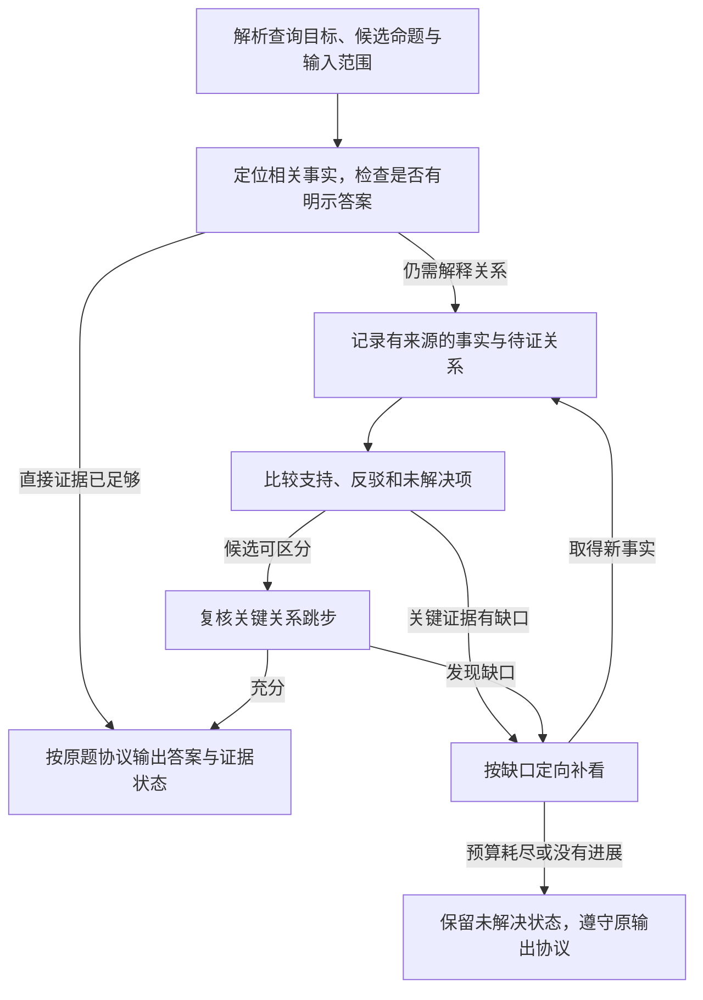

> 分类来源材料：保留原材料的设计语境；当前实现与验证状态请看 [运行文档](../pipelines/) 和 [发布验证](../validation.md)。

# R6：证据约束关系推理——特征与原题讨论材料

整理日期：2026-09-08。分类基线：[benchmark_pipeline_reclassification_v04.xlsx](benchmark_pipeline_reclassification_v04.xlsx) 的九类方案。本文保留原生题型与工作簿归类，并将本次题面分析、来源核验结果和设计建议分别标明。

**R6 的核心，是用有来源的事实支持某种关系或解释，并检查其他解释。** 它可能只涉及一段局部互动，也可能涉及跨片段的动机、叙事和语义关系；长度、模态数量、Reasoning 标签和“为什么”句式都不能单独决定是否使用 R6。常识可以帮助提出候选，但最终解释需要片中证据约束。

本次搜集 **32 条完整原题，覆盖 7 个 benchmark**：工作簿代表题暂列 R6 的 16 条放在主文，另外 16 条作为边界与反例。按另一口径计算，这些入口中 **19 个默认 R6，13 个仅在某些子型下涉及 R6**。两组数字分别描述“代表题归类”和“入口默认归类”，不可相加，也不是 benchmark 中实际 R6 样本数或难度分布。

**本次的具体核验结果：** 24 条核对到官方标注，8 条核对到论文图表；31 条有可追溯答案，1 条论文例题未提供可确认的答案键。未下载或观看完整原视频，未运行模型。因此下文“需要核查的证据”是基于题文与选项的分析，不是已经标注好的最小充分帧集合。

建议讨论时先读第 1、3、6 节，再重点看 [E08 多场决策动机](#e08)、[E09 音画一致](#e09)、[E10 人物关系](#e10)、[E14 叙事转折](#e14)；同时用 [E02 字幕中的明示动机](#e02)、[E04 多命题核验](#e04)、[E11 题干与选项疑点](#e11)、[E12 笑点的事实捷径](#e12)检查设计是否过度复杂或评估口径失真。

## 目录

- [1. R6 的定义、共同特征及九类边界](#definition)
- [2. 入口覆盖与原题索引](#index)
- [3. 六组特征与证据需求](#features)
- [4. 16 条工作簿代表 R6 原题](#main-examples)
- [5. 16 条边界与反例](#boundary-examples)
- [6. 从原题出发讨论 pipeline](#pipeline)
- [7. 建议的诊断实验与错误归因](#experiments)
- [8. 来源、原文修正及核验范围](#sources)

## 1. R6 的定义、共同特征及九类边界

### 1.1 工作簿中的定义

v04“9类Pipeline”工作表对 R6 的规定如下，属于本项目的工程分类，而非各 benchmark 统一采用的官方标签。

| 项目 | 工作簿内容 |
| --- | --- |
| 名称 | 证据约束关系推理 |
| 核心证据状态 | 带来源的事实及关系：原因、意图、人物关系、语义对应、预期/观测差异 |
| 控制流 | 提出待证关系 → 获取支持及反驳证据 → 构建轻量事实/关系表 → 比较解释 → 核验关键跳步 |
| 停止条件 | 关系结论被观察证据支持且关键反例被检查；明示答案可降为直接取证 |
| 查询头/配置 | 因果；动机/社会关系；隐喻/笑点；叙事转折；音画语义一致；步骤违例 |
| 硬边界 | 不是所有 Reasoning 标签都需多跳；只读明示事实 R1；假设未来 R7；明确数学 R8 |
| 实现注意 | 无需为每题维护复杂大图；常识只能提出候选解释，不能代替视频证据 |

例如，[E14](#e14)的“包里还有一包饼干”与“此前吃的是男孩的饼干”分别是物品状态和归属解释；要从前者走到后者，必须核对前面的情节。在 [E09](#e09)中，声音与画面各自是什么基调是两组观察，两者是否一致是另一步语义比较。相比之下，[E02](#e02)的官方字幕直接提到赢得信任，在允许这段字幕的设置下，动机题也可能只剩直接取证。

### 1.2 三层内容必须分开

| 层次 | 应保存什么 | 常见混淆 |
| --- | --- | --- |
| 可观察事实、可追溯陈述 | 哪个人在什么时段做了什么；谁说了哪句话；什么物体或声音确实出现 | 将某角色说的话直接当成客观世界真相；将模型猜测写成“观察到” |
| 待证关系或解释 | 某事实是否导致结果；行为是否服务于某目标；哪些线索支持某人物关系或主题 | 把时间先后等同因果；把共现、次数多等同亲密、意图或主导因素 |
| 题目答案 | 在完整候选中哪个命题受到支持，或者按原协议输出什么 | 只匹配共同关键词；省略否定、人物、时间范围及比较对象 |

角色的信念、表态与叙事事实尤其要区分。[E14](#e14)涉及角色认识改变；[B15](#b15)可能只问某人明确表达的立场；[E07](#e07)要说明片中人物给出的拒绝理由。知道某人说了什么，不自动等于认可该说法为真，也不自动证明这就是其全部心理动机。

### 1.3 跨题共享的七个特征

1. **答案需要的抽象层级不固定。** 可以是单个原因，也可以是关系描述、主题或一组满足动机条件的场合。需结合完整选项识别目标，不能只看题干。
2. **定位事实与判定关系是两个错误来源。** 没找到正确镜头、字幕或人物，后续推理再复杂也无法修复；找到事实后，还需检查是否足以支持结论。
3. **证据范围由关系决定。** 原因可能在结果之前，身份可能在后文澄清，主题可能需要多个关键情节。问题提及的时段与实际允许读取的时段必须分开。
4. **竞争选项决定判别细节。** [E10](#e10)的“针锋相对/敌对”、[E14](#e14)的 G/H、[E09](#e09)的小女孩/小男孩，都容易被宽泛摘要抹掉。
5. **负面证据需要明确语义。** “尚未看见”“看不清”“未提及”“与之相反”不能混用。尤其 incorrect、none、cannot be determined 等形式，不能把未知直接归为错误。
6. **更多模态或更多节点不保证需要更复杂的关系推理。** 字幕可能直接给答案；音画两种事实的身份绑定可能仍是 R1；普通局部关系可能用几行表就能表示。
7. **选对答案与机制正确需要分别审阅。** [E12](#e12)可能凭识别猫伤人答对，尚不能证明理解了幽默；[E11](#e11)可能先存在题意问题。开发集应审查捷径与标注质量。

### 1.4 在九类体系中的位置

| R 类 | 工作簿名称 |
| --- | --- |
| R1 | 定向定位与局部取证 |
| R2 | 连续动态与实体状态追踪 |
| R3 | 事件账本与时序归约 |
| R4 | 清单构建与集合归约 |
| R5 | 分段全局综合 |
| R6 | 证据约束关系推理 |
| R7 | 假设与未来推演 |
| R8 | 视觉符号与约束求解 |
| R9 | 空间场景建模与查询 |

| 相邻类型 | 区分问题 | 本文中的对照 |
| --- | --- | --- |
| R1 | 答案是否在允许输入中直接明示，或能由局部观察直接确认？ | E02 允许字幕时的动机；B08 手套原位置；B15 明示观点 |
| R2 | 核心困难是否为同一实体的连续运动、身份对应和状态演化？ | B05 香的去重可依赖身份；B08 可依赖手套关联。R6 可消费这些结果 |
| R3 | 只需要真实事件的顺序、次数、时长或统计吗？ | B01 咖啡伴随活动、B02 共弹吉他频次；E08 另需逐场动机判断 |
| R4 | 目标是否为完整清单、唯一实例、存在/缺失或集合运算？ | B03 未购清单、B05 香的根数。清单结果可成为关系推理的事实输入 |
| R5 | 是否只需综合内容、整体活动或体裁，而不解释隐含意义？ | B04 打牌并记录、B12 新闻体裁；E15 则比较抽象主题 |
| R7 | 是否改变了已知条件，或推演尚未观察到的未来结果？ | E06 解释已发生的飞起，B13 读取历史变化，都不能仅因结果发生较晚就归 R7 |
| R8 | 是否需要从画面读取符号并执行明确数学/逻辑约束求解？ | B16 矩形面积；知识入口中的普通事实与概念关系仍应另判 |
| R9 | 是否需要跨视角建立空间场景，再做方向、距离、布局或路径查询？ | E06 虽来自 Spatial Reasoning，却是在问原因，并不要求三维建图 |

这些分类描述主控制流，底层证据能力可以共享。采用多个局部证据请求不等于自动生成多个完整 agent；在本次材料中也不把条件候选写成已经实现的自动路由器。

## 2. 入口覆盖与原题索引

### 2.1 覆盖口径

筛选规则是 v04“127题型重分类”表中“条件候选R”含 R6，共 32 个原生入口。每个入口保留已有代表题，再回查官方数据或论文。主文 E01–E16 的条件是“代表题建议R = R6”，边界 B01–B16 则是代表题建议为其他 R。

| Benchmark | 涉及入口 | 默认 R6 | 其他默认、含条件 R6 | 主文原题 | 边界原题 |
| --- | --- | --- | --- | --- | --- |
| EgoLifeQA | 3 | 0 | 3 | 0 | 3 |
| EgoSchema | 1 | 0 | 1 | 0 | 1 |
| LVBench | 3 | 1 | 2 | 1 | 2 |
| MLVU | 3 | 0 | 3 | 0 | 3 |
| MVBench | 3 | 1 | 2 | 1 | 2 |
| Video-MME | 6 | 4 | 2 | 4 | 2 |
| Video-MME-v2 | 13 | 13 | 0 | 10 | 3 |
| 合计 | 32 | 19 | 13 | 16 | 16 |

**特别说明：** “默认 R6”不保证所选代表题也是 R6，例如 Temporal Reasoning、Counterintuitive Comprehension、Individual Social Cognition 和 Professional Knowledge Acquisition；默认 R1 的 Attribute Perception 代表题又暂列 R6。本文不修改工作簿，并在题旁指出本次分析中可能继续简化的路径。

### 2.2 主文题目索引

表中“本文判断”强调条件，不等同视频审阅后的逐题最终归类。原始 Source ID、工作簿行号及题号均在例题正文中保留。

| 编号 | Benchmark | 原生入口 | 默认 / 代表题 | 条件候选 | 本文判断/讨论重点 |
| --- | --- | --- | --- | --- | --- |
| [E01](#e01) | LVBench | Reasoning | R6 / R6 | R1  /  R6  /  R7 | 原因解释；明示可 R1 |
| [E02](#e02) | MVBench | Episodic Reasoning | R6 / R6 | R1  /  R6 | 允许所附字幕时有直接 R1 路径 |
| [E03](#e03) | Video-MME | Action Reasoning | R6 / R6 | R1  /  R6 | 明示缘由 R1；关系组合 R6 |
| [E04](#e04) | Video-MME | Attribute Perception | R1 / R6 | R1  /  R4  /  R6 | 逐项事实核验可能足够 |
| [E05](#e05) | Video-MME | Object Reasoning | R6 / R6 | R1  /  R6 | 关系措辞与明示性待审 |
| [E06](#e06) | Video-MME | Spatial Reasoning | R6 / R6 | R1  /  R6  /  R9 | 原因解释；无需按标签建空间图 |
| [E07](#e07) | Video-MME-v2 | Causal Reasoning | R6 / R6 | R1  /  R6 | 原因/人物指代；明示可 R1 |
| [E08](#e08) | Video-MME-v2 | Collective Dynamics Analysis | R6 / R6 | R6 | 逐场动机判断，再组合场合 |
| [E09](#e09) | Video-MME-v2 | Cross-Modal Semantic Consistency | R6 / R6 | R6 | 同期音频与视觉分别取证 |
| [E10](#e10) | Video-MME-v2 | Dyadic Interaction Dynamics | R6 / R6 | R1  /  R6 | 限定时间内比较近义关系 |
| [E11](#e11) | Video-MME-v2 | General Skills Acquisition | R6 / R6 | R1  /  R3  /  R6 | 题干/选项疑点，先审题 |
| [E12](#e12) | Video-MME-v2 | High-Order Narrative Deconstruction | R6 / R6 | R6 | 事件选择可能有 R1 捷径 |
| [E13](#e13) | Video-MME-v2 | Narrative Cloze Inference | R6 / R6 | R1  /  R6 | 明示身份 R1；线索组合 R6 |
| [E14](#e14) | Video-MME-v2 | Narrative Turning Point Detection | R6 / R6 | R6 | 核对揭示带来的归属理解变化 |
| [E15](#e15) | Video-MME-v2 | Symbolic/Metaphorical Interpretation | R6 / R6 | R5  /  R6 | 事实到抽象主题的对应 |
| [E16](#e16) | Video-MME-v2 | Visual-Audio Collaborative Reasoning | R6 / R6 | R1  /  R6 | 明示身份绑定可能为 R1 |

### 2.3 边界题目索引

| 编号 | Benchmark | 原生入口 | 默认 / 代表题 | 条件候选 | 本文判断/讨论重点 |
| --- | --- | --- | --- | --- | --- |
| [B01](#b01) | EgoLifeQA | HabitInsight | R3 / R3 | R3  /  R6 | 习惯统计 |
| [B02](#b02) | EgoLifeQA | RelationMap | R3 / R3 | R1  /  R3  /  R6 | 人际统计 |
| [B03](#b03) | EgoLifeQA | TaskMaster | R4 / R4 | R4  /  R6  /  R7 | 计划与已购的差集 |
| [B04](#b04) | EgoSchema | Long-form Video QA | R5 / R5 | R5  /  R6 | 全局行为综合 |
| [B05](#b05) | LVBench | Entity Recognition | R1 / R4 | R1  /  R2  /  R4  /  R6 | 实例计数 |
| [B06](#b06) | LVBench | Summarization | R5 / R1 | R1  /  R5  /  R6 | 锚点后局部事实 |
| [B07](#b07) | MLVU | Anomaly Recognition | R1 / R1 | R1  /  R6 | 检测与分类 |
| [B08](#b08) | MLVU | Ego Reasoning | R1 / R1 | R1  /  R2  /  R6 | 时间锚点检索 |
| [B09](#b09) | MLVU | Plot QA | R1 / R1 | R1  /  R6 | 动作客体取证 |
| [B10](#b10) | MVBench | Object Interaction | R1 / R1 | R1  /  R2  /  R6 | 论文例题的来源边界 |
| [B11](#b11) | MVBench | Unexpected Action | R1 / R1 | R1  /  R6 | 问笑点事件，还是解释笑点 |
| [B12](#b12) | Video-MME | Information Synopsis | R5 / R5 | R4  /  R5  /  R6 | 事实层面的全局综合 |
| [B13](#b13) | Video-MME | Temporal Reasoning | R6 / R1 | R1  /  R3  /  R6  /  R7 | 历史叙述检索 |
| [B14](#b14) | Video-MME-v2 | Counterintuitive Comprehension | R6 / R1 | R1  /  R6 | 可见异常不等于原因解释 |
| [B15](#b15) | Video-MME-v2 | Individual Social Cognition | R6 / R1 | R1  /  R6 | 明示观点取证 |
| [B16](#b16) | Video-MME-v2 | Professional Knowledge Acquisition | R6 / R8 | R1  /  R6  /  R8 | 专业知识标签下的符号求解 |

## 3. 六组特征与证据需求

S1–S6 是为了讨论 R6 内部证据需求而设的分组，**不替换 R1–R9，也不要求实现六套独立 pipeline**。分组可交叠；E05 的知识关联、E16 的身份事实绑定等属于边界，不强行凑成一个纯 R6 子类。

### S1. 因果解释

典型形式包括“为什么发生”“为何拒绝”“什么促成这次行动”。最重要的区别是：视频已说出的理由，还是需要把前因、条件与结果组合后才能得到的解释。

- **选项结构：** 围绕同一结果提出不同原因，如 E01 的贿赂/身份/武器/通行证，E06 的爆炸/投掷/气球/月球靠近。
- **证据跨度：** 至少定位结果及相关前因；有时要回看背景设定。不能预先保证三帧或某个固定窗口足够。
- **所需模态：** 视觉动作和状态、允许的叙述/字幕/音频、必要的画面文字；按题分配，不默认全部可用。
- **应保存：** 原因候选、对应结果、实体与时间、支持/反驳/未解决证据、连接尚缺哪一步。
- **常见错误：** 用发生在前代替造成结果；把一般常识当成具体故事的原因；拿答案键反向补情节。
- **代表题：** [E01](#e01)、[E03](#e03)、[E06](#e06)、[E07](#e07)。[E02](#e02)可检验明示原因的简化路径。

这里的“因果”是视频理解任务中的证据约束解释，不是通过一段视频就完成严格的实验性因果识别。文档应陈述支持程度与未解决环节，不夸大为证明了唯一真实机制。

### S2. 动机与社会关系

典型形式包括“为什么这样做”“两人关系如何”“哪些决定基于某种考虑”。同一题可能同时要求人物身份稳定、时间范围清晰和多个场合比较。

- **选项结构：** 不同目的、近义关系描述，或多场合的组合选项；可区分性往往依赖语境，而非单个情绪词。
- **证据跨度：** 局部对话可足够；多次决策需要按场合分别收集。持续时间长不自动表示证据更强。
- **所需模态：** 人物行为、回应及允许的对话；必要时区分语气与文本字面意思。单纯字幕未必保留反讽、重音或互动细节。
- **应保存：** 人物对、当前场合、明确表态、行为支持、竞争动机及时间限定；角色自述与观察者推断分列。
- **常见错误：** 从一次表情推断长期敌意；将资源被提到等同资源是决策主因；把共处频次当成亲密关系。
- **代表题：** [E08](#e08)、[E10](#e10)，以及 [E02](#e02)、[E07](#e07)的明示/隐含动机边界；[B01](#b01)、[B02](#b02)、[B15](#b15)是统计和观点取证对照。

E08 表明关系判断与确定性归约可以组合：先分别判断每一场合，再组合编号。场合顺序正确不保证动机判断正确；这两类错误要分别记录。

### S3. 叙事线索与转折

一部分题通过分散线索澄清身份或事件；另一部分题比较哪个揭示改变了此前的核心理解。后者不能仅靠“检测到新事件”完成。

- **选项结构：** 多种群体身份、多个剧情事件，以及直接事实与其叙事含义之间的近邻选项。
- **证据跨度：** 可能跨越铺垫、关键互动和揭示；后文证据是否可用，取决于实际允许范围。
- **所需模态：** 视觉、人物指代、对白和叙述，按来源记录；只阅读压缩摘要时容易丢掉知识发生变化的时点。
- **应保存：** 事件发生顺序、角色当时已知信息、后来出现的证据、由此改变的解释及其来源。
- **常见错误：** 后验信息污染早期状态；以最后一幕或最大动作幅度代替“最大转折”；直接合并近义候选。
- **代表题：** [E13](#e13)、[E14](#e14)。[B06](#b06)说明“之后做了什么”可能只是局部取证。

E14 的 G/H 可直接用于讨论中间表示：一个保存“发现包里仍有饼干”的事实，另一个保存“先前吃的是男孩的饼干”的归属解释。事实表是否保留了验证这一跳所需的前文，比图的节点数量更关键。

### S4. 隐喻与笑点

这组题把事件与预期、抽象主题或表达效果联系起来。完整选项决定究竟需要解释，还是只需识别一个被称为笑点的事件。

- **选项结构：** 具体反转事件、某种反差的解释，或种族歧视、宗教冲突、心理疗愈等抽象主题。
- **证据跨度：** 笑点通常需相关铺垫与揭示，主题可能需若干关键情节；不是所有题都要求均匀扫描全片。
- **所需模态：** 事件、对话、人物反应以及有必要时的音乐/语气。具体缺哪种模态需要逐题判断。
- **应保存：** 真实事件、预期来源、反差所在、候选主题所解释的事实及冲突事实。
- **常见错误：** 只套通用人生道理；把受伤者与猫的共现自动解释成幽默；回答体裁却声称理解隐喻。
- **代表题：** [E12](#e12)、[E15](#e15)；[B11](#b11)与 [B12](#b12)分别是事件和事实综合边界。

解释质量需要后续单独审阅。若官方只给选择题答案，没有给标准解释，就不能把本文设计的解释结构写成“官方推理链”。

### S5. 跨模态语义一致

重点是分别确认不同模态的语义，再比较它们是否对应。需把这一需求与“用声音确认身份、用画面找到人”的事实绑定区分。

- **选项结构：** 一个候选可能同时断言音乐性质、人物属性、画面基调以及一致/冲突关系。
- **证据跨度：** 首先要求同一目标场景内的时间对齐；在问开头时，不用后面音乐代替。
- **所需模态：** E09 必须有能支持音乐判断的音频证据。普通 ASR 不等于音乐描述，文件存在也不等于已经被正确消费。
- **应保存：** 音频观察、视觉观察、各自来源/时间、对齐关系、最终语义比较；避免跨模态相互猜测。
- **常见错误：** 由画面预测配乐再做“一致性”自证；丢掉人物与环境命题；没有音频却声称音画已核验。
- **代表题：** [E09](#e09)；[E16](#e16)说明跨模态标签下也可能仅有身份事实取证。

现有工程文档显示，R4/R5 只消费已有字幕或 ASR 产物，不能据此宣称已经具备音乐感知能力。原始音频如何取得和分析，是本组需要单列讨论的实际能力缺口。

### S6. 步骤规则与陈述核验

核心形式是“哪步不对”“哪个陈述不正确”“某描述与示范/规则是否一致”。关系推理负担取决于核验是否涉及规则、条件、指代或矛盾消解，而非单纯选项数量。

- **选项结构：** 否定提问、多条复述、对示范的修改，以及 None of the other options 等特殊候选。
- **证据跨度：** 一项一个来源窗口，或跨步骤取证；先明确比较的是示范、复述还是改法。
- **所需模态：** 操作过程、图形/文字、材料与部位、允许的讲解；不能用通用领域常识替换视频示范。
- **应保存：** 原命题、比较基准、前置条件、相关步骤、支持/矛盾/未知、最终否定或组合逻辑。
- **常见错误：** 把未提及当作未执行；遗漏 incorrect；给含糊选项强行编理由；把所有 Professional Knowledge 样本都当解释题。
- **代表题：** [E04](#e04)、[E11](#e11)。[E05](#e05)用于讨论语义/知识关联的歧义，[B16](#b16)用于识别符号求解边界。

本组尤其需要把“题目质量未澄清”和“系统不会推理”分开。E11 不能仅凭官方有答案就被视为一个逻辑结构明确的诊断题。

### 3.1 六组对中间记录的不同要求

| 分组 | 最需要保留的信息 | 有判别力的补看目标 | 可以结束的证据条件（讨论口径） |
| --- | --- | --- | --- |
| S1 因果 | 结果、竞争原因、对应来源、缺失连接 | 原因发生处、交涉、背景设定 | 目标原因有支持，关键竞争解释得到针对性检查 |
| S2 社会关系 | 人物/场合/时期、明确陈述、互动、竞争动机 | 人物指代、近义关系的区分语境 | 相关场合已覆盖，目标关系的限定条件有依据 |
| S3 叙事 | 前后事实、当时理解、后续揭示、解释改变 | 归属/身份的关键揭示及其前文 | 从事实到叙事结论的关键跳步可回指证据 |
| S4 主题/笑点 | 铺垫、事件、反差、候选主题与事实对应 | 缺失的预期来源、反转或主题呼应 | 解释得到具体情节支持，竞争主题/事件可区分 |
| S5 跨模态 | 独立模态观察、同步时间、语义比较 | 对齐音频、人物/动作/环境差异 | 相关模态均有有效证据，完整选项命题可核验 |
| S6 规则/核验 | 命题、基准、条件、冲突与未知 | 指定步骤、具体属性、适用条件 | 题意明确，关键命题状态足以完成选择 |

这些是人工讨论的充分性要求，不是已经校准的硬阈值；预算耗尽或重复查看不再增加信息时，应保存未解决原因，不能把“停止运行”记成“证据充分”。

## 4. 16 条工作簿代表 R6 原题

本节按工作簿“代表题建议 R6”收录，**不表示已经通过视频审阅确认这 16 题都必须使用 R6**。每题的英文与来源答案和本文的中文释义、证据分析分列；可能的直接取证路径与题目质量问题也明确保留。

### E01 母子为何无法进城：竞争原因的核验

**Benchmark / 原生标签：** LVBench / Reasoning。
**分类口径：** 默认 R6；工作簿代表题 R6；条件候选 R1 / R6 / R7。
**讨论分组：** S1 因果解释。
**分类定位：** `127题型重分类` 第 28 行；Source ID：`src.lvbench.reasoning`。
**原题定位：** video=Cm73ma6Ibcs，uid=65。

[原题来源](https://huggingface.co/datasets/zai-org/LVBench/resolve/0caedb92002cc268bad486449e551c76f0485670/video_info.meta.jsonl) · [原视频链接](https://www.youtube.com/watch?v=Cm73ma6Ibcs)

**原始标签与参考时间：** question_type=`["reasoning"]`；time_reference=`19:35-20:20`。参考时间仅用于本文查核定位；是否允许作为模型输入，须遵循具体评测协议。

**英文原题：**

> Why are the mother and child, who line in front of the protagonist, unable to enter the city?

- A. They do not bribe the guard
- B. They are foreigners
- C. They bring illegal weapons
- D. They do not have a pass

**中文对照：**

排在主角前面的母亲和孩子为什么无法进入城内？

- A. 他们没有贿赂守卫。
- B. 他们是外国人。
- C. 他们携带违禁武器。
- D. 他们没有通行证。

**来源答案：A。** They do not bribe the guard（他们没有贿赂守卫。）
**答案依据：** 官方标注答案键；本次核对固定 revision，完整文件 SHA-256 与本地副本一致。

**归类条件：** 工作簿暂列 R6。只有需要结合守卫要求、母子反应、通行结果等线索才能解释拒绝入城时，才体现关系推断；如果对白直接讲明原因，R1 即可。

**需要推断/核验什么：** 待证的是某项条件与拒绝入城之间的原因关系。外国人、武器、通行证和贿赂是不同假设，不能因某个条件恰好出现就认定它导致结果。

**需要检查的证据：**

- 定位母子与守卫的交涉，绑定人物及拒绝通行事件，避免用主角后来自己的遭遇代替。
- 在允许的模态中核对守卫的要求、是否存在金钱交涉，以及其他选项所指条件；保留支持、冲突和未提及三种状态。
- 必要时扩展到交涉前后，检查某条件改变是否伴随通行结果变化；这种变化是待查线索，本文未声称视频中已发生。

**容易出错的地方：** 凭题材先验猜‘守卫腐败’，或从未看见通行证推出‘没有通行证’。官方答案 A 不能反过来作为观察到贿赂情节的证据。

**对 pipeline 的讨论启示：** 比较一次整段回答与‘逐个原因核验’。重点检查模型能否区分支持 A 的证据、反对 D 的证据和根本未查明的条件。

**原文与来源说明：**

- 原标注将选项写在 question 内，使用 (A)–(D)；本文仅统一为 A.–D.，保留选项文字、顺序和原有拼写。

[返回题目索引](#index)

### E02 Castle 扮仙女：字幕可改变推理负担

**Benchmark / 原生标签：** MVBench / Episodic Reasoning。
**分类口径：** 默认 R6；工作簿代表题 R6；条件候选 R1 / R6。
**讨论分组：** S2 动机与社会关系。
**分类定位：** `127题型重分类` 第 48 行；Source ID：`src.mvbench.episodic_reasoning`。
**原题定位：** json/episodic_reasoning.json，数组索引 0（从 0 开始），video=castle_s07e04_seg02_clip_14。

[原题来源](https://huggingface.co/datasets/OpenGVLab/MVBench/resolve/230a2d4fac8900333c61754641c7a13e069ac9c6/json/episodic_reasoning.json)

**额外核验到的字幕信息：** 官方 JSON 附带字幕直接提到 Emily 向 Castle 倾诉及他正赢得信任。这里只用它说明模态条件如何改变取证难度，未观看原视频，也未假定所有 MVBench 设置都允许使用该字段。

**英文原题：**

> Why did Castle dress like a fairy when he was speaking to Emily?

- A. To get her to trust him
- B. He secretly loved fairies
- C. He lost a bet with Emily
- D. It was dress like a fairy day at school
- E. Mrs Ruiz made him dress up

**中文对照：**

Castle 与 Emily 说话时，为什么把自己打扮成仙女？

- A. 为了让她信任自己。
- B. 他暗地里很喜欢仙女。
- C. 他与 Emily 打赌输了。
- D. 那天是学校的仙女装扮日。
- E. Mrs Ruiz 让他这样打扮。

**来源答案：A。** To get her to trust him（为了让她信任自己。）
**答案依据：** 官方 JSON 答案文本精确映射到本题选项；论文 Table 1 本身没有答案键。

**归类条件：** 工作簿代表题为 R6；本次发现官方 JSON 的 subtitle 已直接提到 Emily 向他倾诉以及他正赢得信任。在允许且实际提供该字幕的设置下，本题有很强的 R1 直接取证路径。元数据含字幕，不代表所有官方或项目评测设置都允许使用它。

**需要推断/核验什么：** 若没有明示动机，需要把装扮行为与建立信任这一人际目标联系起来；若已有对应台词，任务变为定位并正确绑定说话对象与指代。

**需要检查的证据：**

- 官方记录 video=castle_s07e04_seg02_clip_14，字幕中确有得到倾诉和赢得信任的表述，答案文本为 To get her to trust him。
- 允许字幕时，保存相关台词来源与人物指代，检查它解释的是否正是这次装扮。
- 纯视觉时需重新评估可解性；能看见装扮、互动或情绪变化，并不自动足以确定隐藏目的。

**容易出错的地方：** 把原生 Episodic Reasoning 标签当作必须多跳的证明；或者为了显示 R6 收益，把另一实验设置中的字幕偷偷加入输入。

**对 pipeline 的讨论启示：** 把它作为模态分层的对照题：固定问题和选项，分别评估视频可用、视频加允许字幕。记录分类为何变化，而不只记录最终答案。

**原文与来源说明：**

- 正文采用官方 JSON 选项全文。论文 Table 1 给各项加句号，D 项写成 It was dressed like a fairy day at school.；JSON 写作 It was dress like a fairy day at school，保留两版本差异。

[返回题目索引](#index)

### E03 考古发掘动机：背景知识与片中原因

**Benchmark / 原生标签：** Video-MME / Action Reasoning。
**分类口径：** 默认 R6；工作簿代表题 R6；条件候选 R1 / R6。
**讨论分组：** S1 因果解释。
**分类定位：** `127题型重分类` 第 76 行；Source ID：`src.video_mme.action_reasoning`。
**原题定位：** question_id=002-2。

[原题来源](https://huggingface.co/datasets/lmms-eval/Video-MME/resolve/ead1408f75b618502df9a1d8e0950166bf0a2a0b/videomme/test-00000-of-00001.parquet) · [原视频链接](https://www.youtube.com/watch?v=N1cdUjctpG8)

**英文原题：**

> Which of the following reasons motivated the archaeologists to excavate the tomb?

- A. Because it's from Ming Dynasty and of specific archaeological significance.
- B. Because a new railway line will be built nearby.
- C. Because there were treasures inside the tomb.
- D. Highway realignment.

**中文对照：**

下列哪项原因促使考古人员发掘这座墓葬？

- A. 因为它属于明代，并具有特殊的考古意义。
- B. 因为附近将修建一条新的铁路。
- C. 因为墓内有宝藏。
- D. 公路改线。

**来源答案：D。** Highway realignment.（公路改线。）
**答案依据：** 官方标注答案键；本次核对固定 revision，完整文件 SHA-256 与本地副本一致。

**归类条件：** 条件性 R6。纪录片旁白若直接交代发掘缘由，就是 R1；需要把道路工程、发现墓葬和抢救性发掘等分散事实连接起来时，才进入 R6。

**需要推断/核验什么：** 问题问的是这一次行动的实际触发原因，不是考古发掘一般有什么价值。选项 B 与 D 都属于建设工程背景，区别落在铁路与公路以及具体项目。

**需要检查的证据：**

- 找到介绍本次墓葬发现及发掘缘由的段落，识别画面文字、旁白或字幕中具体工程名称。
- 将原因陈述与这座墓葬、这次发掘绑定；仅找到全片某处的道路画面不够。
- 若依赖多个片段，保留‘工程背景—发现—发掘’之间真实出现的联系；没有依据的连接记为缺口。

**容易出错的地方：** 从‘考古’常识选文物价值或宝藏；找到一个交通设施后忽略 railway 与 highway 的差别。

**对 pipeline 的讨论启示：** 是否应先用一个低成本的‘明示原因检查’，只在没有直接答案时启用关系比较？本题适合与 E01 配对检验。

[返回题目索引](#index)

### E04 萨拉热窝哪项不正确：命题核验的边界

**Benchmark / 原生标签：** Video-MME / Attribute Perception。
**分类口径：** 默认 R1；工作簿代表题 R6；条件候选 R1 / R4 / R6。
**讨论分组：** S6 步骤规则与陈述核验。
**分类定位：** `127题型重分类` 第 78 行；Source ID：`src.video_mme.attribute_perception`。
**原题定位：** question_id=005-3。

[原题来源](https://huggingface.co/datasets/lmms-eval/Video-MME/resolve/ead1408f75b618502df9a1d8e0950166bf0a2a0b/videomme/test-00000-of-00001.parquet) · [原视频链接](https://www.youtube.com/watch?v=24i4ncHuf6A)

**英文原题：**

> Which of the following options is incorrect regarding the events in Sarajevo depicted in the video?

- A. It was organized by the Black Hand in Serbia.
- B. Ferdinand was sitting on the left side of the car.
- C. Ferdinand was wearing a white hat.
- D. The killer was wearing black suit.

**中文对照：**

关于视频所描绘的萨拉热窝事件，下列哪项说法不正确？

- A. 它由塞尔维亚的黑手组织策划。
- B. 斐迪南坐在汽车左侧。
- C. 斐迪南戴着白帽子。
- D. 凶手穿着黑色西装。

**来源答案：C。** Ferdinand was wearing a white hat.（斐迪南戴着白帽子。）
**答案依据：** 官方标注答案键；本次核对固定 revision，完整文件 SHA-256 与本地副本一致。

**归类条件：** 原生标签为 Attribute Perception，工作簿代表题建议 R6。但逐项核验本身并不必然是关系推理：如果每项都可直接读出，多个 R1 证据请求加否定选择即可。只有需要跨陈述消解矛盾、指代或关系，才体现 R6。

**需要推断/核验什么：** 先把四个选项分别拆成组织者、座位方向、帽子颜色和服装颜色命题，再执行‘选出不正确项’。这些命题的证据来源和判定方式不相同。

**需要检查的证据：**

- 对 A 查叙述中的组织关系，对 B 查明确的空间参照，对 C/D 查对应人物在相关场景中的外观。
- 保持人物与镜头绑定，不能把他人的帽子、另一个时间的服装或后来的重演画面混用。
- 给每项记录支持、反驳或未解决；选择不正确项不能仅凭‘这一项暂时没找到’。

**容易出错的地方：** 把 incorrect 漏掉，或把没有证据支持当成已被证伪。这里没有完整清单目标，不能因为有四个候选就归成 R4。

**对 pipeline 的讨论启示：** 作为 R6 的边界压力测试：显式命题表是否已经足够？在相同观察结果上增加关系图，是否只增加开销？

[返回题目索引](#index)

### E05 食物与国家：语义关联还是直接事实

**Benchmark / 原生标签：** Video-MME / Object Reasoning。
**分类口径：** 默认 R6；工作簿代表题 R6；条件候选 R1 / R6。
**讨论分组：** S6 的知识关联边界。
**分类定位：** `127题型重分类` 第 81 行；Source ID：`src.video_mme.object_reasoning`。
**原题定位：** question_id=003-3。

[原题来源](https://huggingface.co/datasets/lmms-eval/Video-MME/resolve/ead1408f75b618502df9a1d8e0950166bf0a2a0b/videomme/test-00000-of-00001.parquet) · [原视频链接](https://www.youtube.com/watch?v=HIjX8OPuf-w)

**英文原题：**

> In which country is the food featured in the video recognized worldwide?

- A. Mongolia.
- B. Russia.
- C. Germany.
- D. United States.

**中文对照：**

视频中的食物在哪个国家享誉世界？

- A. 蒙古。
- B. 俄罗斯。
- C. 德国。
- D. 美国。

**来源答案：D。** United States.（美国。）
**答案依据：** 官方标注答案键；本次核对固定 revision，完整文件 SHA-256 与本地副本一致。

**归类条件：** 工作簿暂列条件性 R6。原题措辞中‘在哪个国家享誉世界’的关系不够明确，需要结合片中叙述判断是在问国家关联、来源还是名声；不替原题改成‘起源于哪里’。若视频直接给国家，则为 R1。

**需要推断/核验什么：** 可能需要先确认食物，再将其与片中谈及的国家建立特定语义关系。食物识别与国家关联是两步，但两步检索仍不自动等于多跳解释。

**需要检查的证据：**

- 核实视频展示或谈论的食物，保留名称、对应片段与同义称呼。
- 查视频实际如何描述食物与国家的关系，区分起源、流行地、代表性和全球知名度。
- 只有任务允许且确有必要时才讨论外部知识；应把外部知识来源与片中事实分开。

**容易出错的地方：** 根据食物外观或刻板印象直接猜国家，或将 recognized worldwide 擅自解释成某个确定的地理关系。

**对 pipeline 的讨论启示：** 先人工确认题意及视频是否明示，再决定是否把它放入 R6 核心开发集。可用于检验系统会不会编造中间知识联系。

[返回题目索引](#index)

### E06 屋顶物体为何飞起：不能按 Spatial 标签硬分流

**Benchmark / 原生标签：** Video-MME / Spatial Reasoning。
**分类口径：** 默认 R6；工作簿代表题 R6；条件候选 R1 / R6 / R9。
**讨论分组：** S1 因果解释。
**分类定位：** `127题型重分类` 第 85 行；Source ID：`src.video_mme.spatial_reasoning`。
**原题定位：** question_id=043-1。

[原题来源](https://huggingface.co/datasets/lmms-eval/Video-MME/resolve/ead1408f75b618502df9a1d8e0950166bf0a2a0b/videomme/test-00000-of-00001.parquet) · [原视频链接](https://www.youtube.com/watch?v=9jjTGpWmc5U)

**英文原题：**

> Why does the roof object fly?

- A. There was an explosion.
- B. Thrown into the air by a child.
- C. Tied to a balloon.
- D. Lunar approach.

**中文对照：**

屋顶上的物体为什么会飞起来？

- A. 发生了爆炸。
- B. 被一个孩子扔到了空中。
- C. 被绑在一个气球上。
- D. 月球靠近。

**来源答案：D。** Lunar approach.（月球靠近。）
**答案依据：** 官方标注答案键；本次核对固定 revision，完整文件 SHA-256 与本地副本一致。

**归类条件：** 原生标签虽然是 Spatial Reasoning，代表题要解释飞起原因，工作簿建议 R6。它没有直接要求三维地图或距离计算；明示原因可用 R1。

**需要推断/核验什么：** 需要把飞起事件与对应机制或片中设定联系起来。官方答案只有 Lunar approach，不能将其扩写成未经核验的完整物理推导。

**需要检查的证据：**

- 确定 roof object 指哪个物体、哪个飞起事件，先排除目标定位错误。
- 查看事件前后以及必要的背景设定，分别寻找爆炸、投掷、气球牵引和月球靠近的支持或矛盾线索。
- 若原因由多个镜头表达，需要保留跨镜头的事件联系；物体在空中这一结果画面不足以单独区分四个原因。

**容易出错的地方：** 用现实物理常识覆盖虚构视频设定；或见到 Spatial 就强制运行 R9 场景建模。

**对 pipeline 的讨论启示：** 用只看结果窗口、加前因窗口、再加背景设定三种证据条件，检查增加的是哪一种判别信息；窗口范围需后续人工看视频确定。

[返回题目索引](#index)

### E07 为什么不能扮 Hello Kitty：人物动机与叙事事实

**Benchmark / 原生标签：** Video-MME-v2 / Causal Reasoning。
**分类口径：** 默认 R6；工作簿代表题 R6；条件候选 R1 / R6。
**讨论分组：** S1 因果解释；S2 动机与社会关系。
**分类定位：** `127题型重分类` 第 90 行；Source ID：`src.video_mme_v2.causal_reasoning`。
**原题定位：** question_id=001-2。

[原题来源](https://huggingface.co/datasets/MME-Benchmarks/Video-MME-v2/resolve/6e4bebb03202e1ddbf3d37703e560e51c5aa2d64/test.parquet) · [原视频链接](https://www.youtube.com/watch?v=AYSYelOQtQI)

**原始组信息：** video_id=001；group_type=logic；group_structure=`[1,2,3,4]`；level=2。这些字段用于保留来源与离线评估语境，不将组内标准答案作为其他题的输入。

**英文原题：**

> Why didn't the boss let the protagonist dress as Hello Kitty?

- A. Because she is not slender enough.
- B. Because her mom is Malaysian Chinese.
- C. Because she is not Japanese.
- D. Because her face is not beautiful enough.
- E. Because she has no relevant work experience.
- F. Because she is not a Black girl.
- G. Because she doesn't have a deep understanding of Hello Kitty.
- H. Because her temperament doesn't match.

**中文对照：**

老板为什么不让主角打扮成 Hello Kitty？

- A. 因为她不够苗条。
- B. 因为她的母亲是马来西亚华人。
- C. 因为她不是日本人。
- D. 因为她的脸不够漂亮。
- E. 因为她没有相关工作经验。
- F. 因为她不是黑人女孩。
- G. 因为她对 Hello Kitty 没有深入了解。
- H. 因为她的气质不相符。

**来源答案：B。** Because her mom is Malaysian Chinese.（因为她的母亲是马来西亚华人。）
**答案依据：** 官方标注答案键；本次核对固定 revision，完整文件 SHA-256 与本地副本一致。

**归类条件：** 工作簿暂列 R6。应核对拒绝决定及其给出的理由；若老板的对白直接说明原因，R1 即可。不能把官方答案包含身份信息理解为可以从人物外貌推断身份或动机。

**需要推断/核验什么：** 待证的是特定叙事情境中‘给出的身份理由—拒绝扮演’的联系，不是模型对何种人适合某角色的价值判断。

**需要检查的证据：**

- 定位拒绝扮演的交涉，确认发言者、被指代的主角及其母亲。
- 只使用片中明示或有来源关联的身份信息，区分主角身份、母亲身份和老板说出的理由。
- 如果理由隐含，核查前后互动及其他候选原因；不能从‘拒绝’和某个身份事实的共现直接补出因果。

**容易出错的地方：** 从面貌猜族裔，或读取同组 E16 的标准答案作为本题的已知前提。题组结构能够提示分析层次，不能提供额外真值。

**对 pipeline 的讨论启示：** E16→E07→E15 可讨论‘事实—原因—主题’的证据复用，但实验中复用的必须是本次独立取得且协议允许共享的事实，不能是组内答案键。

[返回题目索引](#index)

### E08 Shark Daymond 的多次决策：逐场动机归因后归约

**Benchmark / 原生标签：** Video-MME-v2 / Collective Dynamics Analysis。
**分类口径：** 默认 R6；工作簿代表题 R6；条件候选 R6。
**讨论分组：** S2 动机与社会关系。
**分类定位：** `127题型重分类` 第 91 行；Source ID：`src.video_mme_v2.collective_dynamics_analysis`。
**原题定位：** question_id=024-4。

[原题来源](https://huggingface.co/datasets/MME-Benchmarks/Video-MME-v2/resolve/6e4bebb03202e1ddbf3d37703e560e51c5aa2d64/test.parquet) · [原视频链接](https://www.youtube.com/watch?v=iV8UkuD4gig)

**原始组信息：** video_id=024；group_type=logic；group_structure=`[1,2,3,4]`；level=3。这些字段用于保留来源与离线评估语境，不将组内标准答案作为其他题的输入。

**英文原题：**

> On which occasion(s) was Shark Daymond's motivation based on a reliance on his personal resources and charisma rather than the offer itself?

- A. The first and the fourth occasions.
- B. The third and the fourth occasions.
- C. The second and the fourth occasions.
- D. The first and second occasions.
- E. The second occasion.
- F. The second and third occasions.
- G. The first occasion.
- H. The fourth and the fifth occasions.

**中文对照：**

在哪一次或哪几次场合中，Shark Daymond 的动机主要基于对自身资源与个人魅力的依赖，而不是报价本身？

- A. 第一次和第四次。
- B. 第三次和第四次。
- C. 第二次和第四次。
- D. 第一次和第二次。
- E. 第二次。
- F. 第二次和第三次。
- G. 第一次。
- H. 第四次和第五次。

**来源答案：F。** The second and third occasions.（第二次和第三次。）
**答案依据：** 官方标注答案键；本次核对固定 revision，完整文件 SHA-256 与本地副本一致。

**归类条件：** 这是较适合讨论 R6 机制的代表题：需要按场合判断决策理由，再选择场合组合。R3 可以维护出现顺序，集合操作可以组合结果，但二者都不能替代动机判断。

**需要推断/核验什么：** 对每一场建立‘决策—说出的理由—个人资源/魅力—报价条件’的关联，并比较哪个因素是问题要求的依据。这里的‘动机’应保持为视频可支持的判断，不能直接声称读到人物内心。

**需要检查的证据：**

- 先核实题目所指各个场合及其顺序；选项出现第五次不证明视频一定有五次相关场合。
- 按场合保存决策、报价、关于资源或个人能力的陈述，以及对其他理由的支持和反驳。
- 比较个人资源论据与报价论据的作用，再把满足条件的场合归约成选项组合；对未查清的场合保留未知。

**容易出错的地方：** 把‘提到资源’当成‘主要因资源作决策’，或把各场合压成一个总体人物印象。选项为组合，任一场合判断错都可能改变整题答案。

**对 pipeline 的讨论启示：** 优先比较‘整体总结一次判断’和‘每场事实表＋理由比较＋组合归约’，分别评估场合定位、动机分类与最终映射的错误。

[返回题目索引](#index)

### E09 窗边女孩与背景音乐：两种模态各自取证

**Benchmark / 原生标签：** Video-MME-v2 / Cross-Modal Semantic Consistency。
**分类口径：** 默认 R6；工作簿代表题 R6；条件候选 R6。
**讨论分组：** S5 跨模态语义一致。
**分类定位：** `127题型重分类` 第 94 行；Source ID：`src.video_mme_v2.cross_modal_semantic_consistency`。
**原题定位：** question_id=181-1。

[原题来源](https://huggingface.co/datasets/MME-Benchmarks/Video-MME-v2/resolve/6e4bebb03202e1ddbf3d37703e560e51c5aa2d64/test.parquet) · [原视频链接](https://www.youtube.com/watch?v=bZFjXrMOENc)

**原始组信息：** video_id=181；group_type=relevance；group_structure=`4`；level=1。这些字段用于保留来源与离线评估语境，不将组内标准答案作为其他题的输入。

**英文原题：**

> When the scene showing the little girl sitting by the window is presented at the beginning of the video, which is the most accurate description of the background music and visual tone?

- A. The background music is cheerful and bright, the picture is gloomy and melancholy, the two form a strong contrast.
- B. The background music is sad and low, the picture shows the little girl faintly happy, the two create contrast.
- C. The background music is intense and tense, the little girl in the picture sits calmly, the two create conflict.
- D. The background music is soft and soothing, the little girl in the picture angrily pounds the window, the two are inconsistent.
- E. The background music has a light and lively rhythm, the picture has warm and bright tones, the two are consistent.
- F. The background music is slow and sad, the golden-haired, thick-eyebrowed little boy in the picture looks melancholy, the two are consisten.
- G. The background music is calm and peaceful, the picture shows bright sunshine outside the window, the two are consistent.
- H. The background music is slow and sad, the little girl in the picture looks melancholy, the two are consistent.

**中文对照：**

视频开头出现小女孩坐在窗边的画面时，下列哪项最准确地描述了背景音乐与画面基调？

- A. 背景音乐欢快明亮，画面阴郁忧伤，两者形成强烈反差。
- B. 背景音乐悲伤低沉，画面中的小女孩略显开心，两者形成反差。
- C. 背景音乐激烈紧张，画面中的小女孩平静地坐着，两者形成冲突。
- D. 背景音乐柔和舒缓，画面中的小女孩愤怒地捶打窗户，两者不一致。
- E. 背景音乐节奏轻快活泼，画面色调温暖明亮，两者一致。
- F. 背景音乐缓慢悲伤，画面中金发浓眉的小男孩神情忧郁，两者一致。
- G. 背景音乐平静安宁，画面显示窗外阳光明媚，两者一致。
- H. 背景音乐缓慢悲伤，画面中的小女孩神情忧郁，两者一致。

**来源答案：H。** The background music is slow and sad, the little girl in the picture looks melancholy, the two are consistent.（背景音乐缓慢悲伤，画面中的小女孩神情忧郁，两者一致。）
**答案依据：** 官方标注答案键；本次核对固定 revision，完整文件 SHA-256 与本地副本一致。

**归类条件：** 核心关系是同一时段的声音情绪与视觉基调是否对应。字幕或普通 ASR 通常不承载音乐节奏、强弱和情绪的充分信息；仅输入画面时不能宣称已完成音画一致性核验。

**需要推断/核验什么：** 先分别得到音频描述和视觉描述，再判断它们的语义一致、反差或冲突。选项 F/H 还考查人物匹配，因此不能只输出一个整体‘悲伤’标签。

**需要检查的证据：**

- 将题干指定的开头窗边场景与同期音频准确对齐。
- 音频侧观察速度、音色、力度等可支持基调判断的线索；视觉侧检查人物、动作、表情、色调与环境。
- 比较每个选项的全部命题，尤其 F 的小男孩与 H 的小女孩，以及 A/B/C 的关系词；任何关键部分不符都影响选项支持。

**容易出错的地方：** 看到忧伤画面后推测音乐也忧伤；用语音转写代替实际音乐；人物错误却被总体情绪一致掩盖。

**对 pipeline 的讨论启示：** 比较独立音频/视觉观察后合成与联合观察。记录真正使用的模态；纯视觉实验可作缺失模态诊断，不能与完整输入混报为同条件性能。

**原文与来源说明：**

- 选项 F 的 consisten 为原标注拼写；F 同时将题干中的小女孩换成小男孩，不能只核验音画情绪是否一致。

[返回题目索引](#index)

### E10 Ava 与 Gillian 初期关系：近义关系词与时间约束

**Benchmark / 原生标签：** Video-MME-v2 / Dyadic Interaction Dynamics。
**分类口径：** 默认 R6；工作簿代表题 R6；条件候选 R1 / R6。
**讨论分组：** S2 动机与社会关系。
**分类定位：** `127题型重分类` 第 95 行；Source ID：`src.video_mme_v2.dyadic_interaction_dynamics`。
**原题定位：** question_id=064-2。

[原题来源](https://huggingface.co/datasets/MME-Benchmarks/Video-MME-v2/resolve/6e4bebb03202e1ddbf3d37703e560e51c5aa2d64/test.parquet) · [原视频链接](https://www.youtube.com/watch?v=AiUiUhHoNmo)

**原始组信息：** video_id=064；group_type=logic；group_structure=`[1,[2,3],4]`；level=3。这些字段用于保留来源与离线评估语境，不将组内标准答案作为其他题的输入。

**英文原题：**

> What was the relationship between Ava and Gillian like at the beginning?

- A. Mutually respectful.
- B. Indifferent.
- C. Confrontational.
- D. Cannot be determined.
- E. Friendly.
- F. One-sidedly submissive.
- G. Mutually understanding.
- H. Hostile.

**中文对照：**

Ava 和 Gillian 在开始时的关系是怎样的？

- A. 相互尊重。
- B. 漠不关心。
- C. 针锋相对。
- D. 无法确定。
- E. 友好。
- F. 一方单方面顺从。
- G. 相互理解。
- H. 敌对。

**来源答案：C。** Confrontational.（针锋相对。）
**答案依据：** 官方标注答案键；本次核对固定 revision，完整文件 SHA-256 与本地副本一致。

**归类条件：** 工作簿暂列 R6。通常需要用初期互动和对话支持关系描述；若片中直接明确说明这段关系，则可转 R1。关系必须限定在 at the beginning，而非全片最终状态。

**需要推断/核验什么：** 待证的是两个人在指定阶段的互动关系。C 的 confrontational 与 H 的 hostile 相近，前者偏向对抗或针锋相对，后者更强调敌意，不能在翻译或事实压缩时合并。

**需要检查的证据：**

- 对齐 Ava/Gillian 的身份及初期时间范围，避免同名、换装或后续镜头混入。
- 保存双方言语、回应、行动及对应语境；将可见冲突行为与对长期内心敌意的推断分开。
- 检查单方面顺从、冷漠、友好等竞争描述有无证据；不把一次不愉快表情当成完整关系。

**容易出错的地方：** 拿后续和解覆盖早期冲突，或把所有负面关系统一写成‘敌对’，丢失 C/H 的关键差别。

**对 pipeline 的讨论启示：** 轻量的‘人物对＋时间段＋互动事实＋候选关系’表能否足够？只有出现多人物指代链时，再评估显式关系图的收益。

[返回题目索引](#index)

### E11 烹饪步骤错误：先审题，再谈规则比较

**Benchmark / 原生标签：** Video-MME-v2 / General Skills Acquisition。
**分类口径：** 默认 R6；工作簿代表题 R6；条件候选 R1 / R3 / R6。
**讨论分组：** S6 步骤规则与陈述核验。
**分类定位：** `127题型重分类` 第 102 行；Source ID：`src.video_mme_v2.general_skills_acquisition`。
**原题定位：** question_id=026-1。

[原题来源](https://huggingface.co/datasets/MME-Benchmarks/Video-MME-v2/resolve/6e4bebb03202e1ddbf3d37703e560e51c5aa2d64/test.parquet) · [原视频链接](https://www.youtube.com/watch?v=QAbzIi_UpFI)

**原始组信息：** video_id=026；group_type=relevance；group_structure=`4`；level=3。这些字段用于保留来源与离线评估语境，不将组内标准答案作为其他题的输入。

**英文原题：**

> After scalding the duck breasts, I flipped the breasts to the flesh side and sprinkled five-spice powder and salt over them. Then, I prepared a mixture of soy sauce, red vinegar, and maltose syrup, which I brushed onto the skin side of the breasts. Based on the video, which of the following (if any) is incorrect in my description of the preparation steps above?

- A. Use a smaller and female duck.
- B. None of the other options are correct.
- C. Rinse the duck with cold water before roasting and do not air-dry it.
- D. Place the duck far from the heat source in the hanging oven or regular oven.
- E. Do not poke holes.
- F. Use an electric oven instead of a traditional hanging oven.
- G. Brush the skin with honey or malt sugar syrup before roasting.
- H. Freeze the duck solid before roasting and then roast it immediately after thawing.

**中文对照：**

将鸭胸烫过之后，我把鸭胸翻到肉的一面，在上面撒了五香粉和盐。随后，我调制了酱油、红醋和麦芽糖浆的混合液，并刷在鸭胸的皮面。根据视频，我上面所描述的准备步骤有哪些不正确之处（如果有）？

- A. 使用体型较小的母鸭。
- B. 其余选项都不正确。
- C. 烤鸭前用冷水冲洗，不要风干。
- D. 在挂炉或普通烤箱内，将鸭放在远离热源的位置。
- E. 不要扎孔。
- F. 使用电烤箱代替传统挂炉。
- G. 烤制前在鸭皮上刷蜂蜜或麦芽糖浆。
- H. 先把鸭完全冻硬，解冻后立即烤制。

**来源答案：E。** Do not poke holes.（不要扎孔。）
**答案依据：** 官方标注答案键；本次核对固定 revision，完整文件 SHA-256 与本地副本一致。

**归类条件：** 工作簿建议 R6，但该样本应先进入题目质量审查。题干只叙述部分预处理，候选却包括多个未提步骤；官方原标注即如此。保留答案 E，不把它包装成结构完全清楚的规则推理例。

**需要推断/核验什么：** 理想的本子型要比较‘示范操作/条件’与‘待核验的复述/操作’之间的对应及违例。规则若已被视频明示，可能只是检索后比较；仅涉及先后时更接近 R3。

**需要检查的证据：**

- 先确认每个选项究竟是错误操作、建议改法还是对复述的评价；当前题干无法完全澄清这些角色，应记录歧义。
- 核对相关准备环节的材料、鸭皮/鸭肉面、动作、顺序、条件以及打孔等实际信息，避免用自己的烹饪常识替换视频。
- 仅在题意已澄清的前提下，将复述命题与示范证据逐条比较；‘未在题干出现’不等于‘视频未做’或‘操作错误’。

**容易出错的地方：** 为迎合答案 E 编造一套解释，或将候选 E 改写成题干实际说过的话。

**对 pipeline 的讨论启示：** 先安排人工审题与视频核验，再决定是否进入开发集；可作为‘题目歧义’错误类型的示例。不要用它单独证明 R6 控制器有效或无效。

**原文与来源说明：**

- 官方标注中题干描述鸭胸预处理，但候选扩展至鸭的选择、炉具、打孔等内容，存在题干与选项对齐疑点。已核对远端原标注，并非本文抄录错位；保留答案 E，建议先人工审题，再用于验证关系推理收益。

[返回题目索引](#index)

### E12 众人受伤的笑点：事件识别与反差解释

**Benchmark / 原生标签：** Video-MME-v2 / High-Order Narrative Deconstruction。
**分类口径：** 默认 R6；工作簿代表题 R6；条件候选 R6。
**讨论分组：** S4 隐喻与笑点。
**分类定位：** `127题型重分类` 第 103 行；Source ID：`src.video_mme_v2.high_order_narrative_deconstruction`。
**原题定位：** question_id=009-1。

[原题来源](https://huggingface.co/datasets/MME-Benchmarks/Video-MME-v2/resolve/6e4bebb03202e1ddbf3d37703e560e51c5aa2d64/test.parquet) · [原视频链接](https://www.youtube.com/watch?v=GkK5d-atQjs)

**原始组信息：** video_id=009；group_type=relevance；group_structure=`4`；level=3。这些字段用于保留来源与离线评估语境，不将组内标准答案作为其他题的输入。

**英文原题：**

> In the scene where everyone gets injured, what is the main punchline?

- A. The terrifying enemy that defeats them is actually a toddler throwing toys.
- B. The culprit turns out to be a puppy.
- C. They are not actually fighting a monster, but all accidentally slip on the same banana peel.
- D. The skull that appears in the bottom right corner is very cute.
- E. It's a funny coincidence that everyone sustains facial injuries.
- F. A cat hurts them.
- G. Although the injuries aren't serious, their expressions are full of terror, making them look cowardly.
- H. Everyone is injured in a different embarrasing location.

**中文对照：**

在所有人都受伤的场景中，主要笑点是什么？

- A. 打败他们的可怕敌人其实是一个扔玩具的小孩。
- B. 罪魁祸首原来是一只小狗。
- C. 他们其实并未与怪物战斗，而是都意外踩到同一块香蕉皮滑倒。
- D. 右下角出现的骷髅非常可爱。
- E. 所有人都脸部受伤，这是个有趣的巧合。
- F. 一只猫弄伤了他们。
- G. 伤势虽然不严重，他们却都满脸惊恐，显得很胆小。
- H. 每个人都伤在不同的尴尬部位。

**来源答案：F。** A cat hurts them.（一只猫弄伤了他们。）
**答案依据：** 官方标注答案键；本次核对固定 revision，完整文件 SHA-256 与本地副本一致。

**归类条件：** 工作簿为 R6，任务名称指向幽默解释；但正确选项 F 是事件陈述。如果看到伤人者是一只猫就足以排除其他选项，本题可能存在 R1 取证捷径。必须区分‘选对笑点题’与‘真的解释了笑点’。

**需要推断/核验什么：** 真正的幽默解释需要把铺垫形成的预期与实际揭示联系起来；官方答案只给出猫伤人的事实，没有给出标准的完整反差解释。

**需要检查的证据：**

- 找到众人受伤及致伤对象，排除小狗、小孩、香蕉皮等候选事实。
- 若要讨论解释能力，再回查前面的铺垫、人物反应和揭示方式，明确反差依据来自哪段内容。
- 将‘发生了什么’与‘为什么构成笑点’分别记录；后者不能只复制题目中的 humor/punchline 词语。

**容易出错的地方：** 先猜搞笑桥段再给它配证据；或根据答案 F 补写‘看起来强大的人被弱小猫击败’而没有查到相关铺垫。

**对 pipeline 的讨论启示：** 与 B11 配对，设置事件选择正确性和解释证据充分性两个观察维度；只报选择题准确率不足以验证幽默推理机制。

**原文与来源说明：**

- 选项 H 的 embarrasing 为原标注拼写。标注答案 F 仅写 A cat hurts them；本文不会把更长的幽默解释写成官方答案。

[返回题目索引](#index)

### E13 公交车上是什么人：身份线索的组合

**Benchmark / 原生标签：** Video-MME-v2 / Narrative Cloze Inference。
**分类口径：** 默认 R6；工作簿代表题 R6；条件候选 R1 / R6。
**讨论分组：** S3 叙事线索与转折。
**分类定位：** `127题型重分类` 第 107 行；Source ID：`src.video_mme_v2.narrative_cloze_inference`。
**原题定位：** question_id=010-3。

[原题来源](https://huggingface.co/datasets/MME-Benchmarks/Video-MME-v2/resolve/6e4bebb03202e1ddbf3d37703e560e51c5aa2d64/test.parquet) · [原视频链接](https://www.youtube.com/watch?v=DPWqkyaBEcM)

**原始组信息：** video_id=010；group_type=logic；group_structure=`[1,2,3,4]`；level=3。这些字段用于保留来源与离线评估语境，不将组内标准答案作为其他题的输入。

**英文原题：**

> A bus appears at the beginning of the video. Who are mainly inside the bus?

- A. Tourists.
- B. Patients.
- C. A sports team.
- D. Hostages.
- E. Prisoners.
- F. Military recruits.
- G. Construction workers.
- H. Refugees.

**中文对照：**

视频开头出现一辆公交车。车里主要是什么人？

- A. 游客。
- B. 病人。
- C. 运动队。
- D. 人质。
- E. 囚犯。
- F. 新兵。
- G. 建筑工人。
- H. 难民。

**来源答案：E。** Prisoners.（囚犯。）
**答案依据：** 官方标注答案键；本次核对固定 revision，完整文件 SHA-256 与本地副本一致。

**归类条件：** 工作簿暂列 R6，不能仅凭短题干认定只需看开头一帧。身份若直接由对白、标识或清楚的叙述说明，可为 R1；否则需要组合叙事线索，且允许范围决定能否使用后续揭示。

**需要推断/核验什么：** 从车辆场景、同行者、约束或护送行为、对话等线索判定群体身份；这里列出的线索都是待查项，不表示已经在视频中观察到。

**需要检查的证据：**

- 锁定开头那辆车与主要乘客，避免拿后来另一辆车的内容回答。
- 先查明确身份信息；没有明示时记录每条线索的来源及它支持哪些候选群体。
- 若需后续片段澄清早期身份，分别保存被询问时段和允许观察时段；不得越过实际协议的历史截止。

**容易出错的地方：** 用服装外观或社会刻板印象猜身份；把‘开头出现’误读成‘只准观看开头’，或反过来忽略真实输入截止。

**对 pipeline 的讨论启示：** 比较直接事实核验与多线索组合，并审阅错误发生在身份绑定、范围控制还是关系整合。

**原文与来源说明：**

- 工作簿和数据 third_head 为 Narrative Cloze Inference；工作簿注明论文亦使用 Narrative Clues Inference 别名。本文保留数据标签。

[返回题目索引](#index)

### E14 饼干故事的最大转折：事实揭示与认知改变

**Benchmark / 原生标签：** Video-MME-v2 / Narrative Turning Point Detection。
**分类口径：** 默认 R6；工作簿代表题 R6；条件候选 R6。
**讨论分组：** S3 叙事线索与转折。
**分类定位：** `127题型重分类` 第 108 行；Source ID：`src.video_mme_v2.narrative_turning_point_detection`。
**原题定位：** question_id=011-4。

[原题来源](https://huggingface.co/datasets/MME-Benchmarks/Video-MME-v2/resolve/6e4bebb03202e1ddbf3d37703e560e51c5aa2d64/test.parquet) · [原视频链接](https://www.youtube.com/watch?v=38y_1EWIE9I)

**原始组信息：** video_id=011；group_type=logic；group_structure=`[1,2,3,4]`；level=3。这些字段用于保留来源与离线评估语境，不将组内标准答案作为其他题的输入。

**英文原题：**

> What is the biggest turning point in the plot shown in the video?

- A. The boy did not board the train.
- B. The boy took away the last cookie.
- C. The old woman discovers that the boy took another packet of cookies out of his pocket.
- D. After boarding the train, the old woman discovers that the boy put a packet of cookies in her bag.
- E. The old woman crushed the half cookie the boy gave her.
- F. The boy broke the last cookie.
- G. After boarding the train, the old woman discovers that she had been eating the boy's cookies.
- H. After boarding the train, the old woman discovers that there was actually a packet of cookies in her bag all along.

**中文对照：**

视频剧情中最大的转折是什么？

- A. 男孩没有上火车。
- B. 男孩拿走了最后一块饼干。
- C. 老妇人发现男孩从口袋里又拿出了一包饼干。
- D. 上火车后，老妇人发现男孩把一包饼干放进了她的包里。
- E. 老妇人捏碎了男孩给她的半块饼干。
- F. 男孩掰开了最后一块饼干。
- G. 上火车后，老妇人发现自己一直在吃男孩的饼干。
- H. 上火车后，老妇人发现自己的包里原来一直有一包饼干。

**来源答案：G。** After boarding the train, the old woman discovers that she had been eating the boy's cookies.（上火车后，老妇人发现自己一直在吃男孩的饼干。）
**答案依据：** 官方标注答案键；本次核对固定 revision，完整文件 SHA-256 与本地副本一致。

**归类条件：** 这是较典型的 R6 叙事关系例：‘最大转折’需要比较事件对原有理解的改变，事件定位和时间排序只是基础。G 与 H 尤其适合讨论直接观察与关系结论的区别。

**需要推断/核验什么：** H 描述包中仍有饼干这一发现，G 描述对先前饼干归属的重新理解。两者相关但不能互换；仅看到包内饼干，不自动得到先前一直在吃谁的饼干。

**需要检查的证据：**

- 保存前段围绕饼干归属的行为和叙述、关键互动、后段揭示及人物反应。
- 区分客观物品状态、角色当时的理解以及观众后来能够推出的结论，不把后验结论提前写入早期事实。
- 比较候选事件是否真实发生及是否改变了此前核心理解；不要只按镜头位置、情绪强烈程度或事件新奇程度排名。

**容易出错的地方：** 将最后发生的事件自动当成最大转折，或在摘要中把 H 和 G 合并成一句话，从而丢掉真正需要验证的推理跳步。

**对 pipeline 的讨论启示：** 优先用 G/H 做判别测试：增加关系记录是否使系统能指出‘物品证据如何支持归属改变’，而不只是记住转折答案。

[返回题目索引](#index)

### E15 短片主题：从情节到抽象含义

**Benchmark / 原生标签：** Video-MME-v2 / Symbolic/Metaphorical Interpretation。
**分类口径：** 默认 R6；工作簿代表题 R6；条件候选 R5 / R6。
**讨论分组：** S4 隐喻与笑点。
**分类定位：** `127题型重分类` 第 115 行；Source ID：`src.video_mme_v2.symbolic_metaphorical_interpretation`。
**原题定位：** question_id=001-3。

[原题来源](https://huggingface.co/datasets/MME-Benchmarks/Video-MME-v2/resolve/6e4bebb03202e1ddbf3d37703e560e51c5aa2d64/test.parquet) · [原视频链接](https://www.youtube.com/watch?v=AYSYelOQtQI)

**原始组信息：** video_id=001；group_type=logic；group_structure=`[1,2,3,4]`；level=3。这些字段用于保留来源与离线评估语境，不将组内标准答案作为其他题的输入。

**英文原题：**

> What is the short film about?

- A. Racial discrimination.
- B. Religious conflict.
- C. Cosplay as a means of psychological healing.
- D. Career dilemmas and breakthroughs of independent fashion designers.
- E. The complex psychological struggle of grieving a lost family member.
- F. The conflict between traditional values and modern fashion.
- G. Generational gap.
- H. Gender inequality.

**中文对照：**

这部短片讲的是什么？

- A. 种族歧视。
- B. 宗教冲突。
- C. 将角色扮演作为心理疗愈方式。
- D. 独立时装设计师的职业困境与突破。
- E. 失去亲人后复杂的悲痛心理斗争。
- F. 传统价值观与现代时尚之间的冲突。
- G. 代际隔阂。
- H. 性别不平等。

**来源答案：A。** Racial discrimination.（种族歧视。）
**答案依据：** 官方标注答案键；本次核对固定 revision，完整文件 SHA-256 与本地副本一致。

**归类条件：** 虽然题干仅问 about，候选全是较抽象的社会或心理主题。工作簿因此列 R6。若另一个样本的选项只是剧情复述或体裁，则更接近 R5；不能只凭题干模板路由。

**需要推断/核验什么：** 需要把人物遭遇、拒绝理由及整体情节的组织方式与抽象主题联系起来。答案要求的抽象层级由问题和选项共同确定。

**需要检查的证据：**

- 覆盖足以支持主题的关键情节，检查各个候选主题能解释哪些事实以及解释不了哪些事实。
- 保留身份理由、待遇差异与后续呼应之间的对应，避免只抓一个词就提升为全片主题。
- 可以复用来源可追溯的分段事实综合，但必须为从事实到主题的桥接另给依据。

**容易出错的地方：** 由某个人物身份直接推出全片主题，或者把同组 E07 的标注答案当作已观察的主题证据。

**对 pipeline 的讨论启示：** 比较 R5 事实摘要直接选主题与‘事实摘要＋候选主题对照＋反例回查’；检查后者能否减少看似贴切但缺乏片中依据的宏大解释。

[返回题目索引](#index)

### E16 主角母亲的族裔：跨模态标签不保证关系推理

**Benchmark / 原生标签：** Video-MME-v2 / Visual-Audio Collaborative Reasoning。
**分类口径：** 默认 R6；工作簿代表题 R6；条件候选 R1 / R6。
**讨论分组：** S5 的事实绑定边界。
**分类定位：** `127题型重分类` 第 120 行；Source ID：`src.video_mme_v2.visual_audio_collaborative_reasoning`。
**原题定位：** question_id=001-1。

[原题来源](https://huggingface.co/datasets/MME-Benchmarks/Video-MME-v2/resolve/6e4bebb03202e1ddbf3d37703e560e51c5aa2d64/test.parquet) · [原视频链接](https://www.youtube.com/watch?v=AYSYelOQtQI)

**原始组信息：** video_id=001；group_type=logic；group_structure=`[1,2,3,4]`；level=1。这些字段用于保留来源与离线评估语境，不将组内标准答案作为其他题的输入。

**英文原题：**

> What is the ethnicity of the protagonist's mother?

- A. Malaysian.
- B. British.
- C. Singaporean.
- D. German.
- E. Canadian.
- F. Chinese.
- G. American.
- H. Cannot be determined.

**中文对照：**

主角母亲的族裔是什么？

- A. 马来西亚人。
- B. 英国人。
- C. 新加坡人。
- D. 德国人。
- E. 加拿大人。
- F. 华人／中国人。
- G. 美国人。
- H. 无法确定。

**来源答案：F。** Chinese.（华人／中国人。）
**答案依据：** 官方标注答案键；本次核对固定 revision，完整文件 SHA-256 与本地副本一致。

**归类条件：** 原生标签为 Visual-Audio Collaborative Reasoning，工作簿暂列 R6。但如果对话直接介绍母亲身份，只需要把身份陈述绑定到正确人物，就是 R1；存在跨发言指代链时才需要进一步关系整合。

**需要推断/核验什么：** 首先是‘母亲’与叙事人物的指代关系，其次才是被明确说出的身份属性。不能因为同时用到了声音和画面，就自动认定为跨模态语义关系推理。

**需要检查的证据：**

- 定位主角及母亲的明确身份陈述，保留发言人、被谈论对象与上下文。
- 区分国籍、居住地、族裔等概念；本题选项口径混杂，原始答案为 F，应如实记录这一限制。
- 若只有外观画面而无相应叙事证据，保持未解决；也不能把相关题 E07 的答案反推回来。

**容易出错的地方：** 依据面貌、姓名或刻板印象推断族裔；把 Malaysian Chinese 中的国别修饰与族裔成分混淆。

**对 pipeline 的讨论启示：** 适合作为‘来源与指代是否充分’的边界检查，不宜未经视频审查就作为纯 R6 核心样本。与 E09 对照可解释音画事实绑定和音画语义比较的差别。

**原文与来源说明：**

- 原题问 ethnicity，而若干选项使用国别/国籍式名称，类别口径不完全一致。中文逐项对应，不自行统一术语；只能依据片中明示或可追溯的叙事身份信息，不能从外貌推断族裔。

[返回题目索引](#index)

## 5. 16 条边界与反例

这些入口在某些子型下可能涉及 R6，但工作簿所选代表题归为其他 R 类。收录它们是为了讨论分流和组件复用，不能在统计时把 16 条边界题都算成 R6 正例。

### B01 喝咖啡时通常做什么：习惯统计

**Benchmark / 原生标签：** EgoLifeQA / HabitInsight。
**分类口径：** 默认 R3；工作簿代表题 R3；条件候选 R3 / R6。
**讨论分组：** R3 / R6 边界。
**分类定位：** `127题型重分类` 第 4 行；Source ID：`src.egolifeqa.habitinsight`。
**原题定位：** CVPR 2025 版 Fig.5，PDF p.6 / 论文页 28890。

[原题来源](https://openaccess.thecvf.com/content/CVPR2025/papers/Yang_EgoLife_Towards_Egocentric_Life_Assistant_CVPR_2025_paper.pdf#page=6)

**英文原题：**

> What activity do I usually do while drinking coffee?

- A. Scrolling through TikTok
- B. Texting on the phone
- C. Tidying up the room
- D. Doing Craftwork

**中文对照：**

我喝咖啡时通常会做什么活动？

- A. 刷 TikTok。
- B. 用手机发消息。
- C. 整理房间。
- D. 做手工。

**来源答案：D。** Doing Craftwork（做手工。）
**答案依据：** CVPR 2025 版 Fig.5 红色 Answer 字段；已检查图像。

**归类条件：** 工作簿代表题 R3。Fig.5 明示五次喝咖啡中有三次伴随手工活动，核心是多次事件及其伴随活动的统计。

**需要推断/核验什么：** 共现和频次能回答通常做什么，不能解释为什么形成这个习惯。

**需要检查的证据：**

- 收集在允许历史范围内的咖啡事件、同期活动和重复记录，按事件去重后比较频次。
- 使用问题的历史截止；不能因为论文画了完整周时间线就读取提问后的事件。

**容易出错的地方：** 从三次共现编出‘为了放松所以边喝咖啡边做手工’。

**对 pipeline 的讨论启示：** 如果将来另行设计‘为什么如此’的派生题，应单独标为新题并补关系证据，不能把改写题混入原题集。

**原文与来源说明：**

- 按 CVPR 2025 正式发表版定位；工作簿引用 arXiv v2，当前 Egolife.pdf（本地证据，未随仓库分发） 是 v3，页码不能互换。

[返回题目索引](#index)

### B02 谁经常一起弹吉他：人际统计

**Benchmark / 原生标签：** EgoLifeQA / RelationMap。
**分类口径：** 默认 R3；工作簿代表题 R3；条件候选 R1 / R3 / R6。
**讨论分组：** R3 / R6 边界。
**分类定位：** `127题型重分类` 第 5 行；Source ID：`src.egolifeqa.relationmap`。
**原题定位：** CVPR 2025 版 Fig.5，PDF p.6 / 论文页 28890。

[原题来源](https://openaccess.thecvf.com/content/CVPR2025/papers/Yang_EgoLife_Towards_Egocentric_Life_Assistant_CVPR_2025_paper.pdf#page=6)

**英文原题：**

> Shure is playing the guitar now. Who else usually joins us playing guitar together?

- A. Choizst
- B. Jake
- C. Nicous
- D. Lucia

**中文对照：**

Shure 现在在弹吉他。还有谁经常加入我们一起弹吉他？

- A. Choizst。
- B. Jake。
- C. Nicous。
- D. Lucia。

**来源答案：C。** Nicous（Nicous。）
**答案依据：** CVPR 2025 版 Fig.5 红色 Answer 字段；已检查图像。

**归类条件：** 工作簿代表题 R3。论文给出的依据是 Nicous 与 Shure 和提问者一起弹吉他两次，比其他人更频繁。标签 RelationMap 不等于隐藏社会关系推理。

**需要推断/核验什么：** 回答谁共同参与最多，不需要推出谁与谁最亲密或谁影响了谁。

**需要检查的证据：**

- 保持人物身份、共同参与事件及截止时间，统计同一活动中的共同出现。
- 区分在场、观看、实际一起演奏，以及同一事件多镜头重复。

**容易出错的地方：** 把共同活动频次直接解释成友谊强度。

**对 pipeline 的讨论启示：** 作为路由反例：只有询问隐含关系并有相应证据时，才需要 R6。

**原文与来源说明：**

- 按 CVPR 2025 正式发表版定位；工作簿引用 arXiv v2，当前 Egolife.pdf（本地证据，未随仓库分发） 是 v3，页码不能互换。

[返回题目索引](#index)

### B03 购物车还缺什么：计划与已购的差集

**Benchmark / 原生标签：** EgoLifeQA / TaskMaster。
**分类口径：** 默认 R4；工作簿代表题 R4；条件候选 R4 / R6 / R7。
**讨论分组：** R4 / R6 / R7 边界。
**分类定位：** `127题型重分类` 第 6 行；Source ID：`src.egolifeqa.taskmaster`。
**原题定位：** CVPR 2025 版 Fig.5，PDF p.6 / 论文页 28890。

[原题来源](https://openaccess.thecvf.com/content/CVPR2025/papers/Yang_EgoLife_Towards_Egocentric_Life_Assistant_CVPR_2025_paper.pdf#page=6)

**英文原题：**

> Many things are in my cart already. What items that we previously discussed have I not bought yet?

- A. Milk
- B. Chicken wings
- C. Strawberries
- D. Bananas

**中文对照：**

我的购物车里已经有不少东西了。我们之前讨论过的物品中，还有哪些我没买？

- A. 牛奶。
- B. 鸡翅。
- C. 草莓。
- D. 香蕉。

**来源答案：A。** Milk（牛奶。）
**答案依据：** CVPR 2025 版 Fig.5 红色 Answer 字段；已检查图像。

**归类条件：** 工作簿代表题 R4。以有效计划清单减去截至提问时已购清单即可；任务名称 TaskMaster 不自动要求复杂规划。

**需要推断/核验什么：** 待求是缺失物品集合。解释购买优先级可能涉及 R6，推演未来购买后果才涉及 R7。

**需要检查的证据：**

- 取先前讨论的有效购物清单、计划修改和已购记录，保持物品身份、数量与时间。
- 确认题目语境下放入购物车与已购的对应，不凭没有看到某物就断言没买。

**容易出错的地方：** 以一般购物建议替代历史事实，或使用提问之后的购买记录。

**对 pipeline 的讨论启示：** 复用 R4 的历史与差集机制；R6 若需任务规则，只取该题确实需要的解释部分。

**原文与来源说明：**

- 按 CVPR 2025 正式发表版定位；工作簿引用 arXiv v2，当前 Egolife.pdf（本地证据，未随仓库分发） 是 v3，页码不能互换。

[返回题目索引](#index)

### B04 一起打牌并做记录：全局行为综合

**Benchmark / 原生标签：** EgoSchema / Long-form Video QA。
**分类口径：** 默认 R5；工作簿代表题 R5；条件候选 R5 / R6。
**讨论分组：** R5 / R6 边界。
**分类定位：** `127题型重分类` 第 7 行；Source ID：`src.egoschema.long_form_video_qa`。
**原题定位：** Fig. 1, p. 2。

[原题来源](https://arxiv.org/pdf/2308.09126v1#page=2) · [原视频链接](https://www.youtube.com/watch?v=Tp4q5GeHVMY)

**英文原题：**

> What is the overarching behavior of C and the man in the video?

- A. C teaches the man game rules but the man seems distracted and is not paying attention
- B. The man teaches C how to play the card game while organizing the deck for future games
- C. C and the man are playing a card game while keeping track of it in a notebook
- D. C shows the man how to properly shuffle cards while the man plays them
- E. The man shows C a new card game while C takes notes for future reference

**中文对照：**

视频中 C 与那名男子的整体行为是什么？

- A. C 在教那名男子游戏规则，但男子似乎分心了，没有认真听。
- B. 男子一边整理供后续游戏使用的牌堆，一边教 C 如何玩这个纸牌游戏。
- C. C 与男子在玩纸牌游戏，同时在笔记本上记录。
- D. C 向男子示范如何正确洗牌，男子则出牌。
- E. 男子向 C 展示一个新的纸牌游戏，C 为以后参考而记笔记。

**来源答案：C。** C and the man are playing a card game while keeping track of it in a notebook（C 与男子在玩纸牌游戏，同时在笔记本上记录。）
**答案依据：** 论文 v1 Fig.1（PDF p.2）绿色选项 3；本文显示为 C。

**归类条件：** 工作簿代表题 R5。正确答案描述跨片段持续的整体活动；部分干扰项涉及教学、分心等关系，不意味着每题都必须进入 R6。

**需要推断/核验什么：** 主任务是综合他们在做什么。只有事实不足以区分教学与共同游戏等关系时，才需要额外的关系判断。

**需要检查的证据：**

- 覆盖出牌、洗牌、轮流行动和笔记记录等相关片段，保持人物与行为的时间对应。
- 论文正文明确指出展示的九个均匀帧本身不足以回答示例，不能把图中的快照当成完整证据集。

**容易出错的地方：** 看到纸牌和笔记本就只按物体共现匹配答案，忽略教学与游戏的区别。

**对 pipeline 的讨论启示：** 检验 R5 分段事实是否足够；若仍有关系歧义，再用有针对性的 R6 核验，不按视频时长自动升级。

**原文与来源说明：**

- 原图选项编号为 1–5，没有句末句号；本文将编号对应为 A–E，移除旧调研另加的句号，文字和顺序不变。C 指摄像机佩戴者。图示若干帧不等于完整视频核验。

[返回题目索引](#index)

### B05 放入香炉几根香：实例计数

**Benchmark / 原生标签：** LVBench / Entity Recognition。
**分类口径：** 默认 R1；工作簿代表题 R4；条件候选 R1 / R2 / R4 / R6。
**讨论分组：** R4 / R6 边界。
**分类定位：** `127题型重分类` 第 25 行；Source ID：`src.lvbench.entity_recognition`。
**原题定位：** video=Cm73ma6Ibcs，uid=63。

[原题来源](https://huggingface.co/datasets/zai-org/LVBench/resolve/0caedb92002cc268bad486449e551c76f0485670/video_info.meta.jsonl) · [原视频链接](https://www.youtube.com/watch?v=Cm73ma6Ibcs)

**原始标签与参考时间：** question_type=`["entity recognition"]`；time_reference=`10:43-10:50`。参考时间仅用于本文查核定位；是否允许作为模型输入，须遵循具体评测协议。

**英文原题：**

> How many sticks does the protagonist put in the incense burner?

- A. 3
- B. 2
- C. 5
- D. 1

**中文对照：**

主角往香炉里放了几根香？

- A. 3 根。
- B. 2 根。
- C. 5 根。
- D. 1 根。

**来源答案：D。** 1（1 根。）
**答案依据：** 官方标注答案键；本次核对固定 revision，完整文件 SHA-256 与本地副本一致。

**归类条件：** 原生入口 Entity Recognition，工作簿代表题 R4。核心是确认放入的香的唯一实例，不涉及行为动机。

**需要推断/核验什么：** 要数的是被放入的物品实例，不能把同一根香在多个镜头中的出现重复计数。

**需要检查的证据：**

- 定位放香动作，区分原来就在香炉里的香与主角新放入的香。
- 必要时用 R2 保持跨镜头身份，再做 R4 去重与数量归约。

**容易出错的地方：** 把动作次数、可见总数与新放入实例数混为一谈。

**对 pipeline 的讨论启示：** LVBench 的原生能力可多标签组合；看见同视频另一条 reasoning 问题，不代表本题也应进 R6。

**原文与来源说明：**

- 原标注将选项写在 question 内，使用 (A)–(D)；本文仅统一为 A.–D.，保留选项文字、顺序和原有拼写。

[返回题目索引](#index)

### B06 威胁厨师之后做了什么：锚点后局部事实

**Benchmark / 原生标签：** LVBench / Summarization。
**分类口径：** 默认 R5；工作簿代表题 R1；条件候选 R1 / R5 / R6。
**讨论分组：** R1 / R5 / R6 边界。
**分类定位：** `127题型重分类` 第 29 行；Source ID：`src.lvbench.summarization`。
**原题定位：** video=Cm73ma6Ibcs，uid=61。

[原题来源](https://huggingface.co/datasets/zai-org/LVBench/resolve/0caedb92002cc268bad486449e551c76f0485670/video_info.meta.jsonl) · [原视频链接](https://www.youtube.com/watch?v=Cm73ma6Ibcs)

**原始标签与参考时间：** question_type=`["summarization"]`；time_reference=`04:19-08:41`。参考时间仅用于本文查核定位；是否允许作为模型输入，须遵循具体评测协议。

**英文原题：**

> After the man with the gun threatens the cook, what does the protagonist do?

- A. The protagonist pushes the table aside and stands up, confronting the man. After a series of quarrels, she kills the man and leaves the restaurant. The chef follows her
- B. The protagonist pushes the table aside and stands up, confronting the man. After a series of quarrels, she injuries  the man and leaves the restaurant. The chef follows her
- C. The protagonist pushes the table aside and stands up, taking out her gun and pointing at the man. After a series of quarrels, she kills the man and leaves the restaurant. The chef follows her
- D. The protagonist pushes the table aside and stands up, taking out her gun and pointing at the man. After a series of quarrels, she kills the man and leaves the restaurant

**中文对照：**

持枪男子威胁厨师之后，主角做了什么？

- A. 主角推开桌子站起来，与男子对峙。争吵一番后，她杀死男子并离开餐馆。厨师跟着她。
- B. 主角推开桌子站起来，与男子对峙。争吵一番后，她打伤男子并离开餐馆。厨师跟着她。
- C. 主角推开桌子站起来，掏出枪指着男子。争吵一番后，她杀死男子并离开餐馆。厨师跟着她。
- D. 主角推开桌子站起来，掏出枪指着男子。争吵一番后，她杀死男子并离开餐馆。

**来源答案：A。** The protagonist pushes the table aside and stands up, confronting the man. After a series of quarrels, she kills the man and leaves the restaurant. The chef follows her（主角推开桌子站起来，与男子对峙。争吵一番后，她杀死男子并离开餐馆。厨师跟着她。）
**答案依据：** 官方标注答案键；本次核对固定 revision，完整文件 SHA-256 与本地副本一致。

**归类条件：** 原生 Summarization，工作簿代表题 R1。问题围绕一个锚点后的局部行为序列，长选项不自动要求全片综合或因果解释。

**需要推断/核验什么：** 四项区别在是否掏枪、伤害结果及厨师是否跟随；先完整核验这些事实，不自行扩展成‘为什么出手’。

**需要检查的证据：**

- 定位威胁事件及后续必要窗口，逐个核实选项的动作与结果。
- 结果不清楚时应补看，不能只凭倒地画面就确认死亡；也不能因为选项省略厨师就自动判错，需按完整选项语义比较。

**容易出错的地方：** 所有选项都包含推桌子、站起来和离开，仅抓共同关键词无法作答。

**对 pipeline 的讨论启示：** R1 的完整命题核验可以复用；只有问题另需解释行为原因时，才增加 R6。

**原文与来源说明：**

- 原标注将选项写在 question 内，使用 (A)–(D)；本文仅统一为 A.–D.，保留选项文字、顺序和原有拼写。

[返回题目索引](#index)

### B07 监控异常是什么：检测与分类

**Benchmark / 原生标签：** MLVU / Anomaly Recognition。
**分类口径：** 默认 R1；工作簿代表题 R1；条件候选 R1 / R6。
**讨论分组：** R1 / R6 边界。
**分类定位：** `127题型重分类` 第 33 行；Source ID：`src.mlvu.ar`。
**原题定位：** Fig. 2, p. 5。

[原题来源](https://arxiv.org/pdf/2406.04264v3#page=5)

**英文原题：**

> What type of abnormality in this surveillance video?

- A. Fighting
- B. Vandalism
- C. Robbery
- D. Assault

**中文对照：**

这段监控视频中出现了哪种异常？

- A. 打架。
- B. 破坏财物。
- C. 抢劫。
- D. 袭击。

**来源答案：A。** Fighting（打架。）
**答案依据：** 论文 v3 Fig.2（PDF p.5）蓝色加粗答案；已检查图像。

**归类条件：** 工作簿代表题 R1。可能需要广泛扫描长视频来找到异常片段，但扫描成本大不等于需要建立原因关系。

**需要推断/核验什么：** 本题识别实际异常类别，没有问异常为何发生或为何违背预期。

**需要检查的证据：**

- 先定位相关互动，再检查动作、参与者和对象等判别线索。
- 打架与袭击的语义相近，应保留足以支持对应分类的交互过程，而不是只看一帧姿态。

**容易出错的地方：** 把所有 anomaly 题都交给‘正常世界模型’，或从短暂未见异常得出全片正常。

**对 pipeline 的讨论启示：** 与 E12 对照：异常事件检测和对异常/笑点的解释需要不同终局目标。

**原文与来源说明：**

- 按 Fig.2(b) 恢复原题：abnormality 后没有 is；旧调研补入了 is。中文按原意翻译，英文不替原文补词。

[返回题目索引](#index)

### B08 挂手套之前在哪里：时间锚点检索

**Benchmark / 原生标签：** MLVU / Ego Reasoning。
**分类口径：** 默认 R1；工作簿代表题 R1；条件候选 R1 / R2 / R6。
**讨论分组：** R1 / R2 / R6 边界。
**分类定位：** `127题型重分类` 第 34 行；Source ID：`src.mlvu.er`。
**原题定位：** Fig. 2, p. 5。

[原题来源](https://arxiv.org/pdf/2406.04264v3#page=5)

**英文原题：**

> Where was the baking glove before I hung it on the hook?

- A. On the kitchen count
- B. By the window
- C. On the oven
- D. In the dishwasher

**中文对照：**

在我把烘焙手套挂到挂钩上之前，它在哪里？

- A. 在厨房台面上。
- B. 在窗边。
- C. 在烤箱上。
- D. 在洗碗机里。

**来源答案：A。** On the kitchen count（在厨房台面上。）
**答案依据：** 论文 v3 Fig.2（PDF p.5）蓝色加粗答案；已检查图像。

**归类条件：** 工作簿代表题 R1。先找挂手套这一锚点，再读取同一只手套此前的位置；有身份歧义时可以用 R2。

**需要推断/核验什么：** before 是定位约束，问题并没有要求解释移动原因，也没有要求统计整段动作顺序。

**需要检查的证据：**

- 定位挂起事件并向前回看，确认手套身份和此前可见位置。
- 区分‘最后可见位置’与‘在挂起之前实际所在位置’，中间有未观察间隙时记录不确定性。

**容易出错的地方：** 因原生名为 Ego Reasoning 就强制进行动机分析。

**对 pipeline 的讨论启示：** 作为语言路由反例：Reasoning 和 before 都不足以单独决定 R6 或 R3。

**原文与来源说明：**

- 选项 A 原文为 On the kitchen count；保留该拼写，中文按厨房台面释义，不将改写后的英文冒充原题。

[返回题目索引](#index)

### B09 老鼠用什么打猫：动作客体取证

**Benchmark / 原生标签：** MLVU / Plot QA。
**分类口径：** 默认 R1；工作簿代表题 R1；条件候选 R1 / R6。
**讨论分组：** R1 / R6 边界。
**分类定位：** `127题型重分类` 第 36 行；Source ID：`src.mlvu.pqa`。
**原题定位：** Fig. 2, p. 5。

[原题来源](https://arxiv.org/pdf/2406.04264v3#page=5)

**英文原题：**

> What does the cartoon mouse use to hit the cartoon cat?

- A. Stick
- B. Stone
- C. Vase
- D. Hammer

**中文对照：**

卡通老鼠用什么东西打卡通猫？

- A. 棍子。
- B. 石头。
- C. 花瓶。
- D. 锤子。

**来源答案：C。** Vase（花瓶。）
**答案依据：** 论文 v3 Fig.2（PDF p.5）蓝色加粗答案；已检查图像。

**归类条件：** 工作簿代表题 R1。情节视频中的工具识别并不自动是叙事推理。

**需要推断/核验什么：** 绑定老鼠、击打动作与实际使用的物体；问题没问冲突原因或人物目标。

**需要检查的证据：**

- 找到老鼠打猫的对应事件，观察物体与动作的接触关系。
- 必要时查看动作前后的清晰帧，避免把场景中出现但未使用的工具选为答案。

**容易出错的地方：** 凭猫鼠动画常见道具猜答案，或因 Plot QA 标签编造因果链。

**对 pipeline 的讨论启示：** 作为 R1 基础能力的对照，帮助拆分 R6 失败究竟来自客体识别还是关系解释。

[返回题目索引](#index)

### B10 整理了哪个物体：论文例题的来源边界

**Benchmark / 原生标签：** MVBench / Object Interaction。
**分类口径：** 默认 R1；工作簿代表题 R1；条件候选 R1 / R2 / R6。
**讨论分组：** R1 / R2 / R6 边界。
**分类定位：** `127题型重分类` 第 55 行；Source ID：`src.mvbench.object_interaction`。
**原题定位：** Table 1, p. 3。

[原题来源](https://arxiv.org/pdf/2311.17005v4#page=3)

**英文原题：**

> Which object was tidied up by the person?

- A. broom
- B. cabinet
- C. blanket
- D. table

**中文对照：**

这个人整理了哪个物体？

- A. 扫帚。
- B. 柜子。
- C. 毯子。
- D. 桌子。

**来源答案：** 论文表格未标注。
**答案依据：** 论文 Table 1 未标注答案；不从相似数据样本借用答案。

**归类条件：** 工作簿代表题 R1。识别动作的客体；对象被遮挡或混淆时可能需要 R2 身份关联。

**需要推断/核验什么：** 人与整理动作及物体的绑定可以是局部可见事实，不等于需要解释人物为何整理。

**需要检查的证据：**

- 观察谁整理了什么，以及前后位置或状态变化是否支持动作识别。
- 论文未提供视频 ID；不能将官方数据中同一题干的任意一条记录当成该论文示例。

**容易出错的地方：** 为填满答案栏，从相似题目复制一个答案；本条保留‘论文表格未标注’。

**对 pipeline 的讨论启示：** 适合说明原生入口与样本身份必须分开保存；数据审计也是选开发题之前的必要步骤。

**原文与来源说明：**

- 官方 object_interaction.json 中同题干有 24 条；首个相似候选记录还将 cabinet 写作 The closet/cabinet.。论文未给绑定视频，本次不能确认对应哪条标注，因此保留论文原题及“未标注”答案状态。

[返回题目索引](#index)

### B11 意外拥抱：问笑点事件，还是解释笑点

**Benchmark / 原生标签：** MVBench / Unexpected Action。
**分类口径：** 默认 R1；工作簿代表题 R1；条件候选 R1 / R6。
**讨论分组：** R1 / R6 边界。
**分类定位：** `127题型重分类` 第 59 行；Source ID：`src.mvbench.unexpected_action`。
**原题定位：** json/unexpected_action.json，数组索引 61（从 0 开始），video=test_humor/H_T_99_0000_0315.mp4。

[原题来源](https://huggingface.co/datasets/OpenGVLab/MVBench/resolve/230a2d4fac8900333c61754641c7a13e069ac9c6/json/unexpected_action.json)

**英文原题：**

> What unexpected event contributes to the humor in the video?

- A. The man left without dancing.
- B. Two women hugged each other at the end.
- C. The man finally danced with the woman.
- D. Two men hugged each other unexpectedly.

**中文对照：**

视频中哪个意外事件构成了幽默效果？

- A. 男子没有跳舞就离开了。
- B. 两名女子最后拥抱了彼此。
- C. 男子最终和女子跳了舞。
- D. 两名男子出人意料地拥抱了彼此。

**来源答案：D。** Two men hugged each other unexpectedly.（两名男子出人意料地拥抱了彼此。）
**答案依据：** 官方 JSON 答案文本精确映射到本题选项；论文 Table 1 本身没有答案键。

**归类条件：** 工作簿代表题 R1；本次从官方 JSON 精确定位同题同选项，补得答案 D。问哪个意外事件时，观察实际发生了什么可能已经足够。

**需要推断/核验什么：** 题干包含 humor，但各选项主要在竞争具体事件。只有需要说明此前预期与实际拥抱之间的反差，才进一步进入 R6。

**需要检查的证据：**

- 核实相关人物及最终互动，排除男女跳舞、两名女子拥抱等候选。
- 若要评估解释能力，再另外核对铺垫；不能从选项中 unexpectedly 一词反向认定视频已给出充分预期线索。

**容易出错的地方：** 把选对 D 等同于证明理解了幽默机制。

**对 pipeline 的讨论启示：** 与 E12 形成近邻对照，审查两个入口是否主要考查相同的事件取证能力。

[返回题目索引](#index)

### B12 视频是什么体裁：事实层面的全局综合

**Benchmark / 原生标签：** Video-MME / Information Synopsis。
**分类口径：** 默认 R5；工作簿代表题 R5；条件候选 R4 / R5 / R6。
**讨论分组：** R5 / R6 边界。
**分类定位：** `127题型重分类` 第 80 行；Source ID：`src.video_mme.information_synopsis`。
**原题定位：** question_id=001-2。

[原题来源](https://huggingface.co/datasets/lmms-eval/Video-MME/resolve/ead1408f75b618502df9a1d8e0950166bf0a2a0b/videomme/test-00000-of-00001.parquet) · [原视频链接](https://www.youtube.com/watch?v=fFjv93ACGo8)

**英文原题：**

> What is the genre of this video?

- A. It is a news report that introduces the history behind Christmas decorations.
- B. It is a documentary on the evolution of Christmas holiday recipes.
- C. It is a travel vlog exploring Christmas markets around the world.
- D. It is a tutorial on DIY Christmas ornament crafting.

**中文对照：**

这段视频是什么体裁？

- A. 介绍圣诞装饰背后历史的新闻报道。
- B. 讲述圣诞节食谱演变的纪录片。
- C. 探访世界各地圣诞集市的旅行视频博客。
- D. 教授手工制作圣诞装饰物的教程。

**来源答案：A。** It is a news report that introduces the history behind Christmas decorations.（介绍圣诞装饰背后历史的新闻报道。）
**答案依据：** 官方标注答案键；本次核对固定 revision，完整文件 SHA-256 与本地副本一致。

**归类条件：** 工作簿代表题 R5。需要综合表达形式和内容主题；没有要求解释隐喻或隐藏寓意。

**需要推断/核验什么：** 候选同时包含体裁与内容，二者都应符合。仅判断像新闻或出现圣诞元素都不够。

**需要检查的证据：**

- 覆盖足以识别内容主题和叙述形式的相关片段，避免一个镜头决定整体体裁。
- 保留报道、讲解、旅行记录、操作教学等可观察结构。

**容易出错的地方：** 把主题关键词当成抽象寓意，或者只匹配‘Christmas’忽略装饰/食谱/集市的差异。

**对 pipeline 的讨论启示：** 与 E15 对照，说明 about/主题类提问的抽象层级应结合完整选项判断。

[返回题目索引](#index)

### B13 节日传到美国后发生什么：历史叙述检索

**Benchmark / 原生标签：** Video-MME / Temporal Reasoning。
**分类口径：** 默认 R6；工作簿代表题 R1；条件候选 R1 / R3 / R6 / R7。
**讨论分组：** R1 / R3 / R6 / R7 边界。
**分类定位：** `127题型重分类` 第 87 行；Source ID：`src.video_mme.temporal_reasoning`。
**原题定位：** question_id=006-2。

[原题来源](https://huggingface.co/datasets/lmms-eval/Video-MME/resolve/ead1408f75b618502df9a1d8e0950166bf0a2a0b/videomme/test-00000-of-00001.parquet) · [原视频链接](https://www.youtube.com/watch?v=40BlVzjxu-I)

**英文原题：**

> What happened when Irish imiggrants brought the tradition of St. Patrick's Day to America?

- A. They began to center around drinking and celebrating the festival.
- B. St. Patrick moved to America.
- C. They celebrated St. Patrick's birth instead.
- D. They attended the church and gather for feasts.

**中文对照：**

爱尔兰移民把圣帕特里克节传统带到美国后，发生了什么？

- A. 他们开始以饮酒和庆祝节日为中心。
- B. 圣帕特里克搬到了美国。
- C. 他们改为庆祝圣帕特里克的诞辰。
- D. 他们去教堂并聚在一起享用宴席。

**来源答案：A。** They began to center around drinking and celebrating the festival.（他们开始以饮酒和庆祝节日为中心。）
**答案依据：** 官方标注答案键；本次核对固定 revision，完整文件 SHA-256 与本地副本一致。

**归类条件：** 入口默认 R6，但工作簿代表题暂列 R1：若解说明示发生了什么，就是事实取证。真实时间排序走 R3，原因解释走 R6，未发生的未来推演才走 R7。

**需要推断/核验什么：** when 引入历史背景，不自动表示待证明的因果；已发生的变化也不是未来预测。

**需要检查的证据：**

- 定位视频关于传统传入美国的叙述，绑定相应时期及变化。
- 不以常识中的节日起源代替本片实际说法，尤其要保留各选项的动作与对象。

**容易出错的地方：** 看到 Temporal Reasoning 就建事件图，或将历史上的后续事件误送到 R7。

**对 pipeline 的讨论启示：** 用于检验解析阶段是否保留真实查询目标，而不只按类别名和时间词分流。

**原文与来源说明：**

- 题干 imiggrants、选项 D 的 attended ... and gather 均按原标注保留；不静默修正文法。

[返回题目索引](#index)

### B14 乐团中的异常现象：可见异常不等于原因解释

**Benchmark / 原生标签：** Video-MME-v2 / Counterintuitive Comprehension。
**分类口径：** 默认 R6；工作簿代表题 R1；条件候选 R1 / R6。
**讨论分组：** R1 / R6 边界。
**分类定位：** `127题型重分类` 第 93 行；Source ID：`src.video_mme_v2.counterintuitive_comprehension`。
**原题定位：** question_id=030-1。

[原题来源](https://huggingface.co/datasets/MME-Benchmarks/Video-MME-v2/resolve/6e4bebb03202e1ddbf3d37703e560e51c5aa2d64/test.parquet) · [原视频链接](https://www.youtube.com/watch?v=Yu2unRy9gJk)

**原始组信息：** video_id=030；group_type=relevance；group_structure=`4`；level=3。这些字段用于保留来源与离线评估语境，不将组内标准答案作为其他题的输入。

**英文原题：**

> In the orchestra scene, which of the following is the main physical anomalous phenomenon or object?

- A. The tone of the man in the hat does not match his appearance.
- B. A large number of hot dogs appearing suddenly.
- C. Musical scores are floating in the air.
- D. The musical instruments do not make any sound.
- E. A large hand descending from the sky.
- F. Instruments emit sound automatically.
- G. A man in a formal suit is lifted up.
- H. Very heavy musical instruments are lifted easily.

**中文对照：**

在乐团场景中，下列哪项是主要的物理异常现象或物体？

- A. 戴帽男子的音色与外貌不相符。
- B. 大量热狗突然出现。
- C. 乐谱漂浮在空中。
- D. 乐器没有发出任何声音。
- E. 一只大手从天而降。
- F. 乐器自动发声。
- G. 一个穿正装的男子被举起。
- H. 非常沉重的乐器被轻松举起。

**来源答案：G。** A man in a formal suit is lifted up.（一个穿正装的男子被举起。）
**答案依据：** 官方标注答案键；本次核对固定 revision，完整文件 SHA-256 与本地副本一致。

**归类条件：** 入口默认 R6，代表题建议 R1。直接观察哪个异常发生，可能已经能区分选项；若要解释为何反常、违背何种条件，才需要 R6。实际是否有直接视觉解仍需看视频。

**需要推断/核验什么：** 选项混有视觉事件与声音属性；‘物理异常’标签不意味着所有候选都可由静帧验证。

**需要检查的证据：**

- 定位乐团场景，查人物、物体和动作是否与各候选相符。
- 如果要排除无声或自动发声等候选，应区分是否有允许音频；不把听不到的输入当成场景真的无声。

**容易出错的地方：** 根据现实常识选最不可能的现象，而不是视频实际呈现的异常。

**对 pipeline 的讨论启示：** 与 E06 对比：一个问‘异常是什么’，一个问‘为何飞起’，目标差异可能比原生标签更决定控制流。

[返回题目索引](#index)

### B15 受访者的开源立场：明示观点取证

**Benchmark / 原生标签：** Video-MME-v2 / Individual Social Cognition。
**分类口径：** 默认 R6；工作簿代表题 R1；条件候选 R1 / R6。
**讨论分组：** R1 / R6 边界。
**分类定位：** `127题型重分类` 第 104 行；Source ID：`src.video_mme_v2.individual_social_cognition`。
**原题定位：** question_id=023-1。

[原题来源](https://huggingface.co/datasets/MME-Benchmarks/Video-MME-v2/resolve/6e4bebb03202e1ddbf3d37703e560e51c5aa2d64/test.parquet) · [原视频链接](https://www.youtube.com/watch?v=x9Ekl9Izd38)

**原始组信息：** video_id=023；group_type=relevance；group_structure=`4`；level=3。这些字段用于保留来源与离线评估语境，不将组内标准答案作为其他题的输入。

**英文原题：**

> Based on the conversation, what is the interviewee's stance on whether the model should be open-source or closed-source?

- A. Open-source models can foster innovation and collaboration, but in certain high-risk scenarios, keeping the code closed may be necessary to prevent misuse or malicious applications.
- B. Open source is just another IQ tax.
- C. Closing the source code of models is unreasonable as it undermines the spirit of open-source and hinders technological development.
- D. Closed source is a manifestation of lacking the scientific spirit.
- E. It is reasonable for the most powerful models to be closed-source.
- F. Closed source exists for safety considerations and should be understood.
- G. Whether model code should be open or closed should depend on the specific application scenarios. General-purpose models should be open-source.
- H. While neither open-source nor closed-source models are inherently wrong, open-source models deserve more respect.

**中文对照：**

根据这段对话，受访者对模型应当开源还是闭源持什么立场？

- A. 开源模型能够促进创新与合作，但在某些高风险场景下，可能需要保持闭源以防止滥用或恶意应用。
- B. 开源只不过是另一种智商税。
- C. 将模型源代码封闭是不合理的，因为这破坏了开源精神并阻碍技术发展。
- D. 闭源是缺乏科学精神的表现。
- E. 最强大的模型保持闭源是合理的。
- F. 闭源是出于安全考虑，应当予以理解。
- G. 模型代码是否开放应取决于具体应用场景，通用模型应当开源。
- H. 虽然开源和闭源本身都没有错，但开源模型更值得尊重。

**来源答案：E。** It is reasonable for the most powerful models to be closed-source.（最强大的模型保持闭源是合理的。）
**答案依据：** 官方标注答案键；本次核对固定 revision，完整文件 SHA-256 与本地副本一致。

**归类条件：** 入口默认 R6，工作簿代表题暂列 R1。如果本人明确表达这一立场，应检索原话及限定词；只有含蓄表达、反讽、矛盾陈述等需要解释时才进入 R6。

**需要推断/核验什么：** 区分受访者自己的立场、对他人立场的转述，以及主持人的提问；不要代用户评价哪种观点更合理。

**需要检查的证据：**

- 定位对应发言并绑定说话人，保留 most powerful、合理性及适用范围等关键限定。
- 检查相邻发言是否存在否定、修正、转述或反讽，不能将‘最强模型可闭源’扩成‘所有模型均应闭源’。

**容易出错的地方：** 按模型自己的技术立场选答案，或因为选项 A 更全面就认为更正确。

**对 pipeline 的讨论启示：** 比较直接引文定位与观点综合，关注限定条件是否在摘要压缩时丢失。

[返回题目索引](#index)

### B16 矩形面积：专业知识标签下的符号求解

**Benchmark / 原生标签：** Video-MME-v2 / Professional Knowledge Acquisition。
**分类口径：** 默认 R6；工作簿代表题 R8；条件候选 R1 / R6 / R8。
**讨论分组：** R8 / R6 边界。
**分类定位：** `127题型重分类` 第 111 行；Source ID：`src.video_mme_v2.professional_knowledge_acquisition`。
**原题定位：** question_id=005-3。

[原题来源](https://huggingface.co/datasets/MME-Benchmarks/Video-MME-v2/resolve/6e4bebb03202e1ddbf3d37703e560e51c5aa2d64/test.parquet) · [原视频链接](https://www.youtube.com/watch?v=xrx6cB7Thbw)

**原始组信息：** video_id=005；group_type=logic；group_structure=`[[1,2],3,4]`；level=3。这些字段用于保留来源与离线评估语境，不将组内标准答案作为其他题的输入。

**英文原题：**

> What is the area of the entire rectangle?

- A. 18.
- B. 26.
- C. 28.
- D. 24.
- E. 16.
- F. 20.
- G. 22.
- H. 14.

**中文对照：**

整个矩形的面积是多少？

- A. 18。
- B. 26。
- C. 28。
- D. 24。
- E. 16。
- F. 20。
- G. 22。
- H. 14。

**来源答案：D。** 24.（24。）
**答案依据：** 官方标注答案键；本次核对固定 revision，完整文件 SHA-256 与本地副本一致。

**归类条件：** 入口默认 R6，但工作簿代表题 R8。若需读取图形条件并计算，核心是视觉符号与约束求解；专业知识题并非统一的关系解释。

**需要推断/核验什么：** 需要明确的长度、面积或几何约束及运算，不能只用自然语言构造一个看似合理的因果解释。若视频已直接写出答案，则另有 R1 路径。

**需要检查的证据：**

- 从视频读取矩形结构、标注值和已给约束，记录单位与未知量。
- 以这些条件求面积并检查选项映射；当前元数据只给问题和答案，不足以在本文复原计算过程。

**容易出错的地方：** 仅看到答案 24 就杜撰长宽或计算步骤，或因 Professional Knowledge 名称让 R6 凭常识作答。

**对 pipeline 的讨论启示：** 作为 R8 边界例保留，不将其计入 R6 解释能力的收益统计。

[返回题目索引](#index)

## 6. 从原题出发讨论 pipeline

本节是设计讨论稿。下面的步骤、中间记录和实验比较尚未实现，也不预设六套独立控制器。可以先以同一套取证与关系比较主干覆盖几个结构明确的例子，再判断哪些分支确有不同需求。

### 6.1 一条最小概念流程

对 [E08](#e08)，这个循环可在每个场合上重复，然后由代码组合场合编号；对 [E09](#e09)，先确保两种模态各有有效观察；对 [E14](#e14)，回查的是从物品状态到饼干归属解释的缺口。补看理由应具体到哪项命题仍不清楚，不能只是“信心不足，再多看几帧”。

| 阶段 | 主要问题 | 最少应留下的结果 | 原题提示 |
| --- | --- | --- | --- |
| 解析 | 题目问事实、关系还是解释？有哪些时间/身份/否定限定？ | 查询目标、完整候选命题、输入协议与范围 | E04 的 incorrect；E10 的 beginning；E16 的指代 |
| 定位 | 应到哪里、用哪种允许模态找相关事实？ | 目标场景/人物/场合及待查证据 | E06 飞起前因；E08 多次场合；E09 同期音频 |
| 观察 | 实际看到、读到或听到什么？ | 带源引用的原始事实/陈述，清晰度及可见性缺口 | E02 明示字幕；E09 音频和视觉分开记录 |
| 关系比较 | 哪些事实支持哪种解释，哪里仍需连接？ | 候选关系、支持/冲突/未解决项、简短连接依据 | E01 原因竞争；E10 近义关系；E14 G/H |
| 补看 | 哪个动作最可能减少当前歧义？ | 指向明确缺口的新观察及成本 | 找对话上下文、前因、人物对应或原始音频 |
| 复核与作答 | 关键结论是否由现有来源支持，完整选项是否相符？ | 原生答案、证据引用、未解决项和停止原因 | E12 事件与解释区分；E11 题意问题 |

解析可以查看问题和选项来形成待证命题，但不能把选项内容写成已经存在的事实。观察阶段是否看到原始选项，是下一节应实验比较的选择。

### 6.2 最小记录应当包含什么

先讨论三张逻辑表，未必是三个文件，也未必需要引入图数据库。

| 记录 | 建议内容 | 目的 |
| --- | --- | --- |
| 事实/陈述记录 | 来源 ID、视频与时间、实际模态、人物/对象、观察命题、发言归属、可见性/清晰度 | 能回到原片段；区分客观可见事实、某人的陈述和模型推断 |
| 候选关系记录 | 待证关系、相关事实 ID、支持/反驳/未解决、简短连接依据、缺失前提 | 防止“找到了素材”被误当成“已经证明解释”；方便定向补看 |
| 查询与控制记录 | 原题范围、允许观察范围、候选完整命题、待办缺口、剩余预算、已做动作 | 保持题目约束，避免重复补看和隐性越界 |

事实条目的数量不是证据强度。对同一片段生成三次近似描述，不等于获得三个独立来源；将未核实推断写回事实表，再用它支持自己，会形成循环论证。对每个关系只要求简短、可核验的依据与来源，不用冗长的自由推理文本代替证据。

### 6.3 可以直接带到讨论中的九个问题

| 设计议题 | 有意义的选择 | 建议起点与原因 | 对应原题与检验方式 |
| --- | --- | --- | --- |
| 何时启动 R6 | 按原生标签；按逐题证据需求；标签先验加明示检查 | 将标签作为候选，先检查能否直接取证，保留分类理由 | E02/B15 的明示答案与 E08/E14 的关系需求对照；审查复杂流程的无效调用 |
| 事实表还是关系图 | 单层事实表；事实加轻量关系表；更复杂图结构 | 先用轻量表。只有跨人物、跨时段连接确实难以维护时再增加图 | E10 人物对、E08 场合表、E14 认识变化；比较同预算下的引用正确率与额外成本 |
| 观察者是否看原选项 | 直接展示全部选项；只给问题；给由选项抽出的中性判别目标 | 同时保留两个可比较版本，不在讨论阶段宣称某种方式必胜；选项影响观察时必须留痕 | E09 的人物差异需要被保留；E12 容易被候选故事诱导。做等预算的配对比较 |
| 谁发起补看 | 整体低信心触发；明确命题缺口触发 | 从具体缺口发起，如‘C/H 关系尚无法区分’或‘音乐未观察’ | E10 查上下文、E09 查音频、E14 查归属前文；看补看是否真的解决指定缺口 |
| 如何检查反证 | 只收集支持；逐项检查全部命题；优先检查最具竞争力的解释 | 先核验目标解释的关键前提和最有竞争力的替代解释；对否定题保留全部命题状态 | E01 的多个原因、E04 的 incorrect；比较错误自信与遗漏反例 |
| 哪些结果由代码归约 | 全部交给模型；模型判断语义、代码组合索引/集合 | 将可确定的排序、集合与标签映射交给代码，把动机/语义判断留在有来源的关系阶段 | E08 每场动机判定后组合答案；分别检查判断错误与组合错误 |
| 音频如何接入 | 只有视频；视频加转写；视频加实际音频分析 | 单列真实模态能力。E09 必须取得音乐相关证据，不能由 ASR 冒充 | E09 音乐/画面一致与 E16 身份绑定分开评估；记录模态是否实际被读取 |
| 如何停止 | 固定轮数；满足证据条件；无进展或预算耗尽 | 证据充分与资源性停止分开记。预算耗尽是诊断状态，不是证明答案正确 | E14 关键跳步、E04 未解决项；统计无效重复观察和提前停止 |
| 如何处理含糊或可走捷径的题 | 所有样本混在一起；审题后分层报告 | 标记题意疑点、明示捷径和关系需求是否确认，保留原始题目 | E11 题意、E05 关系措辞、E12 事实捷径；避免把数据问题计成模型关系推理失败 |

这些建议是实验起点，表中尚待比较的选择就是导师讨论的内容；本文不把它们写成已经验证的结论。

### 6.4 可以从现有项目复用什么

以下是根据当前本地工程文档确认的能力背景。复用应落到媒体、来源、事实和归约等模块，不默认嵌套调用多个完整 `solve()`，以免范围和预算各算一套。

| 现有部分 | 可讨论复用的能力 | R6 仍需补足或重新核对的部分 |
| --- | --- | --- |
| R1 V3.1（本地证据，未随仓库分发） | 定位、局部补查、事实来源、字段关联、完整选项命题核验、无进展结束 | 跨事实的关系候选、解释竞争及关键跳步核验不能仅靠字段被填满代替 |
| R3 观察 v2（本地证据，未随仓库分发）与事件账本 | 可见事实到事件映射、时段与阶段、引用、顺序与计数 | E08 的动机判断仍需独立语义依据；事件先后不能自动产生因果边 |
| R4（本地证据，未随仓库分发） | 实体清单、身份约束、三值集合操作、历史截止和计划更新 | 存在/缺失与人物意图、社会关系不是同一命题；清单只提供事实底座 |
| R5（本地证据，未随仓库分发） | 全范围分段观察、事实综合、源事实审计、有限回查 | 现有说明明确排除隐喻、隐藏动机和因果解释；摘要应保留关系判别细节 |
| 共同媒体与外部文本输入 | 原帧/裁剪、时间映射、允许范围、已有字幕/ASR 消费、调用与成本记录 | 读取原始音频并判断音乐情绪不是“已有 ASR 文件”自然附带的能力 |

复用之前尤其要核对三个问题：引用是否仍能指向当前实际输入；不同模块是否共享一份真实预算；关键候选差异是否在摘要或事件映射中被压掉。不能仅凭接口能连接就认为证据语义兼容。

### 6.5 三个可沿原题走通的讨论示例

**E08：多场合动机。** 先把实际场合按时间编号，再逐场记录决策及理由的可见/可听事实。对每场判断“个人资源/魅力”和“报价本身”各有何支持。只在所需场合的状态已清楚时，组合编号并匹配完整选项。若答案组合错误，检查是漏场合、顺序错、动机判断错还是最后映射错。

**E09：音画一致。** 对同一窗边场景分别取得视觉观察和音频观察，再核验人物、动作、音乐性质、视觉基调及一致性。只获得画面时，缺口是音乐证据；已获得音乐但无法区分 F/H 时，缺口是人物匹配。两种缺口应该触发不同观察动作。

**E14：叙事转折。** 先取得饼干互动及后续发现的有来源事实，再区分“人物看见了什么”与“这使此前情节得到什么新解释”。针对 G/H 的分歧回查前文归属，不让综合阶段直接抹平差异。原标注 G 仅用于离线核验，不能作为关系表中的先验事实。

## 7. 建议的诊断实验与错误归因

本节只提出实验，不报告已运行结果。32 题是有目的选取的讨论材料，不是随机抽样测试集，也不代表完整 R6 分布。正式实验前应人工核对视频、输入模态和样本质量，并另留未用于设计的测试样本。

### 7.1 先建立一个小的诊断集

| 样本层 | 初始候选 | 人工核对要点 |
| --- | --- | --- |
| 关系需求候选 | E01、E06、E07、E08、E09、E10、E14、E15 | 实际是否需要跨事实关系；哪些来源区分最强竞争选项 |
| 明示或事实捷径对照 | E02、E03、E04、E12、E13、E16、B11、B15 | 能否用允许输入直接得到答案；选对是否已经需要解释 |
| 其他 R 类对照 | B01、B02、B03、B04、B05、B06、B07、B08、B09、B12、B13、B14、B16 | 主目标是统计、清单、状态检索、综合还是计算 |
| 数据质量/绑定待核 | E05、E11、B10 | 题目关系措辞、选项与题干对应、是否能绑定到具体原视频 |

这些层可随人工核对结果调整，不能把工作簿的“代表题建议 R6”当成已经完成的独立人工标签。B06 也应检查动作结果与完整候选语义，避免将短窗口中的不清晰结果强判为真。

### 7.2 建议比较的实验

| 实验 | 固定条件与比较项 | 想回答的问题 |
| --- | --- | --- |
| 关系记录的收益 | 同一观察结果、同一模型、相同可用模态；自由综合 vs 事实加关系表 | 改进来自中间表示，还是只是多看了视频？ |
| 反证检查的收益 | 给予相同总预算；只查支持 vs 支持加竞争解释核验 | 是否减少不受事实支持但措辞流畅的答案？ |
| 补看策略的收益 | 固定预算和初始观察；均匀增加观察 vs 指定命题缺口补看 | 新观察是否真的解决关键分歧？ |
| 选项对观察的影响 | 同问题、同预算；完整选项可见 vs 中性判别目标/问题驱动 | 判别细节增益是否抵消候选诱导？ |
| 明示路径与复杂流程 | 先验证哪些样本有直接答案；直接取证 vs 强制关系流程 | R6 是否在简单样本上浪费调用或引入错误？ |
| 真实模态的影响 | 清楚标注每个输入条件；视频、允许转写、允许实际音频分别比较 | 字幕是否简化动机题？音乐任务是否因缺音频而不可核验？ |

不得把字幕/音频变化和控制器变化同时改变后，只将增益归因于 R6。额外观察与额外推理调用也都要计成本。同一批设计题上调参后再汇报成绩，只能称开发集诊断结果。

### 7.3 结果、机制与成本分开报告

**结果指标：** 保留单题是否答对、候选数 K、输入模态条件、子型样本数及子型准确率。选择题答案与额外解释分别审阅；没有官方解释真值时，使用明确的人审标准，不声称有官方“推理链准确率”。小样本优先报告原始分子/分母，避免用微小百分比差异下结论。

**机制指标：** 在有人核验的诊断题上检查目标定位是否成功、关键事实是否覆盖、实体和发言者是否绑定正确、引用是否支持命题、关键关系跳步是否成立、竞争解释是否被处理，以及补看是否消除了指定缺口。同一来源的多次生成不计为多个独立证据。

**成本指标：** 独特源帧、实际编码帧与裁剪数、音频时长、视觉/文本 token、模型调用、外部证据请求、延时，以及预算耗尽和无进展停止的比例。关系表和自检提示词的成本也计入。

**输出协议：** 若 benchmark 要求强制选择，保留其原生标签输出，同时在诊断记录中保存证据不足状态；不要自行添加新的拒答标签。选项中的 Cannot be determined 是一个需要按题意判断的内容候选，不等于系统遇到任何困难都可以选它。

**Video-MME-v2 的组协议：** 原题带有 `group_type`、`group_structure` 和 `level`。单题可以做诊断准确率，但官方 AvgAcc/Non-Linear Score 应按完整分组及官方公式计算；不能把本文抽出的几个 R6 题当成完整组，也不能拿组内其他题的标准答案作额外输入。单题之间是否共享缓存，还要核对具体评测协议并分开记录。[官方数据与评分说明](https://huggingface.co/datasets/MME-Benchmarks/Video-MME-v2)

### 7.4 推荐的错误归因顺序

| 顺序 | 错误类别 | 判别方式/原题 |
| --- | --- | --- |
| 1 | 题目或来源问题 | E11 题干与选项不协调；E05 关系措辞含糊；B10 无法绑定论文例题 |
| 2 | 解析/路由问题 | 漏掉 E04 的否定、E10 的时间范围；将 B01 的频次解释成动机 |
| 3 | 范围或模态问题 | 读取不允许的未来；E09 没有实际音乐证据；将组内真值作为输入 |
| 4 | 定位与感知问题 | 找错场合、人物、物体，字或声音无法辨认 |
| 5 | 事实保留与绑定问题 | 发言归属错，G/H 的差别在摘要中被抹掉，将角色陈述当客观事实 |
| 6 | 关系判断问题 | 将相关当因果、资源提及当动机、动作冲突当长期敌意 |
| 7 | 反证与停止问题 | 忽略强竞争候选；未知当反驳；反复看同处却宣称证据增加 |
| 8 | 归约与答案映射问题 | E08 场合组合错；选项编号转换错；只匹配复合命题的一部分 |

按这个顺序审阅能避免把所有错误都归为“模型推理差”。只在前置事实与来源已可靠时，才有条件评价关系比较模块本身。

## 8. 来源、原文修正及核验范围

### 8.1 分类与本地工程背景

- **分类基线：** [benchmark_pipeline_reclassification_v04.xlsx](benchmark_pipeline_reclassification_v04.xlsx)。“9类Pipeline”定义、“127题型重分类”入口、条件候选及关键边界均已只读核对。32 条原题在正文保留 Source ID 和工作簿行号。
- **既有例题定位：** mllm_video_benchmark_survey.md（本地证据，未随仓库分发）。用于定位原题，再回查直接来源。旧调研的 P 类接口包装与当前 R1–R9 不是同一套分类，本文未混用。
- **已有设计背景：** [r1,r3,r4,r5.md](r1,r3,r4,r5.md)，以及第 6.4 节链接的当前工程文档。它们用于判断可以复用什么，不作为 R6 已实现的证明。
- **同类材料参考：** [R2_特征与原题讨论材料.md](R2_特征与原题讨论材料.md)。沿用原题、边界、证据需求和来源分列的整理方式。

### 8.2 官方标注版本

本次从官方仓库解析版本并取得以下元数据文件。Video-MME、Video-MME-v2、LVBench 的完整 SHA-256 均与既有本地副本一致；MVBench 的三个文件用于补充答案、核对论文例题绑定，不将相似题干视作同一个样本。仅取得元数据，没有下载原视频。

| 仓库 | 固定 revision | 标注文件 | SHA-256 前 16 位 | 本次处理 |
| --- | --- | --- | --- | --- |
| MME-Benchmarks/Video-MME-v2 | `6e4bebb03202e1ddbf3d37703e560e51c5aa2d64` | [test.parquet](https://huggingface.co/datasets/MME-Benchmarks/Video-MME-v2/resolve/6e4bebb03202e1ddbf3d37703e560e51c5aa2d64/test.parquet) | `8dc7f8c8830aa49d` | 与既有本地副本完整哈希一致 |
| OpenGVLab/MVBench | `230a2d4fac8900333c61754641c7a13e069ac9c6` | [json/episodic_reasoning.json](https://huggingface.co/datasets/OpenGVLab/MVBench/resolve/230a2d4fac8900333c61754641c7a13e069ac9c6/json/episodic_reasoning.json) | `39ca717f721c274a` | 本次取得固定版本，按样本核对 |
| OpenGVLab/MVBench | `230a2d4fac8900333c61754641c7a13e069ac9c6` | [json/object_interaction.json](https://huggingface.co/datasets/OpenGVLab/MVBench/resolve/230a2d4fac8900333c61754641c7a13e069ac9c6/json/object_interaction.json) | `9624cf2fef5ad4ec` | 本次取得固定版本，按样本核对 |
| OpenGVLab/MVBench | `230a2d4fac8900333c61754641c7a13e069ac9c6` | [json/unexpected_action.json](https://huggingface.co/datasets/OpenGVLab/MVBench/resolve/230a2d4fac8900333c61754641c7a13e069ac9c6/json/unexpected_action.json) | `76b6f440ccb1ed00` | 本次取得固定版本，按样本核对 |
| lmms-eval/Video-MME | `ead1408f75b618502df9a1d8e0950166bf0a2a0b` | [videomme/test-00000-of-00001.parquet](https://huggingface.co/datasets/lmms-eval/Video-MME/resolve/ead1408f75b618502df9a1d8e0950166bf0a2a0b/videomme/test-00000-of-00001.parquet) | `7fffab8ed38ecc2f` | 与既有本地副本完整哈希一致 |
| zai-org/LVBench | `0caedb92002cc268bad486449e551c76f0485670` | [video_info.meta.jsonl](https://huggingface.co/datasets/zai-org/LVBench/resolve/0caedb92002cc268bad486449e551c76f0485670/video_info.meta.jsonl) | `a3042f766f568d45` | 与既有本地副本完整哈希一致 |

哈希表显示 SHA-256 前 16 位便于人工对照，实际比较使用完整值。固定 revision 链接可避免后续仓库更新导致原题无法复现。

### 8.3 论文图表与版本

| 来源 | 本次检查位置 | 具体用途 |
| --- | --- | --- |
| [MVBench arXiv v4](https://arxiv.org/pdf/2311.17005v4#page=3) | Table 1，PDF p.3；已看图 | E02、B10、B11 的论文题干与候选；表格本身没有答案键 |
| [MLVU arXiv v3](https://arxiv.org/pdf/2406.04264v3#page=5) | Fig.2(b/e/f)，PDF p.5；已看图并放大核对 B07 | B07/B08/B09 的完整原文，蓝色答案分别为 A/A/C |
| [EgoSchema arXiv v1](https://arxiv.org/pdf/2308.09126v1#page=2) | Fig.1，PDF p.2；已看图 | B04 原选项 1–5 及绿色答案 3；正文关于九个图示帧不足的说明 |
| [EgoLife CVPR 2025 正式版](https://openaccess.thecvf.com/content/CVPR2025/papers/Yang_EgoLife_Towards_Egocentric_Life_Assistant_CVPR_2025_paper.pdf#page=6) | Fig.5，PDF p.6 / 论文页 28890；已看图 | B01/B02/B03 的原文、答案 D/C/A，以及频次和历史清单的示例依据 |

EgoLife 的工作簿引用 arXiv v2，工作区 Egolife.pdf（本地证据，未随仓库分发） 是 arXiv v3；本文上述三题采用已核对的 CVPR 2025 正式版，并明确 PDF 页与论文页。不能把不同版本的页码拼成一个引用。

### 8.4 相比旧汇编的修正与保留项

| 条目 | 核验发现 | 本文处理 |
| --- | --- | --- |
| E02 | 旧材料仅写论文未标答案；官方 JSON 可唯一定位，并附答案与字幕 | 补入官方 A、视频标识和来源；注明字幕可直接支持信任理由 |
| E02 | 论文 D 项写 dressed，官方 JSON 写 dress，句末标点也不同 | 正文采用官方 JSON 完整选项，题旁注明论文版本差异 |
| B11 | 官方 JSON 中有同题同选项的唯一记录 | 补入答案 D 和原视频路径；不继续写成无答案 |
| B10 | 官方数据里有 24 条同题干，候选用语也有变化，论文没给视频 ID | 保留论文原题及未标注答案，不用近似匹配借用答案 |
| B07 | 论文实际题干没有 is，旧汇编加入了 is | 恢复 What type of abnormality in this surveillance video? |
| B04 | 论文图编号是 1–5，旧汇编采用 A–E 并加句号 | 保留文字，编号按顺序映射，去掉另加句号，说明 3→C |
| E11 | 题干与候选涉及的操作范围不协调，远端原始标注亦如此 | 原样保留，列入先审题再试验的样本 |
| E09 / E12 / B08 / B13 / B06 | consisten、embarrasing、kitchen count、imiggrants、injuries 等拼写/文法问题 | 英文原样保留，中文给出对应意思；不静默修复原题 |
| E13 | Narrative Cloze / Clues 名称存在差异 | 保留数据 third_head 和工作簿入口名，题旁注明别名 |
| E16 | ethnicity 与若干国别式候选不在同一概念口径 | 保留原文与答案，说明术语混杂，避免外貌推断 |

### 8.5 核验结论与待完成工作

**已完成：** 32 个入口与原题对应；默认 R、代表题 R、条件候选分别保留；24 条官方标注与 8 条论文图表核验；英文全文、选项数量/顺序及中文对照检查；31 条来源答案与 1 条未确认答案明确区分；目录、题目锚点、来源链接结构和基线文件未改动检查。

**仍需后续工作：** 观看原视频，确认实际最小充分证据、允许模态下的明示路径、候选捷径、人物和时间范围；澄清 E05/E11 的题意，确定哪些样本进入核心开发集；实现并运行控制器和对照实验。

因此，本材料可以用于解释 R6 的证据需求、选择讨论样本和制定实验问题；实际准确率、最优帧数、预算参数以及关系表/图结构的收益，需要后续实验给出。
