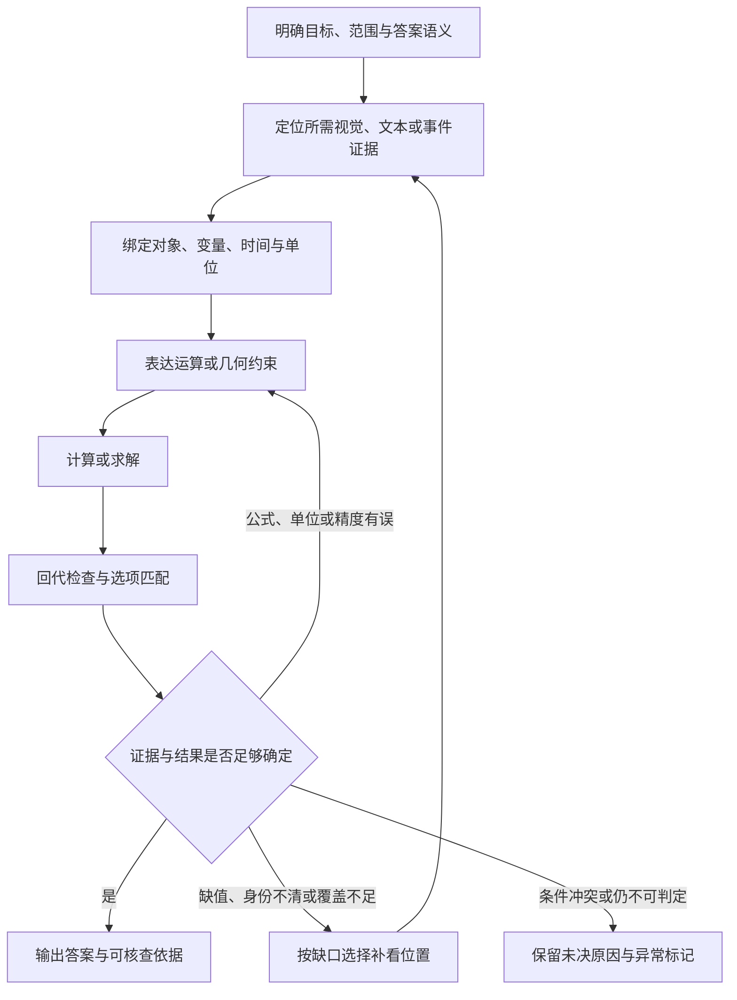

> 分类来源材料：保留原材料的设计语境；当前实现与验证状态请看 [运行文档](../pipelines/) 和 [发布验证](../validation.md)。

# R8：视觉符号与约束求解——题型特征、原题与 pipeline 讨论材料

整理日期：2026-09-08。分类基线：项目当前九类方案，benchmark_pipeline_reclassification_v04.xlsx。

**R8 的核心是：把视频中有来源的数值、符号和图形关系变成明确的变量与约束，再执行可以复算、可以检查的运算。** 难点往往出现在计算之前：究竟读到了哪个对象的值、属于哪个时间或阶段、单位是什么，以及这些值是否真的满足同一组条件。

本文覆盖工作簿中 **1 个默认 R8 入口和 4 个条件性涉及 R8 的入口**，整理 **30 道完整例题：24 道机制例题、6 道边界或标注异常例题**。每题保留原文、全部原始选项（开放数值题除外）、来源答案、中文题意和定位信息。附录收录 Video-MME-v2 / Numerical Calculation 标签下 **全部 106 道题的完整题干索引**。

**建议与导师讨论的主张：先把“证据读取—变量绑定—运算执行—结果核验”做成可检查的共用流程，再按原题需要增加几何约束、事件计数、集合覆盖或反事实条件。** 简单算术、日期加法与图形约束不必使用同等复杂的求解器；只提高算术能力，也不一定能解决看错商品、漏掉尝试或绑定错阶段的问题。

本次核对了工作簿、官方标注、EgoLife 论文原图及相关任务定义；四份标注和 EgoLife 正式论文的远端下载均与本地副本字节一致。**没有逐题观看完整视频，也没有运行模型实验。** 来源答案是 benchmark 标注；机制分组、证据需求和设计建议是本文分析。除论文明确展示条件的酸奶单价例题外，不能把下面的计算形式当作已经从视频恢复出的完整解题过程。

## 阅读导航

- [1. R8 定义、覆盖范围与九类边界](#definition)
- [2. 五组机制、共性特征与错误来源](#features)
- [3. 24 道机制例题](#examples)
- [4. 6 道边界与异常例题](#boundaries)
- [5. 可讨论的 pipeline 方案](#pipeline)
- [6. 实验设计与导师讨论清单](#experiments)
- [7. 附录：106 道完整题干索引](#all106)
- [8. 来源、版本与核验范围](#sources)

时间有限时先读第 1、2、5 节，再看 [E01 变量关系](#e01)、[E07 酸奶单价](#e07)、[E17 最少蜂蜜罐数](#e17)、[E18 分阶段收支](#e18)、[E23 成功率](#e23) 和 [B05 题干与选项冲突](#b05)。

## 1. R8 定义、覆盖范围与九类边界

### 1.1 项目已有定义

下表沿用分类工作簿的核心内容。[分类基线 F01](#f01)

| 维度 | 工作簿定义 |
| --- | --- |
| 名称 | 视觉符号与约束求解 |
| 核心证据状态 | 视觉／文本变量、公式、约束、单位和可复算的计算记录 |
| 控制流 | 读取证据 → 绑定变量与单位 → 构建约束 → 确定性计算／求解 → 代回验证 → 输出 |
| 停止条件 | 变量绑定、单位和结果回代均通过检查；不以语言直觉替代可精确执行的步骤 |
| 查询头／配置 | 数值计算；图形几何；价格／比例；公式关系；语义年代数值比较 |
| 硬边界 | 专业常识不自动属于符号求解；单纯读取一个数字仍可归 R1 |
| 旧策略来源 | P15 中的符号求解；P20 中需要算术的历史事实 |
| 实现注意 | 输入变量必须有证据来源，不能用答案反推中间变量 |

这里的“视觉符号”不只指黑板上的 x、y。价格标签、屏幕时间、比分、包装规格、几何图形的局部标注，以及从事件账本统计出的次数，都可能成为后续计算的输入。R8 的区别在于还要维护**这些输入的绑定关系和明确的计算语义**。

### 1.2 全部 5 个相关原生入口

“默认 R”是入口的默认路由，“代表题 R”是工作簿选中例题的判断，“条件候选”表示该入口可能覆盖的其他执行机制。三者不能混用，入口数量也不是样本数量。

| Source ID | Benchmark / 原生入口 | Excel 行 | 默认 R | 代表题 R | 条件候选 | 正文对应 |
| --- | --- | ---: | --- | --- | --- | --- |
| src.egolifeqa.entitylog | EgoLifeQA / EntityLog | 2 | R1 | R8 | R1 / R8 | [E07](#e07) |
| src.lvbench.key_information_retrieval | LVBench / Key Information Retrieval | 27 | R1 | R1 | R1 / R4 / R8 | [B01](#b01) |
| src.video_mme.temporal_perception | Video-MME / Temporal Perception | 86 | R3 | R1 | R1 / R3 / R8 | [B02](#b02) |
| src.video_mme_v2.numerical_calculation | Video-MME-v2 / Numerical Calculation | 109 | R8 | R8 | R8 | [E01](#e01)；E03、E05–E06、E08–E24；B03–B05 |
| src.video_mme_v2.professional_knowledge_acquisition | Video-MME-v2 / Professional Knowledge Acquisition | 111 | R6 | R8 | R1 / R6 / R8 | [E02](#e02)、[E04](#e04) |

只有 Numerical Calculation 是默认 R8。另四个入口包括历史实体回忆、关键文字检索、时间感知和专业知识：它们只有在实际问题需要计算或求解时才进入 R8。酸奶单价和矩形面积是工作簿已明确归入 R8 的代表题；片头年份、人类演化阶段则用于说明条件边界。

### 1.3 原始标签的规模与数据特征

对固定版本 test.parquet 直接统计，Numerical Calculation 有 106/3,200 道题，占 **3.3125%（约 3.31%）**，涉及 38 个不同 video_id 和 38 个视频 URL。105 道为 8 选 1，1 道为 3 选 1；group_type 中 logic 为 50 道、relevance 为 56 道；这 106 道的 level 均为 1、second_head 均为 Frame-Only。[固定标注 F02](#f02)

这些数字描述**官方原生标签**，不是逐题核验后的 R8 净题集，也不是 R8 在全部 benchmark 中的占比。原论文把 Numerical Calculation 放在读取视觉数值并运算的能力项中，但标签层级不能直接决定项目的抽帧与执行方式。[Video-MME-v2 论文，Appendix Table 4](https://arxiv.org/html/2604.05015v1)

- 命中率、阶段收支、第一件和第三件商品总价等题面仍要求时间或事件条件；不能因为 second_head=Frame-Only 就打乱帧顺序或只看一张图。
- B03 原生标签为 Numerical Calculation，题面却只是读取两个价格；B04 要修改成功规则；B05 的数量问法与百分比选项不一致。
- 362-3 与 362-4 的题干完全相同；本文保留两个不同 ID，不擅自合并为一题。
- 106 题中有 5 条记录含重复选项文本：202-3、202-4、228-3、415-3、782-3。E06 展示其中一例。它们的存在不意味着所有标注都无效，但会影响选项匹配和诊断统计。

### 1.4 放在九类体系中的位置

| 主类 | 项目名称 | 与 R8 的边界或可复用能力 |
| --- | --- | --- |
| R1 | 定向定位与局部取证 | 读一个年份、价格或已写出的答案；为 R8 提供带来源的值 |
| R2 | 连续动态与实体状态追踪 | 确认同一对象、状态变化和运动；为消灭率等查询提供跨时刻身份依据 |
| R3 | 事件账本与时序归约 | 记录尝试、命中、出现顺序和阶段；计算成功率之前先得到正确事件账本 |
| R4 | 清单构建与集合归约 | 构建完整商品清单或实例集合；总价、极值差等计算依赖正确覆盖与去重 |
| R5 | 分段全局综合 | 组织全局背景；精确价格和数值不能只保留在有损摘要中 |
| R6 | 证据约束关系推理 | 解释概念、原因和关系；一旦主目标是明确数学约束求解，则应进入 R8 |
| R7 | 假设与未来推演 | 管理事实与替代条件；可调用 R8 重算，但普通给定参数的算术不自动成为世界推演 |
| **R8** | **视觉符号与约束求解** | **绑定变量、公式、单位和约束，执行可复算运算并核验** |
| R9 | 空间场景建模与查询 | 从真实场景推定尺度、几何或拓扑；最后用乘法算面积也不等于主流程变成 R8 |

“主要由谁维护状态”和“调用哪些算子”是两层问题。R3/R4 可以直接提供基础归约结果，不能只因为程序出现加减乘除就把主类改为 R8。E19、E21、E23 刻意保留复合机制，便于讨论主路由与共享计算模块的分工。

### 1.5 六个实用边界问题

1. **答案是否已被视频明确写出或说出？** 若是，R1 可能足以完成；即便题面写“求面积”，也应核查是否存在直接取证路径。
2. **主要困难是枚举、去重或记录事件，还是把已取得的值组合成数学问题？** 前者通常由 R3/R4 维护主体状态，后者才凸显 R8。
3. **“最早”指视频里最先出现，还是内容中的年代？** 前者是事件顺序；后者可能是明示事实，也可能需要比较带公元前后等语义的日期。
4. **“if”是给定参数，还是改变事实世界或评价规则？** “还差 48 分钟开课”“需要 280g 蜂蜜”可以只是确定性运算；修改“碰杯也算成功”需显式保存原判定与替代判定。
5. **几何条件是图中明示的数学约束，还是要从相机视角估计真实空间？** 图形面积适合 R8；真实房间尺度通常以 R9 为主。
6. **“Symbolic”指形式符号还是隐喻？** Video-MME-v2 的 Symbolic/Metaphorical Interpretation 主要是语义解释入口，不能因为名称含 Symbolic 就当成 R8 的形式约束求解。

## 2. 五组机制、共性特征与错误来源

### 2.1 五组内部机制

S1–S5 是本文组织例题的分析分组，不修改 R1–R9，也不预设建设五套独立 agent。

| 组别 | 典型问题 | 必须维护的内容 | 主要操作 | 例题 |
| --- | --- | --- | --- | --- |
| S1 符号与几何约束 | x 与 b 的关系、矩形面积、最小图形的最短边 | 符号身份、点线面关系、已知与未知、定理条件、单位 | 约束表达、代数求解、几何关系计算、排序后再查询 | E01–E06 |
| S2 价格、比例与平均值 | 单价、均价差、折扣、等价购买量、价格占比 | 商品／套餐身份、规格、价格角色、币种、分组、分母 | 除法、均值、差值、整数购买量、比例 | E07–E12 |
| S3 数字结构、日期、时间与单位换算 | 数位和、倒计时、日期加法、最少罐数 | 原始字符串、格式、单位、日历语义、离散数量约束 | 字符解析、时间换算、日历运算、向上取整 | E13–E17 |
| S4 分阶段收支与跨片段聚合 | 各阶段盈亏、最贵与最便宜之差、第一和第三件总价 | 参与者、收支方向、阶段、完整商品集合、顺序 | 余额或现金流计算、极值差、按序选取后求和 | E18–E20 |
| S5 数量差与成功率 | 消灭率、跨关卡数量差、命中率差 | 关卡／玩家身份、观察区间、初始与剩余数、尝试与成功 | 集合／事件统计、差分、比例、百分点比较 | E21–E24 |

同组内部的证据成本可以相差很大。E10 可能只需读同一张标签上的原价和现价；E23 可能必须看完指定关卡的全部尝试，最后的除法才是很小的一步。

### 2.2 变量必须绑定到对象、角色和阶段

一个裸数值不构成足够的计算证据。用于讨论的最小记录至少应能回答：**谁的值、是什么量、何时有效、单位是什么、从哪里取得、是否存在另一种读法**。

| 要保留的信息 | 少了它会发生什么 | 原题锚点 |
| --- | --- | --- |
| 对象或区域身份 | 茶壶价格绑定到旁边果酱罐；最小图形与最短边来自不同对象 | E09、E06 |
| 数值的角色 | 把原价、现价、折扣金额当成同一字段 | E10 |
| 视频时间与内容时间 | 用播放位置替代包装日期；跨关卡借用错误初始数 | E15、E22 |
| 单位与规格 | 整包价格被当作单杯价格；罐数忽略每罐克重 | E07、E17 |
| 来源位置与原始文本 | 无法回看被误读的小数点、字母或日期格式 | E01、E13、E15 |
| 观察／题设／派生的身份 | 把题设 48 分钟说成屏幕显示，把计算结果当作原始观察 | E16、B04 |

这一记录可以先是小表，不必先引入复杂知识图谱。对有依赖的查询，关键是保留数值的来历与父输入，避免后续推理悄悄覆盖原证据。

### 2.3 找到局部证据与证明覆盖充分是两种任务

- **局部读取型：** 指定标签或控制面板足以提供全部输入，例如 E10、E14。适合定位后用高分辨率复看。
- **多点绑定型：** 四个商品或两个阶段各有输入，例如 E09、E22。需要将多个位置的值绑定成同一问题的变量表。
- **覆盖依赖型：** E19 的最高／最低价格要覆盖指定片段所有符合条件的商品；E23 的成功率需要覆盖全部相关尝试。只找到两件商品或几次命中，不能证明已经取得极值或分母。

可以把视频检索与公式执行共享，但不能给这三种任务使用完全相同的停止标准。

### 2.4 运算语义要比“加减乘除”更明确

| 语义差异 | 应明确的规则 | 例题 |
| --- | --- | --- |
| 均值与总价 | 平均的是几个可比较的价格条目；套餐是否整体计作一项 | E08、E09 |
| 可以购买与满足需求 | 有限预算下的整件数量通常向下取整；满足克重需求的最少罐数向上取整 | E11、E17 |
| 消灭率与保留率 | 分别对应减少数量／初始数量、剩余数量／初始数量 | E21 |
| 比率差与相对增长 | 两个命中率相减是百分点差；除以基准率才是相对百分比变化 | E24 |
| 阶段变动与累计余额 | 每阶段现金流、阶段末余额和经济收益不能混记 | E18 |
| 日期与整数 | 跨月、闰日和格式属于日历语义，不能只对日期字符串中的“日”加 10 | E15 |
| 内容年代与出现顺序 | 公元前数字大小、距今年数与视频时间戳不是同一排序尺度 | B02 |

公式只在输入口径已明确时有意义。例如 success/attempts 无法自己决定一次失败是否应计入分母，也不能修复识别错的成功事件。

### 2.5 约束、精度与回代各有用途

对几何题，要先验证题目图中确实支持所用的共线、垂直、相似、面积分割等关系。视觉上“看起来差不多”不能作为精确等长或直角条件；也不能因为选项答案为 24 就构造一组乘积为 24 的边长。

对数值题，保留原始精度并在最后按题目要求近似。E05 的候选相邻只差 0.01，早一步舍入就可能改变选项；金额计算还应避免把二进制浮点误差误当作真实价格差。

回代包括两个层面：**计算是否满足已建立的约束；约束的输入是否确实由视频支持。** 在一组读错的数值上代回成功，只证明内部计算自洽，不能证明读取正确。E18 可检查交易方向和金额守恒，E17 可检查所选罐数足够且少一罐不足，但这些检查仍依赖原始条件。

### 2.6 原题与选项也需要审查

E06 的 C、G 均为 2.6；E15 的干扰项含不存在的 9 月 31 日；B05 的题干问箭数、选项却全是百分比。三者需要不同处理：重复文本要保留原位置，非法日期可作候选有效性检查，题干和答案类型冲突则应记录为需要人工复核的异常。

异常标记不能成为偷看答案的理由。选项可以帮助理解所求的表达形式，但不能据此补写原视频中未观察到的数值。完整题库索引保留原题 ID；机制诊断可以另报去重或异常子集，正式评测仍应遵守原协议。

### 2.7 便于实验归因的错误分类

| 错误发生处 | 具体表现 | 优先补救 |
| --- | --- | --- |
| 题意与范围 | 错选玩家、阶段、目标区域或比率含义 | 回查题干限定及观察区间 |
| 检索与覆盖 | 没找到目标标签、漏商品、漏尝试 | 定向补看或扩大指定区间覆盖 |
| 感知识别 | 小数点、字符、价格、命中事件识别错误 | 高分辨率裁剪或连续短片段复看 |
| 变量绑定 | 数值正确，但对应错对象、旧状态或分母 | 检查身份、角色和时间键 |
| 建模 | 均值分组、阶段收益定义或几何约束错误 | 审查计算式与适用条件 |
| 执行 | 算术、日历、单位、取整错误 | 使用确定性运算并复算 |
| 输出匹配 | 提前舍入、正负方向相反、重复选项映射错误 | 结果规范化与候选核验 |
| 数据问题 | 题干／选项冲突、同文重复、证据不足 | 保留异常并独立报告 |

## 3. 24 道机制例题

以下选择尽量覆盖不同执行需求，不按某一原生标签整体认定为“纯 R8”。24 道中有 23 道来自 Video-MME-v2（其中 21 道 Numerical Calculation、2 道 Professional Knowledge Acquisition），另 1 道是 EgoLifeQA 论文原例。完整英文选项与来源答案保持原顺序；中文题意和逐题分析用于讨论，不替换原始标注。

| 编号 | 主题 | 来源定位 | 分组 |
| --- | --- | --- | --- |
| [E01](#e01) | x 与 b 的关系：从图中条件到符号约束 | Video-MME-v2 / 005-1 | S1 符号与几何约束 |
| [E02](#e02) | 整个矩形面积：专业知识入口中的 R8 | Video-MME-v2 / 005-3 | S1 符号与几何约束 |
| [E03](#e03) | 线段 EG 的长度：点名与几何关系绑定 | Video-MME-v2 / 007-1 | S1 符号与几何约束 |
| [E04](#e04) | 红色矩形面积：目标区域与分割关系 | Video-MME-v2 / 052-4 | S1 符号与几何约束 |
| [E05](#e05) | 最小与最大三角形的面积差：排序与精度 | Video-MME-v2 / 414-3 | S1 符号与几何约束 |
| [E06](#e06) | 最小图形的最短边：两层查询与重复选项 | Video-MME-v2 / 415-3 | S1 符号与几何约束 |
| [E07](#e07) | 19.9 元买 6 杯酸奶：检索后计算单价 | EgoLifeQA / Fig.5 EntityLog | S2 价格、比例与平均值 |
| [E08](#e08) | 青柠与橙子的平均价格：分组与单位口径 | Video-MME-v2 / 202-2 | S2 价格、比例与平均值 |
| [E09](#e09) | 两组商品的均价差：四项读数与集合身份 | Video-MME-v2 / 203-4 | S2 价格、比例与平均值 |
| [E10](#e10) | 拖把套装降价多少：原价与现价的角色 | Video-MME-v2 / 273-2 | S2 价格、比例与平均值 |
| [E11](#e11) | 玩具价格能买几盒蛋糕：实体检索与整数购买量 | Video-MME-v2 / 273-3 | S2 价格、比例与平均值 |
| [E12](#e12) | 单件价格占购物总额的比例：跨位置分母绑定 | Video-MME-v2 / 273-4 | S2 价格、比例与平均值 |
| [E13](#e13) | 蜡烛标签的数位和：原始字符串不能提前丢失 | Video-MME-v2 / 274-1 | S3 数字结构、日期、时间与单位换算 |
| [E14](#e14) | 洗碗机倒计时：小时与分钟的换算 | Video-MME-v2 / 274-2 | S3 数字结构、日期、时间与单位换算 |
| [E15](#e15) | 饼干盒日期加 10 天：日历语义与非法候选 | Video-MME-v2 / 271-3 | S3 数字结构、日期、时间与单位换算 |
| [E16](#e16) | 距上课还差 48 分钟：给定参数的时间运算 | Video-MME-v2 / 271-4 | S3 数字结构、日期、时间与单位换算 |
| [E17](#e17) | 需要 280g 蜂蜜：最少罐数与向上取整 | Video-MME-v2 / 274-4 | S3 数字结构、日期、时间与单位换算 |
| [E18](#e18) | 顾客与理发师的分阶段收支：事件账本上的数值推理 | Video-MME-v2 / 035-3 | S4 分阶段收支与跨片段聚合 |
| [E19](#e19) | 最贵与最便宜商品的价差：计算之前先保证集合覆盖 | Video-MME-v2 / 275-1 | S4 分阶段收支与跨片段聚合 |
| [E20](#e20) | 第一件与第三件商品的总价：先排序，再绑定价格 | Video-MME-v2 / 275-2 | S4 分阶段收支与跨片段聚合 |
| [E21](#e21) | 绿猪消灭率：初始集合与时间锚点 | Video-MME-v2 / 162-1 | S5 数量差与成功率 |
| [E22](#e22) | 晴天与夜间两个子关卡的数量差：范围键比跟踪更重要 | Video-MME-v2 / 196-4 | S5 数量差与成功率 |
| [E23](#e23) | 打气球挑战的成功率：分母必须包含失败 | Video-MME-v2 / 443-1 | S5 数量差与成功率 |
| [E24](#e24) | 两台机器的命中率差：身份、截止点与百分点 | Video-MME-v2 / 782-4 | S5 数量差与成功率 |

### E01　x 与 b 的关系：从图中条件到符号约束

**来源与定位：** Video-MME-v2；test.parquet，question_id=005-1，video_id=005；原生标签 Numerical Calculation。[原始来源](https://huggingface.co/datasets/MME-Benchmarks/Video-MME-v2/resolve/6e4bebb03202e1ddbf3d37703e560e51c5aa2d64/test.parquet)；[版本与校验 F02](#f02)。

**原视频链接：** [video_id=005](https://www.youtube.com/watch?v=xrx6cB7Thbw)。链接来自标注，本次未验证播放可用性。

**分类与子型：** 工作簿 Numerical Calculation 默认 R8，且本题是该入口代表题。若关系已在讲解中明确写出，则仍需记录可能的 R1 直接取证路径。 分组：S1 符号与几何约束。

**中文题意：** x 与 b 之间是什么关系？候选关系按原文写为 Xb 等于不同常数。

**英文原题：**

> What is the relationship between x and b?

**原始选项：**

- A. Xb=2.
- B. Xb=6.
- C. Xb=1.
- D. Xb=7.
- E. Xb=3.
- F. Xb=8.
- G. Xb=5.
- H. Xb=4.

**来源答案：B。** Xb=6.

**最小证据需求：**

- 定位含 x、b 的原始图形或公式，读取全部相关标注，确认字母属于线段、区域还是独立变量。
- 保存约束对应的图形位置及出现阶段，核对题干 x 与选项 Xb 的记法，不把相邻子题答案当作已知条件。

**求解或边界分析：** 需要先把视觉条件变成可核验的符号关系，再判断哪一候选成立。选项 B 的 Xb=6 是来源答案，不足以恢复图形、系数或推导过程；本文不凭这个结果补写中间条件。

**主要易错点：** 直接把看到的数字凑成 6；忽略大小写和相乘记法；使用同视频其他问题的金标准答案来补足变量。

**pipeline 讨论点：** 最小中间表示是否只需变量表与约束列表？应怎样检查每条约束都能指回图中标注，而不是由语言模型自行添加？

**原文与标注说明：** 保留原选项 Xb 的大小写与拼写，不擅自改写为某个标准代数表达式。

**核验说明：** 已核对固定版本题干、原选项顺序、答案键、URL 和原生标签。源字段：level=1，second_head=Frame-Only，group_type=logic，group_structure=[[1,2],3,4]。未观看原视频。

### E02　整个矩形面积：专业知识入口中的 R8

**来源与定位：** Video-MME-v2；test.parquet，question_id=005-3，video_id=005；原生标签 Professional Knowledge Acquisition。[原始来源](https://huggingface.co/datasets/MME-Benchmarks/Video-MME-v2/resolve/6e4bebb03202e1ddbf3d37703e560e51c5aa2d64/test.parquet)；[版本与校验 F02](#f02)。

**原视频链接：** [video_id=005](https://www.youtube.com/watch?v=xrx6cB7Thbw)。链接来自标注，本次未验证播放可用性。

**分类与子型：** 原生标签 Professional Knowledge Acquisition 默认 R6，但工作簿将这道代表题归为 R8。所需主操作是图形条件读取与面积求解。 分组：S1 符号与几何约束。

**中文题意：** 整个矩形的面积是多少？

**英文原题：**

> What is the area of the entire rectangle?

**原始选项：**

- A. 18.
- B. 26.
- C. 28.
- D. 24.
- E. 16.
- F. 20.
- G. 22.
- H. 14.

**来源答案：D。** 24.

**最小证据需求：**

- 确认整个矩形的边界、内部划分和给定长度／面积，区分全图与局部区域。
- 检查视频是否已明示总面积；若需推导，保留每个约束的来源以及适用的几何条件。

**求解或边界分析：** 与 E01 同属 video_id=005，源数据 group_structure=[[1,2],3,4]。这提示可研究共用图形证据，但分组元数据不能授权把 005-1 或 005-2 的参考答案喂给本题。来源答案为 24，现有题目字段不足以据此推断矩形长宽。

**主要易错点：** 把整类专业知识题都送给常识问答；根据 24 人为构造 6×4；混用中间区域与整个矩形的面积。

**pipeline 讨论点：** 共用证据后，各子题是否独立计算并相互检查？如何区分合法的模型自生成中间结果与禁止使用的参考答案？

**核验说明：** 已核对固定版本题干、原选项顺序、答案键、URL 和原生标签。源字段：level=3，second_head=Video-Based Knowledge Acquisition，group_type=logic，group_structure=[[1,2],3,4]。未观看原视频。

### E03　线段 EG 的长度：点名与几何关系绑定

**来源与定位：** Video-MME-v2；test.parquet，question_id=007-1，video_id=007；原生标签 Numerical Calculation。[原始来源](https://huggingface.co/datasets/MME-Benchmarks/Video-MME-v2/resolve/6e4bebb03202e1ddbf3d37703e560e51c5aa2d64/test.parquet)；[版本与校验 F02](#f02)。

**原视频链接：** [video_id=007](https://www.youtube.com/watch?v=if6bxEFxkTY)。链接来自标注，本次未验证播放可用性。

**分类与子型：** 原生 Numerical Calculation；候选 R8，重点是几何对象与约束的正确绑定。 分组：S1 符号与几何约束。

**中文题意：** 线段 EG 的长度是多少？

**英文原题：**

> What is the length of line segment EG?

**原始选项：**

- A. 7.
- B. 8.
- C. 6.
- D. 5.
- E. R.
- F. 9.
- G. 4.
- H. 3.

**来源答案：D。** 5.

**最小证据需求：**

- 识别 E、G 两个端点及连接线，读取相关长度、交点与几何关系。
- 核对字母遮挡、相似字形及辅助线，确认用于计算的关系是已给条件或有依据的推论。

**求解或边界分析：** 先得到目标线段和足够的条件，再使用适用的几何关系求长度。题面本身没有给出完整图形；答案 5 不能证明曾观察到哪些线段，也不能倒推出应使用哪条定理。

**主要易错点：** 把相邻线段当成 EG；从图形外观猜测等长或直角；忽略非数值候选并自行修正数据。

**pipeline 讨论点：** 当文本识别正确但端点绑定不确定时，补看对象应是整个图形的局部结构，而不是只把数字裁剪得更清楚。

**原文与标注说明：** 原选项 E 为 R.，照录；没有证据将其认定为排版错误或改成某个数值。

**核验说明：** 已核对固定版本题干、原选项顺序、答案键、URL 和原生标签。源字段：level=1，second_head=Frame-Only，group_type=logic，group_structure=[[1,2],3,4]。未观看原视频。

### E04　红色矩形面积：目标区域与分割关系

**来源与定位：** Video-MME-v2；test.parquet，question_id=052-4，video_id=052；原生标签 Professional Knowledge Acquisition。[原始来源](https://huggingface.co/datasets/MME-Benchmarks/Video-MME-v2/resolve/6e4bebb03202e1ddbf3d37703e560e51c5aa2d64/test.parquet)；[版本与校验 F02](#f02)。

**原视频链接：** [video_id=052](https://www.youtube.com/watch?v=9_rbNrtKmoE)。链接来自标注，本次未验证播放可用性。

**分类与子型：** 原生 Professional Knowledge Acquisition，入口允许 R1／R6／R8；按题面属于 R8 几何求解候选，需视频确认是否直接公布答案。 分组：S1 符号与几何约束。

**中文题意：** 红色矩形的面积是多少？

**英文原题：**

> What is the area of the red rectangle?

**原始选项：**

- A. 10.
- B. 12.
- C. 2.
- D. 6.
- E. 8.
- F. 5.
- G. 4.
- H. 7.

**来源答案：A。** 10.

**最小证据需求：**

- 绑定红色区域的实际边界和相邻矩形，读取图中已知边长或面积。
- 核查图形是否在演示中变形或替换，避免把不同阶段的条件合并为一张不存在的图。

**求解或边界分析：** 此类题可能先由面积或共边条件求边长，再计算目标区域；具体步骤取决于原图。来源答案为 10，本文只提出需要验证的条件，不据此构造边长。

**主要易错点：** 把颜色识别当成解题完成；混用整图与红色区域；跨阶段拼接互不兼容的面积条件。

**pipeline 讨论点：** 图形条件表是否需要版本或时间标记？如果最终板书已给出答案，如何在机制实验中另外记录这条直接读取路径？

**核验说明：** 已核对固定版本题干、原选项顺序、答案键、URL 和原生标签。源字段：level=3，second_head=Video-Based Knowledge Acquisition，group_type=logic，group_structure=[1,2,3,4]。未观看原视频。

### E05　最小与最大三角形的面积差：排序与精度

**来源与定位：** Video-MME-v2；test.parquet，question_id=414-3，video_id=414；原生标签 Numerical Calculation。[原始来源](https://huggingface.co/datasets/MME-Benchmarks/Video-MME-v2/resolve/6e4bebb03202e1ddbf3d37703e560e51c5aa2d64/test.parquet)；[版本与校验 F02](#f02)。

**原视频链接：** [video_id=414](https://www.youtube.com/watch?v=lVyXrPbh6nk)。链接来自标注，本次未验证播放可用性。

**分类与子型：** 原生 Numerical Calculation；R8 约束求解、面积比较与近似匹配的组合。 分组：S1 符号与几何约束。

**中文题意：** 嵌入的正方形将大三角形分为三个较小三角形。最小与最大三角形的面积之差，最接近哪个数？

**英文原题：**

> The embedded square in the video divides the large triangle into three smaller triangles. Which of the following numbers is closest to the difference between the area of the smallest triangle and the area of the largest triangle?

**原始选项：**

- A. 1.18.
- B. 1.19.
- C. 1.13.
- D. 1.17.
- E. 1.16.
- F. 1.14.
- G. 1.12.
- H. 1.15.

**来源答案：G。** 1.12.

**最小证据需求：**

- 读取大三角形、嵌入正方形和三个子三角形的连接关系与已知尺寸。
- 明确所有候选区域并计算或约束其面积；保留足够精度，直到选择最接近的候选。

**求解或边界分析：** 可讨论的执行形式是先求三个面积，再取最大与最小的非负差；不能只凭视觉大小排序。候选相邻间隔为 0.01，来源答案 G=1.12，适合检验中间舍入是否改变最近选项。题目条件未在元数据中展开，因此不能给出已验证的数值推导。

**主要易错点：** 按画面像素面积选最小图形；只算两个区域而漏掉第三个；早一步保留两位小数导致答案偏移。

**pipeline 讨论点：** 求解结果是否应保留精确形式或数值区间？若读取精度不足以区分相邻选项，应优先补读哪个长度或角度？

**核验说明：** 已核对固定版本题干、原选项顺序、答案键、URL 和原生标签。源字段：level=1，second_head=Frame-Only，group_type=logic，group_structure=[1,2,3,4]。未观看原视频。

### E06　最小图形的最短边：两层查询与重复选项

**来源与定位：** Video-MME-v2；test.parquet，question_id=415-3，video_id=415；原生标签 Numerical Calculation。[原始来源](https://huggingface.co/datasets/MME-Benchmarks/Video-MME-v2/resolve/6e4bebb03202e1ddbf3d37703e560e51c5aa2d64/test.parquet)；[版本与校验 F02](#f02)。

**原视频链接：** [video_id=415](https://www.youtube.com/watch?v=lLYkhq5lV3I)。链接来自标注，本次未验证播放可用性。

**分类与子型：** 原生 Numerical Calculation；R8，包含先选区域、再查该区域属性的嵌套操作。 分组：S1 符号与几何约束。

**中文题意：** 视频开头图形的红色区域之外还有若干独立图形。面积最小的那个图形，其最短边有多长？

**英文原题：**

> Regarding the shape shown at the very beginning of the video: the area outside the red region consists of several distinct shapes. What is the length of the shortest side of the shape with the smallest area?

**原始选项：**

- A. None of the others.
- B. 2.4.
- C. 2.6.
- D. 0.4.
- E. 1.4.
- F. 1.6.
- G. 2.6.
- H. 0.6.

**来源答案：B。** 2.4.

**最小证据需求：**

- 固定视频开头的图形版本，列出红色区域之外各个独立区域及其边界。
- 依据图中条件比较区域面积，绑定面积最小的区域后，再求其各边长度并取最短边。

**求解或边界分析：** 目标是 min_side(argmin_area(regions))；它通常不等于所有区域所有边中的最小值。区域枚举与几何求解共同约束答案，不能只定位红色部分就结束。来源答案 B=2.4；C、G 的候选文字同为 2.6，原顺序必须保留。

**主要易错点：** 把两层最小值查询压成一次排序；遗漏红色区域外的一块图形；去重选项后导致标签错位。

**pipeline 讨论点：** 候选归约是否保存对象身份而不仅返回一个数？结果匹配遇到重复候选时，如何保留原标签并报告歧义？

**原文与标注说明：** C. 2.6. 与 G. 2.6. 是原数据中的重复选项，照录，不重新编号。

**核验说明：** 已核对固定版本题干、原选项顺序、答案键、URL 和原生标签。源字段：level=1，second_head=Frame-Only，group_type=logic，group_structure=[1,2,3,4]。未观看原视频。

### E07　19.9 元买 6 杯酸奶：检索后计算单价

**来源与定位：** EgoLifeQA；CVPR 2025 正式论文，Fig.5，PDF 第 6 页／会议页码 28890，EntityLog 面板；图中无独立 question_id。[原始来源](https://openaccess.thecvf.com/content/CVPR2025/papers/Yang_EgoLife_Towards_Egocentric_Life_Assistant_CVPR_2025_paper.pdf#page=6)；[版本与校验 F06](#f06)。

**分类与子型：** EgoLifeQA / EntityLog 默认 R1，但工作簿代表题为 R8：找到历史价格后还需单位换算和最近价格匹配。 分组：S2 价格、比例与平均值。

**中文题意：** 我们买一杯酸奶花的钱，最接近下面哪个价格？

**英文原题：**

> Which price is closest to what we paid for one yogurt?

**原始选项：**

- A. RMB 2
- B. RMB 3
- C. RMB 4
- D. RMB 5

**来源答案：B。** RMB 3

**最小证据需求：**

- 论文 Fig.5 显示提问时刻为第 4 天 11:34:05.400，关联证据在第 3 天 17:00:04.450。
- 图中明确给出促销总价 19.9 元、数量 6 杯，并标出答案 B；这两项输入有论文原图依据。

**求解或边界分析：** 可以复算：单价=19.9÷6=3.3166… 元／杯。与 2、3、4、5 元的距离分别约为 1.3167、0.3167、0.6833、1.6833，最近的是 3 元，对应 B。原图展示的是支持证据，不表示本文观看了那段购物视频。

**主要易错点：** 检索到 19.9 就直接匹配价格；把一组 6 杯当作单杯；使用提问之后的新价格；为了得到 B 反推总价。

**pipeline 讨论点：** R1 检索模块能否输出价格、杯数、历史时间和来源位置，再由 R8 独立复算？这道题适合作为最小流程的说明样例。

**原文与标注说明：** 论文图中未给独立数据集 question_id；以正式论文 Fig.5 的 EntityLog 面板和两个时间戳定位，不虚构样本 ID。

**核验说明：** 已目视核对正式论文 Fig.5 的题干、四项候选、答案 B、两个时间戳及 19.9 元／6 杯证据；远端正式 PDF 与用于原图核查的本地文件 SHA-256 一致。未观看原购物视频。

### E08　青柠与橙子的平均价格：分组与单位口径

**来源与定位：** Video-MME-v2；test.parquet，question_id=202-2，video_id=202；原生标签 Numerical Calculation。[原始来源](https://huggingface.co/datasets/MME-Benchmarks/Video-MME-v2/resolve/6e4bebb03202e1ddbf3d37703e560e51c5aa2d64/test.parquet)；[版本与校验 F02](#f02)。

**原视频链接：** [video_id=202](https://www.youtube.com/watch?v=viDi-_yGtvQ)。链接来自标注，本次未验证播放可用性。

**分类与子型：** 原生 Numerical Calculation；R8 多对象读数后的均值计算。 分组：S2 价格、比例与平均值。

**中文题意：** 青柠和橙子的平均价格是多少？

**英文原题：**

> What is the average price of the limes and oranges?

**原始选项：**

- A. $1.49.
- B. $0.98.
- C. $0.89.
- D. $0.99.
- E. $0.84.
- F. $0.79.
- G. $0.80.
- H. $1.60.

**来源答案：E。** $0.84.

**最小证据需求：**

- 分别定位青柠和橙子的价格标签，核对标签属于哪一种商品。
- 记录每个价格的规格、计价单位与币种，确认所求是两个显示价格的算术平均，而非按重量或数量加权的均价。

**求解或边界分析：** 若两个条目就是题目规定的价格，执行 (p_lime+p_orange)/2。运算简单，但错误商品、单件／整包混淆都会产生看似合理的结果。来源答案为 $0.84；当前题目字段没有两项原价，不能据此反造输入。

**主要易错点：** 仅按水果颜色绑定；把每磅价与每件价混用；求总价后忘记除以两个条目。

**pipeline 讨论点：** 均值前是否要求显式列出成员与计价单位？何时应保留显示价格原口径，何时需要先作单位转换？

**核验说明：** 已核对固定版本题干、原选项顺序、答案键、URL 和原生标签。源字段：level=1，second_head=Frame-Only，group_type=logic，group_structure=[1,[2,3],4]。未观看原视频。

### E09　两组商品的均价差：四项读数与集合身份

**来源与定位：** Video-MME-v2；test.parquet，question_id=203-4，video_id=203；原生标签 Numerical Calculation。[原始来源](https://huggingface.co/datasets/MME-Benchmarks/Video-MME-v2/resolve/6e4bebb03202e1ddbf3d37703e560e51c5aa2d64/test.parquet)；[版本与校验 F02](#f02)。

**原视频链接：** [video_id=203](https://www.youtube.com/watch?v=6vmxIv5wNg8)。链接来自标注，本次未验证播放可用性。

**分类与子型：** 原生 Numerical Calculation；R8，需多点取证、两组成员绑定及有方向的均值差。 分组：S2 价格、比例与平均值。

**中文题意：** 白色陶瓷茶壶与蜂蜜果酱罐套装的平均价格，相比水彩颜料套装与绿色可调台灯的平均价格，高或低多少？

**英文原题：**

> In the video, how does the average price of the "white ceramic teapot and honey jam jar set" compare to the average price of the "watercolor paint set and green adjustable desk lamp"?

**原始选项：**

- A. The average price of the former is $5.00 less than the latter.
- B. The average price of the former is $2.50 more than the latter.
- C. The average price of the former is $12.50 more than the latter.
- D. The average price of the former is $3.75 more than the latter.
- E. The average price of the former is $5.00 more than the latter.
- F. The average price of the former is $3.75 less than the latter.
- G. The average price of the former is $2.50 less than the latter.
- H. The average price of the former is $12.50 less than the latter.

**来源答案：A。** The average price of the former is $5.00 less than the latter.

**最小证据需求：**

- 分别读取茶壶、蜂蜜果酱罐套装、水彩颜料套装、绿色可调台灯的对应价格。
- 保留套餐整体与内部物品的区别，确认前后两组各由题目指定的两个价格条目构成。

**求解或边界分析：** 可表示为 d=(p_teapot+p_jar_set)/2−(p_paint_set+p_lamp)/2，再根据 d 的符号表达高或低。来源选项 A 表示前者比后者低 5 美元；这不是已经读取出的四项价格。

**主要易错点：** 将套装内部的多个物品当成多个均值成员；两组数据混排；算对绝对差却说反高低方向。

**pipeline 讨论点：** 计算模块是否应同时返回分组成员、各组均值和有符号差值，使候选匹配可以检查方向？

**核验说明：** 已核对固定版本题干、原选项顺序、答案键、URL 和原生标签。源字段：level=1，second_head=Frame-Only，group_type=logic，group_structure=[1,[2,3],4]。未观看原视频。

### E10　拖把套装降价多少：原价与现价的角色

**来源与定位：** Video-MME-v2；test.parquet，question_id=273-2，video_id=273；原生标签 Numerical Calculation。[原始来源](https://huggingface.co/datasets/MME-Benchmarks/Video-MME-v2/resolve/6e4bebb03202e1ddbf3d37703e560e51c5aa2d64/test.parquet)；[版本与校验 F02](#f02)。

**原视频链接：** [video_id=273](https://www.youtube.com/watch?v=mYmhCZclLOk)。链接来自标注，本次未验证播放可用性。

**分类与子型：** 原生 Numerical Calculation；R8 局部取证后的差值计算，是轻量流程候选。 分组：S2 价格、比例与平均值。

**中文题意：** 按窗上贴纸的信息，打折后的 Vileda Turbo Smart 拖把套装，现价比原价便宜多少英镑？

**英文原题：**

> The video shows a discounted "Vileda Turbo Smart" mop set. According to the information on the window sticker, how much cheaper is the current price compared to the original price in British Pounds (£)?

**原始选项：**

- A. 11.
- B. 12.
- C. 10.
- D. 14.
- E. 15.
- F. 16.
- G. 13.
- H. 9.

**来源答案：A。** 11.

**最小证据需求：**

- 定位指定拖把套装的促销贴纸，读取原价和现价。
- 辨别划线旧价、新价、节省金额或折扣比例的视觉角色，核对币种。

**求解或边界分析：** 目标是 original_price−current_price，输出英镑金额，不是折扣率。若标签已直接写出节省 11 英镑，可能有 R1 路径；若只给两项价格，需执行差值。来源答案 A=11，本次没有确认哪条视觉路径实际存在。

**主要易错点：** 把 11% 与 11 英镑混淆；交换旧价与新价；读取旁边另一套商品的价格。

**pipeline 讨论点：** 对于两数相减，结构化读取加计算工具是否足够？是否值得单独统计直接显示差额与必须重算的两类样本？

**核验说明：** 已核对固定版本题干、原选项顺序、答案键、URL 和原生标签。源字段：level=1，second_head=Frame-Only，group_type=relevance，group_structure=4。未观看原视频。

### E11　玩具价格能买几盒蛋糕：实体检索与整数购买量

**来源与定位：** Video-MME-v2；test.parquet，question_id=273-3，video_id=273；原生标签 Numerical Calculation。[原始来源](https://huggingface.co/datasets/MME-Benchmarks/Video-MME-v2/resolve/6e4bebb03202e1ddbf3d37703e560e51c5aa2d64/test.parquet)；[版本与校验 F02](#f02)。

**原视频链接：** [video_id=273](https://www.youtube.com/watch?v=mYmhCZclLOk)。链接来自标注，本次未验证播放可用性。

**分类与子型：** 原生 Numerical Calculation；R8 与 R1／R3 的实体及顺序定位组合。 分组：S2 价格、比例与平均值。

**中文题意：** 用 Ralph 进店后首先拿起的红绿飞盘接球玩具的价格，可以买多少盒父亲随后拿起的 Jaffa Cakes？

**英文原题：**

> How many boxes of "Jaffa Cakes" (subsequently picked up by the father) can be purchased for the price of the red and green frisbee catching toy that Ralph first picked up after entering the store?

**原始选项：**

- A. 2 boxes.
- B. 9 boxes.
- C. 3 boxes.
- D. 7 boxes.
- E. 6 boxes.
- F. 5 boxes.
- G. 4 boxes.
- H. 8 boxes.

**来源答案：A。** 2 boxes.

**最小证据需求：**

- 借助人物、颜色和首先拿起的动作定位玩具，再定位父亲随后拿起的指定蛋糕盒。
- 读取两件商品的价格与规格，确认计算单位是整盒，且没有额外购买规则。

**求解或边界分析：** 在普通整盒购买且无额外优惠的条件下，数量为 floor(p_toy/p_cake_box)。应先看比值是否为整数，不能默认所有这类题都需要截断；可购买数量必须同时满足预算与再买一盒会超预算。来源答案是 2 盒。

**主要易错点：** 拿错同品牌规格；忽略首先／随后等指代；对可以买多少盒使用四舍五入，得到超预算数量。

**pipeline 讨论点：** R3 负责目标的出现顺序，R8 负责价格比与整数约束；两者交换的信息是否已足以防止商品错配？

**核验说明：** 已核对固定版本题干、原选项顺序、答案键、URL 和原生标签。源字段：level=1，second_head=Frame-Only，group_type=relevance，group_structure=4。未观看原视频。

### E12　单件价格占购物总额的比例：跨位置分母绑定

**来源与定位：** Video-MME-v2；test.parquet，question_id=273-4，video_id=273；原生标签 Numerical Calculation。[原始来源](https://huggingface.co/datasets/MME-Benchmarks/Video-MME-v2/resolve/6e4bebb03202e1ddbf3d37703e560e51c5aa2d64/test.parquet)；[版本与校验 F02](#f02)。

**原视频链接：** [video_id=273](https://www.youtube.com/watch?v=mYmhCZclLOk)。链接来自标注，本次未验证播放可用性。

**分类与子型：** 原生 Numerical Calculation；R8，读取单项价格与不同位置的总额后计算比例。 分组：S2 价格、比例与平均值。

**中文题意：** 视频末尾的大号绿色数字表示本次购物总额。视频中 Giant Inflatable Target 的价格约占总额百分之多少？

**英文原题：**

> The large green number icon that appears at the end of the video is the total amount spent on this shopping trip. Calculate the approximate percentage of the total shopping amount that the price of the "Giant Inflatable Target" shown in the video accounts for.

**原始选项：**

- A. 10%.
- B. 28%.
- C. 15%.
- D. 30%.
- E. 21%.
- F. 18%.
- G. 35%.
- H. 25%.

**来源答案：E。** 21%.

**最小证据需求：**

- 定位指定充气靶商品的价格，核对是否为题目所指的该件商品。
- 读取结尾绿色数字，确认它是此次购物总支出及相同币种，不是某个促销金额或另一次购物的小计。

**求解或边界分析：** 执行 100×p_item/total，再按候选粒度匹配近似值。来源答案为 21%；题目明确指出绿色数字的语义，但仍需从视频实际读取该值，不能用答案补总额。

**主要易错点：** 分子正确但分母选了其他购物段；把百分数与小数比混用；将近似答案 21% 当成精确原始比例。

**pipeline 讨论点：** 跨片段变量应携带同一次购物的标识；若某个数字的语义不确定，是否先补看上下文再调用计算器？

**核验说明：** 已核对固定版本题干、原选项顺序、答案键、URL 和原生标签。源字段：level=1，second_head=Frame-Only，group_type=relevance，group_structure=4。未观看原视频。

### E13　蜡烛标签的数位和：原始字符串不能提前丢失

**来源与定位：** Video-MME-v2；test.parquet，question_id=274-1，video_id=274；原生标签 Numerical Calculation。[原始来源](https://huggingface.co/datasets/MME-Benchmarks/Video-MME-v2/resolve/6e4bebb03202e1ddbf3d37703e560e51c5aa2d64/test.parquet)；[版本与校验 F02](#f02)。

**原视频链接：** [video_id=274](https://www.youtube.com/watch?v=M6jbeOCA18Q)。链接来自标注，本次未验证播放可用性。

**分类与子型：** 原生 Numerical Calculation；R8，OCR 后需要明确的数位操作。 分组：S3 数字结构、日期、时间与单位换算。

**中文题意：** 视频中正在燃烧的白色香薰蜡烛标签上有一个数字。这个数的各位数字之和是多少？

**英文原题：**

> On the label of the white burning scented candle shown in the video, there is a number. What is the sum of the digits of this number?

**原始选项：**

- A. 12.
- B. 4.
- C. 9.
- D. 6.
- E. 20.
- F. 27.
- G. 333.
- H. 24.

**来源答案：D。** 6.

**最小证据需求：**

- 定位指定白色蜡烛的标签，取得完整数字字符串。
- 排除旁边的容量、价格或日期等其他数字，核对每个字符与目标标签的关系。

**求解或边界分析：** 执行对象是十进制数字字符组成的序列，目标为各位数字相加，而不是直接返回标签数字。来源答案是 6；例如许多不同字符串都能产生数位和 6，因此不能由答案恢复标签内容。

**主要易错点：** 提前只保存数值而丢失字符串结构；混合标签上多个不同数字；读到数字后直接匹配候选。

**pipeline 讨论点：** 证据表是否同时保留原始字符串和规范化值？如何在 OCR 字符有多个候选时判断该不确定性是否影响最终结果？

**核验说明：** 已核对固定版本题干、原选项顺序、答案键、URL 和原生标签。源字段：level=1，second_head=Frame-Only，group_type=relevance，group_structure=4。未观看原视频。

### E14　洗碗机倒计时：小时与分钟的换算

**来源与定位：** Video-MME-v2；test.parquet，question_id=274-2，video_id=274；原生标签 Numerical Calculation。[原始来源](https://huggingface.co/datasets/MME-Benchmarks/Video-MME-v2/resolve/6e4bebb03202e1ddbf3d37703e560e51c5aa2d64/test.parquet)；[版本与校验 F02](#f02)。

**原视频链接：** [video_id=274](https://www.youtube.com/watch?v=M6jbeOCA18Q)。链接来自标注，本次未验证播放可用性。

**分类与子型：** 原生 Numerical Calculation；R8。if 在这里明确显示格式，是计算条件，不要求推演未来世界。 分组：S3 数字结构、日期、时间与单位换算。

**中文题意：** 出现洗碗机控制面板特写时，若显示时间采用“小时:分钟”的倒计时格式，总共还剩多少分钟？

**英文原题：**

> When the close-up of the dishwasher control panel appears, if the time displayed is a countdown in the format "hour:minutes", what is the total remaining time in minutes?

**原始选项：**

- A. 68.
- B. 48.
- C. 128.
- D. 90.
- E. 108.
- F. 100.
- G. 88.
- H. 148.

**来源答案：E。** 108.

**最小证据需求：**

- 在控制面板特写中读取冒号两边的实际数字。
- 按照题目给定的小时:分钟格式绑定 h、m，并记录这是剩余时长而非钟表时刻。

**求解或边界分析：** 执行 60h+m，检查分钟部分的取值是否合法。来源答案 E=108 分钟；本文没有观察屏幕，不能把可能的 1:48 写成已核验原值。

**主要易错点：** 把 1:48 当 1.48 小时；误认分钟:秒；因为题干有 if 就调度未来预测模块。

**pipeline 讨论点：** 格式与单位应先于数值运算确定；如果冒号或数码管字符有歧义，回看原图比重复让模型心算更有价值。

**核验说明：** 已核对固定版本题干、原选项顺序、答案键、URL 和原生标签。源字段：level=1，second_head=Frame-Only，group_type=relevance，group_structure=4。未观看原视频。

### E15　饼干盒日期加 10 天：日历语义与非法候选

**来源与定位：** Video-MME-v2；test.parquet，question_id=271-3，video_id=271；原生标签 Numerical Calculation。[原始来源](https://huggingface.co/datasets/MME-Benchmarks/Video-MME-v2/resolve/6e4bebb03202e1ddbf3d37703e560e51c5aa2d64/test.parquet)；[版本与校验 F02](#f02)。

**原视频链接：** [video_id=271](https://www.youtube.com/watch?v=nWAkgJConUc)。链接来自标注，本次未验证播放可用性。

**分类与子型：** 原生 Numerical Calculation；R8 与语言锚点定位组合。日期加法不等于对事件未来作概率预测。 分组：S3 数字结构、日期、时间与单位换算。

**中文题意：** 父亲说出“do i normally go over twice?”之后展示了一盒饼干。包装印刷日期的 10 天之后是哪一天？

**英文原题：**

> In the video, after the father says "do i normally go over twice?", he shows a box of cookies. What date is 10 days after the date printed on it?

**原始选项：**

- A. September 25, 2025.
- B. September 15, 2024.
- C. September 31, 2025.
- D. September 30, 2024.
- E. September 25, 2024.
- F. October 1, 2024.
- G. September 24, 2025.
- H. September 31, 2024.

**来源答案：G。** September 24, 2025.

**最小证据需求：**

- 利用指定台词和随后的展示动作定位饼干盒，读取完整日期及年份。
- 确认日期格式、日月顺序和要读取的日期标签，按允许的模态取得台词锚点，不默认额外开放字幕或音频。

**求解或边界分析：** 将源日期解析为日历日期，再增加 10 天。来源答案 G 为 September 24, 2025；没有观看包装，不能倒推并宣称原日期已确认为 9 月 14 日。C、H 均含 September 31，可由日历合法性排除，但仅排除这两项仍不能得到唯一正确答案。

**主要易错点：** 只给日期的日字段加 10；忽略跨月或年份；从答案倒推包装日期；擅自修正干扰项的非法日期。

**pipeline 讨论点：** 日期解析能否单独输出格式歧义？日历工具解决运算，视觉或语音模块解决原始日期与定位，实验应分别计错。

**原文与标注说明：** 原题台词中的小写 i，以及两项 September 31 均保留。

**核验说明：** 已核对固定版本题干、原选项顺序、答案键、URL 和原生标签。源字段：level=1，second_head=Frame-Only，group_type=relevance，group_structure=4。未观看原视频。

### E16　距上课还差 48 分钟：给定参数的时间运算

**来源与定位：** Video-MME-v2；test.parquet，question_id=271-4，video_id=271；原生标签 Numerical Calculation。[原始来源](https://huggingface.co/datasets/MME-Benchmarks/Video-MME-v2/resolve/6e4bebb03202e1ddbf3d37703e560e51c5aa2d64/test.parquet)；[版本与校验 F02](#f02)。

**原视频链接：** [video_id=271](https://www.youtube.com/watch?v=nWAkgJConUc)。链接来自标注，本次未验证播放可用性。

**分类与子型：** 原生 Numerical Calculation；R8。48 分钟是题设参数，不是推测学校实际课表。 分组：S3 数字结构、日期、时间与单位换算。

**中文题意：** 在视频结尾的车内场景中，按车载控制屏显示的时间，假设距离第一节课还有 48 分钟，第一节课几点开始？

**英文原题：**

> In the car scene at the end of the video, according to the time displayed on the car control screen, assuming there are 48 minutes left until the first class starts, what is the start time of the first class?

**原始选项：**

- A. 08:30.
- B. 07:58.
- C. 07:50.
- D. 08:10.
- E. 08:12.
- F. 07:48.
- G. 08:20.
- H. 08:00.

**来源答案：H。** 08:00.

**最小证据需求：**

- 定位结尾车内场景并读取车载屏幕时间，确认小时、分钟及时间制。
- 将屏幕时刻作为观察值，把 48 分钟单独标成题设条件；必要时处理小时或日期进位。

**求解或边界分析：** 目标为显示时刻加 48 分钟，再转为与候选一致的时刻格式。来源答案 H=08:00；不能使用常见上课时间代替屏幕观察，也不能据此反推并冒充已读到 07:12。

**主要易错点：** 依赖生活常识猜八点上课；将题设时长当作视频证据；把时间加法误当作 R7 的开放未来预测。

**pipeline 讨论点：** 路由是否可以识别“给定偏移量后的确定性计算”，使有假设措辞的简单数学题仍走轻量流程？

**核验说明：** 已核对固定版本题干、原选项顺序、答案键、URL 和原生标签。源字段：level=1，second_head=Frame-Only，group_type=relevance，group_structure=4。未观看原视频。

### E17　需要 280g 蜂蜜：最少罐数与向上取整

**来源与定位：** Video-MME-v2；test.parquet，question_id=274-4，video_id=274；原生标签 Numerical Calculation。[原始来源](https://huggingface.co/datasets/MME-Benchmarks/Video-MME-v2/resolve/6e4bebb03202e1ddbf3d37703e560e51c5aa2d64/test.parquet)；[版本与校验 F02](#f02)。

**原视频链接：** [video_id=274](https://www.youtube.com/watch?v=M6jbeOCA18Q)。链接来自标注，本次未验证播放可用性。

**分类与子型：** 原生 Numerical Calculation；R8，包含包装净含量、单位匹配及整数最优化。 分组：S3 数字结构、日期、时间与单位换算。

**中文题意：** 博主做司康时展示了一小罐蜂蜜。如果配方需要 280g 蜂蜜，这种规格的蜂蜜至少需要几罐？

**英文原题：**

> While making scones, the blogger shows a small jar of honey. If the recipe calls for 280g of honey, what is the minimum number of jars of this specification required?

**原始选项：**

- A. 10.
- B. 24.5.
- C. 4.
- D. 7.
- E. 5.
- F. 14.5.
- G. 14.
- H. 8.

**来源答案：A。** 10.

**最小证据需求：**

- 定位配方段展示的蜂蜜罐，读取每罐净含量 m，并确认它是克重而非容量或包装总重。
- 把 280g 作为题设需求，检查净含量 m>0，按题目所指完整包装计算可用蜂蜜量。

**求解或边界分析：** 在每罐可用量为 m 克的条件下，n=ceil(280/m)，并验证 n×m≥280、(n−1)×m<280。来源答案为 10 罐；答案不能唯一确定每罐净含量，不能直接反推成 28g 并当成已读标签。

**主要易错点：** 使用四舍五入；把毫升未经依据换成克；由最终罐数猜包装规格；不验证最小性。

**pipeline 讨论点：** 与 E11 的预算购买量对比：同是除法，目标语义决定向上还是向下取整。可以用这对例题讨论运算编译是否真正理解约束。

**核验说明：** 已核对固定版本题干、原选项顺序、答案键、URL 和原生标签。源字段：level=1，second_head=Frame-Only，group_type=relevance，group_structure=4。未观看原视频。

### E18　顾客与理发师的分阶段收支：事件账本上的数值推理

**来源与定位：** Video-MME-v2；test.parquet，question_id=035-3，video_id=035；原生标签 Numerical Calculation。[原始来源](https://huggingface.co/datasets/MME-Benchmarks/Video-MME-v2/resolve/6e4bebb03202e1ddbf3d37703e560e51c5aa2d64/test.parquet)；[版本与校验 F02](#f02)。

**原视频链接：** [video_id=035](https://www.youtube.com/watch?v=FXr2Xt6hvUI)。链接来自标注，本次未验证播放可用性。

**分类与子型：** 原生 Numerical Calculation；R3 提供交易时序与阶段，R8 解释金额角色并执行收支计算。 分组：S4 分阶段收支与跨片段聚合。

**中文题意：** 每个阶段中，女顾客与理发师分别获得或损失了多少？最后店主额外获得了多少钱？

**英文原题：**

> How much did the female customer and the barber gain/lose respectively at each stage? In the end, how much extra money did the shopkeeper gain?

**原始选项：**

- A. -100, 100; 0, 100; 100, -100. The shopkeeper made an extra 0 dollars.
- B. 100, 0; 0, 0; 100, 0. The shopkeeper made an extra -30 dollars.
- C. -100, 100; 100, 0; -100; 100. The shopkeeper made an extra -100 dollars.
- D. 100, -100; 0, 0; -100, 100. The shopkeeper made an extra 0 dollars.
- E. 100, -100; 30, 70; 100, -100. The shopkeeper made an extra 30 dollars.
- F. 100, -100; -30, 70; 100, -100. The shopkeeper made an extra 10 dollars.
- G. -100, 70; 0, 0; 100, 100. The shopkeeper made an extra 0 dollars.
- H. 100, -30; 30, 70; 100, 100. The shopkeeper made an extra 0 dollars.

**来源答案：D。** 100, -100; 0, 0; -100, 100. The shopkeeper made an extra 0 dollars.

**最小证据需求：**

- 记录实际交易步骤、转出方、转入方、金额以及是否涉及借款、付款、找零或归还。
- 根据视频讲解确认“各阶段 gain/lose”指阶段变动还是阶段末累计状态，并区分现金流、欠款和商品／服务对应的收益。

**求解或边界分析：** 应在明确定义后计算阶段值和最终净变化。来源 D 给出三组数对 100,-100；0,0；-100,100，以及店主额外收益为 0；这些是答案选项，不能作为已观察的交易账本。已识别的双方现金转移可作守恒检查，但现金守恒本身不能证明经济收益定义正确。

**主要易错点：** 把阶段余额相加当收益；正负方向换了参与者；重复计算借款和归还；按答案数对杜撰交易过程。

**pipeline 讨论点：** 账本应保存原始交易事件，再派生阶段余额与结果。要让导师决定的是阶段语义和检查方式，而不仅是是否调用计算器。

**原文与标注说明：** 选项 C 的阶段分隔形式 -100; 100 按原数据照录，不替来源统一成另一组数对。

**核验说明：** 已核对固定版本题干、原选项顺序、答案键、URL 和原生标签。源字段：level=1，second_head=Frame-Only，group_type=logic，group_structure=[1,2,3,4]。未观看原视频。

### E19　最贵与最便宜商品的价差：计算之前先保证集合覆盖

**来源与定位：** Video-MME-v2；test.parquet，question_id=275-1，video_id=275；原生标签 Numerical Calculation。[原始来源](https://huggingface.co/datasets/MME-Benchmarks/Video-MME-v2/resolve/6e4bebb03202e1ddbf3d37703e560e51c5aa2d64/test.parquet)；[版本与校验 F02](#f02)。

**原视频链接：** [video_id=275](https://www.youtube.com/watch?v=W--Pa-oYnaE)。链接来自标注，本次未验证播放可用性。

**分类与子型：** 原生 Numerical Calculation；R4 清单覆盖与极值归约是重要前置步骤，R8 可共享价格规范化和差值执行。主路由不能只由减法决定。 分组：S4 分阶段收支与跨片段聚合。

**中文题意：** 在“Removing My Empties”片段中，所有展示且带价格标签的商品里，最贵与最便宜商品的价格差是多少？

**英文原题：**

> What is the price difference between the most expensive item and the cheapest item, both with price tags, shown during the "Removing My Empties" segment in the video?

**原始选项：**

- A. $105.01.
- B. $101.00.
- C. $107.01.
- D. $161.01.
- E. $115.01.
- F. $121.01.
- G. $155.00.
- H. $155.01.

**来源答案：D。** $161.01.

**最小证据需求：**

- 定位 Removing My Empties 片段范围，列出其中所有符合“展示且带价签”条件的商品。
- 绑定每件价格、币种和规格，处理重复展示，确认候选集合没有漏掉可能更贵或更便宜的商品。

**求解或边界分析：** 在有效集合 S 上计算 max(price(S))−min(price(S))，同时返回两个极值商品的身份。来源答案为 $161.01；只找到两个价格就做差不能证明它们确为全体最大与最小。

**主要易错点：** 相似度检索只取两三个片段便宣称获得极值；把片段外商品纳入；忽略没有价签的排除条件。

**pipeline 讨论点：** 应先比较 R4 清单完整性的收益，再判断额外计算模块带来多少提升；停止条件需要覆盖依据。

**核验说明：** 已核对固定版本题干、原选项顺序、答案键、URL 和原生标签。源字段：level=1，second_head=Frame-Only，group_type=relevance，group_structure=4。未观看原视频。

### E20　第一件与第三件商品的总价：先排序，再绑定价格

**来源与定位：** Video-MME-v2；test.parquet，question_id=275-2，video_id=275；原生标签 Numerical Calculation。[原始来源](https://huggingface.co/datasets/MME-Benchmarks/Video-MME-v2/resolve/6e4bebb03202e1ddbf3d37703e560e51c5aa2d64/test.parquet)；[版本与校验 F02](#f02)。

**原视频链接：** [video_id=275](https://www.youtube.com/watch?v=W--Pa-oYnaE)。链接来自标注，本次未验证播放可用性。

**分类与子型：** 原生 Numerical Calculation；R3 的出现顺序查询与 R8 两项求和组合。 分组：S4 分阶段收支与跨片段聚合。

**中文题意：** 博主在视频中展示的第一件和第三件商品，总价是多少？

**英文原题：**

> What is the total price of the first and third items shown by the blogger in the video?

**原始选项：**

- A. $22.99.
- B. $54.99.
- C. $19.98.
- D. $51.99.
- E. $19.99.
- F. $13.98.
- G. $16.98.
- H. $58.

**来源答案：A。** $22.99.

**最小证据需求：**

- 确认题目采用的商品展示序列，记录前至少三件商品的对象身份和出现顺序。
- 定位第一件、第三件各自的价格，核查重复展示、预告或转场是否会影响序号定义。

**求解或边界分析：** 先在展示序列中选取第 1、3 个对象，再计算 p_1+p_3。来源答案为 $22.99。不能通过与该金额凑和来反向选择商品，也不能因为同视频 E19 指定了片段，就擅自把本题限制到相同片段。

**主要易错点：** 商品价格读对但序号选错；重复展示推进序号；用 sibling 问题的范围替代本题范围。

**pipeline 讨论点：** R3 的输出应带对象 ID，而非只有“第一件”的文字摘要；这能否减少取价格时的二次身份漂移？

**核验说明：** 已核对固定版本题干、原选项顺序、答案键、URL 和原生标签。源字段：level=1，second_head=Frame-Only，group_type=relevance，group_structure=4。未观看原视频。

### E21　绿猪消灭率：初始集合与时间锚点

**来源与定位：** Video-MME-v2；test.parquet，question_id=162-1，video_id=162；原生标签 Numerical Calculation。[原始来源](https://huggingface.co/datasets/MME-Benchmarks/Video-MME-v2/resolve/6e4bebb03202e1ddbf3d37703e560e51c5aa2d64/test.parquet)；[版本与校验 F02](#f02)。

**原视频链接：** [video_id=162](https://www.youtube.com/watch?v=7pPZwkTWE1E)。链接来自标注，本次未验证播放可用性。

**分类与子型：** 原生 Numerical Calculation；R2／R4 提供状态与实例数，R8 根据同一关卡基数计算比例。 分组：S5 数量差与成功率。

**中文题意：** 第一关第一个子关卡中，白色椭圆形尖嘴鸟即将发射的时刻，绿猪的消灭率最接近多少？

**英文原题：**

> In the video, at the moment the white oval sharp-beaked bird is about to be launched in the first sub-level of Level 1, what is the closest elimination rate of the green pigs?

**原始选项：**

- A. 38%.
- B. 70%.
- C. 88%.
- D. 67%.
- E. 33%.
- F. 56%.
- G. 60%.
- H. 75%.

**来源答案：D。** 67%.

**最小证据需求：**

- 定位准确的关卡、子关卡与白鸟发射前时刻，取得该子关卡初始绿猪数 N0。
- 取得截止该时刻确已消灭的数量 K，或在确认没有新增、复活、遮挡误判等问题后，用初始数减当前存活数。

**求解或边界分析：** 消灭率为 100×K/N0；在适用条件满足时等于 100×(N0−Nt)/N0。来源答案为 67%，属于最近候选，不能据此宣称确实消灭 2 只、初始 3 只。消失、遮挡、移出画面与被消灭也不应自动等同。

**主要易错点：** 使用整个大关卡的数量作分母；拿白鸟发射后的画面；把存活率当成消灭率；从 67% 反推次数。

**pipeline 讨论点：** 输入是否需要同时携带初始集合、当前状态和同一子关卡标识？若界面直接显示比率，应另记 R1 路径。

**核验说明：** 已核对固定版本题干、原选项顺序、答案键、URL 和原生标签。源字段：level=1，second_head=Frame-Only，group_type=relevance，group_structure=4。未观看原视频。

### E22　晴天与夜间两个子关卡的数量差：范围键比跟踪更重要

**来源与定位：** Video-MME-v2；test.parquet，question_id=196-4，video_id=196；原生标签 Numerical Calculation。[原始来源](https://huggingface.co/datasets/MME-Benchmarks/Video-MME-v2/resolve/6e4bebb03202e1ddbf3d37703e560e51c5aa2d64/test.parquet)；[版本与校验 F02](#f02)。

**原视频链接：** [video_id=196](https://www.youtube.com/watch?v=15P1kAGjrZM)。链接来自标注，本次未验证播放可用性。

**分类与子型：** 原生 Numerical Calculation；R4 的两个实例集合计数，加上 R8 的有方向差值。 分组：S5 数量差与成功率。

**中文题意：** 第二关第一个子关卡（晴天场景）的初始绿猪数，比第三关第二个子关卡（夜间场景）的初始绿猪数多多少？

**英文原题：**

> In the video, how many more green pigs are there in the initial state of the first sub-level of the second level (sunny scene) compared to the initial state of the second sub-level of the third level (night scene)?

**原始选项：**

- A. 4.
- B. 1.
- C. 5.
- D. 0.
- E. 3.
- F. 2.
- G. 7.
- H. 6.

**来源答案：E。** 3.

**最小证据需求：**

- 分别定位第二关第一子关卡和第三关第二子关卡，固定两处初始状态。
- 独立统计两处绿猪数量，保留关卡、子关卡、场景描述与时间位置作为各自的范围键。

**求解或边界分析：** 执行 N_sunny_initial−N_night_initial。来源答案为 3。两场景比较的是数量，不要求把晴天的一只猪与夜间的一只猪建立同一实体轨迹；强行追踪反而可能增加无关复杂度。

**主要易错点：** 关卡与子关卡编号混淆；用第二场景的中途状态代替初始状态；差值方向颠倒。

**pipeline 讨论点：** 何时只需要范围绑定与局部计数，何时才需要 R2 的持续身份跟踪？这题可作为降低不必要追踪成本的对照。

**核验说明：** 已核对固定版本题干、原选项顺序、答案键、URL 和原生标签。源字段：level=1，second_head=Frame-Only，group_type=relevance，group_structure=4。未观看原视频。

### E23　打气球挑战的成功率：分母必须包含失败

**来源与定位：** Video-MME-v2；test.parquet，question_id=443-1，video_id=443；原生标签 Numerical Calculation。[原始来源](https://huggingface.co/datasets/MME-Benchmarks/Video-MME-v2/resolve/6e4bebb03202e1ddbf3d37703e560e51c5aa2d64/test.parquet)；[版本与校验 F02](#f02)。

**原视频链接：** [video_id=443](https://www.youtube.com/watch?v=GjuJ9bkMCWw)。链接来自标注，本次未验证播放可用性。

**分类与子型：** 原生 Numerical Calculation；R3 建立指定参与者的尝试／结果账本，R8 计算比率。 分组：S5 数量差与成功率。

**中文题意：** 第一队经过使用类似高尔夫球杆装置击破气球的关卡时，橙色上衣男子的成功率最接近哪个百分比？

**英文原题：**

> When the first team went through the checkpoint involving popping balloons with a golf club–like device, which of the following percentages is closest to the success rate of the man in the orange shirt?

**原始选项：**

- A. 30%.
- B. 22%.
- C. 60%.
- D. 35%.
- E. 12%.
- F. 5%.
- G. 42%.
- H. 50%.

**来源答案：E。** 12%.

**最小证据需求：**

- 固定第一队、指定关卡及橙衣男子，确认一次尝试与成功的实际判定标准。
- 完整记录相关尝试和成功／失败结果，避免漏掉失败、把回放当新尝试，或混入其他队员。

**求解或边界分析：** 在尝试数 N>0 且口径一致时，成功率=100×S/N，再匹配最接近候选。来源答案是 12%；不能仅由这一近似值推定原始分子分母。若 N 未完整取得，再精确的除法也没有可靠输入。

**主要易错点：** 只检索成功片段；将击球动作、气球数和尝试数混作分母；用视频帧数代替事件数。

**pipeline 讨论点：** 成功与尝试能否在同一个事件记录上标注？与提高计算精度相比，补看遗漏失败可能才是本题更重要的资源分配。

**核验说明：** 已核对固定版本题干、原选项顺序、答案键、URL 和原生标签。源字段：level=1，second_head=Frame-Only，group_type=relevance，group_structure=4。未观看原视频。

### E24　两台机器的命中率差：身份、截止点与百分点

**来源与定位：** Video-MME-v2；test.parquet，question_id=782-4，video_id=782；原生标签 Numerical Calculation。[原始来源](https://huggingface.co/datasets/MME-Benchmarks/Video-MME-v2/resolve/6e4bebb03202e1ddbf3d37703e560e51c5aa2d64/test.parquet)；[版本与校验 F02](#f02)。

**原视频链接：** [video_id=782](https://www.youtube.com/watch?v=MhHwed9N7Uo)。链接来自标注，本次未验证播放可用性。

**分类与子型：** 原生 Numerical Calculation；R1/R2 的对象绑定、R3 的截止前事件统计与 R8 的双比率差组合。 分组：S5 数量差与成功率。

**中文题意：** 场边选手拿起遥控器之前，蓝色标记的 26000 号机器与红色标记的 14380 号机器，命中率相差多少？

**英文原题：**

> Before the sideline player picked up the remote control, what was the difference between the hit rates of the blue marker machine numbered 26000 and the red marker machine numbered 14380?

**原始选项：**

- A. The hit rate of the blue marker machine was 12.78% lower than that of the red marker machine.
- B. The hit rate of the blue marker machine was 5.55% lower than that of the red marker machine.
- C. The hit rate of the blue marker machine was 16.00% higher than that of the red marker machine.
- D. The hit rate of the blue marker machine was 7.14% higher than that of the red marker machine.
- E. The hit rate of the blue marker machine was 8.33% higher than that of the red marker machine.
- F. The hit rate of the blue marker machine was 15.00% lower than that of the red marker machine.
- G. The hit rate of the blue marker machine was 13.89% higher than that of the red marker machine.
- H. The hit rate of the blue marker machine was 4.76% higher than that of the red marker machine.

**来源答案：G。** The hit rate of the blue marker machine was 13.89% higher than that of the red marker machine.

**最小证据需求：**

- 把机器编号与颜色共同用于身份确认，定位拿起遥控器的时刻作为问题指定的统计边界。
- 对两台机器分别记录边界前的成功数和尝试数；不混用两组分母，也不把后续事件计入本题。

**求解或边界分析：** 按题干 difference between hit rates，拟比较 100×(S_blue/N_blue−S_red/N_red)，单位为百分点。来源 G 原文写蓝色机器高 13.89%；本文保留该措辞，讨论中应核对它表达的是百分点差还是相对比例。不能用 G 反推四个计数。

**主要易错点：** 仅靠颜色跟踪导致机器交换；遥控器拿起后的事件污染范围；把百分点差变成除以红色命中率后的相对增长。

**pipeline 讨论点：** 原始措辞与规范化结果应分别保存。统计边界应控制事件纳入范围，但它不自动意味着整段视频输入都被官方截断。

**原文与标注说明：** 保留原选项的百分号和 higher/lower 表述，不把它们在英文原题中改写成 percentage points。

**核验说明：** 已核对固定版本题干、原选项顺序、答案键、URL 和原生标签。源字段：level=1，second_head=Frame-Only，group_type=logic，group_structure=[[1,2],3,4]。未观看原视频。

## 4. 6 道边界与异常例题

本节保留原生标签、题面机制与审查意见的区别。B01–B03 说明数字或时间词不等于 R8；B04 讨论替代规则；B05 是题干与选项的类型冲突；B06 将数学图形面积与真实场景尺度估计区分。它们不计入前述 24 道机制例题。

| 编号 | 主题 | 来源定位 | 分组 |
| --- | --- | --- | --- |
| [B01](#b01) | 片头年份：数字读取不需要数值求解 | LVBench / 55 | R1／R8 边界 |
| [B02](#b02) | 最早的人类演化阶段：内容年代不同于视频顺序 | Video-MME / 004-1 | R1／R3／R8 边界 |
| [B03](#b03) | 两个杯子的价格：Numerical Calculation 标签下的直接读取 | Video-MME-v2 / 322-2 | 原生标签与 R1／R8 执行机制边界 |
| [B04](#b04) | 碰杯也算成功：改规则后重算成功率 | Video-MME-v2 / 115-4 | R7／R8 与 R3 的组合边界 |
| [B05](#b05) | 问箭数却给百分比：题干与答案类型冲突 | Video-MME-v2 / 716-3 | R3／R8 路由前的标注异常 |
| [B06](#b06) | 真实房间面积：R9 场景尺度与 R8 数学几何的边界 | VSI-Bench / 530 | R9／R8 边界；开放数值题 |

### B01　片头年份：数字读取不需要数值求解

**来源与定位：** LVBench；video_info.meta.jsonl，video=Cm73ma6Ibcs，uid=55；question_type=['key information retrieval']。[原始来源](https://huggingface.co/datasets/zai-org/LVBench/resolve/0caedb92002cc268bad486449e551c76f0485670/video_info.meta.jsonl)；[版本与校验 F04](#f04)。

**原视频链接：** [video_id=Cm73ma6Ibcs](https://www.youtube.com/watch?v=Cm73ma6Ibcs)。链接来自标注，本次未验证播放可用性。

**分类与子型：** LVBench / Key Information Retrieval 默认 R1，工作簿代表题也是 R1；只有基于读数进一步计算时才进入 R8。 分组：R1／R8 边界。

**中文题意：** 视频片头字幕中出现的是哪一年？

**英文原题：**

> What year appears in the opening caption of the video?

**原始选项：**

- (A) 1636
- (B) 1366
- (C) 1363
- (D) 1633

**来源答案：D。** 1633

**最小证据需求：**

- 定位片头字幕，读取四位年份并核对字形顺序。
- 官方标注给出 time_reference=00:15–00:19，本文用它核对来源位置；普通评测是否允许使用该字段必须遵守原协议，不能直接当作模型检索输入。

**求解或边界分析：** 题目只要求识别 1633，不要求把它与另一日期比较或执行加减。高分辨率文字取证可能是关键；增加公式或约束求解器并没有明确作用。

**主要易错点：** 只因为选项都是数字就归 R8；倒置 1633 与 1636；把标注定位信息泄漏给原本应自行检索的模型。

**pipeline 讨论点：** 路由的第一步是否应判断答案是否为已明示字段？可以将这题作为开启计算工具后的成本与误差对照。

**原文与标注说明：** 原数据把选项写在 question 字段内，使用 (A) 至 (D)；本文保留原选项前缀与顺序。

**核验说明：** 已按视频 key 与 uid 核对固定版本的题干、(A)–(D) 选项、答案及 time_reference。未观看原视频。

### B02　最早的人类演化阶段：内容年代不同于视频顺序

**来源与定位：** Video-MME；test parquet，question_id=004-1，video_id=004；task_type=Temporal Perception。[原始来源](https://huggingface.co/datasets/lmms-eval/Video-MME/resolve/ead1408f75b618502df9a1d8e0950166bf0a2a0b/videomme/test-00000-of-00001.parquet)；[版本与校验 F03](#f03)。

**原视频链接：** [video_id=004](https://www.youtube.com/watch?v=HwnB8aCn8yE)。链接来自标注，本次未验证播放可用性。

**分类与子型：** Video-MME / Temporal Perception 默认 R3，工作簿代表题暂列 R1，条件候选为 R1／R3／R8。当前没有视频证据确认具体执行路径。 分组：R1／R3／R8 边界。

**中文题意：** 根据视频，下列哪个被认为是人类演化中最早的阶段？候选为腊玛古猿、森林古猿、始祖地猿和智人。

**英文原题：**

> According to the video, which of the following is considered the earliest stage of human evolution?

**原始选项：**

- A. Ramapithecus.
- B. Dryopithecus.
- C. Ardipithecus Ramidus.
- D. Homo Sapiens.

**来源答案：B。** Dryopithecus.

**最小证据需求：**

- 检查视频是直接说明最早阶段，还是分别列出候选阶段及其年代。
- 如果需要年代比较，保留公元前后、距今年数等语义；如果问题实际问出现顺序，则另记录视频中的事件时间。

**求解或边界分析：** 直接陈述 earliest 可用 R1；依据视频给定年代排序可用 R8；视频里最先出现的画面不必就是内容中最早的演化阶段。来源答案 B=Dryopithecus 是本题标注，本文不据此作独立的人类演化学判断。

**主要易错点：** 用视频时间戳代替内容年代；在没有读取视频年代的情况下凭常识作答；对距今年数使用错误排序方向。

**pipeline 讨论点：** 能否把视频位置和内容时间保存成不同字段？元数据不足时应保留条件分类，而不是强行计入 R8 净样本。

**核验说明：** 已按 question_id 核对固定版本的题干、完整选项、答案与 task_type。未观看原视频，语义年代／直接陈述的实际取证路径待核验。

### B03　两个杯子的价格：Numerical Calculation 标签下的直接读取

**来源与定位：** Video-MME-v2；test.parquet，question_id=322-2，video_id=322；原生标签 Numerical Calculation。[原始来源](https://huggingface.co/datasets/MME-Benchmarks/Video-MME-v2/resolve/6e4bebb03202e1ddbf3d37703e560e51c5aa2d64/test.parquet)；[版本与校验 F02](#f02)。

**原视频链接：** [video_id=322](https://www.youtube.com/watch?v=NMMA1OI0geU)。链接来自标注，本次未验证播放可用性。

**分类与子型：** 原生 Numerical Calculation，但题面只要求两个价格字段的读取与对象绑定；本文建议优先审查 R1 路径，不能把标签直接当成 R8 真值。 分组：原生标签与 R1／R8 执行机制边界。

**中文题意：** 根据视频，KKV 店中粉色心形马克杯和冰淇淋形马克杯的价格分别是多少？

**英文原题：**

> According to the video footage, what are the prices of the pink heart-shaped mug and the ice cream-shaped mug displayed in the KKV store, respectively?

**原始选项：**

- A. Heart-shaped mug ₱349, ice cream-shaped mug ₱219.
- B. Heart-shaped mug ₱179, ice cream-shaped mug ₱249.
- C. Heart-shaped mug ₱349, ice cream-shaped mug ₱79.
- D. Heart-shaped mug ₱349, ice cream-shaped mug ₱559.
- E. Heart-shaped mug ₱179, ice cream-shaped mug ₱339.
- F. Heart-shaped mug ₱559, ice cream-shaped mug ₱349.
- G. Heart-shaped mug ₱69, ice cream-shaped mug ₱699.
- H. Heart-shaped mug ₱69, ice cream-shaped mug ₱539.

**来源答案：B。** Heart-shaped mug ₱179, ice cream-shaped mug ₱249.

**最小证据需求：**

- 定位两种杯子，并分别读取其价格标签。
- 检查币种符号和两件商品对应关系，保留心形杯在前、冰淇淋杯在后的输出顺序。

**求解或边界分析：** 来源 B 为心形杯 ₱179、冰淇淋杯 ₱249。题目没有要求求和、均值或价差；多点读取并不自动变成符号求解。与 E09 相比，两者都需绑定多个商品，但只有后者明确要求运算。

**主要易错点：** 强行增加平均值或求和步骤；把两个价格交换；因为官方标签为 Numerical Calculation 就将本题当作计算能力收益。

**pipeline 讨论点：** 是否同时保留 source_label 和 execution_mechanism？这样可分别报告原生标签成绩与经审查的 R8 机制成绩。

**核验说明：** 已核对固定版本题干、原选项顺序、答案键、URL 和原生标签。源字段：level=1，second_head=Frame-Only，group_type=logic，group_structure=[1,[2,3],4]。未观看原视频。

### B04　碰杯也算成功：改规则后重算成功率

**来源与定位：** Video-MME-v2；test.parquet，question_id=115-4，video_id=115；原生标签 Numerical Calculation。[原始来源](https://huggingface.co/datasets/MME-Benchmarks/Video-MME-v2/resolve/6e4bebb03202e1ddbf3d37703e560e51c5aa2d64/test.parquet)；[版本与校验 F02](#f02)。

**原视频链接：** [video_id=115](https://www.youtube.com/watch?v=upoR5SpUonw)。链接来自标注，本次未验证播放可用性。

**分类与子型：** 原生 Numerical Calculation。题设改变成功判定，适合讨论 R7 管理替代条件、R3 提供事件、R8 执行重算；也可研究在 R8 中容纳显式规则参数的轻量实现。 分组：R7／R8 与 R3 的组合边界。

**中文题意：** 若第一个挑战改为“碰到杯子就算成功”，Möregårdh 在第一个挑战第二次尝试中的成功率会是多少？

**英文原题：**

> If the rules of the first challenge in the video were changed to "touching a cup counts as success," what would be Möregårdh's success rate in his second attempt at the first challenge?

**原始选项：**

- A. 50%.
- B. 40%.
- C. 20%.
- D. 30%.
- E. 60%.
- F. 80%.
- G. 90%.
- H. 70%.

**来源答案：E。** 60%.

**最小证据需求：**

- 定位指定挑战的第二次尝试，确认一次子尝试的划分与全部相关事件。
- 逐事件保存是否触杯及原规则结果，把新成功谓词与原观察事实分开，不只保留旧成功次数。

**求解或边界分析：** 若题意是在既有动作轨迹上重新评分，令 success_new(event)=touches_cup(event)，再计算新成功数／原规定尝试数即可，不必生成另一段未来视频。来源答案是 60%。是否需要传播行为改变，应由题设决定，不能擅自假定运动轨迹也变化。

**主要易错点：** 仅保存旧命中总数，无法重判触杯事件；把新规则结果写回真实历史；一见反事实就调用重型物理仿真。

**pipeline 讨论点：** 这是需要导师明确的接口边界：规则改变由 R7 编排，还是由 R8 接受显式参数？无论怎样路由，都应保存原事实、规则和派生结果的区别。

**核验说明：** 已核对固定版本题干、原选项顺序、答案键、URL 和原生标签。源字段：level=1，second_head=Frame-Only，group_type=logic，group_structure=[1,[2,3],4]。未观看原视频。

### B05　问箭数却给百分比：题干与答案类型冲突

**来源与定位：** Video-MME-v2；test.parquet，question_id=716-3，video_id=716；原生标签 Numerical Calculation。[原始来源](https://huggingface.co/datasets/MME-Benchmarks/Video-MME-v2/resolve/6e4bebb03202e1ddbf3d37703e560e51c5aa2d64/test.parquet)；[版本与校验 F02](#f02)。

**原视频链接：** [video_id=716](https://www.youtube.com/watch?v=uFoxPgBBPX8)。链接来自标注，本次未验证播放可用性。

**分类与子型：** 原生 Numerical Calculation。题干按字面是数量查询，选项却对应比率；应先标为题干／答案类型冲突，不能据此确定纯 R3 或 R8。 分组：R3／R8 路由前的标注异常。

**中文题意：** 白衣参赛者有多少支箭命中了靶子的得分区域？注意：原始选项全部是百分比，而非箭数。

**英文原题：**

> How many arrows did the participant in white hit the target's scoring area?

**原始选项：**

- A. 57.1%.
- B. 68.9%.
- C. 20%.
- D. 33.3%.
- E. 66.7%.
- F. 100%.
- G. 16.7%.
- H. 50%.

**来源答案：D。** 33.3%.

**最小证据需求：**

- 保留完整原题、八个百分比候选和来源答案键 D。
- 若后续复核视频，应分别取得命中数与尝试数，并核查正式勘误或作者说明；本文没有擅自修复该题。

**求解或边界分析：** 官方答案 D 的内容是 33.3%。这个百分比不是箭数，也无法唯一恢复整数分子分母。模型若猜测作者想问命中率，有可能命中答案键，但这种正确不应直接解释为题意理解与数量计算都正确。

**主要易错点：** 悄悄把 How many 改成 hit rate；把 33.3% 输出成 33.3 支箭；用选项反推为 1/3 或其他计数。

**pipeline 讨论点：** 候选答案类型能否用来发现不一致，而不是用来掩盖不一致？诊断报告应单列异常题，正常题与异常题的准确率分别解释。

**原文与标注说明：** 题干、选项百分号、答案 D 均按官方数据照录。中文提示是本文审查意见，不是官方勘误。

**核验说明：** 已核对固定版本题干、原选项顺序、答案键、URL 和原生标签。源字段：level=1，second_head=Frame-Only，group_type=logic，group_structure=[1,[2,3],4]。未观看原视频。

### B06　真实房间面积：R9 场景尺度与 R8 数学几何的边界

**来源与定位：** VSI-Bench；test.jsonl，id=530，dataset=arkitscenes，scene_name=41069025；question_type=room_size_estimation。[原始来源](https://huggingface.co/datasets/nyu-visionx/VSI-Bench/resolve/bdcadb3fea447621a828a24911801faba3587c12/test.jsonl)；[版本与校验 F05](#f05)。

**分类与子型：** VSI-Bench / room_size_estimation；按九类体系以 R9 为主。真实空间范围和尺度推定是核心，后续面积计算可以复用数值工具。 分组：R9／R8 边界；开放数值题。

**中文题意：** 这个房间的面积是多少平方米？如果展示多个房间，则估计合并空间的面积。

**英文原题：**

> What is the size of this room (in square meters)?
> If multiple rooms are shown, estimate the size of the combined space.

**原始选项：** 无；原标注 options=null，属于开放数值题。

**来源参考值：26.4 平方米。** 原字段 ground_truth 为字符串 "26.4"。

**最小证据需求：**

- 从正式提供的视频视角识别房间边界、连通空间和需要计入的区域，避免重叠重复计算。
- 根据允许的视觉证据估计尺度及几何，并保留不确定性；不能把数据集标注的面积或原始场景几何当作输入。

**求解或边界分析：** 官方 id=530、dataset=arkitscenes、scene_name=41069025；这是开放数值题，options=null，参考面积为 26.4 平方米。与 E02 的显式数学图形不同，这里通常先要从移动相机视角建立足够的场景表示，不能杜撰精确长宽。

**主要易错点：** 只因输出平方米就归为 R8；把估计面积包装成精确重建；将参考面积、GT 深度或 mesh 作为模型证据。

**pipeline 讨论点：** 什么条件下先调用 R9 取得带不确定性的尺度，再交给面积运算？开放数值题应按原 benchmark 的数值评价协议，不能强套选择题答案键。

**原文与标注说明：** 本题无选项，保留原题第二句的多房间合并要求。原标注未提供直接公开视频 URL，以 dataset、scene_name 和样本 ID 定位。

**核验说明：** 已按 id 核对固定版本的完整题干、options=null 和 ground_truth=26.4。原标注没有直接视频 URL，未观看或重建该场景。

## 5. 可讨论的 pipeline 方案

### 5.1 一条共用主流程，按缺口补证据

下面是根据原题提出的候选流程，尚未实现或验证其收益。

这个流程的停止条件不是“算出了一个选项”。至少要确认：目标与范围正确；所需输入都有来源；集合／事件任务的覆盖足够；单位与运算含义一致；关键约束通过检查；结果能按题目精度映射到候选。若正式评测要求强制选择，按其协议输出，同时在诊断记录中保留未决原因，不能伪造缺失变量来补齐解释。

### 5.2 各阶段要解决什么问题

| 阶段 | 应产生的内容 | 失败时先做什么 | 对应例题 |
| --- | --- | --- | --- |
| 明确目标 | 所求量、对象、范围、时间锚点、输出单位、是否有替代条件 | 回查限定词与答案类型；发现冲突时标记 | E06、E16、B05 |
| 定位证据 | 可回看的片段、帧或文字位置；覆盖任务还需范围记录 | 为缺失标签或遗漏事件定向补看 | E10、E19、E23 |
| 变量绑定 | 值与其对象、角色、时间、单位、来源，以及歧义 | 复核身份或保留多种读法，避免只重算 | E01、E09、E22 |
| 运算表达 | 公式、约束、分组、分母与取整语义 | 检查是否把总价写成均值、把阶段值写成累计值 | E08、E17、E18 |
| 执行 | 可复算结果与必要中间值 | 使用适当的算术、日历、单位或约束工具 | E14、E15、E17 |
| 核验与输出 | 条件一致性、数值精度、候选匹配与不确定性 | 区分读数错、公式错、舍入错、数据异常 | E05、E06、B05 |

若选择题要求近似答案，应按照题目语义比较候选与计算结果；若两种合法读法会落到不同选项，优先补读有判别力的输入。重复选项的标签不能在预处理时被去掉。对 B06 这样的开放数值题，保留数值与单位，使用正式数值评分协议。

### 5.3 需要保留的最小证据状态

以下是讨论用的概念结构，不是已经定稿的程序接口。

| 记录 | 最少要表达的信息 | 用途 |
| --- | --- | --- |
| 问题目标 | 要算什么、在哪个范围、时间条件、目标单位或类型 | 防止读取正确但回答了另一问题 |
| 观察变量 | 对象／区域、原始文本、规范化值、单位、时间、来源 | 让读数和绑定可检查 |
| 题设条件 | 额外数量、时间偏移、替代规则及适用范围 | 不与视频实际观察混淆 |
| 运算与约束 | 所用变量、关系、公式、整数／日期等语义 | 支持复算与检查 |
| 派生结果 | 使用哪些输入得到什么值，采用什么近似 | 防止摘要抹去依赖或提前舍入 |
| 未决项 | 缺值、歧义、范围未覆盖、互相矛盾或标注异常 | 决定补看或报告的下一步 |

用于计数与成功率时，变量表应连接 R3/R4 的事件或集合记录，而不只接收一个无法追溯的计数。几何题则要连接区域、边与点的身份。每题都构建复杂通用大图未必划算，先保存实际参与答案的内容即可。

### 5.4 三种候选实现方式

| 方式 | 怎么做 | 适用候选 | 预期优点 | 需要验证的风险 |
| --- | --- | --- | --- | --- |
| A 模型直接作答 | 同一视觉语言模型读取正式输入后选择答案 | 作为所有样本的对照；B01/B03 的直接字段读取 | 流程简单，额外调用少 | 读数、推导与算术错误混在一起，难以检查 |
| B 结构化读取＋确定性工具 | 模型输出带来源的变量和明确运算，工具完成算术／日历／单位计算，再匹配候选 | E07–E17；E20–E24 在事件与集合输入可信时 | 运算可复算，便于区分读取与计算失败 | 工具不能修复错误输入；变量丢失和口径错误会被精确执行 |
| C 显式约束表达＋求解 | 把图形关系、未知量或阶段限制表达为可检查约束，求解后代回 | E01–E06；部分 E18 | 可检测不一致或不足约束，适合明确关系较复杂的题 | 建模错误、无来源约束与额外成本；内部自洽不等于视觉证据正确 |

三种方式应在相同模型、允许模态与观察预算下比较。可以先让所有样本走 A/B，再只对确有约束需求的子集考察 C；这是实验建议，不是已经证明最佳的路由策略。具体工具选型和正式接口留给后续实现讨论。

### 5.5 与其他题型怎样配合

| 能力来源 | 给 R8 的内容 | 不应丢掉的约束 | 例题 |
| --- | --- | --- | --- |
| R1 定向取证 | 指定对象的数值、公式或文字 | 数值角色、来源、单位、原始字符串 | E10、E13–E16 |
| R2 状态追踪 | 跨时刻对象状态与对应关系 | 同一身份、遮挡不等于消灭、状态时刻 | E21 |
| R3 事件账本 | 顺序、交易、尝试与成功／失败 | 一次事件的单位、去重、参与者和截止范围 | E18、E20、E23、E24 |
| R4 集合清单 | 完整商品集合、局部实例数 | 成员资格、覆盖范围、实例去重 | E19、E22 |
| R7 假设管理 | 替代规则或条件及其作用范围 | 实际事实与替代结果分离 | B04 |
| R9 空间建模 | 有依据的尺度和几何估计 | 参考系、空间范围和估计不确定性 | B06 |

这里的配合可以通过共享记录和函数完成，不意味着每种能力都要独立部署一个 agent。把单一查询拆得过细，可能增加信息丢失和调用成本；完全合并也可能让精确计算及证据检查无法单独评估。

### 5.6 三个具体讨论场景

**酸奶单价：最小可复算路径。** R1 定位历史购买证据，输出总价 19.9 元、数量 6 杯及时间来源；R8 计算 19.9/6，再选择最近价格。它展示“找到了事实”与“把事实转成所求量”之间的接口。

**蜂蜜最少罐数：语义比运算符更重要。** 读取规格后，系统应表达“总量不少于 280g，罐数为非负整数，目标是罐数最小”。只让模型选一个除法运算符仍可能选择错误的舍入方式。与 E11 的有限预算购买量配对可以诊断这一点。

**命中率：最贵的步骤可能是建立分母。** R3 记录范围内全部尝试并标结果，R8 只做一次除法。若提升只来自看到更多失败片段，就应归因到取证／事件覆盖；若输入已正确而比例仍算错，才是计算执行的收益空间。

## 6. 实验设计与导师讨论清单

### 6.1 推荐先回答的研究问题

1. 当前错误主要来自“看错／找漏”，还是“算错／约束写错”？
2. 结构化变量表本身能带来多少提升，额外计算工具又带来多少？
3. 几何题中，约束求解的收益是否足以抵消建模与调用成本？
4. 共用 R3/R4 记录能否同时改善数量口径与可解释性？
5. 原生 Numerical Calculation 标签中的直接读取、复合机制和异常题，会怎样影响对 R8 能力的判断？

### 6.2 用哪些题做起步诊断

正文 24 道是讨论样本池，6 道边界题用于路由与异常审查；不把这样小且经过挑选的集合当成总体性能代表。后续应从 106 题索引及四个条件入口继续扩充，并逐题确认所需证据和执行机制。

| 诊断主题 | 建议配对或小组 | 想区分的因素 |
| --- | --- | --- |
| 直接读取与计算 | B01/B03 对 E07/E09/E10 | 数字答案、多个读数和明确运算是否被正确区分 |
| 取整方向 | E11 对 E17 | 有限预算的最大购买量与满足需求的最少包装量 |
| 时间语义 | E14/E15/E16 对 B02 | 时长、钟表、日历日期和内容年代 |
| 几何目标层级 | E02/E04 对 E05/E06 | 求单一区域、排序区域及嵌套查询 |
| 覆盖成本 | E10 对 E19/E23 | 局部取证、多项清单和完整尝试序列 |
| 复合与异常 | E23 对 B04/B05 | 实际成功率、规则改变、题干类型冲突 |

调参与留出测试按视频分组，避免同一视频的近邻题出现在两边。005、273、274 等视频在正文有多道题，不能把它们当成完全独立场景。不得向模型提供 sibling 子题的参考答案；研究共享中间状态时，应使用系统自己从正式输入取得的证据，并单独说明设置。

### 6.3 对照与消融

| 对照 | 控制条件 | 能说明什么 |
| --- | --- | --- |
| A 直接作答 vs B 结构化读取＋工具 | 同一模型、同一允许模态、同一观察预算 | 分离读取与执行是否有总体收益 |
| 有变量表但模型计算 vs 有变量表且工具计算 | 尽量固定输入变量与计算目标 | 确定性执行本身减少多少算术／日历错误 |
| B vs C，仅在几何／约束子集 | 尽量复用相同证据，记录约束建立成本 | 显式约束是否改善复杂关系而非简单运算 |
| 有／无定向补看 | 记录新增帧、时长和调用成本 | 改善是否来自更充分证据，以及成本是否合理 |
| 预测输入 vs 人工核准输入 | 后者仅作明确标注的诊断条件 | 分离感知／绑定瓶颈与计算／建模瓶颈 |
| 原生标签集 vs 审查后的机制子集 | 保留完整原协议结果，另报子集定义 | 直接读取、异常和重复记录怎样影响解释 |

人工核准的变量、事件数或几何条件属于额外诊断信息，不得混入正式端到端成绩。纯文本、遮挡关键数值或改变选项顺序等对照可用于检查先验／选项偏置，但要单列为实验条件；它们不能替代在原始协议下的完整评测。

### 6.4 不只报告最终准确率

| 指标 | 观察对象 | 注意事项 |
| --- | --- | --- |
| 最终答案准确率 | 与来源答案键或正式数值协议比较 | 单题准确不证明证据和计算都正确 |
| 证据充分率 | 所需标签、关系、对象或事件是否取得 | 几何与覆盖任务需要人工审查标准 |
| 变量绑定正确率 | 对象、角色、时间、单位、分母是否绑定正确 | 数值读对但绑定错要计错 |
| 运算／约束正确率 | 公式、条件、取整和范围是否正确 | 可在人工核准输入条件下另作诊断 |
| 执行正确率 | 正确输入与公式能否得到正确结果 | 不把输入错误归因到计算器 |
| 回代有效性 | 检查是否发现真实矛盾或错误 | 在同一错误输入上自洽，不算独立证据验证 |
| 成本 | 帧数、读取时长、模型／工具调用、延迟 | 用相同观察预算比较，并单列额外补看 |
| 异常与未决率 | 类型冲突、重复候选、缺值、多解 | 防止靠隐式改题来提高答案键命中率 |

Video-MME-v2 还包含按问题组计算的非线性评价；小型 R8 子集的逐题准确率不能等同于完整 benchmark 组级分数。若运行正式评测，应保留原始问题组和官方评价逻辑，再补充 R8 机制诊断。[Video-MME-v2 论文，§3.3](https://arxiv.org/html/2604.05015v1)

### 6.5 可直接带给导师的问题

- **R8 的独立性：** 哪些问题值得作为独立主流程，哪些只是 R3/R4/R7 的共享计算环节？
- **第一阶段目标：** 先做价格、日期等轻量样本，还是同时覆盖几何约束？依据当前错误分布还是样本规模决定？
- **中间状态：** 变量表与来源引用是否足够？什么时候才需要图形关系、交易账本或完整事件记录？
- **观察策略：** 哪些题先定位再高分辨率读取，哪些题需要覆盖整个指定区间？停止条件如何判断？
- **工具边界：** 让模型表达运算、工具执行，是否比要求模型生成任意代码更容易核验？几何题需要多强的求解能力？
- **规则改变：** B04 应由 R7 编排，还是在 R8 内支持带来源的规则参数？如何保证不覆盖事实状态？
- **异常协议：** B05 这样的冲突题如何记录、评测和复核？主成绩与机制诊断如何分别报告？
- **可信证据：** 如何验证来源引用真的支持变量与约束，避免生成了一条看似合理但没有原图依据的计算链？
- **评测划分：** 如何按视频划分、保留组结构、控制模态与预算，并禁止使用 sibling 题参考答案？
- **成功标准：** 更高准确率、较少错误绑定、较低成本、可复查性，哪一项是第一轮实验主要目标？

## 7. 附录：Numerical Calculation 的 106 道完整题干索引

下表逐条对应固定版本 test.parquet 的 third_head=Numerical Calculation，按原始记录顺序列出。保留 106 个不同 question_id，包括题干相同的 362-3、362-4；因此本表有 106 条记录、105 个不同题干。正文机制题与边界题在最后一列链接。除正文已展开的例题外，索引不重复列出选项与答案，可凭 ID 在 [固定版本官方标注](https://huggingface.co/datasets/MME-Benchmarks/Video-MME-v2/resolve/6e4bebb03202e1ddbf3d37703e560e51c5aa2d64/test.parquet) 查询。

106 是原生标签口径，不含 E02/E04 的专业知识入口题，也不含 EgoLife、LVBench、Video-MME 和 VSI-Bench 的例题。不能把本附录当成已经逐题视频验证的 R8 纯样本集。

| 序号 | question_id | 完整英文题干 | 原视频 | 正文对应 |
| ---: | --- | --- | --- | --- |
| 1 | 005-1 | What is the relationship between x and b? | [视频 005](https://www.youtube.com/watch?v=xrx6cB7Thbw) | [E01](#e01) |
| 2 | 005-2 | What is the relationship between y and a? | [视频 005](https://www.youtube.com/watch?v=xrx6cB7Thbw) | — |
| 3 | 007-1 | What is the length of line segment EG? | [视频 007](https://www.youtube.com/watch?v=if6bxEFxkTY) | [E03](#e03) |
| 4 | 024-3 | Was Shark Daymond's offer a competitive one available on each occasion he presented it? | [视频 024](https://www.youtube.com/watch?v=iV8UkuD4gig) | — |
| 5 | 033-2 | What is the length of BQ? | [视频 033](https://www.youtube.com/watch?v=SFENe_UloMo) | — |
| 6 | 035-1 | Did the customer make extra money off the shopkeeper? | [视频 035](https://www.youtube.com/watch?v=FXr2Xt6hvUI) | — |
| 7 | 035-2 | How much extra money did the customer make off the shopkeeper? | [视频 035](https://www.youtube.com/watch?v=FXr2Xt6hvUI) | — |
| 8 | 035-3 | How much did the female customer and the barber gain/lose respectively at each stage? In the end, how much extra money did the shopkeeper gain? | [视频 035](https://www.youtube.com/watch?v=FXr2Xt6hvUI) | [E18](#e18) |
| 9 | 115-4 | If the rules of the first challenge in the video were changed to "touching a cup counts as success," what would be Möregårdh's success rate in his second attempt at the first challenge? | [视频 115](https://www.youtube.com/watch?v=upoR5SpUonw) | [B04](#b04) |
| 10 | 162-1 | In the video, at the moment the white oval sharp-beaked bird is about to be launched in the first sub-level of Level 1, what is the closest elimination rate of the green pigs? | [视频 162](https://www.youtube.com/watch?v=7pPZwkTWE1E) | [E21](#e21) |
| 11 | 162-2 | In the video, at the moment the red bird is about to be launched in the second sub-level of Level 1, what is the closest elimination rate of the green pigs? | [视频 162](https://www.youtube.com/watch?v=7pPZwkTWE1E) | — |
| 12 | 162-3 | In the video, at the moment the white bird is about to be launched in the fourth sub-level of Level 1, what is the closest elimination rate of the green pigs? | [视频 162](https://www.youtube.com/watch?v=7pPZwkTWE1E) | — |
| 13 | 162-4 | In the video, at the moment when the white oval sharp-beaked bird is about to be launched in the first sub-level of the second stage, how many green pigs are missing compared to the initial state? | [视频 162](https://www.youtube.com/watch?v=7pPZwkTWE1E) | — |
| 14 | 182-1 | At the moment when the white bird is about to be launched in the third sub-level of the first level (bamboo forest scene) in the video, what is the closest retention rate of green pigs in that single level? | [视频 182](https://www.youtube.com/watch?v=vvBk7MFPAAs) | — |
| 15 | 182-2 | At the moment when the white bird is about to be launched in the third sub-level of the second level (futuristic tech base scene) in the video, what is the closest retention rate of green pigs in that single level? | [视频 182](https://www.youtube.com/watch?v=vvBk7MFPAAs) | — |
| 16 | 182-3 | At the moment when the black bird is about to be launched in the second sub-level of the third level (amusement park scene) in the video, what is the closest retention rate of green pigs in that single level? | [视频 182](https://www.youtube.com/watch?v=vvBk7MFPAAs) | — |
| 17 | 182-4 | How many more green pigs are there in the initial state of the third sub-level of the third level (amusement park scene) compared to the initial state of the second sub-level of the third level in the video? | [视频 182](https://www.youtube.com/watch?v=vvBk7MFPAAs) | — |
| 18 | 196-1 | In the video, how many more green pigs are there in the initial state of the second sub-level of the first level (dusk scene) compared to the initial state of the first sub-level of the first level (dusk scene)? | [视频 196](https://www.youtube.com/watch?v=15P1kAGjrZM) | — |
| 19 | 196-2 | In the video, how many more green pigs are there in the initial state of the third sub-level of the first level (dusk scene) compared to the initial state of the first sub-level of the first level (dusk scene)? | [视频 196](https://www.youtube.com/watch?v=15P1kAGjrZM) | — |
| 20 | 196-3 | In the video, how many more green pigs are there in the initial state of the first sub-level of the second level (sunny scene) compared to the initial state of the fourth sub-level of the second level (sunny scene)? | [视频 196](https://www.youtube.com/watch?v=15P1kAGjrZM) | — |
| 21 | 196-4 | In the video, how many more green pigs are there in the initial state of the first sub-level of the second level (sunny scene) compared to the initial state of the second sub-level of the third level (night scene)? | [视频 196](https://www.youtube.com/watch?v=15P1kAGjrZM) | [E22](#e22) |
| 22 | 202-2 | What is the average price of the limes and oranges? | [视频 202](https://www.youtube.com/watch?v=viDi-_yGtvQ) | [E08](#e08) |
| 23 | 202-3 | What is the average price of the apples and the pineapple? | [视频 202](https://www.youtube.com/watch?v=viDi-_yGtvQ) | — |
| 24 | 202-4 | What is the difference between the average price of the limes and oranges and the average price of the apples and the pineapple? | [视频 202](https://www.youtube.com/watch?v=viDi-_yGtvQ) | — |
| 25 | 203-2 | What is the average price of the white ceramic teapot and honey jam jar set shown in the video? | [视频 203](https://www.youtube.com/watch?v=6vmxIv5wNg8) | — |
| 26 | 203-3 | What is the average price of the watercolor paint set and the green adjustable desk lamp shown in the video? | [视频 203](https://www.youtube.com/watch?v=6vmxIv5wNg8) | — |
| 27 | 203-4 | In the video, how does the average price of the "white ceramic teapot and honey jam jar set" compare to the average price of the "watercolor paint set and green adjustable desk lamp"? | [视频 203](https://www.youtube.com/watch?v=6vmxIv5wNg8) | [E09](#e09) |
| 28 | 226-2 | According to the price tags in the video, what is the average price of the large and small marble decorative bowls shown? | [视频 226](https://www.youtube.com/watch?v=Gu_q7Vdn-3Q) | — |
| 29 | 226-3 | What is the average price of the wicker tray and the shell tray shown in the video? | [视频 226](https://www.youtube.com/watch?v=Gu_q7Vdn-3Q) | — |
| 30 | 226-4 | What is the difference between the average price of the wicker and shell trays and the average tagged price of the large and small marble decorative bowls shown in the video? | [视频 226](https://www.youtube.com/watch?v=Gu_q7Vdn-3Q) | — |
| 31 | 228-2 | According to the video, what is the average price of the Tree Hut Mini Body Scrub and the Native Mini Deodorant? | [视频 228](https://www.youtube.com/watch?v=S87JG3Yf4TE) | — |
| 32 | 228-3 | What is the average price of the Lysol Disinfectant Spray and the Dove Garden Party Limited Edition products shown in the video? | [视频 228](https://www.youtube.com/watch?v=S87JG3Yf4TE) | — |
| 33 | 228-4 | What is the price difference between the average price of the "Tree Hut Mini Body Scrub and Native Mini Deodorant" and the average price of the "Lysol Disinfectant Spray and Dove Garden Party Limited Edition"? | [视频 228](https://www.youtube.com/watch?v=S87JG3Yf4TE) | — |
| 34 | 271-1 | When the man is holding a pack of Warburtons crumpets, if a family buys 4 packs of the same crumpets, how many crumpets will they get in total? | [视频 271](https://www.youtube.com/watch?v=nWAkgJConUc) | — |
| 35 | 271-2 | On the large player card hanging on the wall of the boy's bedroom, what is the sum of the values for "DRI" and "DEF"? | [视频 271](https://www.youtube.com/watch?v=nWAkgJConUc) | — |
| 36 | 271-3 | In the video, after the father says "do i normally go over twice?", he shows a box of cookies. What date is 10 days after the date printed on it? | [视频 271](https://www.youtube.com/watch?v=nWAkgJConUc) | [E15](#e15) |
| 37 | 271-4 | In the car scene at the end of the video, according to the time displayed on the car control screen, assuming there are 48 minutes left until the first class starts, what is the start time of the first class? | [视频 271](https://www.youtube.com/watch?v=nWAkgJConUc) | [E16](#e16) |
| 38 | 272-1 | The video shows several digital speed settings for the black handheld fan, what is the difference between the numerical value of the last displayed setting and the first displayed setting? | [视频 272](https://www.youtube.com/watch?v=WCR5D4LYoqk) | — |
| 39 | 272-2 | Based on the video content, if a black and a white magnetic wireless power bank are purchased, how much will they cost in total in British pounds? | [视频 272](https://www.youtube.com/watch?v=WCR5D4LYoqk) | — |
| 40 | 272-3 | On the first self-checkout screen appearing in the video, if the item "Stn Mst Spf30 200" is removed from the list, what will be the new payable total? | [视频 272](https://www.youtube.com/watch?v=WCR5D4LYoqk) | — |
| 41 | 272-4 | On the second self-checkout screen appearing in the video, if 2 items are taken out of the bin, how many items should the screen display? | [视频 272](https://www.youtube.com/watch?v=WCR5D4LYoqk) | — |
| 42 | 273-1 | What is the difference in price in British Pounds (£) between the price tag on the box of the "Giant Inflatable Target" shown in the video and the discounted price shown on the red sticker on the box of the "6ft Football Goal"? | [视频 273](https://www.youtube.com/watch?v=mYmhCZclLOk) | — |
| 43 | 273-2 | The video shows a discounted "Vileda Turbo Smart" mop set. According to the information on the window sticker, how much cheaper is the current price compared to the original price in British Pounds (£)? | [视频 273](https://www.youtube.com/watch?v=mYmhCZclLOk) | [E10](#e10) |
| 44 | 273-3 | How many boxes of "Jaffa Cakes" (subsequently picked up by the father) can be purchased for the price of the red and green frisbee catching toy that Ralph first picked up after entering the store? | [视频 273](https://www.youtube.com/watch?v=mYmhCZclLOk) | [E11](#e11) |
| 45 | 273-4 | The large green number icon that appears at the end of the video is the total amount spent on this shopping trip. Calculate the approximate percentage of the total shopping amount that the price of the "Giant Inflatable Target" shown in the video accounts for. | [视频 273](https://www.youtube.com/watch?v=mYmhCZclLOk) | [E12](#e12) |
| 46 | 274-1 | On the label of the white burning scented candle shown in the video, there is a number. What is the sum of the digits of this number? | [视频 274](https://www.youtube.com/watch?v=M6jbeOCA18Q) | [E13](#e13) |
| 47 | 274-2 | When the close-up of the dishwasher control panel appears, if the time displayed is a countdown in the format "hour:minutes", what is the total remaining time in minutes? | [视频 274](https://www.youtube.com/watch?v=M6jbeOCA18Q) | [E14](#e14) |
| 48 | 274-3 | On the thermostat screen shown in the video, two temperature values are displayed (a large current temperature and a small set temperature). What is the difference between these two temperatures in degrees? | [视频 274](https://www.youtube.com/watch?v=M6jbeOCA18Q) | — |
| 49 | 274-4 | While making scones, the blogger shows a small jar of honey. If the recipe calls for 280g of honey, what is the minimum number of jars of this specification required? | [视频 274](https://www.youtube.com/watch?v=M6jbeOCA18Q) | [E17](#e17) |
| 50 | 275-1 | What is the price difference between the most expensive item and the cheapest item, both with price tags, shown during the "Removing My Empties" segment in the video? | [视频 275](https://www.youtube.com/watch?v=W--Pa-oYnaE) | [E19](#e19) |
| 51 | 275-2 | What is the total price of the first and third items shown by the blogger in the video? | [视频 275](https://www.youtube.com/watch?v=W--Pa-oYnaE) | [E20](#e20) |
| 52 | 275-3 | What is the total price of the second and fourth items shown by the blogger in the video? | [视频 275](https://www.youtube.com/watch?v=W--Pa-oYnaE) | — |
| 53 | 275-4 | Comparing the final total expenditures of the three shopping trips in the video, how much more did the blogger spend at Ulta than the combined total she spent at Target and Sephora? | [视频 275](https://www.youtube.com/watch?v=W--Pa-oYnaE) | — |
| 54 | 310-2 | According to the video, what is the average price of a serving of peaches and a serving of tomatoes? | [视频 310](https://www.youtube.com/watch?v=yBAu1-riUT4) | — |
| 55 | 310-3 | According to the video, what is the average price of a serving of carrots and a serving of potatoes? | [视频 310](https://www.youtube.com/watch?v=yBAu1-riUT4) | — |
| 56 | 310-4 | According to the video, what is the difference between "the average price of a serving of peaches and a serving of tomatoes" and "the average price of a serving of carrots and a serving of potatoes"? | [视频 310](https://www.youtube.com/watch?v=yBAu1-riUT4) | — |
| 57 | 322-2 | According to the video footage, what are the prices of the pink heart-shaped mug and the ice cream-shaped mug displayed in the KKV store, respectively? | [视频 322](https://www.youtube.com/watch?v=NMMA1OI0geU) | [B03](#b03) |
| 58 | 322-3 | According to the video, what is the total price of the cute puppy sleep lamp and the panda sleep lamp displayed in the KKV store? | [视频 322](https://www.youtube.com/watch?v=NMMA1OI0geU) | — |
| 59 | 322-4 | In the KKV store, how much higher is the total price of the two sleep lamps (cute puppy and panda) shown in the video compared to the total price of the two mugs (heart-shaped and ice cream-shaped)? | [视频 322](https://www.youtube.com/watch?v=NMMA1OI0geU) | — |
| 60 | 323-2 | According to the FamilyMart shopping segment on Day 1 in the video, what is the total price in USD of the items finally displayed and tasted on the table? | [视频 323](https://www.youtube.com/watch?v=wmfhI2Hic-M) | — |
| 61 | 323-3 | According to the 7-Eleven shopping segment on Day 3 in the video, what is the total price in USD of the items finally displayed and tasted on the table? | [视频 323](https://www.youtube.com/watch?v=wmfhI2Hic-M) | — |
| 62 | 323-4 | Calculate the difference in USD between the total price of the items from FamilyMart on Day 1 and the items from 7-Eleven on Day 3 that were finally displayed and tasted on the table? | [视频 323](https://www.youtube.com/watch?v=wmfhI2Hic-M) | — |
| 63 | 324-2 | What is the total price in yen of the two volumes of Oshi no Ko manga shown in the video? | [视频 324](https://www.youtube.com/watch?v=hkNcQ9s5RH0) | — |
| 64 | 324-3 | According to the video, what is the total price in yen of the two volumes of Demon Slayer manga that were picked up and shown? | [视频 324](https://www.youtube.com/watch?v=hkNcQ9s5RH0) | — |
| 65 | 324-4 | Based on the manga shown in the video, how much more expensive in yen is the total price of the two Oshi no Ko volumes compared to the total price of the two Demon Slayer volumes? | [视频 324](https://www.youtube.com/watch?v=hkNcQ9s5RH0) | — |
| 66 | 325-2 | What is the total price of the Goodal Vita-C Pad and the L'Oreal Hello Kitty Hair Pack that the vlogger bought? | [视频 325](https://www.youtube.com/watch?v=iJcd_dOPQbw) | — |
| 67 | 325-4 | How much more expensive is the most expensive gift set the vlogger bought compared to the total price of the other two skincare products she purchased? | [视频 325](https://www.youtube.com/watch?v=iJcd_dOPQbw) | — |
| 68 | 326-2 | What is the average price of the two KIRKLAND SIGNATURE tomato products (ORGANIC TOMATO SAUCE and ORGANIC TOMATO PASTE)? | [视频 326](https://www.youtube.com/watch?v=hpG8pl0XAQw) | — |
| 69 | 326-4 | How much higher or lower is the price of SAN FRANCISCO BAY HAZELNUT CREAM COFFEE 3 POUNDS compared to the average price of the two KIRKLAND SIGNATURE tomato products (ORGANIC TOMATO SAUCE and ORGANIC TOMATO PASTE)? | [视频 326](https://www.youtube.com/watch?v=hpG8pl0XAQw) | — |
| 70 | 362-1 | What is the sum of the highest positive score and the second-highest positive score displayed on the backdrop during the foam pit dunk final? | [视频 362](https://www.youtube.com/watch?v=qUUloBe5vEo) | — |
| 71 | 362-2 | On the backboard of the foam pit dunk finals, add up all the scores located between the numbers "1" and "18". What is the total sum? | [视频 362](https://www.youtube.com/watch?v=qUUloBe5vEo) | — |
| 72 | 362-3 | According to the final scoreboard displayed at the end of the competition, what was the point difference between the winner and the runner-up? | [视频 362](https://www.youtube.com/watch?v=qUUloBe5vEo) | — |
| 73 | 362-4 | According to the final scoreboard displayed at the end of the competition, what was the point difference between the winner and the runner-up? | [视频 362](https://www.youtube.com/watch?v=qUUloBe5vEo) | — |
| 74 | 414-2 | The graphics in the video are divided into three smaller triangles. What is the closest length of the shortest side of the smallest triangle among these three? | [视频 414](https://www.youtube.com/watch?v=lVyXrPbh6nk) | — |
| 75 | 414-3 | The embedded square in the video divides the large triangle into three smaller triangles. Which of the following numbers is closest to the difference between the area of the smallest triangle and the area of the largest triangle? | [视频 414](https://www.youtube.com/watch?v=lVyXrPbh6nk) | [E05](#e05) |
| 76 | 415-3 | Regarding the shape shown at the very beginning of the video: the area outside the red region consists of several distinct shapes. What is the length of the shortest side of the shape with the smallest area? | [视频 415](https://www.youtube.com/watch?v=lLYkhq5lV3I) | [E06](#e06) |
| 77 | 429-4 | What is the success rate of the runner-up flipping the water bottle upside down in the video? | [视频 429](https://www.youtube.com/watch?v=H6UKmV3IdxQ) | — |
| 78 | 443-1 | When the first team went through the checkpoint involving popping balloons with a golf club–like device, which of the following percentages is closest to the success rate of the man in the orange shirt? | [视频 443](https://www.youtube.com/watch?v=GjuJ9bkMCWw) | [E23](#e23) |
| 79 | 443-2 | When the first team went through the checkpoint involving throwing footballs into a basket, which of the following percentages is closest to the shooting accuracy of the man in the orange shirt? | [视频 443](https://www.youtube.com/watch?v=GjuJ9bkMCWw) | — |
| 80 | 443-3 | In the second team, which of the following percentages is closest to the success rate of the man in the red shirt when throwing footballs into a bin using a two-wheeled cart? | [视频 443](https://www.youtube.com/watch?v=GjuJ9bkMCWw) | — |
| 81 | 443-4 | In the second team, which of the following percentages is closest to the success rate of the man in the red shirt when throwing large exercise balls into a hole? | [视频 443](https://www.youtube.com/watch?v=GjuJ9bkMCWw) | — |
| 82 | 478-1 | How many times would the robot need to be recharged to operate continuously for 48 hours? | [视频 478](https://www.youtube.com/watch?v=j31dmodZ-5c) | — |
| 83 | 478-2 | If you want to purchase two robots outright, how much would you need to pay? | [视频 478](https://www.youtube.com/watch?v=j31dmodZ-5c) | — |
| 84 | 478-3 | According to the video, how much more expensive is the most expensive iMac compared to the cheapest one? | [视频 478](https://www.youtube.com/watch?v=j31dmodZ-5c) | — |
| 85 | 478-4 | If you want to subscribe to the Neo robot service for 3 months, how much would you need to pay? | [视频 478](https://www.youtube.com/watch?v=j31dmodZ-5c) | — |
| 86 | 528-1 | According to research estimates from MIT, if AI replaces 20% of the workforce, what would be the total amount of wages corresponding to those displaced workers? | [视频 528](https://www.youtube.com/watch?v=eRmU2AmWeQ4) | — |
| 87 | 528-2 | How much higher is McKinsey's estimate of the share of the workforce that could be replaced by AI compared to Goldman Sachs'? | [视频 528](https://www.youtube.com/watch?v=eRmU2AmWeQ4) | — |
| 88 | 528-3 | According to the budget plan of Cook County, the total amount paid to residents over 2 years is how much? | [视频 528](https://www.youtube.com/watch?v=eRmU2AmWeQ4) | — |
| 89 | 528-4 | What proportion of the total budget does the money paid to Cook County represent? | [视频 528](https://www.youtube.com/watch?v=eRmU2AmWeQ4) | — |
| 90 | 562-1 | According to the introduction in the video, assuming the brand created by the woman maintains the same annual revenue as it does now, what will the total revenue be after five years? | [视频 562](https://www.youtube.com/watch?v=FWrazQKd8ZU) | — |
| 91 | 562-2 | What was the brand's total cost across all aspects from November 2023 to October 2024? | [视频 562](https://www.youtube.com/watch?v=FWrazQKd8ZU) | — |
| 92 | 562-3 | What percentage of the brand's revenue was spent on advertising from November 2023 to October 2024? | [视频 562](https://www.youtube.com/watch?v=FWrazQKd8ZU) | — |
| 93 | 562-4 | How much higher was the revenue at the end of 2021 compared to the end of 2020? | [视频 562](https://www.youtube.com/watch?v=FWrazQKd8ZU) | — |
| 94 | 597-1 | What was the hit rate of the balloon thrown by the person on the left in the fifth level of the video? | [视频 597](https://www.youtube.com/watch?v=yYEhwVGSa0c) | — |
| 95 | 597-2 | What is the hit rate of the balloon thrown by the person on the right in the fifth level of the video? | [视频 597](https://www.youtube.com/watch?v=yYEhwVGSa0c) | — |
| 96 | 597-3 | What was the hit rate of the balloon thrown by the person on the right in the sixth level of the video? | [视频 597](https://www.youtube.com/watch?v=yYEhwVGSa0c) | — |
| 97 | 597-4 | What was the hit rate of the balloon in the seventh level for the person on the right in the video? | [视频 597](https://www.youtube.com/watch?v=yYEhwVGSa0c) | — |
| 98 | 665-4 | In the sixth level, what is the hit rate of the player in blue and white? | [视频 665](https://www.youtube.com/watch?v=EyBXrPmanFg) | — |
| 99 | 679-4 | What is the hit rate of the player on the left in level 10? | [视频 679](https://www.youtube.com/watch?v=UwGUkTccTh4) | — |
| 100 | 716-2 | What was the hit rate of the participant in black on the target's valid area? | [视频 716](https://www.youtube.com/watch?v=uFoxPgBBPX8) | — |
| 101 | 716-3 | How many arrows did the participant in white hit the target's scoring area? | [视频 716](https://www.youtube.com/watch?v=uFoxPgBBPX8) | [B05](#b05) |
| 102 | 716-4 | How did the hit rates of the two participants compare on the target's valid area? | [视频 716](https://www.youtube.com/watch?v=uFoxPgBBPX8) | — |
| 103 | 782-3 | Before the sideline contestant picked up the remote control, what were the hit rates of the blue-marked machine numbered 26000 and the red-marked machine numbered 14380, respectively? | [视频 782](https://www.youtube.com/watch?v=MhHwed9N7Uo) | — |
| 104 | 782-4 | Before the sideline player picked up the remote control, what was the difference between the hit rates of the blue marker machine numbered 26000 and the red marker machine numbered 14380? | [视频 782](https://www.youtube.com/watch?v=MhHwed9N7Uo) | [E24](#e24) |
| 105 | 783-3 | What are the shooting percentages of Nora and Dad, respectively? | [视频 783](https://www.youtube.com/watch?v=25RjNO7IDLo) | — |
| 106 | 783-4 | What is the difference in shooting percentage between Nora and Dad? | [视频 783](https://www.youtube.com/watch?v=25RjNO7IDLo) | — |

## 8. 来源、版本与核验范围

### 8.1 核心来源及文件校验

本次通过官方数据仓库 API 取得 revision 后下载固定版本标注，并计算 SHA-256。四份标注与已使用的本地副本均字节一致；EgoLife 正式论文 PDF 亦一致。下表的完整校验值用于复现本文的数据口径，不代表原始视频内容已被验证。

**F01　项目分类基线。** [benchmark_pipeline_reclassification_v04.xlsx](benchmark_pipeline_reclassification_v04.xlsx)；工作表“9类Pipeline”和“127题型重分类”（Excel 第 2、27、86、109、111 行）。SHA-256：`bb4e7d23165cd2042a36c7cc2964dd45b71446a54fc788cec8f1902d793192e4`。本次只读使用，没有修改分类工作簿。

**F02　Video-MME-v2。** [固定版本来源](https://huggingface.co/datasets/MME-Benchmarks/Video-MME-v2/resolve/6e4bebb03202e1ddbf3d37703e560e51c5aa2d64/test.parquet)。

- 仓库／发布方：MME-Benchmarks/Video-MME-v2。
- 版本：`6e4bebb03202e1ddbf3d37703e560e51c5aa2d64`。
- 文件：`test.parquet`；1,185,975 字节。
- SHA-256：`8dc7f8c8830aa49dd08a82592f8276899472a145155dde3bea5dd6914a65a9b4`。
- 核验：2026-09-08 重新下载，远端文件与本文使用的本地副本字节一致。

**F03　Video-MME。** [固定版本来源](https://huggingface.co/datasets/lmms-eval/Video-MME/resolve/ead1408f75b618502df9a1d8e0950166bf0a2a0b/videomme/test-00000-of-00001.parquet)。

- 仓库／发布方：lmms-eval/Video-MME。
- 版本：`ead1408f75b618502df9a1d8e0950166bf0a2a0b`。
- 文件：`videomme/test-00000-of-00001.parquet`；405,167 字节。
- SHA-256：`7fffab8ed38ecc2f9f0eca4c44d8a11636f0ee96116ede83580c8b9ae0faf986`。
- 核验：2026-09-08 重新下载，远端文件与本文使用的本地副本字节一致。

**F04　LVBench。** [固定版本来源](https://huggingface.co/datasets/zai-org/LVBench/resolve/0caedb92002cc268bad486449e551c76f0485670/video_info.meta.jsonl)。

- 仓库／发布方：zai-org/LVBench。
- 版本：`0caedb92002cc268bad486449e551c76f0485670`。
- 文件：`video_info.meta.jsonl`；486,362 字节。
- SHA-256：`a3042f766f568d457e2a91a30cdcf32a886c5421226eefa98a006ffaae038d8f`。
- 核验：2026-09-08 重新下载，远端文件与本文使用的本地副本字节一致。

**F05　VSI-Bench。** [固定版本来源](https://huggingface.co/datasets/nyu-visionx/VSI-Bench/resolve/bdcadb3fea447621a828a24911801faba3587c12/test.jsonl)。

- 仓库／发布方：nyu-visionx/VSI-Bench。
- 版本：`bdcadb3fea447621a828a24911801faba3587c12`。
- 文件：`test.jsonl`；1,632,679 字节。
- SHA-256：`aa3ff8cc2010e555f4f865ff96483812ec0b275005b68562f53bb114ad4db9db`。
- 核验：2026-09-08 重新下载，远端文件与本文使用的本地副本字节一致。

**F06　EgoLifeQA。** [固定版本来源](https://openaccess.thecvf.com/content/CVPR2025/papers/Yang_EgoLife_Towards_Egocentric_Life_Assistant_CVPR_2025_paper.pdf)。

- 仓库／发布方：CVF / EgoLife。
- 版本：`CVPR 2025 published version`。
- 文件：`Yang_EgoLife_Towards_Egocentric_Life_Assistant_CVPR_2025_paper.pdf`；4,077,494 字节。
- SHA-256：`dfd66ccad9e429bcb24a0ecc3a146fc5ea28988ccbf5592d2b461af49fd42bd3`。
- 核验：2026-09-08 重新下载，远端文件与本文使用的本地副本字节一致。

### 8.2 论文与官方说明

- [Video-MME-v2，arXiv:2604.05015v1](https://arxiv.org/html/2604.05015v1)：§3 的能力组织与评价；Appendix Table 4 的原生类别定义。本文区分这些原生定义与项目 R1–R9 的执行分类。
- [EgoLife，CVPR 2025 正式论文](https://openaccess.thecvf.com/content/CVPR2025/papers/Yang_EgoLife_Towards_Egocentric_Life_Assistant_CVPR_2025_paper.pdf)：Fig.5，PDF 第 6 页／会议页码 28890。已目视核对 EntityLog 面板的题干、四项候选、答案及 19.9 元／6 杯证据。Fig.5 中提供的时间戳用于来源定位。
- [LVBench 官方仓库](https://github.com/zai-org/LVBench)与[论文](https://arxiv.org/html/2406.08035v3)：原生任务与官方标注入口。B01 直接核对固定版 meta JSONL。
- [Video-MME 官方数据集](https://huggingface.co/datasets/lmms-eval/Video-MME)与[论文](https://arxiv.org/html/2405.21075v3)：B02 直接核对 question_id=004-1；其科学内容不在本文作独立事实审查。
- [VSI-Bench 官方数据集](https://huggingface.co/datasets/nyu-visionx/VSI-Bench)与[论文](https://arxiv.org/abs/2412.14171)：B06 直接核对 id=530 的开放数值标注；没有读取或使用该场景的 GT 几何作为解题证据。

### 8.3 如何理解本文的核验程度

| 信息 | 本次做了什么 | 不能据此声称什么 |
| --- | --- | --- |
| 分类方案 | 核对工作簿中 R8 定义及 5 个相关入口 | 所有原生标签样本都已逐题归类 |
| 原题与答案 | 对照固定版标注逐字核对；论文例对照原图 | 来源答案一定能由当前可见元数据独立推导 |
| 全量索引 | 从完整 3,200 条标注筛选 106 条，核对 ID、题干、URL 与重复 | 106 条都是无争议、无噪声的 R8 |
| 图形与数值证据 | 酸奶例的给定条件已由论文图核对；其他例明确列出待取证条件 | 已看过各数学图形、读到价格或完成事件计数 |
| 视频与模态 | 保留标注 URL 和问题中的时间限定 | 链接当前可播放、每题允许字幕或音频、定位时间可直接作模型输入 |
| pipeline 与实验 | 根据原题提出流程、取舍、归因与验证建议 | 已实现代码、执行模型实验或证明方案优于基线 |

原题中的大小写、奇特候选、重复文本和类型冲突都予以保留；中文解释与规范化运算单独标注。讨论材料中的答案键、人工证据时间、论文提供的条件和诊断用核准变量，应与后续正式模型输入区分。
