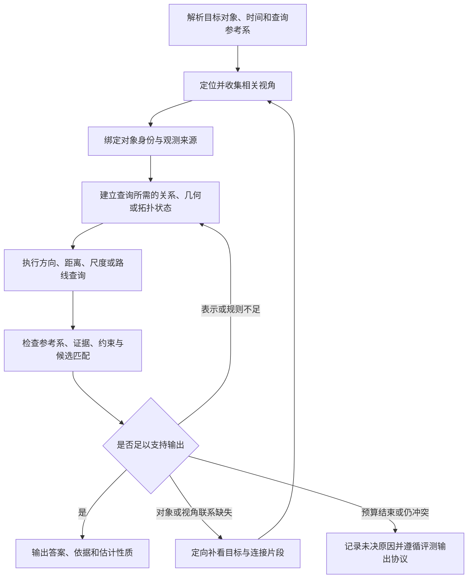

> 分类来源材料：保留原材料的设计语境；当前实现与验证状态请看 [运行文档](../pipelines/) 和 [发布验证](../validation.md)。

# R9：空间场景建模与查询——题型特征、原题与 pipeline 讨论材料

整理日期：2026-09-08。分类基线：项目当前九类方案，benchmark_pipeline_reclassification_v04.xlsx。

**R9 的核心是：把不同视角下看到的对象连接到足够解题的空间表示中，再按照题目指定的站位、朝向、尺度或路线规则进行查询。** 需要保存什么，取决于问题：左右关系可能只需三个对象的局部关系；朝向更新需要共同基准；绝对距离需要尺度；路线补全需要地标连接与行进朝向；高低关系还可能需要高度信息。

本文覆盖分类表中 **8 个默认 R9 入口、2 个条件入口**，整理 **32 道完整例题：24 道机制例题、8 道边界或复合机制例题**。机制例题由 VSI-Bench 12 道、Video-MME-v2 10 道、MVBench 2 道组成。附录收录固定版本 Video-MME-v2 / Spatial Understanding 标签下 **全部 95 道完整题干及原视频链接**。

**建议带给导师讨论的主张：先做能够检查对象绑定、查询参考系和证据来源的共用流程，再由问题决定是否增加角度、米制尺度、高度或路线代价。** 是否需要完整重建，应由原题的证据缺口与误差分析决定。局部地图更小并不保证正确，三维模型更完整也不保证目标对象、测量口径和参考系正确。

本次核对了 v04 分类表、四份固定版本官方标注、VSI 论文的任务模板与评分定义，以及 MVBench 参考加载器。三份已有本地标注与重新取得的固定版本远端文件字节一致；MVBench 导航标注另行取得并记录校验值。**没有逐题观看视频、重建场景或运行模型实验。** 下文的来源答案是 benchmark 标注，机制拆解与 pipeline 建议是分析意见；不会由答案倒推出未观察到的对象坐标、尺度、轨迹或场景布局。

## 阅读导航

- [1. R9 定义、原生入口与九类边界](#definition)
- [2. 六组机制、关键状态与常见错误](#features)
- [3. 24 道机制例题](#examples)
- [4. 8 道边界与复合机制例题](#boundaries)
- [5. 可讨论的 pipeline 方案](#pipeline)
- [6. 实验设计与导师讨论清单](#experiments)
- [7. 附录：95 道完整题干索引](#all95)
- [8. 来源、版本与核验范围](#sources)

时间有限时，先读第 1、2、5 节，再看 [E01–E03 同场景方位题](#e01)、[E06 初始朝向](#e06)、[E09 绝对距离](#e09)、[E14 房间面积](#e14)、[E17 指定路线](#e17)、[E22 相机视点](#e22) 与 [B06 标签边界](#b06)。

## 1. R9 定义、原生入口与九类边界

### 1.1 项目已有定义

以下内容依据分类工作簿的“9类Pipeline”中 R9 行整理。[分类基线 F01](#f01)

| 维度 | 项目定义 |
| --- | --- |
| 名称 | 空间场景建模与查询 |
| 核心证据状态 | 足够解题的局部场景关系、几何或拓扑表示，以及坐标参考系 |
| 控制流 | 收集相关视角 → 绑定对象和参考系 → 构建最低必要空间表示 → 几何／方向／路线查询 → 一致性检查 |
| 停止条件 | 对象关系和参考系足以约束答案；尺度不足时保留估计性质 |
| 查询能力 | 相对方向与距离、绝对尺度、房间面积、朝向更新、给定路线补转向 |
| 硬边界 | 同框直接关系可由 R1 完成；全房间实例数以 R4 为主；类别首现顺序以 R3 为主 |
| 旧策略来源 | P04、需要计算的 P17、P18、P19 |
| 实现注意 | 不要求每题执行完整 SLAM；不将标注用的真实相机位姿、深度或 mesh 作为模型输入 |

**局部／全局、单帧／多帧，与主类判断是不同维度。** E05 可能通过局部画面完成医生视角变换，仍有 R9 的参考系操作；B03 可能需要看遍全房间，主状态却是 R4 的唯一实例集合。判断重点是问题要求维护什么状态、执行什么查询。

### 1.2 全部 10 个相关原生入口

“默认 R”指原生入口的默认路由，不表示入口内每道题必须使用同一流程。“条件候选”表示逐题分析后可能采用的执行机制。[分类基线 F01](#f01)

| 原生入口与 Source ID | 表内行号／路由 | R9 触发条件或边界 | 正文例题 |
| --- | --- | --- | --- |
| MVBench／Egocentric Navigation src.mvbench.egocentric_navigation | 第 47 行；默认 R9；条件 R9 | 根据指令和当前朝向判断下一步导航动作；不一定求全局最短路。 | [E18](#e18)、[E19](#e19) |
| Video-MME／Spatial Perception src.video_mme.spatial_perception | 第 84 行；默认 R1；条件 R1 / R9 | 空瓶出现时背景有什么通常是直接可见的局部关系；跨视角参考系、不可同框的空间关系改R9。 | [B01](#b01) |
| Video-MME／Spatial Reasoning src.video_mme.spatial_reasoning | 第 85 行；默认 R6；条件 R1 / R6 / R9 | 代表题问屋顶物体为何飞起，是原因推断，不是左右/距离计算。其他子题按直接空间事实R1、关系推理R6或场景建模R9拆分。 | [B02](#b02) |
| Video-MME-v2／Spatial Understanding src.video_mme_v2.spatial_understanding | 第 114 行；默认 R9；条件 R1 / R9 | 追逐后朝向相对初始方向需统一参考系并更新方向状态；屏幕中直接左右可R1。 | [E04](#e04)–E07、E11、E20–E24；[B05](#b05)、B06、B08 |
| VSI-Bench／Absolute Distance src.vsi_bench.absolute_distance | 第 121 行；默认 R9；条件 R9 | 估计物体最近点之间的米制距离，需要带尺度的局部场景表示；视频不给精确尺度时保留不确定性，不读取GT深度/网格。 | [E09](#e09)、[E10](#e10) |
| VSI-Bench／Object Size src.vsi_bench.object_size | 第 124 行；默认 R9；条件 R9 | 炉灶最长边的厘米数需要尺度估计及可见形状/多视角证据；单目估计并不保证精确。 | [E12](#e12)、[E13](#e13) |
| VSI-Bench／Relative Direction src.vsi_bench.relative_direction | 第 125 行；默认 R9；条件 R9 | 站炉灶面向沙发判断电视方位，是物体定义的参考系变换，不要求沿相机轨迹积分；按题目排除边界方向等定义作答。 | [E01](#e01)–E03 |
| VSI-Bench／Relative Distance src.vsi_bench.relative_distance | 第 126 行；默认 R9；条件 R9 | 比较各物体与电视的最近距离，可用相对尺度/局部几何，不要求先恢复绝对米制地图。 | [E08](#e08) |
| VSI-Bench／Room Size src.vsi_bench.room_size | 第 127 行；默认 R9；条件 R9 | 房间/合并空间面积需要尺度与边界估计，遮挡和单目尺度不确定性是实际限制；禁止把标注用网格作为模型输入。 | [E14](#e14)、[E15](#e15) |
| VSI-Bench／Route Plan src.vsi_bench.route_plan | 第 128 行；默认 R9；条件 R9 | 在给定短路线动作序列中补转向，重点是拓扑邻接与朝向状态；不能把所有此类题都说成求全局最短路径。 | [E16](#e16)、[E17](#e17) |

默认 R9 的八个入口分别是 MVBench 的导航、Video-MME-v2 的空间理解，以及 VSI-Bench 的六类空间任务。Video-MME 的 Spatial Perception 和 Spatial Reasoning 则是两个条件入口；其工作簿代表题分别归 R1、R6。

### 1.3 原生标签的规模与答案形式

以下规模均按本文固定的原始标注直接统计。它们描述数据来源，不等于已经逐题观看视频后得到的纯 R9 样本量。

| Benchmark／语义任务 | 原始字段或标签 | 条数 | 答案形式与说明 |
| --- | --- | ---: | --- |
| VSI-Bench／Relative Direction | object_rel_direction_easy／medium／hard | 217／378／373，共 968 | 分别为 2、3、4 选 1，三者不是同一套方向判定规则 |
| VSI-Bench／Relative Distance | object_rel_distance | 710 | 4 选 1，比较对象最近点距离 |
| VSI-Bench／Absolute Distance | object_abs_distance | 834 | 开放数值，米 |
| VSI-Bench／Object Size | object_size_estimation | 953 | 开放数值，厘米，最长一维 |
| VSI-Bench／Room Size | room_size_estimation | 288 | 开放数值，平方米 |
| VSI-Bench／Route Plan | route_planning | 194 | 4 选 1，补全给定路线中的转向 |
| **VSI-Bench 六类空间任务合计** | **上述 8 个原始字段值** | **3,947** | **语义任务数与原始字段值数不同** |
| MVBench／Egocentric Navigation | egocentric_navigation.json | 200 | 4 选 1，四类动作各 50 条 |
| Video-MME-v2／Spatial Understanding | third_head=Spatial Understanding | 95 | 94 道为 8 选 1，1 道为 6 选 1 |

VSI-Bench 全集有 5,130 条标注、288 个场景。余下的 Object Counting 565 条与 Appearance Order 618 条在九类方案中分别以 R4、R3 为主，不能因为来自空间 benchmark 就一起算作 R9。[固定标注 F02](#f02)

Video-MME-v2 的 95 道题占固定版本 3,200 题的 2.96875%（约 2.97%），涉及 26 个 video_id；全部 level=3、second_head=Physical World Reasoning。group_type 为 relevance 的有 84 条，logic 的有 11 条。该标签中没有完全重复的题干或重复选项文本，但仍存在题面机制与空间标签不吻合的样例，例如 [B05](#b05)、[B06](#b06)。[固定标注 F03](#f03)

另一个需要保留的源数据问题是附录的 605-2：完整 question 字段只陈述警车在追逐中多次从后方撞击目标车辆，选项则为不同次数，来源答案 B 对应 3 times。从候选看，它可能意在询问撞击次数，机制更接近 R3；本文不替原题补写遗漏的问句，也不据此宣称视频已经核验。唯一的 6 选 1 题是 122-1，内容为三个车距的排序，其 6 个候选对应三项的排列。[固定标注 F03](#f03)

MVBench 的四个动作答案是左转并前进、右转并前进、直行、停止。官方 candidates 字段保存候选文本，answer 也是文本；本文保留这种形式，不把后加的字母当作原始标注字段。[固定标注 F04](#f04)

### 1.4 在九类体系中的位置

| 主类 | 与 R9 的关系和边界 | 例题锚点 |
| --- | --- | --- |
| R1 定向定位与局部取证 | 定位目标片段、读取背景或路标；直接事实足够时结束，需要参考系或场景关系时再调用 R9 | B01、E05、E20 |
| R2 连续动态与实体状态追踪 | 管理同一对象的运动与状态变化；当查询要求把状态投到共同空间参考系时与 R9 配合 | B05、E06 |
| R3 事件账本与时序归约 | 定位第一次、第二次等事件和边界，向 R9 提供时间锚点；出现顺序本身仍是 R3 | E07、E11、B04 |
| R4 清单构建与集合归约 | 管理唯一实例、范围覆盖和去重；可为相对距离提供多实例候选 | B03、E08 |
| R5 分段全局综合 | 支持跨片段取证与概括；R9 所需的身份、方位、尺度不宜只压成有损摘要 | E23、B06 |
| R6 证据约束关系推理 | 解释原因、评价和关系；题面有空间名词不意味着必须做几何查询 | B02、B06 |
| R7 假设与未来推演 | 维护改变后的规则或情景；单纯把观察者换到另一个站位仍可由 R9 做参考系转换 | E04、E24、B08 |
| R8 视觉符号与约束求解 | 处理明示数学条件、单位和可复算运算；真实对象的尺度与空间边界由 R9 取得 | E11、E14、B07、B08 |
| **R9 空间场景建模与查询** | **维护对象、查询参考系及足够解题的空间关系，再完成方向、距离、尺度和路线查询** | **E01–E24** |

### 1.5 五个能改变 pipeline 的判别问题

1. **答案是否为某一画面直接可读的事实？** 背景物体识别可以是 R1；从医生视角回答左右仍需检查视角变换。
2. **查询参考系由谁定义？** 当前相机、人物身体、起始朝向、对象到对象的朝向或题设虚拟视点，不能互相替代。
3. **需要顺序、相对关系还是绝对尺度？** 最近者排序可能无需米制坐标；回答多少米则需要尺度依据。
4. **路线是已指定、待选择，还是只问下一动作？** 依次补转向、比较最快路线和判定停止点是不同查询头。
5. **if 改变了场景事实，还是只改变观察位置？** E04 的电话亭站位主要是坐标转换；B08 的替代排列可能需要另一套情景状态和规则。

## 2. 六组机制、关键状态与常见错误

### 2.1 六组内部机制

S1–S6 是本文组织例题的分析分组，不修改 R1–R9 分类，也不预设要实现六套独立 agent。

| 分组 | 最小证据与应保留的状态 | 典型错误 | 可以停止的条件 | 例题 |
| --- | --- | --- | --- | --- |
| S1 对象相对方位与参考系转换 | 定位对象、朝向对象、查询对象及其关联；查询原点、朝向、方向判定规则 | 用屏幕左右代替题设左右；坐标轴或选项映射错误 | 对象身份明确，必要方向分量与判定区域稳定 | E01–E05 |
| S2 初始朝向与方向更新 | 初始参考、关键状态、事件时刻、地标关联或连续转向证据 | 第二次状态误与上一次比较；相机与人物方向混淆；剪辑后漂移 | 所问状态能一致地表达在指定基准中 | E06–E07 |
| S3 相对／绝对距离与排序 | 目标实例、测量点或边界、时间锚点；距离关系或带单位估计 | 比较像素间距、中心距；跨时刻串值；尺度不可用却输出精确数值 | 排序可分；或数值估计有相应尺度依据及误差说明 | E08–E11 |
| S4 物体尺寸与房间面积 | 目标范围、对象形状或空间边界、覆盖情况、尺度及不确定性 | 常见尺寸充当实测值；回访区域重复计入；外接矩形代替目标面积 | 目标范围和尺度已充分约束估计，缺失区域被明确记录 | E12–E15 |
| S5 导航动作、路线补全与选择 | 地标连接、当前站位和朝向、指令进度、必经点、终止条件；必要时有代价 | 忽略中间地标；转向基准不更新；最少动作等同最快 | 所求动作或完整候选路径满足目标、步骤和空间约束 | E16–E21 |
| S6 跨视角布局与观察位置 | 跨视角实体关联、相机／查询视点、地标排列、遮挡；必要的高度信息 | 屏内外视点混淆；图像上下当海拔；透视夹角当世界夹角 | 有足够独立空间证据区分候选，关键关系彼此相容 | E22–E24 |

这些条件是建议的诊断标准，并非已经验证的最优停止策略。“模型很确信”不能单独代替对象绑定、参考系或覆盖检查；若只得到估计，也应按估计输出和评价。

### 2.2 一个裸的“在左边”不是完整空间事实

至少需要能够追问：**谁在谁的左边、从哪个站位朝向看、何时成立、来自哪些画面、是直接观察还是变换后的推断？**

| 必须区分的内容 | 不区分会出现什么问题 | 例题 |
| --- | --- | --- |
| 对象类别与实例身份 | 多把椅子、多台发电机或回访视角被错误合并 | E07、E08、B03 |
| 观测参考系与查询参考系 | 把相机看到的右侧直接当作医生或电话亭观察者的右侧 | E04、E05 |
| 原点与朝向 | 只记面对哪个方向，却不知道站在哪里；相同方向对应不同相对位置 | E01–E04 |
| 身体朝向、镜头朝向与运动方向 | 人向前看却侧移，或游戏镜头旋转，导致错误方向更新 | E06、B05 |
| 事件时间与空间状态 | 第二场比赛的距离绑定到第三场，或用停车后代替过线时刻 | E07、E11 |
| 中心、边界与最长一维 | 使用中心点地图解最近点距离，或只测正面像素宽度 | E08–E13 |
| 原始观察、题设条件与派生结果 | 将虚拟站位或先验尺度写成视频直接观测 | E04、E09、B08 |

一种适合起步的做法是保存可回查的小型关系表和证据索引。是否需要对象框、局部坐标或拓扑图，可在发现某类查询无法可靠执行后逐步增加。

### 2.3 四种空间表示的能力不同

| 表示 | 能自然支持什么 | 仍缺少什么 |
| --- | --- | --- |
| 带参考系的定性关系 | 在左侧、前方、某地标相邻、某对象高于视线 | 精确长度、面积及未被关系约束的角度 |
| 局部平面位置／方向 | 对象定义的左右前后、相对距离、局部主方向比较 | 米制尺度可能未知；中心点不足以表达最近点距离 |
| 地标拓扑与朝向状态 | 必经点、转向、导航进度、路线重放与可达性 | 未定义边权时不能证明最快或最短 |
| 带尺度、边界或高度的几何表示 | 物体尺寸、绝对距离、空间面积、高低和更复杂视角 | 仍需正确身份、测量定义及可靠视觉支持；不能自动消除误差 |

二维表示并不等于使用图像坐标。局部场景平面中的关系要由视频证据建立，不能把透视图的像素位置当作统一地图。反过来，也不能为了“做空间题”就默认运行全场景 SLAM。

### 2.4 方向规则必须来自题目

E01–E03 使用同一场景中的炉灶、沙发、电视，官方答案分别是 left、left、front-left。它们体现的是查询粒度和规则差异：

- easy：判断左或右。
- medium：判断左、右或后，题干明确至少转动 135° 才算后方。
- hard：以观察者为原点、正前方为正 y 轴，判断四象限。

这些规则来自 VSI 论文 Table 4，并保存在每道具体题干中。[论文与页面核验 F06](#f06)

作为**计算方法示意**，如果已经有同一水平平面中的可靠坐标，可令站位为 O、面向目标为 F、查询物体为 Q。以从 O 指向 F 的单位向量作为前方轴，再构造右方轴，计算 Q−O 在两轴上的分量；四象限看符号，三分类按其角度规则判断。这里只说明查询可如何执行，没有假定任何例题的实际坐标已经可用。

若站位与面向点近乎重合、对象朝向看不清、推断区间跨越方向边界，就需要保留歧义并补证据。一个视图中的投影交叉或短暂遮挡，不自动表示对象的真实空间关系发生了改变。

附录还有两种值得后续扩展的约定：648-3 的攀岩角度题以垂直于地面的平面为 0°，并明确向攀爬者倾斜为负、远离攀爬者为正，提示查询规格也要保存角度零位和符号规则；722-2 查询客厅镜中最合理的可见画面，需要结合镜面朝向、观察位置和场景可见性。这些题说明 S6 的视角关系还可能包含镜像与特殊角度定义。[固定标注 F03](#f03)

### 2.5 测量定义与标注近似需要分开

VSI 论文说明：绝对距离通过在对象定向包围盒中采样点、求最小成对欧氏距离近似；对象尺寸取唯一对象包围盒的最长一维；房间面积由场景点云的 alpha shape 方法计算。相对距离候选类别存在多个实例时，使用与目标对象的最小距离。[论文 Appendix B.1，F06](#f06)

这些内容解释的是**参考答案如何构造以及评测使用什么口径**。它们不表示模型能读取标注包围盒、点云、真实深度或场景面积。若采用从视频预测的几何工具，需要说明预测输入、尺度来源和误差。

由此产生三类重要区别：

- **排序与测量：** E08 只需确定最近者；E09 必须估计米制数值。统一缩放通常不改变同一几何表示中的距离排序，却会改变绝对距离。
- **形状与中心：** 两个中心相距较远的大物体，其边界可能很近；中心点关系不能保证最近点距离正确。
- **长度与面积：** 在统一缩放假设下，长度尺度乘以 s，面积会乘以 s²。面积偏差不能只归咎于最后的乘法。

### 2.6 哪些证据需要连续性，哪些需要覆盖

局部方位题可以在三个对象关系明确后停止；带初始朝向的状态题需要连接关键时刻；面积或复杂布局题则需要检查空间范围是否遗漏。它们不应共用“找到一帧相关画面就停止”的规则。

抽帧应考虑对象共同可见、过门、转角、重新看到稳定地标、楼层或高度变化等可用线索。先均匀抽帧可以作为基线，后续补看则应针对缺失对象、参考系连接或范围覆盖。镜头切换会影响连续跟踪的有效性；同一场景被不同视角重访时，也不应自动当作新增房间。

### 2.7 便于实验归因的错误分类

| 错误环节 | 具体表现 | 应优先检查或补救 |
| --- | --- | --- |
| 任务解析 | 漏掉初始视角、最近点、至少 135°、必经地标 | 重新检查题干限定和输出规则 |
| 时间定位 | 找错比赛、第二次事件或最后一个场景 | 核验事件账本与片段边界 |
| 目标识别／绑定 | 医生、朋友混淆；回访或同类实例合并错误 | 精看目标并复核身份依据 |
| 参考系 | 相机与人物视角混用，左右翻转，原点选错 | 显式检查站位、前向、时间和坐标约定 |
| 场景整合 | 不同视角缺少可靠连接，却合成同一布局 | 找共同地标或连接片段，保留未连通部分 |
| 尺度／边界 | 常见尺寸替代实例尺度，中心距替代最近点 | 核查测量口径、对象范围和尺度来源 |
| 路线执行 | 忽略中间点、朝向更新或终止条件 | 逐步重放候选路径与约束 |
| 查询／匹配 | 数值单位错误，正确语义映射到错误字母 | 独立计算、单位检查和原候选顺序核验 |
| 数据与协议 | 标签机制不符、来源字段泄漏、场景跨划分 | 保留原数据并单报诊断，清理模型可见输入 |

## 3. 24 道机制例题

例题按 S1–S6 排列。每题的“来源答案”仅表示原标注给出的答案；“机制拆解”说明预期需要解决什么问题，不是已经从视频完成的解题实录。原视频链接保留标注中的 URL，未在本次逐一验证播放状态。VSI-Bench 与 MVBench 以场景或文件定位，不凭空补造视频链接。

| 编号 | 主题 | 原始定位 | 分组 |
| --- | --- | --- | --- |
| [E01](#e01) | 站在炉灶旁看沙发：二选一的对象参考系 | VSI-Bench／1236 | S1 |
| [E02](#e02) | 左、右、后：135° 是题设判定条件 | VSI-Bench／1100 | S1 |
| [E03](#e03) | 前左、前右、后左、后右：四象限判定 | VSI-Bench／957 | S1 |
| [E04](#e04) | 走进电话亭再看邮筒：虚拟站位转换 | Video-MME-v2／061-2 | S1 |
| [E05](#e05) | 从医生的视角看玩家：身体朝向与相机朝向 | Video-MME-v2／086-1 | S1 |
| [E06](#e06) | 追逐后的两次朝向：共同的初始基准 | Video-MME-v2／028-1 | S2 |
| [E07](#e07) | 第二次破坏发电机：事件时刻与开局视角 | Video-MME-v2／040-4 | S2 |
| [E08](#e08) | 离电视最近的物体：距离排序与实例范围 | VSI-Bench／1334 | S3 |
| [E09](#e09) | 沙发到炉灶有几米：绝对尺度与最近点 | VSI-Bench／680 | S3 |
| [E10](#e10) | 门与电源排插：目标识别和精细定位 | VSI-Bench／1597 | S3 |
| [E11](#e11) | 两场比赛的车头间距：时间锚点、尺度和排序 | Video-MME-v2／083-3 | S3 |
| [E12](#e12) | 炉灶的最长尺寸：厘米与物体边界 | VSI-Bench／167 | S4 |
| [E13](#e13) | 床的最长尺寸：同一任务在不同场景中的尺度 | VSI-Bench／3206 | S4 |
| [E14](#e14) | 房间面积：边界、覆盖和平方尺度 | VSI-Bench／530 | S4 |
| [E15](#e15) | 同一面积题干、不同房间：视频才提供实例信息 | VSI-Bench／2663 | S4 |
| [E16](#e16) | 床、电视、淋浴、马桶：给定路线补两次转向 | VSI-Bench／4959 | S5 |
| [E17](#e17) | 已经面向终点，仍须经过指定地标 | VSI-Bench／4963 | S5 |
| [E18](#e18) | 向左穿过门：导航指令与当前进度 | MVBench／row[1] | S5 |
| [E19](#e19) | 长指令中的停止点：提到左、右也可能该停止 | MVBench／row[150] | S5 |
| [E20](#e20) | 寺庙到车站：地标、岔路和视频范围 | Video-MME-v2／061-3 | S5 |
| [E21](#e21) | 电梯到病房的最快路线：确实需要比较候选路径 | Video-MME-v2／086-2 | S5 |
| [E22](#e22) | 大屏画面来自哪里：根据视角反推相机位置 | Video-MME-v2／333-3 | S6 |
| [E23](#e23) | 从终点看起点：跨视角布局与高低关系 | Video-MME-v2／333-4 | S6 |
| [E24](#e24) | 从高处看吊臂与房屋：投影视角和世界夹角 | Video-MME-v2／369-4 | S6 |

### E01　站在炉灶旁看沙发：二选一的对象参考系

**来源与定位：** VSI-Bench；test.jsonl；id=1236；dataset=arkitscenes；scene_name=41069025；question_type=object_rel_direction_easy。[固定标注与版本 F02](#f02)。

**视频定位：** 原标注没有独立视频 URL；使用上方 dataset 与 scene_name 在官方场景视频中定位，不以参考几何文件替代视频。

**分类理由与子型：** R9；由定位对象、朝向对象和查询对象共同定义的相对方位。原生 easy 子型。 分组：对象相对方位与参考系转换。

**中文题意：** 如果我站在炉灶旁并面向沙发，电视在沙发的左边还是右边？

**英文原题：**

> If I am standing by the stove and facing the sofa, is the tv to the left or the right of the sofa?

**原始选项：**

- A. left
- B. right

**来源答案：A。** left

**最小证据需求：**

- 识别炉灶、沙发、电视，并确认多次出现是否对应同一实例。
- 取得足以判断三者位置关系的视角，把站在炉灶旁、面向沙发转换为查询参考系。

**机制拆解：** 要回答的是题设观察者的左右，而不是当前画面的左右。可以只保存三对象的局部相对关系，不必先估计米制坐标。来源答案 A 表示 left。它没有提供对象坐标，也不能据此补画一张声称已经恢复的房间地图。E01–E03 来自同一场景、同一组三对象，适合比较判定规则改变时是否仍保持空间关系一致。

**主要易错点：** 把电视在某帧的屏幕左侧直接当作答案；混淆站位对象和面向对象；跨镜头把另一台同类设备绑定进来。

**pipeline 讨论点：** 能否复用同一份对象关系证据，只切换方向查询规则？二选一已经可判定时，应允许停止，而不是强制完成四象限地图。

**核验说明：** 已核对固定版本 id、场景、完整题干、原选项顺序或 options=null，以及 ground_truth。未观看原场景视频。

### E02　左、右、后：135° 是题设判定条件

**来源与定位：** VSI-Bench；test.jsonl；id=1100；dataset=arkitscenes；scene_name=41069025；question_type=object_rel_direction_medium。[固定标注与版本 F02](#f02)。

**视频定位：** 原标注没有独立视频 URL；使用上方 dataset 与 scene_name 在官方场景视频中定位，不以参考几何文件替代视频。

**分类理由与子型：** R9；对象参考系中的三分类角度判定。原生 medium 子型。 分组：对象相对方位与参考系转换。

**中文题意：** 站在炉灶旁、面向沙发时，电视在我的左边、右边还是后方？必须转动至少 135° 才能面向的对象，算在后方。

**英文原题：**

> If I am standing by the stove and facing the sofa, is the tv to my left, right, or back?
> An object is to my back if I would have to turn at least 135 degrees in order to face it.

**原始选项：**

- A. back
- B. right
- C. left

**来源答案：C。** left

**最小证据需求：**

- 复用或重新确认 E01 同一场景的炉灶、沙发和电视。
- 保留朝向与电视方位之间的角度关系，以及题干给出的至少 135° 规则。

**机制拆解：** 本题的 back 不能简单等价为普通四象限中的整个后半平面。若用角度实现，可先求相对正前方的带符号偏角，再按题设判断后方区域和左右。来源答案 C 对应 left，与 E01 的 A=left 在语义上相容；不同字母并不代表空间结论相反。本文未取得实际偏角。

**主要易错点：** 省略第二句限定；一见背后便使用 90° 边界；沿用上一题的答案字母而没有重新匹配选项。

**pipeline 讨论点：** 方向分类规则能否作为查询参数独立保存？应检查角度不确定区间是否跨越 135°，而不是输出一个没有证据支持的精确角度。

**核验说明：** 已核对固定版本 id、场景、完整题干、原选项顺序或 options=null，以及 ground_truth。未观看原场景视频。

### E03　前左、前右、后左、后右：四象限判定

**来源与定位：** VSI-Bench；test.jsonl；id=957；dataset=arkitscenes；scene_name=41069025；question_type=object_rel_direction_hard。[固定标注与版本 F02](#f02)。

**视频定位：** 原标注没有独立视频 URL；使用上方 dataset 与 scene_name 在官方场景视频中定位，不以参考几何文件替代视频。

**分类理由与子型：** R9；明确给出二维查询参考系的四象限问题。原生 hard 子型。 分组：对象相对方位与参考系转换。

**中文题意：** 站在炉灶旁并面向沙发时，电视在前左、前右、后左还是后右？以我为原点，正前方为笛卡尔平面的正 y 轴。

**英文原题：**

> If I am standing by the stove and facing the sofa, is the tv to my front-left, front-right, back-left, or back-right?
> The directions refer to the quadrants of a Cartesian plane (if I am standing at the origin and facing along the positive y-axis).

**原始选项：**

- A. front-left
- B. back-right
- C. back-left
- D. front-right

**来源答案：A。** front-left

**最小证据需求：**

- 确认三对象的身份及足以支持左右、前后两个分量的空间关系。
- 记录原点在炉灶旁、正 y 指向沙发，并保留投影到查询平面的依据。

**机制拆解：** 若采用局部坐标，需同时判断横向和纵向分量的符号；只知道电视在左边还不足以区分 front-left 与 back-left。来源答案 A 为 front-left。E01–E03 的参考答案在 left／left／front-left 层面相容，但这仅是标注关系检查，不能替代视频取证。

**主要易错点：** 把 hard 误解为必须做完整 3D 重建；坐标轴或手性反转；依据一张透视图直接把图像上下当作世界前后。

**pipeline 讨论点：** 需要多精细的表示才能稳定区分前左与后左？接近坐标轴时，可以补看有判别力的视角，而不必无条件增加全片抽帧。

**核验说明：** 已核对固定版本 id、场景、完整题干、原选项顺序或 options=null，以及 ground_truth。未观看原场景视频。

### E04　走进电话亭再看邮筒：虚拟站位转换

**来源与定位：** Video-MME-v2；test parquet；question_id=061-2；video_id=061；third_head=Spatial Understanding。[固定标注与版本 F03](#f03)。

**原视频：** [video_id=061](https://www.youtube.com/watch?v=OAuHBJ9o21w)。链接取自标注。

**分类理由与子型：** R9；对固定场景施加新的观察站位和朝向。出现 if 不自动意味着要推演一个变化后的世界。 分组：对象相对方位与参考系转换。

**中文题意：** 离开商店后看到一个电话亭。假如走进电话亭并面向电话打电话，此时邮筒在我的哪个方向？

**英文原题：**

> After I walked out of the store, I saw a telephone booth. If I walked into the telephone booth and faced the phone to made a call, in which direction would the mailbox be from me at this moment?

**原始选项：**

- A. Front-right.
- B. Ahead.
- C. Back-right.
- D. Behind.
- E. Back-left.
- F. Right.
- G. Front-left.
- H. Left.

**来源答案：C。** Back-right.

**最小证据需求：**

- 定位出店、电话亭和邮筒相关画面，确认它们属于同一处空间。
- 识别电话所在的朝向，确定题设站位与邮筒的位置关系；未同框时需跨视角关联。

**机制拆解：** 需要把相机实际看到的布局转成站在电话亭内、面向电话的查询视角。此假设主要改变观察者参考系，并未要求邮筒或电话亭发生变化。来源答案 C 是 Back-right。没有视频布局时，不能从这个答案反推出电话亭和邮筒的具体距离。

**主要易错点：** 继续用出店时的相机朝向；只定位到电话亭而没有确定电话面板朝向；将虚拟视点一律分流至 R7。

**pipeline 讨论点：** 任务解析时能否分开记录实际观测视点和题设查询视点？若两对象不同时可见，最少需要哪些共同地标来连接证据？

**原文与标注说明：** 原文中的 to made a call 保持不变，中文只解释题意。

**核验说明：** 已核对固定版本题干、全部原始选项、答案键、标签与原视频 URL。未观看原视频。 源字段：level=3；second_head=Physical World Reasoning；group_type=relevance；group_structure=4。

### E05　从医生的视角看玩家：身体朝向与相机朝向

**来源与定位：** Video-MME-v2；test parquet；question_id=086-1；video_id=086；third_head=Spatial Understanding。[固定标注与版本 F03](#f03)。

**原视频：** [video_id=086](https://www.youtube.com/watch?v=m6Eqx1-Jxj0)。链接取自标注。

**分类理由与子型：** R9；以场景内另一人物为原点和朝向依据的视角变换，事件定位可复用 R1。 分组：对象相对方位与参考系转换。

**中文题意：** 玩家角色跟随朋友进入病房并拍照时，从医生的视角看，玩家角色位于哪个方向？

**英文原题：**

> When the player's avatar follows his friend into the hospital room and takes a photo, from the doctor's viewpoint, in which direction is the avatar located?

**原始选项：**

- A. Rear-left.
- B. Left side.
- C. Directly in front.
- D. Front-right.
- E. Right side.
- F. Front-left.
- G. Rear-right.
- H. Directly behind.

**来源答案：D。** Front-right.

**最小证据需求：**

- 找到进入病房并拍照的时刻，区分玩家、朋友和医生。
- 取得医生的朝向与玩家位置；若朝向存在歧义，保留能辨认身体或面部朝向的证据。

**机制拆解：** 同框并不保证可以直接读出答案：题目要求从医生看玩家，必须把可见的人物姿态转换为医生的前后左右。局部画面可能已经足够完成这一变换，因此 R9 也不等于长视频或全局建图。来源答案 D 为 Front-right。

**主要易错点：** 把朋友误当医生；用游戏镜头方向代替医生身体方向；将相机右侧机械翻转成医生左侧。

**pipeline 讨论点：** 以人物为参考对象时，朝向读取应返回方向证据和歧义，而不仅是一个粗略位置框。是否需要对称姿态的定向补看？

**核验说明：** 已核对固定版本题干、全部原始选项、答案键、标签与原视频 URL。未观看原视频。 源字段：level=3；second_head=Physical World Reasoning；group_type=relevance；group_structure=4。

### E06　追逐后的两次朝向：共同的初始基准

**来源与定位：** Video-MME-v2；test parquet；question_id=028-1；video_id=028；third_head=Spatial Understanding。[固定标注与版本 F03](#f03)。

**原视频：** [video_id=028](https://www.youtube.com/watch?v=C-uK4zJN9ok)。链接取自标注。

**分类理由与子型：** R9；固定初始参考方向后查询两个结束状态，可复用 R2 的连续状态记录和 R3 的任务边界。 分组：初始朝向与方向更新。

**中文题意：** 在第一次追逐目标的游戏中，完成第一次和第二次追逐任务时，朝向分别相对于初始朝向发生了什么变化？

**英文原题：**

> In the first target-chasing game, what were the facing directions upon completing the first and second target-chasing tasks, respectively, relative to the initial orientation?

**原始选项：**

- A. Largely unchanged; largely unchanged.
- B. Approximately 90° to the right; largely unchanged.
- C. Approximately 180° (facing opposite); largely unchanged.
- D. Approximately 45° to the right; largely unchanged.
- E. Largely unchanged; approximately 90° to the right.
- F. Approximately 90° to the right; approximately 90° to the right.
- G. Approximately 90° to the left; approximately 180° (facing opposite).
- H. Approximately 90° to the left; largely unchanged.

**来源答案：B。** Approximately 90° to the right; largely unchanged.

**最小证据需求：**

- 区分第一次游戏与其中的第一、第二次追逐任务。
- 确定初始朝向及两个任务完成时的朝向，保留连接这些状态的地标或连续运动证据。

**机制拆解：** 两个结果都要与同一个初始朝向比较，不能把第二项解释成相对于第一次任务结束的变化。来源答案 B 为第一次约向右 90°、第二次大致不变。可以用初始朝向加关键转移状态表示；如果地标足以重新定向，不必完全依赖逐帧累计转角。

**主要易错点：** 把任务编号与游戏编号混淆；把身体朝向、相机朝向和运动方向混为一谈；跨剪辑直接累计方向造成漂移。

**pipeline 讨论点：** 何时使用局部转角更新，何时通过固定地标重新定位？状态中应显式保存每次结论使用的共同基准。

**核验说明：** 已核对固定版本题干、全部原始选项、答案键、标签与原视频 URL。未观看原视频。 源字段：level=3；second_head=Physical World Reasoning；group_type=relevance；group_structure=4。

### E07　第二次破坏发电机：事件时刻与开局视角

**来源与定位：** Video-MME-v2；test parquet；question_id=040-4；video_id=040；third_head=Spatial Understanding。[固定标注与版本 F03](#f03)。

**原视频：** [video_id=040](https://www.youtube.com/watch?v=hg0YV8vXc7A)。链接取自标注。

**分类理由与子型：** R9 与 R3 的组合；R3 定位第二次指定事件，R9 将事件目标的位置转换到开局参考系。 分组：初始朝向与方向更新。

**中文题意：** 以游戏开始时屠夫的视角为基准，屠夫第二次损坏的发电机位于哪个方向？

**英文原题：**

> From the butcher's perspective at the start of the game, in which direction was the generator damaged by the butcher for the second time?

**原始选项：**

- A. Front right.
- B. Directly behind.
- C. Directly to the left.
- D. Rear right.
- E. Directly ahead.
- F. Directly to the right.
- G. Front left.
- H. Rear left.

**来源答案：B。** Directly behind.

**最小证据需求：**

- 取得开局屠夫的站位、朝向及可关联的场景地标。
- 区分每次损坏发电机的事件，找到第二次事件对应的目标并连接到开局空间。

**机制拆解：** 题目同时给出了事件序号和空间基准。找到第二次事件只是取证的一步，还需要从开局视角表达该发电机所在方向。来源答案 B 为 Directly behind。事件发生时看到的画面方向不能直接替代开局方向，也不能由答案倒推屠夫一路如何移动。

**主要易错点：** 只扫描到第一次事件便停止；把第二次事件发生时的朝向作为基准；同样外观的发电机被错误合并。

**pipeline 讨论点：** R3 返回事件时刻、目标身份和来源片段后，R9 是否已有足够的跨视角联系？缺少联系时应补看衔接片段，而不是反复重看事件终点。

**核验说明：** 已核对固定版本题干、全部原始选项、答案键、标签与原视频 URL。未观看原视频。 源字段：level=3；second_head=Physical World Reasoning；group_type=relevance；group_structure=4。

### E08　离电视最近的物体：距离排序与实例范围

**来源与定位：** VSI-Bench；test.jsonl；id=1334；dataset=arkitscenes；scene_name=42446103；question_type=object_rel_distance。[固定标注与版本 F02](#f02)。

**视频定位：** 原标注没有独立视频 URL；使用上方 dataset 与 scene_name 在官方场景视频中定位，不以参考几何文件替代视频。

**分类理由与子型：** R9；指定对象集合内的相对距离比较。多实例情形可复用 R4 的身份清单。 分组：相对／绝对距离与排序。

**中文题意：** 按两个物体最近点之间的距离测量，椅子、凳子、炉灶、沙发中，哪一个离电视最近？

**英文原题：**

> Measuring from the closest point of each object, which of these objects (chair, stool, stove, sofa) is the closest to the tv?

**原始选项：**

- A. chair
- B. stool
- C. stove
- D. sofa

**来源答案：A。** chair

**最小证据需求：**

- 绑定电视及四种候选物体，检查候选类别是否存在多个实例。
- 取得能够比较最近点距离的对象边界与空间关系；只需区分排序时可以不恢复米制尺度。

**机制拆解：** 要比较的是对象间最近点距离，不是各自中心距、画面距离或它们距相机的远近。VSI 论文还说明：候选类别有多个实例时，采用与目标对象的最小距离。来源答案 A 是 chair；它并没有给出四个候选的距离值。建模时应让估计的对象形状与距离定义相匹配。

**主要易错点：** 用图像中心的欧氏距离替代场景距离；漏掉更近的同类实例；为相对排序引入不必要且不稳定的绝对尺度。

**pipeline 讨论点：** 能否先判断距离区间是否足以确定最近者？只有排序重叠时才补取视角或细化边界。

**核验说明：** 已核对固定版本 id、场景、完整题干、原选项顺序或 options=null，以及 ground_truth。未观看原场景视频。

### E09　沙发到炉灶有几米：绝对尺度与最近点

**来源与定位：** VSI-Bench；test.jsonl；id=680；dataset=arkitscenes；scene_name=41069025；question_type=object_abs_distance。[固定标注与版本 F02](#f02)。

**视频定位：** 原标注没有独立视频 URL；使用上方 dataset 与 scene_name 在官方场景视频中定位，不以参考几何文件替代视频。

**分类理由与子型：** R9；需要对象边界及米制尺度的开放数值估计。 分组：相对／绝对距离与排序。

**中文题意：** 从沙发和炉灶各自最近的点测量，两者相距多少米？

**英文原题：**

> Measuring from the closest point of each object, what is the distance between the sofa and the stove (in meters)?

**原始选项：** 无；原标注 options=null，属于开放数值题。

**来源参考值：2.9 米。** 原字段 ground_truth 保留其原始数值字符串。

**最小证据需求：**

- 确认沙发和炉灶的位置、外形边界及两者之间的空间。
- 取得可支持尺度估计的视觉线索，明确哪些尺度来自估计，哪些来自实际可读的参照。

**机制拆解：** 来源参考值为 2.9 米。VSI 论文描述的标注方法是在两个对象的定向包围盒内采样点，并取成对点的最小欧氏距离；这是一种几何近似口径。模型若只输出两个中心坐标再求距离，会与题目及标注口径不一致。本文未测出这段距离，也未恢复两对象的坐标。

**主要易错点：** 把沙发或炉灶的常见尺寸当作该实例的已知尺寸；混用厘米和米；计算精确但尺度输入完全来自猜测。

**pipeline 讨论点：** 绝对距离能否输出估计值、尺度来源和不确定区间？数值解算正确与米制尺度可信应分别评价。

**核验说明：** 已核对固定版本 id、场景、完整题干、原选项顺序或 options=null，以及 ground_truth。未观看原场景视频。

### E10　门与电源排插：目标识别和精细定位

**来源与定位：** VSI-Bench；test.jsonl；id=1597；dataset=scannetpp；scene_name=7b6477cb95；question_type=object_abs_distance。[固定标注与版本 F02](#f02)。

**视频定位：** 原标注没有独立视频 URL；使用上方 dataset 与 scene_name 在官方场景视频中定位，不以参考几何文件替代视频。

**分类理由与子型：** R9；ScanNet++ 场景中的绝对距离题，目标定位可能需要局部精看。 分组：相对／绝对距离与排序。

**中文题意：** 从门和电源排插各自最近的点测量，两者相距多少米？

**英文原题：**

> Measuring from the closest point of each object, what is the distance between the door and the power strip (in meters)?

**原始选项：** 无；原标注 options=null，属于开放数值题。

**来源参考值：2.7 米。** 原字段 ground_truth 保留其原始数值字符串。

**最小证据需求：**

- 在场景中找到指定门和电源排插，确认目标不是相似的插座或其他长条物体。
- 确定对象边界、两者的相对位置及尺度依据，保留目标定位和全局关系之间的联系。

**机制拆解：** 这题与 E09 使用相同的测量语义，但对象和场景不同，来源参考值为 2.7 米。它适合检验几何模块前端是否能把细小目标绑定到正确的空间位置。若排插难以辨认，可补做裁剪精看，但裁剪必须能追溯到原帧位置，不能丢掉与门之间的空间联系。

**主要易错点：** 细小目标识别错误后仍正常计算；只保留裁剪图导致相对位置丢失；从近景视觉大小直接断言真实长度。

**pipeline 讨论点：** 局部精看返回的对象定位如何与已有场景表示合并？需要同时检查识别是否改善，以及是否引入了新的坐标偏移。

**核验说明：** 已核对固定版本 id、场景、完整题干、原选项顺序或 options=null，以及 ground_truth。未观看原场景视频。

### E11　两场比赛的车头间距：时间锚点、尺度和排序

**来源与定位：** Video-MME-v2；test parquet；question_id=083-3；video_id=083；third_head=Spatial Understanding。[固定标注与版本 F03](#f03)。

**原视频：** [video_id=083](https://www.youtube.com/watch?v=5BBTghKXjDE)。链接取自标注。

**分类理由与子型：** R9 为主，组合 R3 的比赛和过线事件定位、R2 的车辆身份，以及 R8 的数值排序。 分组：相对／绝对距离与排序。

**中文题意：** 每次起跑算一场比赛。将第二场、第三场中布加迪 Chiron 过终点时两车车头的距离，与 8 米、1 米这四个量从小到大排列。

**英文原题：**

> Each start constitutes one race. Please arrange the following four distances in order from smallest to largest:
> The distance between the two car fronts when the Bugatti Chiron crossed the finish line in the second race
> The distance between the two car fronts when the Bugatti Chiron crossed the finish line in the third race
> 8 meters
> 1 meter

**原始选项：**

- A. 1 meter < 8 meters < The distance between the two car fronts when the Bugatti crossed the finish line in the second race < The distance between the two car fronts when the Bugatti crossed the finish line in the third race.
- B. The distance between the two car fronts when the Bugatti crossed the finish line in the second race < 1 meter < 8 meters < The distance between the two car fronts when the Bugatti crossed the finish line in the third race.
- C. The distance between the two car fronts when the Bugatti crossed the finish line in the second race < The distance between the two car fronts when the Bugatti crossed the finish line in the third race < 1 meter < 8 meters.
- D. The distance between the two car fronts when the Bugatti crossed the finish line in the second race < The distance between the two car fronts when the Bugatti crossed the finish line in the third race < 8 meters < 1 meter.
- E. 1 meter < The distance between the two car fronts when the Bugatti crossed the finish line in the second race < The distance between the two car fronts when the Bugatti crossed the finish line in the third race < 8 meters.
- F. 1 meter < The distance between the two car fronts when the Bugatti crossed the finish line in the third race < The distance between the two car fronts when the Bugatti crossed the finish line in the second race < 8 meters.
- G. The distance between the two car fronts when the Bugatti crossed the finish line in the second race < 1 meter < The distance between the two car fronts when the Bugatti crossed the finish line in the third race < 8 meters.
- H. 1 meter < The distance between the two car fronts when the Bugatti crossed the finish line in the second race < 8 meters < The distance between the two car fronts when the Bugatti crossed the finish line in the third race.

**来源答案：B。** The distance between the two car fronts when the Bugatti crossed the finish line in the second race < 1 meter < 8 meters < The distance between the two car fronts when the Bugatti crossed the finish line in the third race.

**最小证据需求：**

- 区分第二、第三次起跑，分别定位布加迪车头过终点的时刻。
- 在每个时刻识别两车车头，并估计间距与 1 米、8 米的相对关系；两场的相机视角可能不同。

**机制拆解：** 先形成 d2、d3 两个带比赛和时间锚点的距离估计，再与题设常量 1、8 比较。来源答案 B 给出 d2 < 1 米 < 8 米 < d3 的排序，但没有给出 d2、d3 的具体值。对于排序任务，可靠的上下界可能已经足够，不应把候选中的不等式当作实测距离。

**主要易错点：** 读取停车后的间距而非过线时刻；测量车尾到车头的空隙而非两个车头；跨不同视角直接比较像素距离。

**pipeline 讨论点：** 可以先用区间回答排序，还是必须估计每个距离的单点值？时间定位误差对几何测量的影响应如何单独诊断？

**核验说明：** 已核对固定版本题干、全部原始选项、答案键、标签与原视频 URL。未观看原视频。 源字段：level=3；second_head=Physical World Reasoning；group_type=logic；group_structure=[[1,2],3,4]。

### E12　炉灶的最长尺寸：厘米与物体边界

**来源与定位：** VSI-Bench；test.jsonl；id=167；dataset=arkitscenes；scene_name=41069025；question_type=object_size_estimation。[固定标注与版本 F02](#f02)。

**视频定位：** 原标注没有独立视频 URL；使用上方 dataset 与 scene_name 在官方场景视频中定位，不以参考几何文件替代视频。

**分类理由与子型：** R9；指定物体的真实尺寸估计。与 E01–E03、E09、E14 使用同一 ARKitScenes 场景。 分组：物体尺寸与房间面积。

**中文题意：** 炉灶的长、宽、高中，最长的一维是多少厘米？

**英文原题：**

> What is the length of the longest dimension (length, width, or height) of the stove, measured in centimeters?

**原始选项：** 无；原标注 options=null，属于开放数值题。

**来源参考值：62 厘米。** 原字段 ground_truth 保留其原始数值字符串。

**最小证据需求：**

- 识别炉灶实例和可见的外形边界，区分物体本体与相邻台面。
- 取得判断哪一维最长及其米制尺度的视觉证据；不可见部分应保留估计性质。

**机制拆解：** 应查询三维对象的最长尺寸，而非某一帧中最长的像素边。论文将该类参考值定义为唯一对象包围盒的最长一维。来源参考值为 62 厘米，不意味着已经知道这是宽、高或深度中的哪一维。题面没有授权直接采用某种炉灶的标准产品尺寸。

**主要易错点：** 把炉灶所在整段橱柜算进物体；以正面图宽度代替最长尺寸；把常见规格写成观测值。

**pipeline 讨论点：** 采用对象框、局部 3D 盒或尺寸区间，哪种表示足够？尺度参照的不确定性如何传递到最终厘米值？

**核验说明：** 已核对固定版本 id、场景、完整题干、原选项顺序或 options=null，以及 ground_truth。未观看原场景视频。

### E13　床的最长尺寸：同一任务在不同场景中的尺度

**来源与定位：** VSI-Bench；test.jsonl；id=3206；dataset=scannet；scene_name=scene0277_02；question_type=object_size_estimation。[固定标注与版本 F02](#f02)。

**视频定位：** 原标注没有独立视频 URL；使用上方 dataset 与 scene_name 在官方场景视频中定位，不以参考几何文件替代视频。

**分类理由与子型：** R9；ScanNet 场景的对象尺寸估计，可用于检查方法是否依赖单一场景或类别先验。 分组：物体尺寸与房间面积。

**中文题意：** 床的长、宽、高中，最长的一维是多少厘米？

**英文原题：**

> What is the length of the longest dimension (length, width, or height) of the bed, measured in centimeters?

**原始选项：** 无；原标注 options=null，属于开放数值题。

**来源参考值：221 厘米。** 原字段 ground_truth 保留其原始数值字符串。

**最小证据需求：**

- 找到该场景中的床，确定床的整体边界以及床架、床头等部分与目标实例的关系。
- 利用相关视角估计最长一维及尺度，保留遮挡、截断或视角不足的证据。

**机制拆解：** 来源参考值为 221 厘米。解题需要针对视频里的具体实例估计，不能只回答床的常见长度。题干并不说明哪一维最长，本文也没有由视频确定床的方向或完整边界。与 E12 对照可以把类别先验、目标范围识别和尺度恢复的贡献分开讨论。

**主要易错点：** 看到床便输出通用床垫规格；把床垫长度、床架长度和包围盒最长边当作同一口径；遮挡部分未经说明便补成标准形状。

**pipeline 讨论点：** 设置无视觉基线后，加入视频是否真正改善该实例的尺寸估计？如果主要收益来自物体类别，几何模块的价值应重新审查。

**核验说明：** 已核对固定版本 id、场景、完整题干、原选项顺序或 options=null，以及 ground_truth。未观看原场景视频。

### E14　房间面积：边界、覆盖和平方尺度

**来源与定位：** VSI-Bench；test.jsonl；id=530；dataset=arkitscenes；scene_name=41069025；question_type=room_size_estimation。[固定标注与版本 F02](#f02)。

**视频定位：** 原标注没有独立视频 URL；使用上方 dataset 与 scene_name 在官方场景视频中定位，不以参考几何文件替代视频。

**分类理由与子型：** R9；真实场景的范围和面积估计。最终可以调用 R8 做面积计算，但空间边界和尺度仍由 R9 建立。 分组：物体尺寸与房间面积。

**中文题意：** 这个房间有多少平方米？如果视频展示多个房间，则估计这些空间的合计面积。

**英文原题：**

> What is the size of this room (in square meters)?
> If multiple rooms are shown, estimate the size of the combined space.

**原始选项：** 无；原标注 options=null，属于开放数值题。

**来源参考值：26.4 平方米。** 原字段 ground_truth 保留其原始数值字符串。

**最小证据需求：**

- 确定视频展示的空间范围、房间之间的连接和重复经过的位置。
- 取得边界及尺度线索，标明缺少观察的区域和估计依据。

**机制拆解：** 来源参考值为 26.4 平方米。论文以场景点云的 alpha shape 方法构造面积参考值，不能默认等于一个外接矩形的长乘宽。若用分区平面图近似，需要处理区域重叠、遗漏和尺度误差；长度尺度的倍率误差会以平方影响面积。本题含多个房间的条件句，但这不证明该具体视频一定展示了多个房间。

**主要易错点：** 把相机走过的路线长度当作面积线索的充分替代；重复计入回访房间；只看局部视角便假定完整矩形边界。

**pipeline 讨论点：** 面积题的停止标准如何体现边界覆盖？若只能恢复部分可见区域，如何区分可见面积和题目要求的空间面积？

**核验说明：** 已核对固定版本 id、场景、完整题干、原选项顺序或 options=null，以及 ground_truth。未观看原场景视频。

### E15　同一面积题干、不同房间：视频才提供实例信息

**来源与定位：** VSI-Bench；test.jsonl；id=2663；dataset=scannetpp；scene_name=7b6477cb95；question_type=room_size_estimation。[固定标注与版本 F02](#f02)。

**视频定位：** 原标注没有独立视频 URL；使用上方 dataset 与 scene_name 在官方场景视频中定位，不以参考几何文件替代视频。

**分类理由与子型：** R9；与 E14 题干完全相同、场景及参考值不同的实例对照。 分组：物体尺寸与房间面积。

**中文题意：** 这个房间有多少平方米？如果展示多个房间，则估计合计面积。本题来自另一段 ScanNet++ 场景视频。

**英文原题：**

> What is the size of this room (in square meters)?
> If multiple rooms are shown, estimate the size of the combined space.

**原始选项：** 无；原标注 options=null，属于开放数值题。

**来源参考值：18.4 平方米。** 原字段 ground_truth 保留其原始数值字符串。

**最小证据需求：**

- 按本题 dataset 和 scene_name 找到对应场景，不能复用 E14 的数值或空间状态。
- 独立建立该空间的范围、边界和尺度依据，并检查多视角观察是否重复覆盖。

**机制拆解：** 来源参考值为 18.4 平方米。E14 与 E15 的完整题干相同，却对应不同视频和数值；它们不是同一条样本的重复副本。这组题直接说明为什么不能只按问题文本缓存答案。E10 的门与排插距离题也来自此场景，可用于讨论场景内证据复用，但不能共享参考答案。

**主要易错点：** 按相同题干去重造成样本丢失；题干缓存串用旧场景状态；以面积先验替代对视频空间的分析。

**pipeline 讨论点：** 同场景多题可以共享哪些无答案证据？实验划分应以场景为单位，防止同一空间的调试样例进入保留评测集。

**核验说明：** 已核对固定版本 id、场景、完整题干、原选项顺序或 options=null，以及 ground_truth。未观看原场景视频。

### E16　床、电视、淋浴、马桶：给定路线补两次转向

**来源与定位：** VSI-Bench；test.jsonl；id=4959；dataset=arkitscenes；scene_name=42446167；question_type=route_planning。[固定标注与版本 F02](#f02)。

**视频定位：** 原标注没有独立视频 URL；使用上方 dataset 与 scene_name 在官方场景视频中定位，不以参考几何文件替代视频。

**分类理由与子型：** R9；沿给定地标序列维护位置和朝向的拓扑导航。 分组：导航动作、路线补全与选择。

**中文题意：** 从床边面向电视出发，按给定顺序走到电视、淋浴处、马桶；补出在电视和淋浴处的两次转向。

**英文原题：**

> You are a robot beginning at the bed facing the tv. You want to navigate to the toilet. You will perform the following actions (Note: for each [please fill in], choose either 'turn back,' 'turn left,' or 'turn right.'): 1. Go forward until the TV 2. [please fill in] 3. Go forward until the shower 4. [please fill in] 5. Go forward until the toilet. You have reached the final destination.

**原始选项：**

- A. Turn Back, Turn Left
- B. Turn Left, Turn Left
- C. Turn Left, Turn Right
- D. Turn Right, Turn Right

**来源答案：C。** Turn Left, Turn Right

**最小证据需求：**

- 绑定床、电视、淋浴处、马桶，并确认题目所用地标之间的通路关系。
- 确定起始朝向及每段到达后的朝向，检查给定动作序列的连接是否成立。

**机制拆解：** 地标访问顺序已经由题目给出，所求是空缺的两个转向。来源答案 C 为 Turn Left, Turn Right。可逐段模拟位置和朝向来检查候选；若这些局部转向已确定，不必求出整个房间的米制地图。标注没有提供真实坐标，不能为了解释 C 而补造一个房间布局。

**主要易错点：** 跳过题目指定的淋浴地标；第二次转向仍相对于起始朝向；把此任务自动改成全局最短路径搜索。

**pipeline 讨论点：** 是否用地标图加朝向状态即可解题？哪一段的方向仍不确定，就补看哪一段的地标连接。

**核验说明：** 已核对固定版本 id、场景、完整题干、原选项顺序或 options=null，以及 ground_truth。未观看原场景视频。

### E17　已经面向终点，仍须经过指定地标

**来源与定位：** VSI-Bench；test.jsonl；id=4963；dataset=scannetpp；scene_name=1ada7a0617；question_type=route_planning。[固定标注与版本 F02](#f02)。

**视频定位：** 原标注没有独立视频 URL；使用上方 dataset 与 scene_name 在官方场景视频中定位，不以参考几何文件替代视频。

**分类理由与子型：** R9；带指定中间地标约束的路线补全，检验是否保留完整路线语义。 分组：导航动作、路线补全与选择。

**中文题意：** 从蓝椅子旁面向柱子出发，目标也是柱子，但必须按给定动作先到垃圾桶、再到墙、最后到柱子；补出三次转向。

**英文原题：**

> You are a robot beginning at the blue chair and facing the column. You want to navigate to the column. You will perform the following actions (Note: for each [please fill in], choose either 'turn back,' 'turn left,' or 'turn right.'): 1. [please fill in] 2. Go forward until the trash bin 3. [please fill in] 4. Go forward until the wall 5. [please fill in] 6. Go forward until the column. You have reached the final destination.

**原始选项：**

- A. Turn Left, Turn Right, Turn Right
- B. Turn Right, Turn Left, Turn Left
- C. Turn Right, Turn Left, Turn Right
- D. Turn Right, Turn Right, Turn Right

**来源答案：B。** Turn Right, Turn Left, Turn Left

**最小证据需求：**

- 识别蓝椅子、柱子、垃圾桶和墙，并确认题目使用的具体实例或墙面。
- 取得起始朝向，以及依次通向垃圾桶、墙、柱子的局部方向关系。

**机制拆解：** 面向终点不意味着可以忽略题目给定的绕行过程。需要完整执行三处转向及其间的直行动作。来源答案 B 为 Turn Right, Turn Left, Turn Left。该题适合检查 planner 是否把终点目标与路径约束分别保存；不需要凭答案构造真实墙体坐标。

**主要易错点：** 直接朝柱子前进；省略第一个空缺转向；按固定世界方向输出左、右，而没有更新机器人当前朝向。

**pipeline 讨论点：** 路线状态中能否同时保存当前步、已到达地标、朝向和剩余约束？候选重放应检查全部步骤，而不只核验最后到达终点。

**核验说明：** 已核对固定版本 id、场景、完整题干、原选项顺序或 options=null，以及 ground_truth。未观看原场景视频。

### E18　向左穿过门：导航指令与当前进度

**来源与定位：** MVBench；egocentric_navigation.json；数组下标 1（从 0 开始）；video=left/2763_frame73.mp4；原记录没有独立 question_id。[固定标注与版本 F04](#f04)。

**视频定位：** 官方参考加载器使用 vlnqa 目录下的相对文件 left/2763_frame73.mp4。[加载方式 F07](#f07)。

**分类理由与子型：** R9；MVBench 的第一视角导航动作选择。next 在这里服务于空间导航和指令进度判断。 分组：导航动作、路线补全与选择。

**中文题意：** 一个导航智能体正在执行向左穿过门的指令。根据当前导航视频，它下一步应采取什么动作？

**英文原题：**

> This is a navigation video of an agent following instruction: "Go left through the door." What is the next action it should take?

**原始选项：**

- Turn left and move forward
- Move forward
- Stop
- Turn right and move forward

**来源答案：** Turn left and move forward。原 answer 为文本，对应原候选第 1 项；上方保留 candidates 原文，未增加字母字段。

**最小证据需求：**

- 读取公开的该条导航视频，确定当前视点、门的位置及指令已执行到哪里。
- 将可见场景与指令对齐，判断左转前进、直行、停止或右转前进中的下一步动作。

**机制拆解：** 原始 answer 是文本 Turn left and move forward。指令中虽然有 left，仍需确认当前视频是否已经完成转向或到达门口，不能只做关键词匹配。官方参考加载器对该任务读取所提供的视频文件，未启用额外 start/end 字段；这不授权读取未提供的后续导航轨迹。

**主要易错点：** 见 left 就选左转；忽略已有行动进度；将带 left 目录的原始视频路径放入模型提示，直接泄漏动作类别。

**pipeline 讨论点：** 对比只读指令与读指令加视频的表现，检验视觉状态是否被使用。文件路径和行号仅用于离线定位，模型输入应使用不含答案信息的标识。

**核验说明：** 已核对固定版本 question、candidates 顺序、文本 answer 和 video；动作目录仅用于离线定位。未观看原导航视频。

### E19　长指令中的停止点：提到左、右也可能该停止

**来源与定位：** MVBench；egocentric_navigation.json；数组下标 150（从 0 开始）；video=stop/2282_frame52.mp4；原记录没有独立 question_id。[固定标注与版本 F04](#f04)。

**视频定位：** 官方参考加载器使用 vlnqa 目录下的相对文件 stop/2282_frame52.mp4。[加载方式 F07](#f07)。

**分类理由与子型：** R9；导航指令与当前状态对齐后的停止判定。 分组：导航动作、路线补全与选择。

**中文题意：** 沿红地毯穿过华丽的门，再穿过下一房间，走到地毯路径分别向左 45°、向右 90° 分岔之前。根据当前视频，下一步应做什么？

**英文原题：**

> This is a navigation video of an agent following instruction: "Staying on the red carpet, go through the ornate doors next to you and continue forward through the next room until just before the carpet path splits off at a forty-five degree angle to the left and a ninety degree angle to the right." What is the next action it should take?

**原始选项：**

- Turn right and move forward
- Turn left and move forward
- Stop
- Move forward

**来源答案：** Stop。原 answer 为文本，对应原候选第 3 项；上方保留 candidates 原文，未增加字母字段。

**最小证据需求：**

- 定位红地毯、门和指令中的分岔处，区分已完成与未完成的指令片段。
- 确认当前视点是否已经到达分岔之前的指定停止位置。

**机制拆解：** 来源 answer 为 Stop，即原候选列表的第 3 项。题干中的左 45°、右 90° 描述分岔外观，并不是要求分别执行两个转弯。这题与 E18 配对，能检查系统是否理解指令完成条件。本文没有观看该视频，不能写成已经独立确认到达了停止位置。

**主要易错点：** 把地标的方向描述解析成动作序列；忽略 just before；不断向前寻找下一地标而错过停止条件。

**pipeline 讨论点：** 是否将目标位置和终止条件作为显式状态？评价时应包括停止过早、停止过晚和误转弯，而不只统计左右动作。

**原文与标注说明：** 原始 video 路径的 stop 目录与答案类别一致。四类目录对全部 200 条导航标注均与答案对应，只能用于离线溯源。

**核验说明：** 已核对固定版本 question、candidates 顺序、文本 answer 和 video；动作目录仅用于离线定位。未观看原导航视频。

### E20　寺庙到车站：地标、岔路和视频范围

**来源与定位：** Video-MME-v2；test parquet；question_id=061-3；video_id=061；third_head=Spatial Understanding。[固定标注与版本 F03](#f03)。

**原视频：** [video_id=061](https://www.youtube.com/watch?v=OAuHBJ9o21w)。链接取自标注。

**分类理由与子型：** R9；根据视频里的地标和分岔关系选择路线，可复用 R1 的地名或路标取证。 分组：导航动作、路线补全与选择。

**中文题意：** 游览完宝山寺后，如果想直接去梅屋敷站，根据视频应该走哪条路线？

**英文原题：**

> After finishing a visit at Hozanji Temple, if I want to go directly to Umeyashiki Station, which of the following routes is correct according to this video?

**原始选项：**

- A. Umeyashiki Station is right across from Hozanji Temple - just exit the temple to reach it.
- B. Turn back and walk downhill to reach Umeyashiki Station.
- C. Turn back and walk downhill to Kasumigaoka Station, then take the cable car to Umeyashiki Station.
- D. Walk along a forest path lined with many stone statues until you reach a fork, then take the right path to Umeyashiki Station.
- E. Follow the forest path lined with stone statues to Okunoin-hondo, then continue uphill to reach Umeyashiki Station.
- F. Follow the forest path lined with stone statues to Okunoin-hondo, where Umeyashiki Station is located next to it.
- G. Walk along a forest path lined with many stone statues until you reach a fork, then take the left path to Umeyashiki Station.
- H. Wait for the bus at the entrance of Hozanji Temple and take it to Umeyashiki Station.

**来源答案：G。** Walk along a forest path lined with many stone statues until you reach a fork, then take the left path to Umeyashiki Station.

**最小证据需求：**

- 识别 Hozanji Temple、Umeyashiki Station 及候选路线中的关键地标。
- 取得从寺庙到林间路径、石像和岔路的连接证据，并确定在题设行进方向下该选哪一支。

**机制拆解：** 来源答案 G 为沿两旁有许多石像的林间路径走到岔路，再选左路。应基于视频建立这段路线的拓扑，而非凭外部地图或旅行常识补全。directly 在这里限定路线目标，不能自行推断要求计算全区域最短距离或最快交通方式。

**主要易错点：** 混淆不同站名；从来路视角把左岔误当右岔；以现实地理常识替代视频中的路线证据。

**pipeline 讨论点：** 只记录地名够不够，还是必须保留带方向的地标邻接关系？路标可读文字与场景转向如何共同约束候选？

**核验说明：** 已核对固定版本题干、全部原始选项、答案键、标签与原视频 URL。未观看原视频。 源字段：level=3；second_head=Physical World Reasoning；group_type=relevance；group_structure=4。

### E21　电梯到病房的最快路线：确实需要比较候选路径

**来源与定位：** Video-MME-v2；test parquet；question_id=086-2；video_id=086；third_head=Spatial Understanding。[固定标注与版本 F03](#f03)。

**原视频：** [video_id=086](https://www.youtube.com/watch?v=m6Eqx1-Jxj0)。链接取自标注。

**分类理由与子型：** R9；与给定路线补转向不同，本题明确要求在候选路径之间比较最快到达方式。 分组：导航动作、路线补全与选择。

**中文题意：** 玩家角色走出电梯并面对第一扇门后，走哪条路线能最快到达病房？

**英文原题：**

> After the avatar exits the elevator and faces the first door, which path is the fastest way to reach the hospital room?

**原始选项：**

- A. Go straight, turn right, go straight, turn left, then go straight.
- B. Go straight, then turn right twice and go straight.
- C. Turn left immediately, go straight, turn right, then go straight.
- D. Go straight, then turn left once to reach the room.
- E. Turn right, go straight, turn right, then go straight.
- F. Turn right, go straight, turn left twice.
- G. Go straight, turn left, go straight, turn right, then go straight.
- H. Go straight, turn left twice, then go straight.

**来源答案：G。** Go straight, turn left, go straight, turn right, then go straight.

**最小证据需求：**

- 固定出电梯、面对第一扇门的起点与朝向，并确认目标病房。
- 收集相关走廊、门及转角连接，检查候选路线是否可达以及比较快慢的依据。

**机制拆解：** 来源答案 G 为直行、左转、直行、右转、直行。不能因为某候选转弯少就断言最快：可达性、路段长度和通行条件都可能影响比较。若视频只能支持候选的空间连通性，应把实际能够验证的依据写清，不能声称已经求得全局最优路径。

**主要易错点：** 从另一扇门或病房内部作为起点；把最少动作数等同于最快；默认所有连边等长或所有门都可通行。

**pipeline 讨论点：** 第一版是否先做候选路径重放与可达性检查，再对仍成立的候选比较代价？何时才值得引入带权路径搜索？

**核验说明：** 已核对固定版本题干、全部原始选项、答案键、标签与原视频 URL。未观看原视频。 源字段：level=3；second_head=Physical World Reasoning；group_type=relevance；group_structure=4。

### E22　大屏画面来自哪里：根据视角反推相机位置

**来源与定位：** Video-MME-v2；test parquet；question_id=333-3；video_id=333；third_head=Spatial Understanding。[固定标注与版本 F03](#f03)。

**原视频：** [video_id=333](https://www.youtube.com/watch?v=Pp0AlpGDSI8)。链接取自标注。

**分类理由与子型：** R9；将屏内视图与场景布局关联，反推候选观察位置。 分组：跨视角布局与观察位置。

**中文题意：** 观众席后方的大屏正在播放某台相机拍摄的实况。根据屏幕中的视角，这台相机最可能位于哪里？

**英文原题：**

> Behind the spectator stands, there is a huge screen displaying live footage captured by a certain camera. Based on the perspective analysis of the content shown on the screen, where is the most likely location of the camera?

**原始选项：**

- A. Directly opposite the finish line on the track.
- B. Overlook the runway from above.
- C. Overlooking the track from the racing circuit.
- D. Overlooking the audience from above the spectator seats.
- E. Squinting at the runway from the left side of the runway.
- F. It is located directly in front of the audience in the auditorium.
- G. Look at the runway diagonally from the right side of the runway.
- H. In the house located in the middle of the runway.

**来源答案：A。** Directly opposite the finish line on the track.

**最小证据需求：**

- 定位大屏中的具体画面，区分屏幕内容和拍到屏幕的外层视角。
- 识别屏内与场景共有的赛道、终点或观众等地标，比较遮挡、朝向和相对排列。

**机制拆解：** 需要先确认屏内看到的是哪些地标，再判断哪个候选相机位置能产生相容视图。来源答案 A 为在赛道上正对终点的位置。可以先做候选视角的定性检验，不一定需要精确恢复相机六自由度位姿。本文未独立核验大屏画面或相机坐标。

**主要易错点：** 把外层相机的位置当成屏内相机的位置；仅凭一个地标命中就忽略其他遮挡关系；屏幕透视畸变影响比较却未处理。

**pipeline 讨论点：** 能否用少量地标的可见性、遮挡和排列排除候选？只有多个候选仍等价时，再增加相机或场景几何建模。

**核验说明：** 已核对固定版本题干、全部原始选项、答案键、标签与原视频 URL。未观看原视频。 源字段：level=3；second_head=Physical World Reasoning；group_type=relevance；group_structure=4。

### E23　从终点看起点：跨视角布局与高低关系

**来源与定位：** Video-MME-v2；test parquet；question_id=333-4；video_id=333；third_head=Spatial Understanding。[固定标注与版本 F03](#f03)。

**原视频：** [video_id=333](https://www.youtube.com/watch?v=Pp0AlpGDSI8)。链接取自标注。

**分类理由与子型：** R9；多视角整合后的空间高度查询，可能借助分段覆盖取证，但主输出是空间关系。 分组：跨视角布局与观察位置。

**中文题意：** 综合整段视频的赛道布局和高程变化，假设站在终点平台面向起点，判断视野内各对象的相对高低关系。

**英文原题：**

> Please synthesize all information from the entire video to reconstruct the spatial layout of the racecourse. Imagine you are standing on the finish-line platform, facing toward the starting line. Based on your understanding of the elevation changes throughout the course, which of the following statements correctly describes the relative vertical positions of objects within your field of view?

**原始选项：**

- A. The Swedish flag on top of the "Red House" is located slightly below your eye level, requiring a slight downward gaze to see clearly.
- B. From your position, the first uphill crest near the finish line on the track is almost level with the bottom of the arch on the starting platform, creating a visual illusion of height.
- C. The head of the water rescue personnel is at the same horizontal level as the lowest point of the bumpy section of the track.
- D. The platform floor of the starting point's elevated platform is at the same altitude as the top of the tree canopy on the opposite bank.
- E. The average eye level of the spectators sitting on the stone wall on the opposite bank is significantly higher than your eye level on the finish platform.
- F. The eye level of the announcer standing on the starting platform is roughly at the same level as your line of sight when standing on the finishing platform.
- G. You need to lift up to see the highest point of the Red Bull arch located on the starting platform.
- H. The highest point of the roof of the "red house" is on the same horizontal plane as the platform floor of the starting point's elevated platform.

**来源答案：G。** You need to lift up to see the highest point of the Red Bull arch located on the starting platform.

**最小证据需求：**

- 识别终点平台、起点平台、拱门等候选涉及的地标，并连接不同片段中的同一对象。
- 取得足以判断相对于终点观察者视线高度的高低关系，检查相关区段覆盖。

**机制拆解：** 平面拓扑图只能告诉哪些地标相连，不能直接回答是否需要抬头看起点拱门。来源答案 G 指需要抬头才能看到起点 Red Bull 拱门的最高点。可先维护必要的高度或视线关系，不必恢复所有地标的精确海拔。题面要求综合全片，取证应覆盖相关空间，而不能仅用语言摘要代替高度证据。

**主要易错点：** 把图像中的上下顺序当作真实海拔；混淆终点平台地面高度和站立者眼高；把平面布局表示用于所有三维问题。

**pipeline 讨论点：** 哪些原题要求从二维关系升级为包含高度的信息？如何保存站位高度、视线和遮挡，同时控制建模成本？

**原文与标注说明：** 来源选项 G 的 You need to lift up 保持原文，中文按该高低关系题的语境解释为需要抬头。

**核验说明：** 已核对固定版本题干、全部原始选项、答案键、标签与原视频 URL。未观看原视频。 源字段：level=3；second_head=Physical World Reasoning；group_type=relevance；group_structure=4。

### E24　从高处看吊臂与房屋：投影视角和世界夹角

**来源与定位：** Video-MME-v2；test parquet；question_id=369-4；video_id=369；third_head=Spatial Understanding。[固定标注与版本 F03](#f03)。

**原视频：** [video_id=369](https://www.youtube.com/watch?v=GQNYuVTXXHg)。链接取自标注。

**分类理由与子型：** R9；跨视角恢复对象主方向，再对题设高处视点进行空间关系查询。 分组：跨视角布局与观察位置。

**中文题意：** 最后一次蹦床场景中，起重机吊着沙袋，旁边有一排房屋。从足够高的视点看，吊臂与这排房屋是什么位置关系？

**英文原题：**

> The video features three trampoline scenes. In the last trampoline scene, a crane is suspending a sandbag. Next to the trampoline is a row of houses. From a sufficiently high vantage point, what is the positional relationship between the crane arm and these houses?

**原始选项：**

- A. The crane arm is almost aligned with this row of buildings, so the buildings are not visible.
- B. The crane arm is perpendicular to this row of buildings.
- C. The crane arm straddles this row of buildings, nearly vertical.
- D. The crane arm forms an angle of about 5 degrees with this row of buildings, nearly parallel.
- E. The crane arm straddles this row of buildings at a 45-degree angle.
- F. The crane arm is parallel to this row of buildings.
- G. The crane arm forms a 45-degree angle with this row of buildings.
- H. The crane arm forms an angle of approximately 85 degrees with this row of buildings, nearly vertical.

**来源答案：G。** The crane arm forms a 45-degree angle with this row of buildings.

**最小证据需求：**

- 定位最后一次蹦床场景，识别所问吊臂与指定一排房屋。
- 取得两者主方向及其关联证据，区分吊臂本身的倾斜、图像投影角度和题设高处观察关系。

**机制拆解：** 来源答案 G 为吊臂与房屋形成 45° 夹角。相机透视可以显著改变画面中的夹角，因此不能直接量某一帧的两条图像线段便当作场景角度。若用俯视投影近似，应明确所用平面与适用条件；本文没有恢复这些方向向量，也没有验证 45° 的几何依据。

**主要易错点：** 读成第一或第二次蹦床场景；将吊臂升起角度误当作与房屋排列方向的夹角；默认所有线段共面。

**pipeline 讨论点：** 先做候选关系的一致性判断，还是显式估计方向向量？应如何把近似角度的误差与候选之间的差异联系起来？

**原文与标注说明：** 保留 straddles、nearly vertical 等来源措辞，不擅自修订其几何含义；含糊表述在诊断时另行记录。

**核验说明：** 已核对固定版本题干、全部原始选项、答案键、标签与原视频 URL。未观看原视频。 源字段：level=3；second_head=Physical World Reasoning；group_type=relevance；group_structure=4。

## 4. 8 道边界与复合机制例题

本节保留原生标签与题面机制的区别。B01–B05 分别展示直接取证、因果解释、实例计数、首现顺序和动态轨迹；B06 展示标签与题意不吻合；B07 对照数学图形面积；B08 展示编号运算、替代情景和位置关系的组合。分类意见来自题面和项目定义，仍需在未来的视频核验中检查实际可用的证据路径。

| 编号 | 主题 | 原始定位 | 分组 |
| --- | --- | --- | --- |
| [B01](#b01) | 空瓶出现时的背景：空间标签下的直接取证 | Video-MME／013-1 | 边界 |
| [B02](#b02) | 屋顶物体为什么飞起：因果问题不是方位问题 | Video-MME／043-1 | 边界 |
| [B03](#b03) | 房间里有几张桌子：空间记忆服务于实例去重 | VSI-Bench／0 | 边界 |
| [B04](#b04) | 第一次出现的顺序：完整视频上的时序归约 | VSI-Bench／2713 | 边界 |
| [B05](#b05) | 雄松鸡的移动轨迹：Spatial 标签中的动态追踪 | Video-MME-v2／451-4 | 边界 |
| [B06](#b06) | 不同项目的优缺点：空间标签与题意不吻合 | Video-MME-v2／449-4 | 边界 |
| [B07](#b07) | 整个矩形的面积：数学图形与真实房间的区别 | Video-MME-v2／005-3 | 边界 |
| [B08](#b08) | 骰子、编号减法与替代排列：复合机制 | Video-MME-v2／430-4 | 边界 |

### B01　空瓶出现时的背景：空间标签下的直接取证

**来源与定位：** Video-MME；test parquet；question_id=013-1；video_id=013；task_type=Spatial Perception。[固定标注与版本 F05](#f05)。

**原视频：** [video_id=013](https://www.youtube.com/watch?v=5wLv3pCqZ9o)。链接取自标注。

**分类理由与子型：** 工作簿代表题为 R1；Spatial Perception 入口仅在需要跨视角关系或参考系转换时条件进入 R9。 分组：边界／复合机制。

**中文题意：** 微型瓶子被展示为空的时候，视频背景中能看到什么？

**英文原题：**

> Which of the following is visible in the background of the video when the miniature bottle is shown empty?

**原始选项：**

- A. Water.
- B. Cork.
- C. Shells.
- D. Star.

**来源答案：C。** Shells.

**最小证据需求：**

- 找到微型瓶子为空的画面。
- 观察该时刻背景，区分水、软木塞、贝壳和星形物体。

**机制拆解：** 题目要读取一个局部可见事实，没有要求从另一个视点解释方位、估计距离或重建布局。来源答案 C 为 Shells。背景一词或 Spatial 标签不能单独决定启用 R9；如果局部画面已经能区分候选，R1 取证流程即可满足需求。

**主要易错点：** 因为题型名含 Spatial 就建图；忽略空瓶这个时间锚点；用其他时刻的背景代替目标时刻。

**pipeline 讨论点：** 路由器是否检查问题真正要求的操作？应保留简单直接取证的退出路径，并观察它能节省多少成本。

**核验说明：** 已核对固定版本题干、全部原始选项、答案键、标签与原视频 URL。未观看原视频。

### B02　屋顶物体为什么飞起：因果问题不是方位问题

**来源与定位：** Video-MME；test parquet；question_id=043-1；video_id=043；task_type=Spatial Reasoning。[固定标注与版本 F05](#f05)。

**原视频：** [video_id=043](https://www.youtube.com/watch?v=9jjTGpWmc5U)。链接取自标注。

**分类理由与子型：** 工作簿代表题为 R6；Spatial Reasoning 原生入口可能需要 R1、R6 或 R9，本题侧重原因解释。 分组：边界／复合机制。

**中文题意：** 屋顶上的物体为什么会飞起来？

**英文原题：**

> Why does the roof object fly?

**原始选项：**

- A. There was an explosion.
- B. Thrown into the air by a child.
- C. Tied to a balloon.
- D. Lunar approach.

**来源答案：D。** Lunar approach.

**最小证据需求：**

- 定位屋顶物体飞起的事件及前后背景。
- 获取支持或反驳爆炸、抛掷、气球、月球接近等候选原因的证据。

**机制拆解：** 来源答案 D 的原文为 Lunar approach。本题的输出是原因而不是空间坐标，主要需要证据约束的关系推理。本文未观看视频，不将这个答案扩写成已经验证的现实物理解释，也不补充未见的故事情节。若场景以超现实叙事呈现，更需要以作品证据确定原因。

**主要易错点：** 被屋顶、飞行等词触发为几何任务；用日常常识否定或替代片中因果；从答案猜测整段故事。

**pipeline 讨论点：** 如何把几何关系作为可调用证据组件，同时让解释任务仍由 R6 管理候选原因与反例？

**核验说明：** 已核对固定版本题干、全部原始选项、答案键、标签与原视频 URL。未观看原视频。

### B03　房间里有几张桌子：空间记忆服务于实例去重

**来源与定位：** VSI-Bench；test.jsonl；id=0；dataset=arkitscenes；scene_name=41069025；question_type=object_counting。[固定标注与版本 F02](#f02)。

**视频定位：** 原标注没有独立视频 URL；使用上方 dataset 与 scene_name 在官方场景视频中定位，不以参考几何文件替代视频。

**分类理由与子型：** R4；VSI-Bench Object Counting 的主状态是唯一实例集合，空间信息可用于跨视角去重。 分组：边界／复合机制。

**中文题意：** 这个房间里有几张桌子？

**英文原题：**

> How many table(s) are in this room?

**原始选项：** 无；原标注 options=null，属于开放数值题。

**来源参考值：4 张桌子。** 原字段 ground_truth 保留其原始数值字符串。

**最小证据需求：**

- 覆盖题目指定房间，找到所有桌子实例。
- 判断多视角或回访画面里的桌子是否为同一张，并记录尚未充分检查的区域。

**机制拆解：** 来源参考值为 4。最终归约是唯一实例数，主要困难是覆盖与去重；即使借助局部地图辅助，也不因此将主类改成 R9。此题与 E01–E03 等来自同一场景，却需要不同的状态和停止标准。

**主要易错点：** 按出现帧数或视角数重复计数；找到四次命中后按参考答案停止；依靠一个局部区域推断全房间没有其他桌子。

**pipeline 讨论点：** 对象身份表可在 R4、R9 间复用，但覆盖责任由谁维护？地图中没有某物体不能直接作为该物体不存在的证据。

**核验说明：** 已核对固定版本 id、场景、完整题干、原选项顺序或 options=null，以及 ground_truth。未观看原场景视频。

### B04　第一次出现的顺序：完整视频上的时序归约

**来源与定位：** VSI-Bench；test.jsonl；id=2713；dataset=scannetpp；scene_name=45b0dac5e3；question_type=obj_appearance_order。[固定标注与版本 F02](#f02)。

**视频定位：** 原标注没有独立视频 URL；使用上方 dataset 与 scene_name 在官方场景视频中定位，不以参考几何文件替代视频。

**分类理由与子型：** R3；VSI-Bench Appearance Order 的核心是首次出现时间，而不是未来预测或空间邻接。 分组：边界／复合机制。

**中文题意：** 吊灯、杯子、暖气设备和门这四类对象，在视频中第一次出现的顺序是什么？

**英文原题：**

> What will be the first-time appearance order of the following categories in the video: ceiling light, cup, heater, door?

**原始选项：**

- A. cup, door, heater, ceiling light
- B. ceiling light, door, cup, heater
- C. heater, cup, door, ceiling light
- D. ceiling light, cup, heater, door

**来源答案：A。** cup, door, heater, ceiling light

**最小证据需求：**

- 按视频时间顺序定位四类对象的首次可确认出现。
- 检查更早的片段是否已有同类对象，保留每类首次出现的边界证据。

**机制拆解：** 来源答案 A 为 cup, door, heater, ceiling light。这里 will be 是问法，并没有要求只观察前缀后预测未来。空间地图可以帮助对象识别，但不能替代首次出现时间账本；打乱视频顺序会改变这类问题的证据意义。

**主要易错点：** 将 will 机械路由到 R7；按房间中的相对位置推断出现先后；把最清晰出现时刻当成首次出现。

**pipeline 讨论点：** 哪些任务能共享无序空间观察，哪些必须保留严格时序？这道题可以作为抽帧和记忆策略的边界对照。

**核验说明：** 已核对固定版本 id、场景、完整题干、原选项顺序或 options=null，以及 ground_truth。未观看原场景视频。

### B05　雄松鸡的移动轨迹：Spatial 标签中的动态追踪

**来源与定位：** Video-MME-v2；test parquet；question_id=451-4；video_id=451；third_head=Spatial Understanding。[固定标注与版本 F03](#f03)。

**原视频：** [video_id=451](https://www.youtube.com/watch?v=HxiSHkRAoMI)。链接取自标注。

**分类理由与子型：** 题面主要对应 R2；若具体选项需要解释其相对于其他对象的视角，才进一步调用 R9。 分组：边界／复合机制。

**中文题意：** 雄松鸡的移动轨迹是什么？

**英文原题：**

> What is the movement trajectory of the male grouse?

**原始选项：**

- A. Turn right at an angle and quickly run to the feed area to start drinking water.
- B. Go straight through the flock of chickens, with all the chickens on its right side.
- C. Turn right at an angle, then quickly pass through both the flock of chickens and the group of ducks.
- D. Turn right at an angle, then quickly pass through the flock of chickens, with most of the roosters on its left side.
- E. Turn left at an angle, then quickly pass through the flock of chickens, with most of the hens on its right side.
- F. Turn right at an angle and quickly run to the riverside to drink water.
- G. I cannot confirm.
- H. Turn left, then quickly pass through the flock of chickens.

**来源答案：H。** Turn left, then quickly pass through the flock of chickens.

**最小证据需求：**

- 定位并持续确认题目所指个体，保留转向和穿行过程。
- 检查选项涉及的鸡群、鸭群或水边等参照对象与实际轨迹是否相容。

**机制拆解：** 来源答案 H 为先左转，再快速穿过鸡群。主要证据是一段连续动态轨迹，而非静态房间布局。只从题干与选项可以提出 R2 为主的机制判断，但左转所依赖的具体视角仍需由视频确定，不能在本文中假称已经验证。

**主要易错点：** 把所有轨迹题归入空间重建；用起点和终点替代中途转向；跨个体混接一条轨迹。

**pipeline 讨论点：** R2 轨迹记录在什么条件下需要转换到 R9 的固定参考系？应由具体查询需求触发，而不是由原生标签统一触发。

**原文与标注说明：** 原题的 grouse 与候选中 chickens、roosters、hens 等称谓均保持原样，不擅自统一物种名称。

**核验说明：** 已核对固定版本题干、全部原始选项、答案键、标签与原视频 URL。未观看原视频。 源字段：level=3；second_head=Physical World Reasoning；group_type=relevance；group_structure=4。

### B06　不同项目的优缺点：空间标签与题意不吻合

**来源与定位：** Video-MME-v2；test parquet；question_id=449-4；video_id=449；third_head=Spatial Understanding。[固定标注与版本 F03](#f03)。

**原视频：** [video_id=449](https://www.youtube.com/watch?v=PG8eHKrmsdg)。链接取自标注。

**分类理由与子型：** 来源仍标为 Spatial Understanding；题面更接近 R5 的跨项目综合，可能结合 R6 的评价解释。归入标签与机制不吻合的复核样例。 分组：边界／复合机制。

**中文题意：** 主人公在不同考核项目中表现出哪些优势和不足？

**英文原题：**

> What strengths and weaknesses did the protagonist show across the different events?

**原始选项：**

- A. After the assessment, all the Marines expressed admiration for the blogger, especially highlighting his strength in pull-ups. Overall, he excelled in pull-ups, while his performance in the plank and the three-mile run was relatively weaker.
- B. The blogger was described as "close to active-duty standards," particularly outperforming most Marines in the plank, though his pull-ups were somewhat lacking.
- C. The blogger was praised for his endurance-especially for holding the plank for over three minutes-but his upper-body strength (pull-ups) was identified as a weakness.
- D. The blogger received an "Excellent" rating, with his main strength in pull-ups, but weaknesses in the three-mile run and the plank.
- E. The Marines gave the blogger a mediocre evaluation, saying he barely passed the three-mile run and performed weakly in the other two events.
- F. A Marine stated that he was impressed, believing the blogger met or exceeded the Marine Corps average in all three events.
- G. Overall, he performed particularly well in pull-ups and the three-mile run, but his plank performance was relatively less impressive.
- H. After the final assessment, the blogger was rated as "good," showing strong explosive power and agility but relatively weaker endurance.

**来源答案：G。** Overall, he performed particularly well in pull-ups and the three-mile run, but his plank performance was relatively less impressive.

**最小证据需求：**

- 覆盖题目所指的不同考核项目，收集表现、结果与评价。
- 比较各候选对优势、短板和总体评价的描述，检查是否混入未被视频支持的结论。

**机制拆解：** 来源答案 G 为引体向上和三英里跑表现较好，平板支撑相对逊色。从题面看不到必须建立空间场景表示的要求，因此不能将全部 95 道 Spatial Understanding 自动视为纯 R9 评测集。本文保留官方标签，同时将机制判断列为分析意见，不擅自改动数据。

**主要易错点：** 把标签等同实际执行机制；为了符合空间类而给题目强行增加方位解释；在统计中悄悄删掉此题。

**pipeline 讨论点：** 应同时报告原生标签口径和机制复核后的诊断口径。导师可以据此讨论路由质量与任务本身性能如何分别评价。

**核验说明：** 已核对固定版本题干、全部原始选项、答案键、标签与原视频 URL。未观看原视频。 源字段：level=3；second_head=Physical World Reasoning；group_type=logic；group_structure=[1,2,3,4]。

### B07　整个矩形的面积：数学图形与真实房间的区别

**来源与定位：** Video-MME-v2；test parquet；question_id=005-3；video_id=005；third_head=Professional Knowledge Acquisition。[固定标注与版本 F03](#f03)。

**原视频：** [video_id=005](https://www.youtube.com/watch?v=xrx6cB7Thbw)。链接取自标注。

**分类理由与子型：** 工作簿将该代表题归为 R8；Professional Knowledge Acquisition 入口中的数学几何例题。 分组：边界／复合机制。

**中文题意：** 整个矩形的面积是多少？

**英文原题：**

> What is the area of the entire rectangle?

**原始选项：**

- A. 18.
- B. 26.
- C. 28.
- D. 24.
- E. 16.
- F. 20.
- G. 22.
- H. 14.

**来源答案：D。** 24.

**最小证据需求：**

- 找到目标矩形及图中明示的边长、符号、分割关系或可用约束。
- 区分需要独立计算的条件与视频中已经直接展示的答案。

**机制拆解：** 来源答案 D 为 24，原选项未写单位，本文不添加平方厘米等具体单位。与 E14 的真实房间面积相比，预期主难点是读取形式条件并求解，而不是估计真实场景尺度。若视频已经明示结果，仍应记录可直接取证的路径；没有看到图形时，不能倒推一组乘积为 24 的边长。

**主要易错点：** 看到 area 就一律进入同一求解器；把图中标注约束当成透视几何估计；由答案反推边长或单位。

**pipeline 讨论点：** R9 可以调用 R8 执行面积运算，但应分别验证前端的真实尺度估计与形式条件求解。

**核验说明：** 已核对固定版本题干、全部原始选项、答案键、标签与原视频 URL。未观看原视频。 源字段：level=3；second_head=Video-Based Knowledge Acquisition；group_type=logic；group_structure=[[1,2],3,4]。

### B08　骰子、编号减法与替代排列：复合机制

**来源与定位：** Video-MME-v2；test parquet；question_id=430-4；video_id=430；third_head=Spatial Understanding。[固定标注与版本 F03](#f03)。

**原视频：** [video_id=430](https://www.youtube.com/watch?v=MW2yWXLgV94)。链接取自标注。

**分类理由与子型：** 复合机制；包含位置和编号取证、R8 的确定性减法，以及替代条件下的排列查询。参考系变换需要 R9 时再调用，替代规则需要推演时涉及 R7。 分组：边界／复合机制。

**中文题意：** 骰子为 4 时，先找到被选物品左侧相邻物品的编号；分别减去 2 和 1 得到两个新编号；再考虑骰子为 5 的排列，判断这两个编号对应物品的位置关系。

**英文原题：**

> When the die shows 4, first identify the ID of the item immediately to the left of the selected item. Subtract 2 and 1 from this ID respectively to obtain two new IDs. Then, imagine a scenario where the die shows 5: what would be the relative positions of the items corresponding to these two new IDs in the arrangement?

**原始选项：**

- A. The former is to the right of the latter, with one item between them.
- B. The former is to the left of the latter, separated by two items.
- C. The former is to the left of the latter, separated by three items.
- D. The former is to the right of the latter, with two items between them.
- E. The former is to the left of the latter, with one item between them.
- F. The former is to the right of the latter, separated by four items.
- G. The former is to the left of the latter, separated by four items.
- H. The former is to the right of the latter, separated by three items.

**来源答案：A。** The former is to the right of the latter, with one item between them.

**最小证据需求：**

- 核对骰子为 4 时的选中物品、其左邻物品、编号与左右视角。
- 取得骰子值与物品排列的规则，或骰子为 5 时已展示的排列证据；保持原情景与替代情景分开。

**机制拆解：** 可将依赖写成源编号 k → k−2、k−1 → 骰子为 5 时两个物品的位置关系。来源答案 A 说前者在后者右边，中间隔一个物品，但不提供 k 的值或完整排列。如果骰子为 5 的结果已在视频中展示，可能直接检索该状态；若需要按规则生成，则要显式施加替代条件。

**主要易错点：** 只做减法却没有找对源编号；将骰子为 4 的布局用于骰子为 5 的查询；从答案编造排列规则。

**pipeline 讨论点：** pipeline 如何传递带情景版本的对象、编号和位置？这类题适合检查主路由与可调用组件能否分工，而不是让一个 Spatial 标签决定全部控制流。

**核验说明：** 已核对固定版本题干、全部原始选项、答案键、标签与原视频 URL。未观看原视频。 源字段：level=3；second_head=Physical World Reasoning；group_type=logic；group_structure=[1,2,3,4]。

## 5. 可讨论的 pipeline 方案

### 5.1 共用流程：先确定查询，再建立足够的空间状态

以下为基于原题提出的设计方案，本次没有实现或验证其效果。

停止条件应与查询绑定。例如：E01 需要稳定的左右关系；E03 还需要前后分量；E08 需要确定最近者；E14 需要空间边界和尺度有足够依据；E17 要核验全部指定步骤。即使最后命中了某个选项，也不能自动认为这些条件已满足。

### 5.2 输入、状态与输出：讨论用的概念接口

下表描述阶段间需要传递的信息，不是已定稿的代码 schema。

| 接口／阶段产物 | 应包含的核心信息 | 不应混淆的内容 |
| --- | --- | --- |
| 问题规格 QuestionSpec | 查询类型、目标对象、范围、事件锚点、查询站位与朝向、方向规则、测量单位、路线约束和终止条件 | 原题给定条件与视频观测；当前相机与题设观察者 |
| 观测记录 Observation | 帧／片段和时间、对象或地标候选、可见位置／边界、朝向线索、原始文字、读取歧义 | 看见一个类别与确认某个实例；图像位置与世界位置 |
| 身份与连接 EntityLinks | 稳定实例 ID、类别、各视角中的关联依据、共同地标、未解决的同一性问题 | 同一对象再次出现与新增对象；外观相似与身份相同 |
| 空间状态 SpatialState | 使用的参考系、关系表或坐标／边界、尺度来源、高度信息、地标拓扑；每条关系的来源和不确定性 | 直接观察、估计、坐标变换和题设虚拟状态 |
| 查询结果 QueryResult | 候选关系或数值／单位、使用的变量和关系、路线重放结果、可检查的中间结果 | 查询逻辑正确与空间输入正确 |
| 核验记录 Verification | 身份、参考系、范围、单位、规则和候选匹配检查；缺失内容、冲突与补看目标 | 内部自洽与已被视频支持 |

对于同场景多题，可以考虑共享对象与视角证据，但查询站位、朝向、方向规则和路线进度要按题独立绑定。E01–E03 可以复用同一组三对象关系，不能复用答案字母；E14、E15 即使题干相同，也不能共享两个不同场景的空间状态。

### 5.3 根据题目选择表示和计算

| 查询需求 | 优先尝试的表示与操作 | 何时增加能力 |
| --- | --- | --- |
| 对象定义的左右／象限 | 三对象关系、局部前向与侧向，按题设规则分类 | 定性关系无法稳定区分候选时加入局部角度或坐标 |
| 相对于初始朝向的状态 | 共同初始参考、关键时刻朝向、地标重新定向 | 关键状态联系缺失时补看中间转向或重访地标 |
| 最近者或距离排序 | 明确实例范围和距离口径，比较关系或区间 | 排序不确定时细化边界；有米制阈值时补尺度 |
| 绝对距离／尺寸／面积 | 对象边界或空间范围，加可说明来源的尺度估计 | 视觉估计误差主导时加入从视频预测的深度、位姿或几何工具 |
| 给定路线补转向 | 地标连接、当前位置、朝向与步骤指针，逐候选重放 | 转角关系不能确定时补看连接视角 |
| 最快／最短路径选择 | 先检查候选是否可达，再检查比较代价的证据 | 确有必要且边权可估计时再做带权路径比较 |
| 高低、相机位置、俯视夹角 | 地标相对关系、可见性、遮挡和必要的高度／方向信息 | 多个候选仍相容时增加视点或三维几何建模 |

若采用计算工具，它应执行已经明确的坐标转换、距离比较、单位换算或路线状态更新，而不替前端猜测对象身份和真实尺度。对于尺寸或距离题，模型预测的几何结果也要有来源与误差记录。

### 5.4 三种候选实现方式

| 方案 | 主要行为 | 可能收益 | 主要代价与需要验证的问题 |
| --- | --- | --- | --- |
| A 直接视频问答 | 在统一观察预算内读取视频和题目，直接输出候选或数值 | 建立基础准确率与成本参照 | 很难区分读取、参考系和计算错误；是否只利用语言先验 |
| B 显式空间状态与查询 | 输出带来源的对象绑定、查询参考系和必要关系／局部地图，再进行查询和补看 | 有助于定位错误，复用无答案证据，检查参考系 | 中间结构可能遗漏或扭曲视觉证据；额外模型调用是否值得 |
| C 加入视觉几何工具 | 在 B 上按需调用对象、深度、相机或几何估计工具，以及确定性查询 | 可能改善尺度、跨视角一致性和复杂观察关系 | 预测误差、尺度漂移、遮挡和多工具成本；工具输出是否适合原题测量口径 |

建议第一轮先比较 A 与 B，在 S1、S2、S5 中观察显式参考系、状态和路线约束是否产生收益；将 S3、S4 中的绝对尺度与边界问题单独报告。只有误差证据表明确由几何估计限制效果时，再评估 C 的额外复杂度。

这里的 C 使用公开视频推得的预测结果。VSI 标注生成用的真实位姿、对象框、点云、深度和 mesh 不属于正常题目输入；即使这些文件可下载，也不能把它们混入主实验后声称获得了视频理解性能提升。

### 5.5 一致性检查应检查哪些内容

- **身份一致性：** 不同视角中的同一地标有足够关联依据；相似物体未被无依据合并。
- **参考系一致性：** 每个方向都有原点、朝向和时间。只有在同一固定坐标约定下，才可直接使用左右、前后关系的对应规则。
- **测量一致性：** 对称距离使用同一实例与测量定义；尺寸和面积单位正确；相对坐标不能未经尺度恢复就解释成米。
- **路径一致性：** 每个转向基于当前朝向，所有指定地标按序满足，到达终点和满足终止条件分别检查。
- **多视角一致性：** 新证据应能解释已保留的关系；若冲突，应回到具体对象或参考系，而非只重复最终回答。
- **候选一致性：** E01–E03 先比较方向语义再匹配字母；数值题保持官方要求的单位和输出形式。

一致性通过只说明当前表示没有暴露矛盾，不能证明这张地图真的正确。给错误对象建立的一张自洽地图，也可能生成一套一致但错误的答案。

### 5.6 与其他题型的可复用组件

| 提供方 | 向 R9 提供什么 | R9 仍需负责什么 |
| --- | --- | --- |
| R1 局部取证 | 相关帧、裁剪、路标文字、人物或地标候选 | 绑定对象与参考系，连接不同观察中的关系 |
| R2 动态追踪 | 对象轨迹、关键状态、遮挡或转向线索 | 判断这些状态是否能映射到题设共同基准 |
| R3 时序账本 | 比赛序号、第二次事件、完成时刻、观察区间 | 对正确时刻的目标执行空间查询 |
| R4 实例清单 | 候选集合、唯一身份、范围覆盖和去重信息 | 按实际空间关系比较候选，遵守最近点等测量口径 |
| R8 确定性求解 | 单位、坐标变换、排序、几何公式或数值复算 | 为计算提供有证据支持的空间输入与尺度 |
| R7 情景推演 | 原事实、替代规则及可使用的状态 | 在正确情景中解释对象关系，避免原布局与替代布局混用 |

## 6. 实验设计与导师讨论清单

### 6.1 先区分“表示是否有用”与“观察是否更充分”

建议分别做两种比较：

1. **固定证据包比较：** A、B、C 使用相同帧／片段，比较加入参考系、空间状态或计算之后的变化。若 C 使用额外原始视觉输入，必须另标输入差异。
2. **端到端比较：** 在同等总预算下允许各方案自行选择补看，比较最终表现和成本。新增模型调用、重复帧曝光及工具开销都计入预算。

这样可以避免把“多看了关键帧”产生的收益，误归因于场景建模或推理结构。

### 6.2 对照与消融建议

| 对照 | 用于回答的问题 | 适合的例题／子型 |
| --- | --- | --- |
| 只有题干和选项／加入视频 | 方法是否真的利用空间证据，还是依赖类别或答案分布先验？ | E12–E15、E18–E19 |
| 直接回答／显式指定查询参考系 | 站位、朝向和方向规则的解析能否减少错误？ | E01–E07 |
| 独立处理各视角／保存跨视角身份与关系 | 记忆结构是否改善对象绑定和视角连接？ | E04、E07、E22 |
| 均匀观察／按缺口补看 | 定向精看或连接片段是否优于相同预算的额外均匀帧？ | E10、E17、E23 |
| 定性关系／局部坐标／增加米制尺度 | 不同查询到底需要多少几何信息？ | E08–E15 |
| 中心点近似／保留对象边界的距离估计 | 错误是否来自测量口径不匹配？ | E08–E10 |
| 直接选路线／逐步状态重放 | 朝向更新、必经地标和停止条件是否得到改善？ | E16–E21 |
| 只用平面关系／加入必要高度信息 | 三维信息是否对高低和视点题有实际帮助？ | E22–E24 |
| 不回查／仅对冲突或边界情况回查 | 核验能否修正错误，以及需要付出多少成本？ | 全部六组 |

oracle 诊断可以用于区分“假如身份或尺度正确，后续查询能否解对”，但应单独列为诊断上限，不与正常视频输入的主结果混报。本次文档没有给出这些对照的实测成绩。

### 6.3 样本划分、来源泄漏与观察协议

**按场景或视频划分。** E01–E03、E09、E12、E14 和 B03 共享同一场景；E10、E15 共享另一场景。Video-MME-v2 也有同视频相关题。调试、选择方法与保留评测的划分应避免同场景跨集合；不要按题目文本去重或随机拆散同一场景后忽略关联。

**原始标签与机制诊断分开。** 95 道 Spatial Understanding 全部保留在原生标签统计中；B05、B06 这样的机制差异另报。不能为了提高 R9 准确率而悄悄删除不合预期的题，也不能把 32 道精挑例题的结果当作完整 benchmark 成绩。

**源文件名不能作为答案提示。** 对全部 200 条 MVBench 导航标注逐条统计，video 路径的 left、right、forward、stop 目录分别与四类正确动作对应，各 50 条。因此，原始路径、按类别排列的记录行号和答案字段应留在离线定位／评分层。模型可见部分只包含协议允许的视频、题目及候选；不把这些目录名、参考答案或标注字段加入 prompt、字幕或文件显示名。[固定标注 F04](#f04)

**观察范围按数据协议。** MVBench 参考加载器将 Egocentric Navigation 配置为读取所给视频文件，bound=False；不能从这个配置推断获得了未来完整原轨迹。Video-MME-v2 题面中的开局、第二次、最后一个场景通常是查询限定，不自动表示官方输入已经按该事件截断。VSI 的相机轨迹、深度和 mesh 可用于标注构造，正常实验输入仍应遵守其视频问答协议。[参考加载器 F07](#f07)

**统一模态与预算。** 固定主模型版本、视频来源、抽帧分辨率、是否提供音频／字幕、总帧曝光和调用预算；记录实际使用量。若另测去偏子集，应单独标明版本和任务分布，不能与完整 VSI-Bench 混成一个分数。共享场景记忆的实验也应说明协议，且记忆中不含其他题的官方答案。

### 6.4 应报告哪些指标

| 指标层 | 建议报告内容 | 解释范围 |
| --- | --- | --- |
| 选择题结果 | 各原生任务和六组机制的准确率，注明样本数 | 不把不同候选数的题当成相同随机难度 |
| VSI 数值结果 | 按官方口径报告 MRA；可补充相对误差分布 | 保持厘米、米、平方米等目标单位，不用字面完全匹配替代估计评分 |
| Video-MME-v2 结果 | AvgAcc；具备完整组时按官方结构计算组级非线性分数 | 95 题过滤结果不能直接当作完整组；同组其他题须遵循原协议处理 |
| 中间过程 | 对象绑定、参考系、尺度／边界、路线和输出匹配的错误比例 | 需要人工或独立证据核验，不能只靠同一模型自评 |
| 成本 | 总调用数、独立帧数、重复帧曝光、像素量、token、工具耗时、端到端耗时 | 区分视觉观察成本与几何／查询计算成本 |
| 未决情况 | 未决率、原因、强制选择比例及其准确率 | 强制输出不能被当作证据已经充分 |

**VSI-Bench 的 MRA 定义。** 对参考值 y 和预测值 ŷ，计算相对误差 e=abs(ŷ−y)/y；在 θ∈{0.50, 0.55, …, 0.95} 这 10 个阈值下，分别判断 e < 1−θ，单题 MRA 为条件成立的比例。再按官方聚合方式汇总。这里的 θ 是评分阈值，并非模型自报置信度。[论文 §4.1，PDF 第 4 页，F06](#f06)

作为**纯评分演示，非模型实验**：若 E09 的参考值为 2.9 米，假设预测 3.2 米，相对误差约为 10.34%，满足上述 10 个阈值中的 8 个，单题 MRA 为 0.8。题库答案写成 2.9，不意味着评测只接受字面完全相同的 2.9。

Video-MME-v2 同时强调逐题准确率与相关题组表现。论文 §3.3 对一致性组采用与正确题比例相关的非线性评分，对逻辑连贯组按依赖结构处理前序错误。具体实验应使用固定版本的正式评分定义和实现，不另造一个“空间组必须全部答对”指标来替代官方分数。[Video-MME-v2 论文](https://arxiv.org/html/2604.05015v1)

### 6.5 可直接与导师讨论的问题

- **主攻能力：** 第一轮优先降低参考系错误、改善跨视角身份，还是攻克绝对尺度？
- **最小表示：** 哪些题只需关系表，哪些需要局部坐标，哪些确实需要对象边界、高度或米制几何？
- **工具分工：** MLLM 负责对象和空间关系读取到哪一步，哪些转换和查询交给确定性工具？
- **证据采集：** 是否采用统一初始抽帧，再根据对象、连接视角、尺度或覆盖缺口定向补看？
- **状态复用：** 同场景多题能否复用空间证据？复用是否影响独立题目评测协议和成本统计？
- **失败恢复：** 发生左右矛盾、对象混淆或尺度不足时，应回查哪个层级，何时停止补看？
- **实验归因：** 能否同时做固定证据包和端到端比较，区分表示收益与额外观察收益？
- **成功标准：** 主要目标是准确率、MRA、成本还是可复查性？是否按六组分别设定关注指标？

## 7. 附录：Spatial Understanding 的 95 道完整题干索引

下表逐条对应固定版本 test.parquet 中 third_head=Spatial Understanding 的记录，保留原始顺序、question_id、完整英文题干和原视频 URL。共有 95 个不同 question_id、95 个不同题干、26 个 video_id。换行在表格中显示为换行，不改写原题内容。[固定标注 F03](#f03)

95 是原生标签口径，包含正文讨论的边界与复合机制题，并非已经逐题视频验证的纯 R9 子集。为便于检索，本表不重复展开所有选项与答案；32 道完整例题在正文呈现，其余可按 ID 回到固定标注查询。VSI-Bench 和 MVBench 例题不计入这 95 条。

| 序号 | question_id | 完整英文题干 | 原视频 | 正文对应 |
| ---: | --- | --- | --- | --- |
| 1 | 028-1 | In the first target-chasing game, what were the facing directions upon completing the first and second target-chasing tasks, respectively, relative to the initial orientation? | [视频 028](https://www.youtube.com/watch?v=C-uK4zJN9ok) | [E06](#e06) |
| 2 | 028-2 | What is the highest point traversed by the protagonist performer? | [视频 028](https://www.youtube.com/watch?v=C-uK4zJN9ok) | — |
| 3 | 028-3 | In the second target-chasing game, what were the facing directions upon completing the first and second target-chasing tasks, respectively, relative to the initial orientation? | [视频 028](https://www.youtube.com/watch?v=C-uK4zJN9ok) | — |
| 4 | 028-4 | In the second target-chasing game, during the time from when the first person was caught to when the second person was caught, approximately how much distance did the first person who was caught move? | [视频 028](https://www.youtube.com/watch?v=C-uK4zJN9ok) | — |
| 5 | 040-1 | From the butcher's perspective at the start of the game, in which direction was the human injured for the first time? | [视频 040](https://www.youtube.com/watch?v=hg0YV8vXc7A) | — |
| 6 | 040-2 | From the butcher's perspective at the start of the game, at what location did the butcher knock down the last human? | [视频 040](https://www.youtube.com/watch?v=hg0YV8vXc7A) | — |
| 7 | 040-3 | From the butcher's perspective at the start of the game, in which direction was the human injured for the second time? | [视频 040](https://www.youtube.com/watch?v=hg0YV8vXc7A) | — |
| 8 | 040-4 | From the butcher's perspective at the start of the game, in which direction was the generator damaged by the butcher for the second time? | [视频 040](https://www.youtube.com/watch?v=hg0YV8vXc7A) | [E07](#e07) |
| 9 | 061-1 | When the station first appears, from the "perspective" of the yellow train, in which direction is the service room located? | [视频 061](https://www.youtube.com/watch?v=OAuHBJ9o21w) | — |
| 10 | 061-2 | After I walked out of the store, I saw a telephone booth. If I walked into the telephone booth and faced the phone to made a call, in which direction would the mailbox be from me at this moment? | [视频 061](https://www.youtube.com/watch?v=OAuHBJ9o21w) | [E04](#e04) |
| 11 | 061-3 | After finishing a visit at Hozanji Temple, if I want to go directly to Umeyashiki Station, which of the following routes is correct according to this video? | [视频 061](https://www.youtube.com/watch?v=OAuHBJ9o21w) | [E20](#e20) |
| 12 | 061-4 | In the shop called Chiel, after the photographer pushed the door open and walked in, what is directly facing the door? | [视频 061](https://www.youtube.com/watch?v=OAuHBJ9o21w) | — |
| 13 | 083-3 | Each start constitutes one race. Please arrange the following four distances in order from smallest to largest: The distance between the two car fronts when the Bugatti Chiron crossed the finish line in the second race The distance between the two car fronts when the Bugatti Chiron crossed the finish line in the third race 8 meters 1 meter | [视频 083](https://www.youtube.com/watch?v=5BBTghKXjDE) | [E11](#e11) |
| 14 | 083-4 | Each start constitutes one race. Please arrange the following five distances in order from smallest to largest: The distance between the two car fronts when the Bugatti Chiron crossed the finish line in the third race The distance between the two car fronts when both cars stopped in the fifth race The distance between the two car fronts when the Bugatti Chiron crossed the finish line in the second race 8 meters, 1 meter | [视频 083](https://www.youtube.com/watch?v=5BBTghKXjDE) | — |
| 15 | 085-1 | In the video, after pretending to argue with another person, the protagonist leaves and walks through the stairs. When he reaches the first door and faces its lock, suppose he hesitates and decides to go back to find that person again. How would his turning direction change, ignoring any straight walking? | [视频 085](https://www.youtube.com/watch?v=cQlgVqTkTTQ) | — |
| 16 | 085-2 | When the protagonist points with both hands toward the green 'Hong Kong' sign, there is a pole beside him. In which direction relative to him is the pole located? | [视频 085](https://www.youtube.com/watch?v=cQlgVqTkTTQ) | — |
| 17 | 085-3 | In the video, the vlogger passes by a park where there is a yellow children's rocking toy. Suppose the vlogger sits on the toy facing the opposite direction, in which direction relative to him is the cyan-green slide in the park located? | [视频 085](https://www.youtube.com/watch?v=cQlgVqTkTTQ) | — |
| 18 | 085-4 | At the end of the video, when the vlogger says "Follow me on Instagram", from the vlogger's perspective, in which direction is the character "合" on the billboard? | [视频 085](https://www.youtube.com/watch?v=cQlgVqTkTTQ) | — |
| 19 | 086-1 | When the player's avatar follows his friend into the hospital room and takes a photo, from the doctor's viewpoint, in which direction is the avatar located? | [视频 086](https://www.youtube.com/watch?v=m6Eqx1-Jxj0) | [E05](#e05) |
| 20 | 086-2 | After the avatar exits the elevator and faces the first door, which path is the fastest way to reach the hospital room? | [视频 086](https://www.youtube.com/watch?v=m6Eqx1-Jxj0) | [E21](#e21) |
| 21 | 086-3 | At the end of the video, when the bully is spraying the victim with a water gun, where is the player's avatar positioned relative to the bully? | [视频 086](https://www.youtube.com/watch?v=m6Eqx1-Jxj0) | — |
| 22 | 086-4 | In the video, regarding the hospital's operating room, suppose you are now inside the operating room facing the operating room door, how would you walk to reach the elevator? | [视频 086](https://www.youtube.com/watch?v=m6Eqx1-Jxj0) | — |
| 23 | 122-1 | During the first turn when the lateral pressure is relatively low: Please arrange the following three distances in order from smallest to largest: The distance between the 1st-place car and the 2nd-place car; The distance between the 2nd-place car and the 3rd-place car; The distance between the 4th-place car and the 5th-place car | [视频 122](https://www.youtube.com/watch?v=h6QFIj_uBN4) | — |
| 24 | 122-2 | During the first turn when the lateral pressure is relatively low: Please arrange the following four distances in order from smallest to largest: The distance between the 1st-place car and the 2nd-place car; The distance between the 2nd-place car and the 3rd-place car; The distance between the 4th-place car and the 5th-place car; 3 meters | [视频 122](https://www.youtube.com/watch?v=h6QFIj_uBN4) | — |
| 25 | 122-3 | During the first turn when the lateral pressure is relatively low: Please arrange the following four distances in order from smallest to largest: The distance between the 1st-place car and the 2nd-place car; The distance between the 2nd-place car and the 3rd-place car; The distance between the 4th-place car and the 5th-place car; 1 meter | [视频 122](https://www.youtube.com/watch?v=h6QFIj_uBN4) | — |
| 26 | 122-4 | During the first turn when the lateral pressure is relatively low: Please arrange the following six distances in order from smallest to largest: The distance between the 1st-place car and the 2nd-place car; The distance between the 2nd-place car and the 3rd-place car; The distance between the 4th-place car and the 5th-place car; The distance between the 5th-place car and the 6th-place car; 1 meter; 3 meters | [视频 122](https://www.youtube.com/watch?v=h6QFIj_uBN4) | — |
| 27 | 125-1 | After the blogger finished the phone call, he slid down a staircase. When he reached the end of the staircase, there was a person wearing a hat nearby. From the perspective of the person wearing the hat, in which direction is the blogger located? | [视频 125](https://www.youtube.com/watch?v=CgrZBKhZ8R0) | — |
| 28 | 125-2 | After the blogger got the homework and went out, he encountered three people walking side by side for the first time along the way. When the blogger was about to jump down from the last white cube, from the perspective of the middle person among the three, which direction is the blogger's position closest to? | [视频 125](https://www.youtube.com/watch?v=CgrZBKhZ8R0) | — |
| 29 | 125-3 | After the blogger got the homework and went out the door, he encountered three people walking side by side for the first time along the way. At this moment, the blogger jumped down from a white cube. From the perspective of the middle person among the three (referred to as c), assuming the person on his left is a and the person on his right is b, at this instant, which person is closest to the blogger? | [视频 125](https://www.youtube.com/watch?v=CgrZBKhZ8R0) | — |
| 30 | 125-4 | During the parkour, the blogger passed through a park and jumped down from a wooden railing. Nearby there was a wave-shaped blue slide and a swing with green seats. If the blogger were to sit on the swing, which direction would the slide be closest to relative to him? | [视频 125](https://www.youtube.com/watch?v=CgrZBKhZ8R0) | — |
| 31 | 330-1 | There is a warning sign in the video that says YOU WILL GET WET. If you happen to pass by this warning sign according to the distance of the video photographer, what is the location of the nearby caf é in the direction of the photographer? | [视频 330](https://www.youtube.com/watch?v=fIfYIi4bCTE) | — |
| 32 | 330-2 | During the journey, two small dinosaurs were seen fighting over an object, and next to them was a damaged spherical sightseeing vehicle. If you were sitting in this vehicle's seat, what would you see directly ahead of you? | [视频 330](https://www.youtube.com/watch?v=fIfYIi4bCTE) | — |
| 33 | 330-3 | Inside the tour guide's backpack is a small dinosaur. What would this little dinosaur see from its point of view? | [视频 330](https://www.youtube.com/watch?v=fIfYIi4bCTE) | — |
| 34 | 330-4 | In the video, a horned dinosaur emerges from the water. From this dinosaur's perspective, what can be seen? | [视频 330](https://www.youtube.com/watch?v=fIfYIi4bCTE) | — |
| 35 | 333-1 | On the shore, three men dressed in black with white name tags are sitting side by side. From their perspective, which of the people who fell into the water is closest to their position? | [视频 333](https://www.youtube.com/watch?v=Pp0AlpGDSI8) | — |
| 36 | 333-2 | For the first team to fall into the water, from the position where they entered the water, in which direction was the lifeguard located? | [视频 333](https://www.youtube.com/watch?v=Pp0AlpGDSI8) | — |
| 37 | 333-3 | Behind the spectator stands, there is a huge screen displaying live footage captured by a certain camera. Based on the perspective analysis of the content shown on the screen, where is the most likely location of the camera? | [视频 333](https://www.youtube.com/watch?v=Pp0AlpGDSI8) | [E22](#e22) |
| 38 | 333-4 | Please synthesize all information from the entire video to reconstruct the spatial layout of the racecourse. Imagine you are standing on the finish-line platform, facing toward the starting line. Based on your understanding of the elevation changes throughout the course, which of the following statements correctly describes the relative vertical positions of objects within your field of view? | [视频 333](https://www.youtube.com/watch?v=Pp0AlpGDSI8) | [E23](#e23) |
| 39 | 369-1 | The video features three trampoline scenes. In the first trampoline scene, the helpers are numbered. From the perspective of someone calculating the height from the rooftop, where is helper number 6 located? | [视频 369](https://www.youtube.com/watch?v=GQNYuVTXXHg) | — |
| 40 | 369-2 | The video features three trampoline scenes. In the second trampoline scene, a person in a red shirt and cowboy hat is filming from a distance. If a helper on the trampoline wants to come down to meet this person, which helper takes the shortest path? | [视频 369](https://www.youtube.com/watch?v=GQNYuVTXXHg) | — |
| 41 | 369-3 | The video features three trampoline scenes. After the first trampoline scene, there's an indoor meeting scene. In this scene, there's a television set. From the television set's perspective, where is the man in the pink shirt located? | [视频 369](https://www.youtube.com/watch?v=GQNYuVTXXHg) | — |
| 42 | 369-4 | The video features three trampoline scenes. In the last trampoline scene, a crane is suspending a sandbag. Next to the trampoline is a row of houses. From a sufficiently high vantage point, what is the positional relationship between the crane arm and these houses? | [视频 369](https://www.youtube.com/watch?v=GQNYuVTXXHg) | [E24](#e24) |
| 43 | 430-2 | From the magician's perspective, when the dice show a 4, what is the item to the left of the selected item? | [视频 430](https://www.youtube.com/watch?v=MW2yWXLgV94) | — |
| 44 | 430-3 | From the magician's perspective, when the dice show a 4, what is the number of the item to the left of the selected item? | [视频 430](https://www.youtube.com/watch?v=MW2yWXLgV94) | — |
| 45 | 430-4 | When the die shows 4, first identify the ID of the item immediately to the left of the selected item. Subtract 2 and 1 from this ID respectively to obtain two new IDs. Then, imagine a scenario where the die shows 5: what would be the relative positions of the items corresponding to these two new IDs in the arrangement? | [视频 430](https://www.youtube.com/watch?v=MW2yWXLgV94) | [B08](#b08) |
| 46 | 448-1 | At the beginning of the video, there are three little foxes: one stays still at the entrance of the den, while the other two are running. From the perspective of the stationary fox, in which direction are the other two little foxes running? | [视频 448](https://www.youtube.com/watch?v=3Rf0dIk_Eec) | — |
| 47 | 448-2 | In the scene from the video where the mother bear leads her cub(s) across the wetland, how do the relative positions of the three bears change? | [视频 448](https://www.youtube.com/watch?v=3Rf0dIk_Eec) | — |
| 48 | 448-3 | In the scene of the video showing the running wolf pack, for the wolf at the bottom of the frame, how does the position of the nearest wolf relative to it change? | [视频 448](https://www.youtube.com/watch?v=3Rf0dIk_Eec) | — |
| 49 | 448-4 | In the scene where the three little lambs first appear in the video, which of the following statements correctly describes the change in their relative positions? | [视频 448](https://www.youtube.com/watch?v=3Rf0dIk_Eec) | — |
| 50 | 449-4 | What strengths and weaknesses did the protagonist show across the different events? | [视频 449](https://www.youtube.com/watch?v=PG8eHKrmsdg) | [B06](#b06) |
| 51 | 450-1 | Based on the video content, what is the sequence of operating the machine from the excavator operator's perspective? | [视频 450](https://www.youtube.com/watch?v=huGT0zW-YB4) | — |
| 52 | 450-2 | In the video, two honey badgers come to drink water one after another. From the perspective of the first honey badger, from which direction does the second honey badger approach relative to the first? | [视频 450](https://www.youtube.com/watch?v=huGT0zW-YB4) | — |
| 53 | 450-3 | In the video, a pair of ducks comes to drink water. Relative to the other duck, in which direction (or position) is the duck with green feathers on its head? | [视频 450](https://www.youtube.com/watch?v=huGT0zW-YB4) | — |
| 54 | 450-4 | In the video, two predatory birds catch a mouse one after another. From the perspective of the mouse being caught (assuming it's the same mouse), how does the position (or direction) of the birds change between the two predation attempts? | [视频 450](https://www.youtube.com/watch?v=huGT0zW-YB4) | — |
| 55 | 451-1 | The video features a scene depicting the coexistence of a snow-capped mountain, a village, and a lake. Taking the camera's shooting direction as the forward direction, what is their relative positional relationship? | [视频 451](https://www.youtube.com/watch?v=HxiSHkRAoMI) | — |
| 56 | 451-2 | In the video, there is a shot showing two trees, each with a ring of bark stripped from its trunk, and the person wearing a yellow hat is holding the bark in his hands. From the first-person perspective of the person wearing the yellow hat in the frame, in which direction relative to him are the two trees located? | [视频 451](https://www.youtube.com/watch?v=HxiSHkRAoMI) | — |
| 57 | 451-3 | In the video, a caracal is released from a cage. What is its running direction? | [视频 451](https://www.youtube.com/watch?v=HxiSHkRAoMI) | — |
| 58 | 451-4 | What is the movement trajectory of the male grouse? | [视频 451](https://www.youtube.com/watch?v=HxiSHkRAoMI) | [B05](#b05) |
| 59 | 486-1 | At the beginning of the video, when the chef has finished preparing the bread and is about to send it into the oven, what is his direction of movement from the chef's first-person perspective? | [视频 486](https://www.youtube.com/watch?v=wM4NvvtK1NM) | — |
| 60 | 486-2 | In the opening low-altitude drone shot of the video, what is the drone's direction of movement from the camera's (first-person) perspective? | [视频 486](https://www.youtube.com/watch?v=wM4NvvtK1NM) | — |
| 61 | 486-3 | In the scene where the man and his wife are talking in the park, from the perspective of  facing the camera, on which side are the people positioned? | [视频 486](https://www.youtube.com/watch?v=wM4NvvtK1NM) | — |
| 62 | 486-4 | In the same park conversation scene, from the perspective facing the camera, on which side is the dog located? | [视频 486](https://www.youtube.com/watch?v=wM4NvvtK1NM) | — |
| 63 | 487-1 | In the scene where the elderly person continuously swims past a giant deer in the water, from the camera's perspective, in which direction do the arms rotate? | [视频 487](https://www.youtube.com/watch?v=aUjTmYa0xKQ) | — |
| 64 | 487-2 | In the second shot of the elderly person playing table tennis, from the opponent's perspective, in which direction does her arm swing? | [视频 487](https://www.youtube.com/watch?v=aUjTmYa0xKQ) | — |
| 65 | 487-3 | In the video clip showing the man's past pole vaulting attempts, how does the direction of his jumps change between the two attempts? | [视频 487](https://www.youtube.com/watch?v=aUjTmYa0xKQ) | — |
| 66 | 487-4 | In the scene where an elderly person is doing sit-ups, from the camera's perspective, how does the movement direction of the supporting leg differ from that of the arms? | [视频 487](https://www.youtube.com/watch?v=aUjTmYa0xKQ) | — |
| 67 | 488-1 | From the first-person perspective of the second skydiver, what is the approximate direction of his glide trajectory? | [视频 488](https://www.youtube.com/watch?v=O-c55eMyfXY) | — |
| 68 | 488-2 | When the first two skydivers land in the video, from the perspective of the first person who lands, in which direction (relative to him) does the second person land? | [视频 488](https://www.youtube.com/watch?v=O-c55eMyfXY) | — |
| 69 | 488-3 | From the skydiver's first-person perspective, how does the rotation angle differ between the first two tandem skydives shown in the footage? | [视频 488](https://www.youtube.com/watch?v=O-c55eMyfXY) | — |
| 70 | 488-4 | During the return journey, in which direction of the road did the traffic jam occur? | [视频 488](https://www.youtube.com/watch?v=O-c55eMyfXY) | — |
| 71 | 489-1 | In the scene where two vehicles arrive one after another in the video, from the perspective of the second driver, where is the first driver located relative to him? | [视频 489](https://www.youtube.com/watch?v=llOgxVggq4Q) | — |
| 72 | 489-2 | After several grenades explode, the special forces enter the hall. From the perspective facing the camera, into how many directions do they split and advance? | [视频 489](https://www.youtube.com/watch?v=llOgxVggq4Q) | — |
| 73 | 489-3 | While the special forces are searching, the man hides behind a wall-how many people are near him, and in which directions are they located relative to him? | [视频 489](https://www.youtube.com/watch?v=llOgxVggq4Q) | — |
| 74 | 489-4 | When Jonathan switches weapons and engages the enemy in his first direct confrontation, assuming he is facing the wall, where are the enemies positioned relative to him? | [视频 489](https://www.youtube.com/watch?v=llOgxVggq4Q) | — |
| 75 | 566-1 | In the first accident, the Chevrolet was driving straight ahead of the truck when the rocks fell. So, how did the truck end up crushing the Chevy when it flipped over because of those rocks? | [视频 566](https://www.youtube.com/watch?v=_ip1v50W53I) | — |
| 76 | 566-2 | In the second car accident, on which side did the Mercedes overtake the large truck? Which direction did the large truck steer to take evasive action after being overtaken? Finally, the Mercedes was struck by the truck and pushed under the train, moving in which direction with the train? | [视频 566](https://www.youtube.com/watch?v=_ip1v50W53I) | — |
| 77 | 566-3 | In the third car accident, what were the relative front-to-back positions of the vehicles that appeared in the scene both at the very beginning and when the accident occurred? | [视频 566](https://www.youtube.com/watch?v=_ip1v50W53I) | — |
| 78 | 566-4 | In the fourth car accident, in which direction were the conflicting Land Rover and Mercedes respectively traveling when they collided with the oncoming vehicle at the intersection? | [视频 566](https://www.youtube.com/watch?v=_ip1v50W53I) | — |
| 79 | 605-1 | At the beginning of the video, in what direction did the target vehicle appear relative to the police car? When the Mic 1 light came on, how did the distance between the target vehicle and the police car change? | [视频 605](https://www.youtube.com/watch?v=YvPRiE7_cxc) | — |
| 80 | 605-2 | During the chase, the police car rammed into the target vehicle from behind several times. | [视频 605](https://www.youtube.com/watch?v=YvPRiE7_cxc) | — |
| 81 | 605-3 | During the chase, what change in orientation did the target vehicle undergo that caused it to crash into the wooden fence? | [视频 605](https://www.youtube.com/watch?v=YvPRiE7_cxc) | — |
| 82 | 605-4 | The target vehicle eventually crashed into a tree, but the impact itself wasn't captured on video. Based on the police car's perspective, how would you reconstruct the path it took leading up to the crash? | [视频 605](https://www.youtube.com/watch?v=YvPRiE7_cxc) | — |
| 83 | 648-3 | What is the climbing angle for this rock? (Assuming the plane perpendicular to the ground is 0 degrees; angles tilting toward the climber are negative, and angles tilting away are positive.) | [视频 648](https://www.youtube.com/watch?v=jfZCNGAl0-A) | — |
| 84 | 685-1 | When the resident is at the entrance, which of the following situations is most likely to occur? | [视频 685](https://www.youtube.com/watch?v=GVijrFnis0U) | — |
| 85 | 685-2 | Which of the following statements about room access is correct? | [视频 685](https://www.youtube.com/watch?v=GVijrFnis0U) | — |
| 86 | 685-3 | Which activity is most likely to occur in the living room? | [视频 685](https://www.youtube.com/watch?v=GVijrFnis0U) | — |
| 87 | 685-4 | Which of the following can be realized without changing the existing layout of the apartment? | [视频 685](https://www.youtube.com/watch?v=GVijrFnis0U) | — |
| 88 | 722-1 | Without changing the current apartment layout, which statement about the kitchen is most reasonable? | [视频 722](https://www.youtube.com/watch?v=Nq53T89tr6I) | — |
| 89 | 722-2 | Standing in front of the living room mirror, which view is most reasonable to see in the mirror? | [视频 722](https://www.youtube.com/watch?v=Nq53T89tr6I) | — |
| 90 | 722-3 | Which statement about room passageways is correct? | [视频 722](https://www.youtube.com/watch?v=Nq53T89tr6I) | — |
| 91 | 722-4 | Which of the following can be accomplished without changing the current apartment layout? | [视频 722](https://www.youtube.com/watch?v=Nq53T89tr6I) | — |
| 92 | 725-1 | After the drone entered the stadium through the main gate, it successively captured a banner reading "WELCOME TO DODGER STADIUM" and a large video screen. Which statement correctly describes the positions of these two objects? | [视频 725](https://www.youtube.com/watch?v=_u3lRA_VfDM) | — |
| 93 | 725-2 | Which statement correctly describes the location of the second indoor space that the drone entered for filming? | [视频 725](https://www.youtube.com/watch?v=_u3lRA_VfDM) | — |
| 94 | 725-3 | If the drone flies around the course in a counterclockwise direction, what is the correct sequence of the four doors it passes through? ① The door it passes when entering the first indoor space ② The door it passes when leaving the first indoor space ③ The door it passes when entering the second indoor space ④ The door it passes when leaving the second indoor space | [视频 725](https://www.youtube.com/watch?v=_u3lRA_VfDM) | — |
| 95 | 725-4 | After the drone left the commentator booth, which statement correctly describes the subsequent locations it passed through and their positions? | [视频 725](https://www.youtube.com/watch?v=_u3lRA_VfDM) | — |

## 8. 来源、版本与核验范围

### 8.1 分类基线与固定标注

### F01　项目 v04 分类工作簿

[benchmark_pipeline_reclassification_v04.xlsx](benchmark_pipeline_reclassification_v04.xlsx)；核对工作表“9类Pipeline”第 10 行及“127题型重分类”的 10 个相关入口。表内行号在第 1.2 节列出。

SHA-256：bb4e7d23165cd2042a36c7cc2964dd45b71446a54fc788cec8f1902d793192e4。文档整理过程中未修改该工作簿。

### F02　nyu-visionx/VSI-Bench

[固定版本原始标注](https://huggingface.co/datasets/nyu-visionx/VSI-Bench/resolve/bdcadb3fea447621a828a24911801faba3587c12/test.jsonl)；文件：test.jsonl。

固定 revision：bdcadb3fea447621a828a24911801faba3587c12。

SHA-256：aa3ff8cc2010e555f4f865ff96483812ec0b275005b68562f53bb114ad4db9db；大小：1,632,679 字节。

本次重新取得固定版本文件，与项目已有本地副本逐字节一致。

本次使用完整 test.jsonl（5,130 条），未用 debiased 配置替换。六类空间任务合计 3,947 条；相对方向的三个子型分别保留。

### F03　MME-Benchmarks/Video-MME-v2

[固定版本原始标注](https://huggingface.co/datasets/MME-Benchmarks/Video-MME-v2/resolve/6e4bebb03202e1ddbf3d37703e560e51c5aa2d64/test.parquet)；文件：test.parquet。

固定 revision：6e4bebb03202e1ddbf3d37703e560e51c5aa2d64。

SHA-256：8dc7f8c8830aa49dd08a82592f8276899472a145155dde3bea5dd6914a65a9b4；大小：1,185,975 字节。

本次重新取得固定版本文件，与项目已有本地副本逐字节一致。

Spatial Understanding 的 95 条索引直接按原文件顺序提取。正文例题的原始选项、分组字段和原生标签均保留。

### F04　OpenGVLab/MVBench

[固定版本原始标注](https://huggingface.co/datasets/OpenGVLab/MVBench/resolve/230a2d4fac8900333c61754641c7a13e069ac9c6/json/egocentric_navigation.json)；文件：json/egocentric_navigation.json。

固定 revision：230a2d4fac8900333c61754641c7a13e069ac9c6。

SHA-256：4a5f80cca3471a15efe6d7d4ded192218871992cab32fa3a3eede93ea7fb3972；大小：82,642 字节。

本次从官方数据仓库取得完整导航标注；200 条原记录用于规模与来源路径核验。

### F05　lmms-eval/Video-MME

[固定版本原始标注](https://huggingface.co/datasets/lmms-eval/Video-MME/resolve/ead1408f75b618502df9a1d8e0950166bf0a2a0b/videomme/test-00000-of-00001.parquet)；文件：videomme/test-00000-of-00001.parquet。

固定 revision：ead1408f75b618502df9a1d8e0950166bf0a2a0b。

SHA-256：7fffab8ed38ecc2f9f0eca4c44d8a11636f0ee96116ede83580c8b9ae0faf986；大小：405,167 字节。

本次重新取得固定版本文件，与项目已有本地副本逐字节一致。

### 8.2 论文定义与参考加载器

### F06　VSI-Bench 论文

[Thinking in Space: How Multimodal Large Language Models See, Remember, and Recall Spaces](https://arxiv.org/abs/2412.14171)。

本次核对的本地论文 PDF（本地来源，未随仓库分发），共 28 页；本地版本用下列校验值固定。已渲染并目视核对 PDF 第 4 页的 §4.1／MRA 公式、第 13 页的 Appendix B.1／标注构造口径，以及第 14 页的 Table 4／完整任务模板。

SHA-256：5ee4d9c16392ccb64929b4aad437e0472c16b8e2b190de9a05e1c0b3e44335d6。

论文任务模板用于解释定义，32 道正文原题和答案均回到具体样本标注；不把模板或论文示意图当作每一道实例的视频证据。

### F07　MVBench 官方参考加载器

[固定版本的 mvbench.ipynb](https://github.com/OpenGVLab/Ask-Anything/blob/4dd8210b030374bb0c510a57dfbe916f70d3ef71/video_chat2/mvbench.ipynb)。

本次重新读取固定版本 notebook，并核对 task 配置中的 Egocentric Navigation、get_index、read_video 和 __getitem__：任务使用 egocentric_navigation.json、vlnqa 视频目录和 bound=False。本文的两题保留原文件相对路径和数组下标；这些信息不属于应向模型暴露的答案线索。

固定 notebook 原文件 SHA-256：2dd6b4cbed0a12914a0407031410ec3efd50212deafd29d6bf8fa097e2e44597。

### 8.3 其他任务定义与评分参考

- [MVBench: A Comprehensive Multi-modal Video Understanding Benchmark](https://arxiv.org/abs/2311.17005)：§3.1、Table 1 的导航任务定义。具体例题以 F04 官方 JSON 为准。
- [Video-MME: The First-Ever Comprehensive Evaluation Benchmark of Multi-modal LLMs in Video Analysis](https://arxiv.org/html/2405.21075v3)：空间感知与空间推理入口；具体边界题以 F05 为准。
- [Video-MME-v2: Towards the Next Stage in Benchmarks for Comprehensive Video Understanding](https://arxiv.org/html/2604.05015v1)：空间理解定义与 §3.3 逐题／组级评价；具体例题以 F03 为准。

### 8.4 如何理解本文的核验程度

| 内容 | 本次完成的核验 | 尚未声称完成的工作 |
| --- | --- | --- |
| 九类定义与入口 | 核对 v04 工作簿的定义、行号、默认和条件路由 | 不修改分类表，不将入口标签等同逐题机制 |
| 32 道完整例题 | 逐项核对定位 ID、题干、选项顺序、答案及单位 | 未逐题观看视频或独立证明来源答案正确 |
| 95 条原题索引 | 与固定版本 Spatial Understanding 标注逐条对应 | 未将其宣称为纯 R9 样本集 |
| 论文定义与评分 | 核对任务模板、测量口径、MRA 公式和参考加载方式 | 未把标注构造几何作为模型可用输入 |
| 机制与 pipeline | 按原题分析证据、状态、查询、错误和实验方案 | 未运行模型、几何工具或评测实验 |

如后续补做视频核验，建议优先选择 E01–E03、E06、E09、E14、E17、E19、E22。它们分别暴露参考系、动态基准、尺度、覆盖、路线约束、停止条件和视点关联等不同瓶颈。实际观测所得的画面、数值和布局应新增为可追溯证据，再与本文的预期机制对照。
